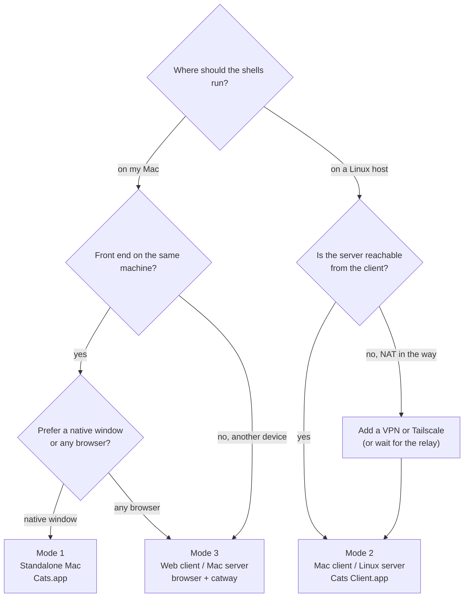
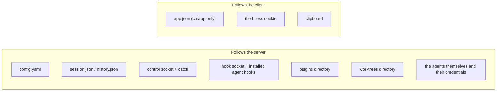

# Choosing a topology

All three modes run the same `catway` and the same `cathost`. What differs is
**who launches them**, **where the browser protocol crosses a machine
boundary**, and therefore **how much auth and TLS you owe**.

## Decision path

## Side by side

| | **Mode 1** Standalone Mac | **Mode 2** Mac client / Linux server | **Mode 3** Web client / Mac server |
|---|---|---|---|
| Front end | `Cats.app` WebKit window | `Cats Client.app` WebKit window | any browser |
| `catway` runs on | the Mac, spawned by `catapp` | the Linux host, via systemd | the Mac, by hand or launchd |
| `cathost` runs on | the Mac, spawned by `catapp` | the Linux host | the Mac |
| Browser protocol crosses | loopback only | the network | loopback or the LAN |
| Orchestration seam | `$TMPDIR` unix socket | unix socket, local to Linux | unix socket |
| Auth | `--auth none` | password (mandatory) | password (default) |
| TLS | none | yes, ideally your own cert | recommended on a LAN |
| Build target | `make macapp` | `make macapp-client` + Linux `make binaries` | `make binaries` |
| Needs Zig/ghostty toolchain | yes (for the bundle) | on Linux only | yes |
| `catctl` runs on | the Mac | the **Linux host** | the Mac |
| Clipboard | native pasteboard bridge | native pasteboard bridge | browser clipboard API |
| Font zoom | native menu ⌘+ / ⌘- / ⌘0 | native menu | browser zoom |
| Sessions outlive the client | within a run | yes, independent of the laptop | yes |
| Concurrent clients | one window | one window (plus browsers) | many |
| Offline | fully | no | on the same machine, yes |

## What is identical in every mode

It is a short list, and it is the reason the modes are cheap to switch between:

* The **session model** — workspaces, tabs, BSP panes, ids, naming.
* The **command table**. `pane.split` is the same code path from a browser
  click, a `catctl` verb, or a plugin.
* **Agent detection and hook arbitration**, running on whichever host owns the
  PTYs.
* **Persistence** — `session.json` and `history.json` under the *server's*
  `$XDG_STATE_HOME/cats`.
* **Configuration** — `config.yaml` on the *server's* host, including theme and
  keybindings, since the page is rendered server-side.
* The **four protocols** and their independent version numbers.

## What changes when you switch

The practical trap: **agent integrations must be installed on the host that runs
`cathost`**, because that is where the pane's child process lives and where
`CATS_SOCKET_PATH` points. Installing `catctl integration install claude` on
your Mac does nothing for a Linux-hosted session.

Likewise, plugins and worktrees are created on the server's filesystem. In Mode 2
`../cats-todo` in the plugin **add…** prompt resolves against the focused
pane's cwd *on Linux*, not on your Mac.

## Mixing modes

Nothing stops you. Two combinations are genuinely useful:

* **Mode 1 flipped to remote.** `Cats.app` is a superset: edit
  `~/Library/Application Support/cats/app.json` to `"mode": "remote"` with a URL
  and it behaves as a thin client, backend binaries idle in the bundle. The
  reason `make macapp-client` exists at all is to avoid *shipping* those
  binaries, not because the launcher differs.
* **Mode 3 alongside Mode 2.** A Linux-hosted `catway` also serves plain
  browsers. So the same server backs `Cats Client.app` on your desk and Safari
  on a tablet — same session, same panes.

What you cannot do today is split the **orchestration seam** across a network:
`catway` dials a unix socket, so `cathost` must be on the same host. The seam is
already transport-agnostic (`Host.Serve(ctx, io.ReadWriteCloser)`) and the dial
site is a single line, so generalising it would mean adding a transport choice
plus auth — noted as a possibility, not implemented.

## Recommendations

* **Just want cats on your Mac?** Mode 1. One double-click, nothing to configure.
* **Want to use it from more than one device?** Mode 3, with `--tls` and a
  password.
* **Have a beefy Linux box and a laptop you close?** Mode 2. The sessions live on
  the server, which is the whole point — agents keep working while the lid is
  shut.
* **Behind NAT with no VPN?** Set up Tailscale. It is less work than a relay and
  available now.
