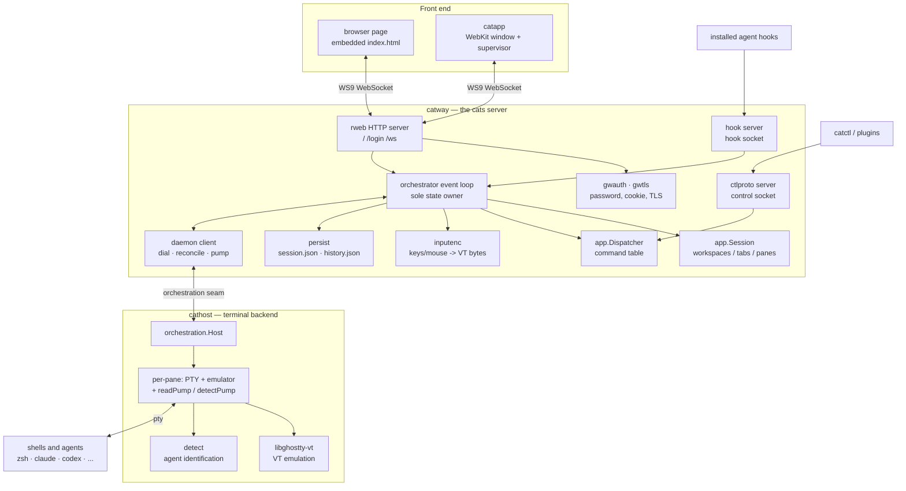
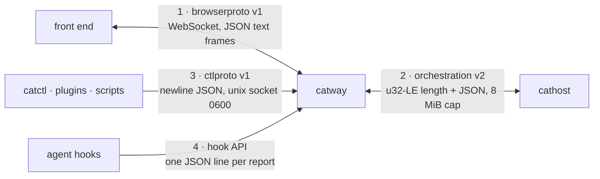
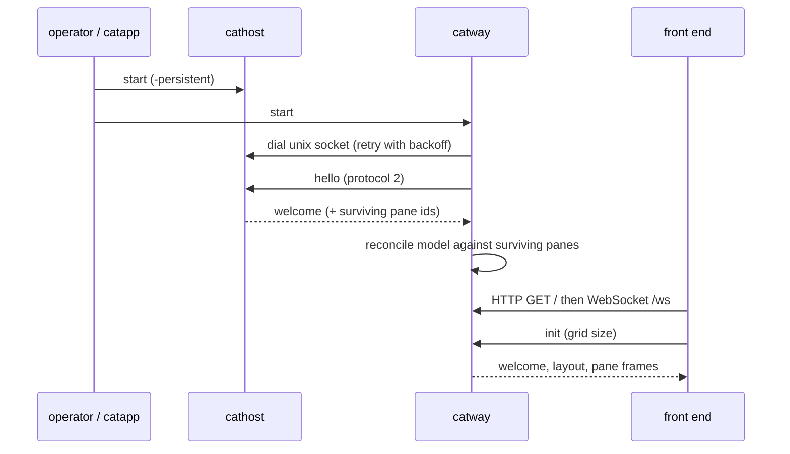
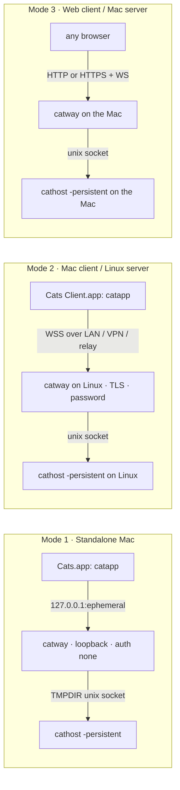
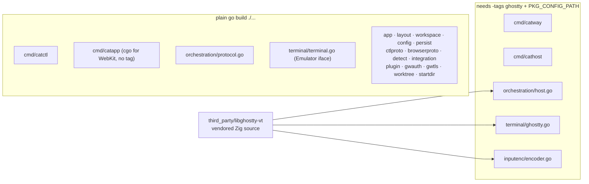

# Architecture overview

cats splits cleanly into a **front end**, an **orchestrator**, and a **terminal
backend**, joined by versioned protocols. Every run mode is the same three
pieces; only the machine boundaries move.

## Component map

## Responsibility split

| Concern | Lives in |
|---------|----------|
| What the session looks like; what a command changes | `catway` — `internal/app` |
| Pane geometry | `catway` — `internal/layout` |
| Rendering the page, drawing cell grids, copy mode UI | front end — `cmd/catway/web/index.html` |
| Encoding a keystroke into VT bytes | `catway` — `internal/inputenc` |
| PTY ownership, child processes, VT emulation, cell grids | `cathost` — `internal/orchestration` + `internal/terminal` |
| Which agent is in a pane, and what it is doing | `cathost` detection + `catway` hook arbitration |
| Durable state | `catway` — `internal/persist` |
| Access control | `catway` — `internal/gwauth`, `internal/gwtls` |

Two rules explain most of the design:

1. **The orchestrator never touches a PTY.** It sends commands over the seam
   and receives frames. That is what lets `cathost` outlive it.
2. **The terminal backend never knows about layout.** It knows pane ids and grid
   sizes. Tabs, workspaces, splits and zoom are invisible to it.

## The four seams

Each protocol has its **own** version constant, bumped independently. See
[Protocols](../protocols/index.md).

## Process lifecycles

`catway` and `cathost` are independent processes with independent lifetimes.
Neither spawns the other — `catway` only *dials*.

The important consequences:

* **`catway` can restart** without losing a shell. On reconnect it reconciles
  the restored model against the panes `cathost` still has, re-adopting live
  PTYs and re-spawning only the dead ones.
* **`cathost` can die.** `catway` keeps serving, redials with backoff, and on
  reconnect replays the model — re-spawning panes and seeding them with the
  scrollback it captured into `history.json`.
* **The front end can come and go** freely. It is stateless; a fresh connection
  gets a full resync (layout, chrome, pane frames) from cached runtime state.
* `server.stop` / SIGINT / SIGTERM on `catway` saves state, runs a final
  scrollback capture, and exits — **terminals survive**.

## The three run modes at a glance

Detailed pages:

* [Mode 1 — Standalone Mac](standalone-mac.md)
* [Mode 2 — Mac client / Linux server](mac-client-linux-server.md)
* [Mode 3 — Web client / Mac server](web-client-mac-server.md)
* [Choosing a topology](choosing-a-topology.md)

## Build-tag topology

The CGO terminal path is behind the `ghostty` build tag. This is what keeps most
of the tree testable without a Zig toolchain.

`catapp` needs cgo (WebKit) but **not** the `ghostty` tag — it only supervises
processes and shows a window. That is why the thin-client bundle can be built on
a Mac with no Zig toolchain at all.
