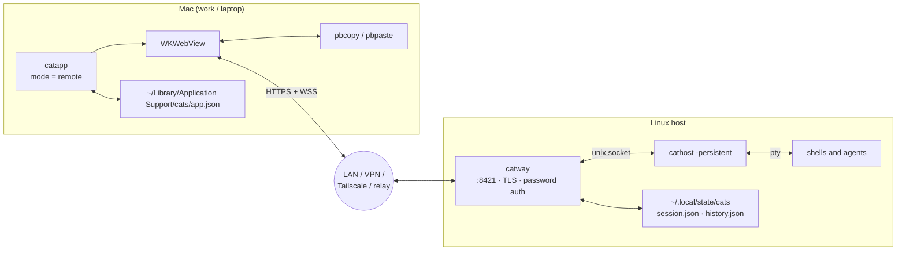
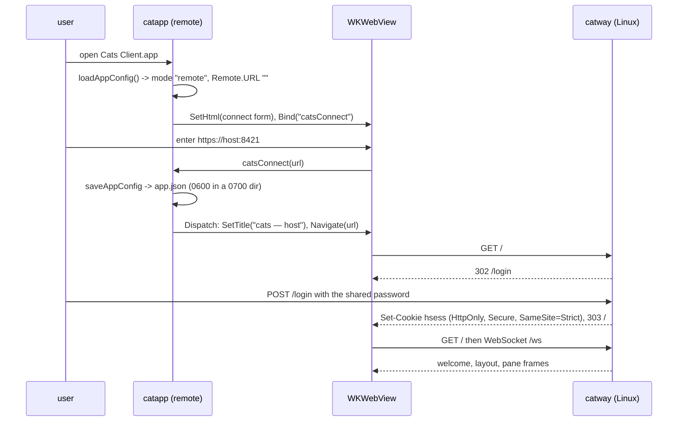
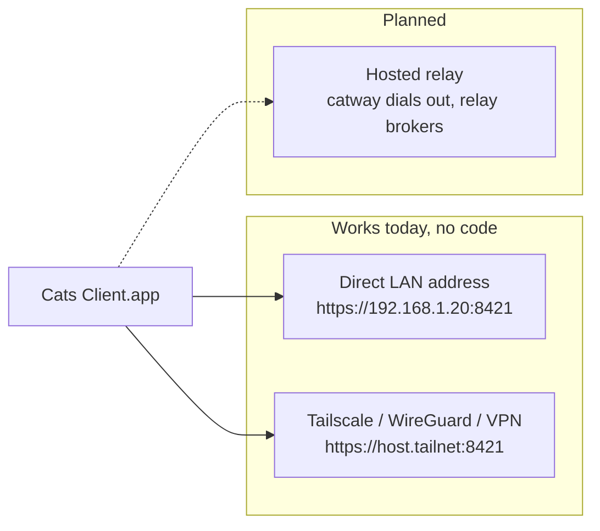
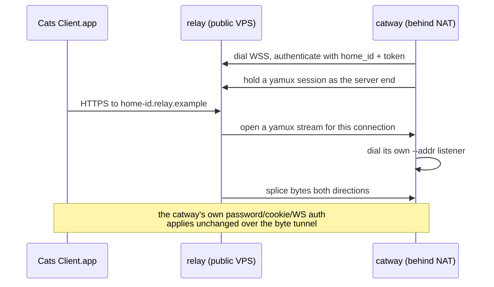

# Mode 2 — Mac client / Linux server

**`Cats Client.app`** — a thin native front end on a Mac, talking to a `catway`
that runs on a Linux host (a home mini-PC, a workstation, a VM). The Mac never
touches a PTY.

```bash
make macapp-client        # on the Mac — no Zig/ghostty toolchain needed
open "dist/Cats Client.app"
```

```bash
# on the Linux host
make vt && make binaries
cathost -socket /run/user/$UID/cats-cathost.sock -persistent &
CATS_PASSWORD=... catway --addr :8421 --tls --socket /run/user/$UID/cats-cathost.sock
```

## Topology

The network boundary sits on the **browser protocol**, not the orchestration
seam. `catway` and `cathost` stay together on the Linux host, sharing a local
unix socket.



## What the bundle contains

`scripts/build-macapp.sh client` assembles only the launcher:

```
dist/Cats Client.app/Contents/
  Info.plist            bundle id dev.cats.client
  MacOS/catapp          -ldflags "-X main.defaultMode=remote"
  Resources/AppIcon.icns
```

No backend binaries. That is the point: the common "front end at work" build
needs no Zig, no libghostty, no CGO terminal path — just plain `go build` with
cgo for WebKit.

## First-run connect flow



On every later launch `app.json` already holds the URL, so the window navigates
straight there. WKWebView persists the `hsess` cookie in its data store, so
re-launch is one click until the cookie's TTL expires — or until `catway`
restarts, which invalidates outstanding sessions because the cookie signing key
is per-process.

Note the launcher spawns **no daemons** in this mode. It still installs the
signal handler (so a clean quit behaves uniformly), the native menu, and the
clipboard bridge — the clipboard bridge matters *more* here, since the Mac
pasteboard is the only clipboard the user actually has.

### `app.json`

```json
{
  "mode": "remote",
  "remote": { "url": "https://host.example:8421", "label": "home" }
}
```

Written `0600` inside a `0700` directory. It lives in
`~/Library/Application Support/cats/`, deliberately separate from the daemons'
XDG paths, so packaging never disturbs existing sessions. A malformed file is
logged and ignored, falling back to the build-time `defaultMode` — the launcher
must always resolve to a usable mode and never fail to open.

## Building the Linux backend

CGO cross-compilation macOS → Linux is painful: it needs a Linux cross-toolchain
*and* libghostty built for the Linux target. Two sane options instead:

1. **Build on the Linux host**: `make vt && make binaries`. `make vt` there is a
   plain native Zig build — the macOS SDK `.tbd` patch in
   `scripts/build-libghostty-vt.sh` is macOS-only and skipped.
2. **Pull the release tarball**: a `v*` tag triggers `release.yml`, which
   attaches a per-platform Linux tarball.

On Linux, CGO links glibc dynamically, so build on the same distro family you
run on. CI already exercises the ghostty-tagged race tests on Linux.

## Running the backend as a service

Not shipped in the repo — this is the shape that works. Two units with an
ordering dependency, run as your own user so `~/.config` and `~/.local/state`
resolve normally:

```ini
# ~/.config/systemd/user/cathost.service
[Unit]
Description=cats terminal backend
[Service]
ExecStart=%h/bin/cathost -socket %t/cats-cathost.sock -persistent -idle-timeout 0
Restart=always
[Install]
WantedBy=default.target
```

```ini
# ~/.config/systemd/user/catway.service
[Unit]
Description=cats server
Requires=cathost.service
After=cathost.service
[Service]
Environment=CATS_PASSWORD=...
ExecStart=%h/bin/catway --addr :8421 --tls --socket %t/cats-cathost.sock
Restart=always
[Install]
WantedBy=default.target
```

```bash
systemctl --user enable --now cathost catway
loginctl enable-linger "$USER"     # so it survives logout
```

`-idle-timeout 0` disables `cathost`'s "exit if no client has been attached for
10 minutes" behaviour, which you want for a service that should be there
whenever you connect. Restarting `catway` alone is safe and cheap — it re-adopts
the surviving PTYs.

## Reaching the Linux host

Three ways, in increasing order of work:



### LAN or VPN — supported today

`catway --tls` plus a password is already remotely usable. The auto-generated
self-signed certificate deliberately includes the hostname *and every
non-loopback interface IP* in its SANs, precisely so a LAN or VPN address
validates against it. Browsers still show a first-connect trust warning because
there is no CA; supply your own PEMs with `--tls-cert` / `--tls-key` to avoid it.

A VPN or Tailscale is the recommended answer: it solves NAT traversal, it
authenticates the transport, and `catway`'s own password remains a second layer.

### Relay — planned, not implemented

The design (see `ai_docs/mac-app-and-remote-relay-plan.md`) is a rendezvous
service so a home host behind NAT is reachable without port-forwarding:



Two properties make it cheap: routing by **subdomain** (so
`Origin.Host == Host` and the same-origin WebSocket check passes untouched), and
splicing **raw bytes**, so the WebSocket upgrade rides through transparently and
no auth code changes.

The one piece already landed for it is the configurable WebSocket origin
allowlist — `server.allowed_origins` / `--allowed-origins` — which lets a
reverse proxy or relay serve the UI under a different host.

> **Warning — relay trust model**
>
> A relay terminates the browser's TLS, so it can see plaintext — including
> the password at login. That is the ngrok model and is acceptable for a
> **self-hosted** relay you control. App-layer end-to-end encryption is a
> possible later hardening, not part of the design's v1.

## Security posture

This is the one mode where a network boundary is unavoidable, so the defaults
tighten:

| Control | Setting |
|---------|---------|
| Auth | `--auth password` (the default). Never `none` on a routable address. |
| Secret source | `CATS_PASSWORD` or `--password` — deliberately *not* readable from `config.yaml`, so it never lands in a committed file |
| Transport | `--tls`, ideally with your own certificate |
| Cookie | `hsess`, HMAC-signed with a per-process key, `HttpOnly`, `Secure` under TLS, `SameSite=Strict`, TTL from `session_ttl` (default 24h) |
| WebSocket | strict same-origin, plus any `allowed_origins` entries |
| Control socket | unix, `0600`, owner-only — **not** exposed over the network |
| Hook socket | unix, local to the Linux host |

Note the asymmetry: `catctl` drives the *Linux* `catway` and must run on the
Linux host (or over SSH). The Mac client has no control socket of its own.

## Trade-offs

| Upside | Downside |
|--------|----------|
| Big-RAM Linux host does the work; the Mac stays cool | Requires a reachable route: LAN, VPN, or the planned relay |
| Sessions persist independently of the laptop — close the lid, reconnect later | Interactive latency is network latency |
| The thin bundle builds in seconds with no Zig toolchain | Two machines to keep in sync |
| Native window, menu, clipboard and zoom, same as Mode 1 | Password + TLS are now mandatory homework |
