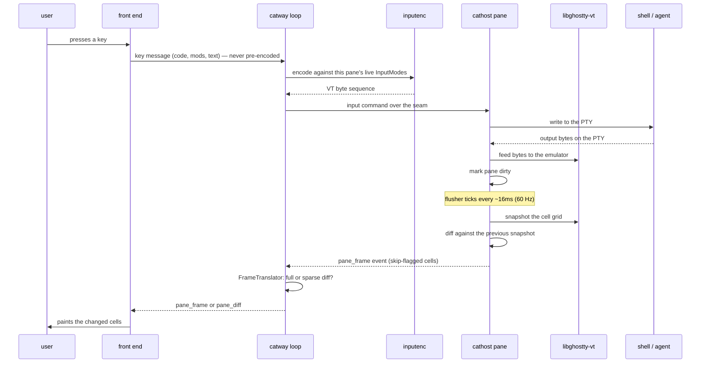
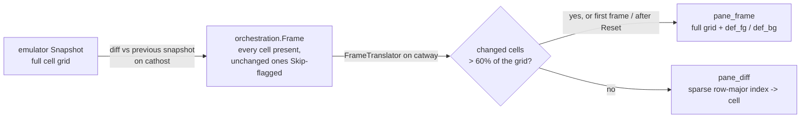
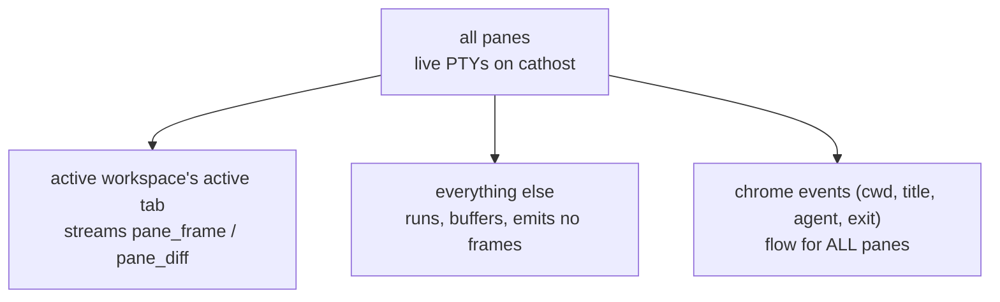
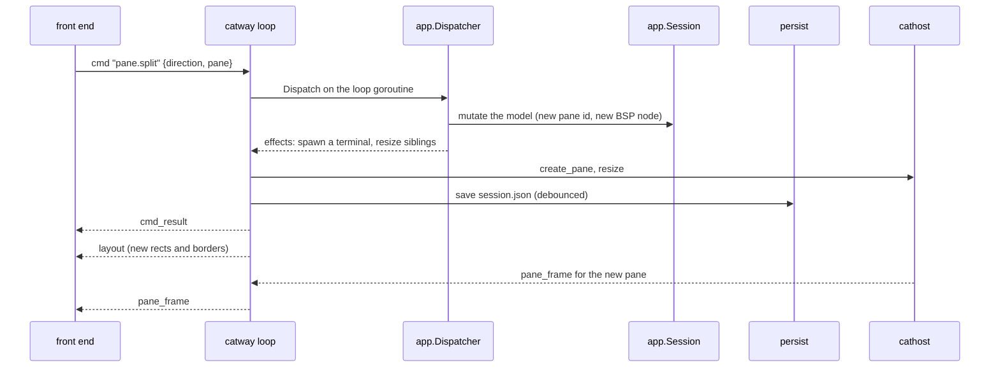

# Keystroke to pixel

This is the hot path, end to end. It is worth reading once because almost every
performance and correctness decision in cats lives somewhere along it.

## The round trip

## Why the server encodes input

The browser sends **structured** events — a W3C `KeyboardEvent.code`, modifier
flags, optional text — and never VT bytes. Encoding happens server-side in
`internal/inputenc`, driven by the pane's *live* mode state mirrored from the
emulator (`pane_modes`).

That placement is deliberate:

* The encoder is ghostty's own, via `go-libghostty` — the same library
  `cathost` uses for emulation. The encoder and the emulator interpreting its
  bytes cannot drift apart.
* Mode-dependent encoding (the full kitty keyboard protocol, xterm
  `modifyOtherKeys`, DECCKM cursor keys, mouse protocols, alternate scroll) needs
  the terminal's current modes. The server has them; the browser would have to be
  told them and kept in sync.
* One encoder serves every front end. A browser, `catctl probe` and a future
  client all produce identical bytes.

The pure-Go part of `inputenc` is the `KeyboardEvent.code` → key-name mapping and
the alternate-scroll fallback (mode 1007), which is a policy layered *above* the
encoders — ghostty implements it in its Surface, not its encoder.

## Why frames are coalesced at 60 Hz

A pane marks itself dirty on any PTY read. A single flusher goroutine wakes every
`DefaultFlushInterval` (16 ms) and turns dirty panes into frames. Without
coalescing, a `make` build would emit thousands of frames per second; with it,
the wire sees at most ~60 per pane. This mirrors the coalescing a browser
`requestAnimationFrame` loop would do anyway, done once on the server for all
clients.

## Two layers of diffing

Diffing happens **twice**, for different reasons.

* **On `cathost`**, each pane diffs the new snapshot against the last one it
  sent and marks unchanged cells `Skip`. The frame still carries the whole
  resolved grid, which keeps the seam stateless — a reconnecting orchestrator can
  ask for a resync and get everything.
* **On `catway`**, a per-pane, per-connection `FrameTranslator` converts that
  into the browser's sparse form. It sends a full `pane_frame` when the seam sent
  a full frame, when it has not yet emitted a full frame on this connection
  (first frame, or after `Reset`), or when more than **3/5 of the cells changed**
  — at that density the per-cell index overhead costs more than resending the
  grid.

The translator is stateful because a full frame declares the `def_fg` / `def_bg`
that subsequent diff cells omit against. Those must stay fixed until the next
full frame, which is why the translator is per pane *per connection* and why a
newly-visible pane calls `Reset()`.

## Visibility policy

Every pane in every workspace is a live PTY on `cathost`, running whether or not
anyone is looking. But **only the active workspace's active tab streams frames**.

Chrome events are the exception and must be: that is how a background agent's
"blocked" badge or a finished-task toast reaches you while you are in another
workspace. When a pane becomes visible, its translator resets and it gets a full
frame — the buffered state, not a replay.

## Where a command goes instead

A `cmd` message takes a different path from a keystroke: it mutates the session
model rather than a PTY.

Notice the ordering: the model changes first and the layout goes out
immediately, so the UI re-tiles before the new shell has produced a single byte.

## Blocking commands

Two control-API methods deliberately do not return at once:

* **`pane.wait_for_output`** — still one request → one response, but the response
  is withheld until the pane's raw output matches the pattern (or the wait times
  out). It rides the unchanged envelope; the server just grants it a longer
  backstop. Raw output only streams for panes that actually have a waiter, armed
  by a `set_output_stream` command over the seam — a pane with no waiter never
  streams raw bytes.
* **`events.subscribe`** — the one streaming method: an ack response, then zero
  or more event frames on the same connection until the client disconnects.

These are what make `catctl wait 1 "BUILD SUCCESSFUL" 120` and
`catctl events 1` possible without polling.

## OSC passthrough

`libghostty-vt` does not surface every OSC sequence, so each pane's read pump
scans the raw byte stream for the ones cats needs, alongside feeding the
emulator:

| Sequence | Used for |
|----------|----------|
| OSC 7 | the pane's current working directory — feeds the header, tab naming, and cold-restore respawn |
| OSC 8 | hyperlinks, carried on the frame as a link table |
| OSC 9 | progress reporting |
| OSC 0 / OSC 2 | window title → the pane header and the browser tab title |
| OSC 52 | clipboard writes → the `clipboard` down message |
| XTMODKEYS | `modifyOtherKeys` state → mirrored to `inputenc` via `pane_modes` |

The scanners are owned exclusively by the pane's read-pump goroutine. Once a
shell has reported a cwd via OSC 7, that retires the periodic process probe for
that pane — the probe exists only for shells that never emit OSC 7.
