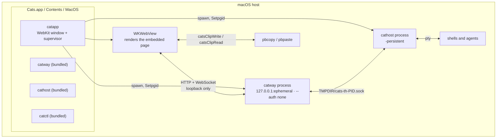
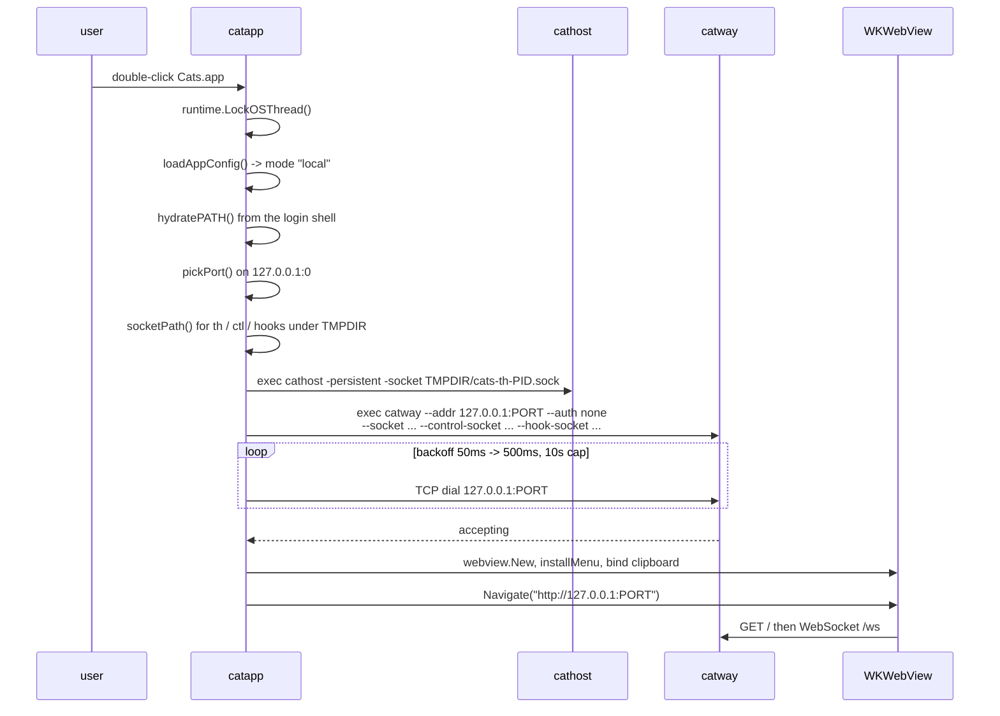
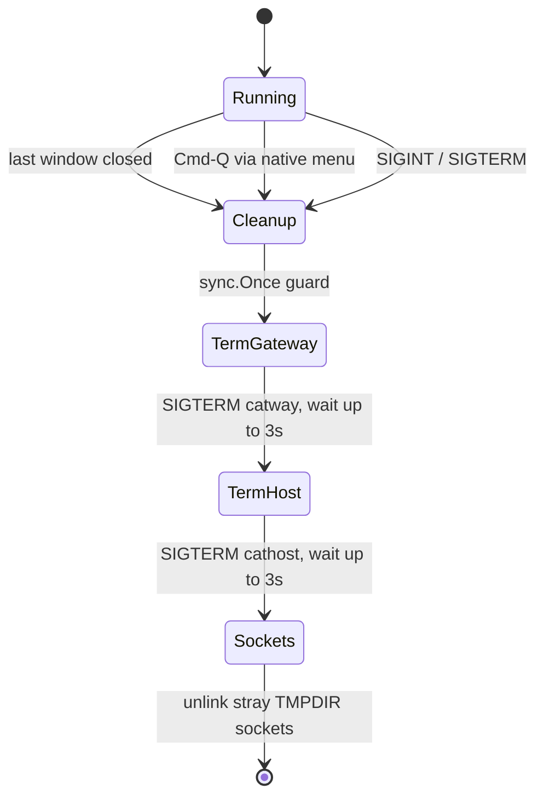

# Mode 1 — Standalone Mac

**`Cats.app`** — a self-contained macOS bundle. `catapp` supervises its own
`cathost` and `catway`, then shows their UI in a WebKit window. Fully local,
fully offline, no login.

```bash
make vt && make macapp
open dist/Cats.app
```

## Topology

Everything is one machine and one process tree. The only network is loopback.



## What the bundle contains

`scripts/build-macapp.sh self` assembles:

```
dist/Cats.app/Contents/
  Info.plist            bundle id dev.cats.app, version from git describe
  MacOS/catapp          CFBundleExecutable — the launcher
  MacOS/catway          -tags ghostty, statically linked against libghostty-vt
  MacOS/cathost         -tags ghostty
  MacOS/catctl          untagged
  Resources/AppIcon.icns
```

The three daemons link libghostty-vt **statically** — `otool -L` shows only
system frameworks — so there are no dylibs to copy and no `@rpath` fixups. The
launcher finds its siblings via `os.Executable()` → same directory, falling back
to `$PATH` so `go run ./cmd/catapp` still works in development.

`catapp` itself is built with plain `go build` (cgo on for WebKit, **no**
`-tags ghostty`) and `-ldflags "-X main.defaultMode=local"`.

## Startup sequence



A successful TCP dial is sufficient readiness: `catway` serves HTTP as soon as it
binds and dials `cathost` lazily with its own retry loop.

## Design decisions specific to this mode

### `--auth none` on loopback

Local mode binds `127.0.0.1` only, so there is no network exposure and a login
prompt would be pure friction. The password/cookie machinery is still compiled
in — it is simply not armed. See [Auth and TLS](../subsystems/auth-and-tls.md).

### Private `$TMPDIR` sockets

All three sockets move off the default world-visible `/tmp/cats-*.sock` to
`$TMPDIR/cats-<role>-<pid>.sock`. On macOS `$TMPDIR` is a per-user `0700`
directory under `/var/folders/…`, so this buys both privacy and uniqueness:

| Role | Path |
|------|------|
| orchestration seam | `$TMPDIR/cats-th-<pid>.sock` |
| control API | `$TMPDIR/cats-ctl-<pid>.sock` |
| hook API | `$TMPDIR/cats-hooks-<pid>.sock` |

Isolating the control and hook sockets (not just the seam) means agent hook
reporting keeps working even alongside a separately hand-launched `catway` on
the default paths. Two `Cats.app` instances also never collide.

### PATH hydration

A double-clicked `.app` is launched by launchd, not a shell, so it inherits the
bare system PATH — none of your `.zprofile` / `.zshrc` additions. Everything
downstream inherits that: the daemons, and through them every pane and every
plugin build step. The classic symptom is a plugin failing with
`sh: go: command not found` inside the app while the identical install works
from a terminal.

`hydratePATH()` fixes it the way WebKit desktop apps have converged on: detect a
GUI launch via `__CFBundleIdentifier` (set by LaunchServices), ask the login
shell what PATH it would set up — fenced in a `__CATS_PATH__` marker, because
interactive rc files print banners — and merge it in. It is best-effort; any
failure leaves the inherited PATH, and the bundled daemons still resolve because
they are found next to the executable, not via PATH.

Launched from a dev terminal, `__CFBundleIdentifier` is unset and the inherited
PATH is already yours, so hydration is skipped.

### Working directory

From Finder the process cwd is `/`, which the daemons would hand to every pane's
shell — a terminal at the filesystem root helps nobody. `daemonDir()` routes
that through `internal/startdir`, which falls back to `$HOME`. Launched from a
dev shell, that shell's cwd is kept, so `cd project && catapp` opens panes in the
project.

### Native menu bar

`webview` creates a bundled app with **no menu**, so without intervention ⌘Q
cannot quit and the standard ⌘C/⌘V/⌘X/⌘A editing shortcuts — which Cocoa routes
through Edit-menu items to the first responder — do not work. `installMenu()`
(cgo → `menu_darwin.m`) installs one after `webview.New` creates
`NSApplication` and before `Run()`.

The View menu also owns ⌘+ / ⌘- / ⌘0 font zoom, because Cocoa resolves those as
key equivalents *before* the WKWebView's page sees a keydown — the page's own
handler would never fire. The menu action calls back into Go
(`catappZoom`) which evaluates `window.catsAdjustFont(delta)` in the page.

### Clipboard bridge

WKWebView restricts `navigator.clipboard`: reads resolve empty, and writes
demand a user activation that a WebSocket-driven copy (OSC 52 from a pane, a
`read` command) never has. `catapp` injects `catsClipWrite` / `catsClipRead` into
every page of every window (a `WKScriptMessageHandlerWithReply`, so the page's
read is still a promise), backed by `/usr/bin/pbcopy` and `/usr/bin/pbpaste`,
and the UI prefers them when present. The windows only ever load the configured
`catway` UI, so exposing the pasteboard to the page does not leak it to
arbitrary content.

## Windows

The app opens **native windows**: one `NSWindow` + `WKWebView` each
(`cmd/catapp/window_darwin.m`), all over the one running session. Every
connection is a view on one workspace, so a window is just `?ws=<id>` in a
`WKWebView`.

| Action | What it does |
|---|---|
| **Window → New Window** (⌘N) | a window on the primary view — another window on what you are doing |
| sidebar row → **open in new window** | a window on *that* workspace (the page's `window.open`, intercepted in `WKUIDelegate`) |
| **Close Window** (⌘W) | closes the window; the workspace it showed keeps running |
| ⌘+ / ⌘- / ⌘0 | font size in the **front** window's page |

Windows on different workspaces are independent — own tab, own focus, own zoom,
own size. Windows on the same workspace mirror. Closing a window never closes
anything in the session. See [Concepts](../concepts.md#windows-and-views).

All windows share one `WKWebsiteDataStore`, so cookies and page storage (the
font size, sidebar widths) are one set across them.

**Restore.** The window layout — each window's workspace and frame — is saved in
`app.json` beside the mode and the presets, debounced on every open, close, move
and resize. It is client state: `catway` persists nothing about windows at all.
The page keeps its own `?ws=` in step with the workspace it is showing
(`history.replaceState`), which is how a switch inside a window is remembered
without any extra protocol. A saved window whose workspace no longer exists
still opens — the server falls back to the primary view — because a window
layout should survive tidying up projects.

`setFrameAutosaveName` is deliberately not used: it keys by a fixed name, and N
windows need N frames whose names we choose.

### Manual runbook

There is no Go test for Objective-C. On a clean `make macapp` install (a stale
bundle is the usual cause of a "bug" here — check the installed build first):

1. ⌘N — a second window opens on the same workspace and mirrors the first.
2. Sidebar row → **open in new window** on another workspace — the two windows
   now show different projects; switching tabs or splitting in one leaves the
   other alone.
3. Resize one window — the other window's panes keep their shape.
4. Close the first window — the second keeps working, and its workspace's panes
   are untouched.
5. ⌘+ in one window — only that window's text changes size.
6. Open three windows, ⌘Q, relaunch — three windows come back on the same
   workspaces, at the same frames.
7. Close the last window — the app quits and the daemons are reaped (check with
   `pgrep cathost`).

## Shutdown



Three paths reach teardown — the **last** window closing
(`applicationShouldTerminateAfterLastWindowClosed` is YES, and
`applicationWillTerminate:` calls the cgo-exported `catappCleanup`), ⌘Q (the
Objective-C Quit action calls the same), and a signal handler — and all funnel
through one `sync.Once`, so the daemons are reaped exactly once. Closing one
window out of three reaps nothing: only the last one ends the app.

Teardown is reverse order: SIGTERM `catway` first (it saves session state and
exits within its own short grace window), then SIGTERM `cathost`. Each daemon
runs in its own process group (`Setpgid`) so a stray Ctrl-C in a dev terminal
cannot pre-empt the orderly teardown. The daemons unlink their own sockets on a
clean exit; the launcher removes stragglers as a backstop.

`cathost` runs `-persistent` even here, so panes survive a `catway` restart
*within* a session. A future "keep sessions alive in the background" option would
simply skip signalling it.

## Failure surfacing

A double-clicked `.app` has no console. If `startBackend()` fails, `catapp`
opens a small fixed-size window with the reason (`showError`) — the only way the
user learns why nothing appeared. It is also logged for a dev terminal.

## Trade-offs

| Upside | Downside |
|--------|----------|
| One double-click; no daemons to remember | macOS only |
| No password, no TLS, no exposure | Sessions end with the app (by design, today) |
| Offline — nothing leaves the machine | Requires the full ghostty/Zig toolchain to build |
| Native windows, menu, clipboard and zoom integration | Unsigned: other Macs need right-click → Open |

Mode 1 is a superset — `app.json` can flip it to `remote` and point it at
another `catway`. Keeping [Mode 2](mac-client-linux-server.md) as its own target
just means the common "front end at work" build carries no backend binaries.
