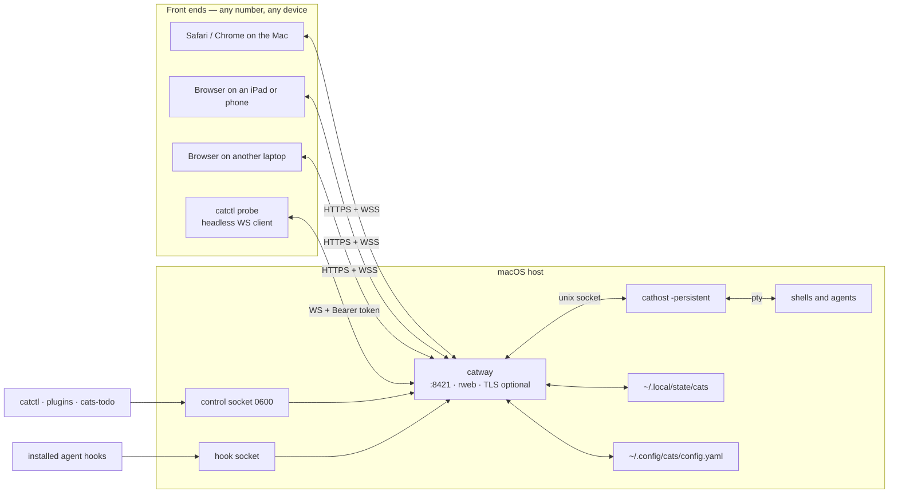
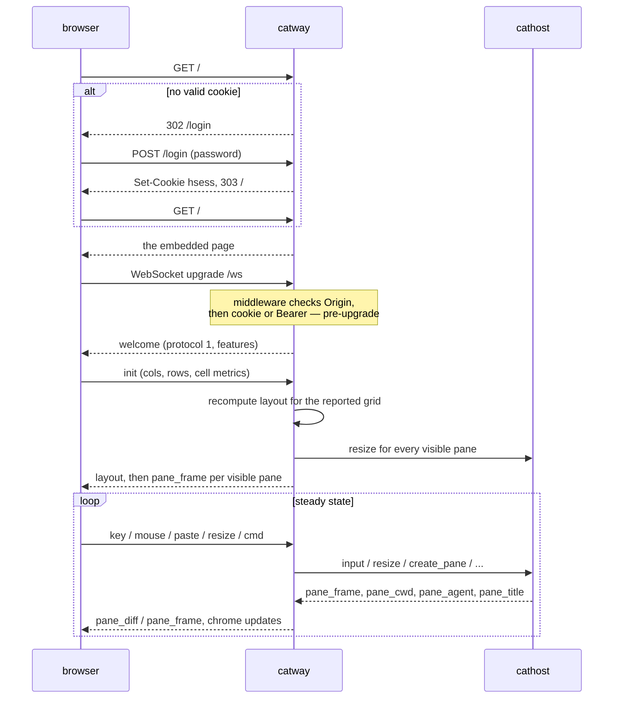

# Mode 3 — Web client / Mac server

The original shape, and still the most flexible: `catway` and `cathost` run on
your Mac, and **any browser** — the same Mac, an iPad on the couch, a second
laptop — is the front end. No bundle, no launcher.

```bash
bin/cathost -socket /tmp/cats-cathost.sock -persistent &
CATS_PASSWORD=changeme bin/catway --addr :8421 --tls
# open https://<mac>:8421
```

## Topology



## What is actually served

`catway` runs an [rweb](https://github.com/rohanthewiz/rweb) server with a
deliberately tiny surface:

| Route | Purpose |
|-------|---------|
| `GET /` | the single-page UI, rendered from `cmd/catway/web/index.html` |
| `GET /login` | the login form (only when `auth: password`) |
| `POST /login` | check the secret, issue the `hsess` cookie |
| `GET /ws` | the one WebSocket endpoint — the whole browser protocol |

That is all. No REST API, no asset pipeline, no CDN. The page is
**self-contained** and embedded into the binary with `//go:embed`.

!!! note "Rebuild after editing the UI"
    Because `index.html` is compiled in, editing it and reloading the browser
    keeps serving the old page. Rebuild and restart `catway`.

Theme colours and keybindings are injected into the served page at render time,
which is why `catctl reload` can apply a config edit with no restart: the
orchestrator re-renders the page and tells connected clients to reload it.

## Session lifecycle for a browser



Auth is checked **once, pre-upgrade**, by the global middleware — there is no
mid-session expiry. A long-lived WebSocket outlives its cookie's TTL.

## Multiple simultaneous clients

Several browsers can be connected at once. They are **not** independent
sessions: there is exactly one `app.Session`, so everyone sees the same
workspaces, tabs, panes and focus. A second client is a second view, not a
second workspace set.

Consequences worth knowing:

* Focus, splits and tab switches are global. Two people (or two devices) fight
  over focus if they both drive it.
* Each client reports its own grid via `init`/`resize`. The orchestrator keeps
  one desired size per pane, so the **last reporter wins** — a phone connecting
  to a session driven from a desktop will resize everyone's panes.
* Broadcast messages (`notify`, `title`, `shutdown`, `update_ready`) go to all
  connected clients.
* A late joiner gets a full resync from cached runtime state — layout, per-pane
  chrome, and a full `pane_frame` per visible pane — so it never sees a partial
  screen.

## Serving on the LAN

`--addr :8421` binds all interfaces by default. To make that safe:

* `--tls` mints a self-signed certificate cached in `~/.config/cats`, with SANs
  covering the hostname and every non-loopback interface IP — deliberately, so a
  LAN IP validates. It auto-renews within 30 days of expiry (825-day validity).
* Keep `--auth password` and set the secret via `CATS_PASSWORD` or `--password`.
  If neither is given, `catway` **generates** one and logs it — fine for a quick
  local run, useless for a service.
* Bind narrowly if you only want local use: `--addr 127.0.0.1:8421`.
* Behind a reverse proxy, add the proxy's host to `server.allowed_origins` so
  the WebSocket origin check passes.

!!! warning "No `X-Forwarded-*` trust"
    `catway` does not interpret forwarded headers. Behind a proxy it sees the
    proxy's address, and the same-origin check compares the `Origin` header to
    the `Host` header it received. Subdomain-style routing keeps those equal;
    path-prefix routing does not.

## Running it as a background service on macOS

`launchd` is the macOS equivalent of the systemd setup in
[Mode 2](mac-client-linux-server.md#running-the-backend-as-a-service). Two
caveats specific to launchd, both already solved for `Cats.app` and worth
copying by hand here:

1. **PATH.** A launchd job gets the bare system PATH, not your shell's. Panes and
   plugin build steps inherit it, which is how you get
   `sh: go: command not found` from a job that works fine in a terminal. Set
   `EnvironmentVariables.PATH` explicitly in the plist.
2. **Working directory.** A launchd job's cwd is `/`. Set
   `WorkingDirectory` to your home directory, or every new pane opens at the
   filesystem root. (`internal/startdir` already falls back to `$HOME`, but
   being explicit costs nothing.)

## Headless clients

Two non-browser front ends speak the same edges:

* **`catctl`** over the control socket — the same command table as the browser.
  Owner-only `0600`, local, no auth of its own (filesystem permissions *are* the
  auth). See [Control API](../protocols/control-api.md).
* **`catctl probe`** over `/ws` — a stdlib-only WebSocket client for exercising
  the browser protocol headlessly, authenticating with
  `Authorization: Bearer <secret>` instead of a cookie. This is how the browser
  path gets tested without a browser.

## Trade-offs

| Upside | Downside |
|--------|----------|
| No bundle, no launcher — just two binaries | You manage the daemons yourself |
| Any device with a browser is a client, including tablets and phones | Browser clipboard restrictions: no native pasteboard bridge, so OSC 52 copies depend on `navigator.clipboard` and its activation rules |
| Multiple simultaneous views | Those views share one session — last resize wins, focus is global |
| Trivial to script and probe headlessly | ⌘+/⌘- font zoom is the browser's, not the app's |
| The Mac's own agents, keys and toolchains are right there | Serving on a LAN means doing the TLS and password work |
