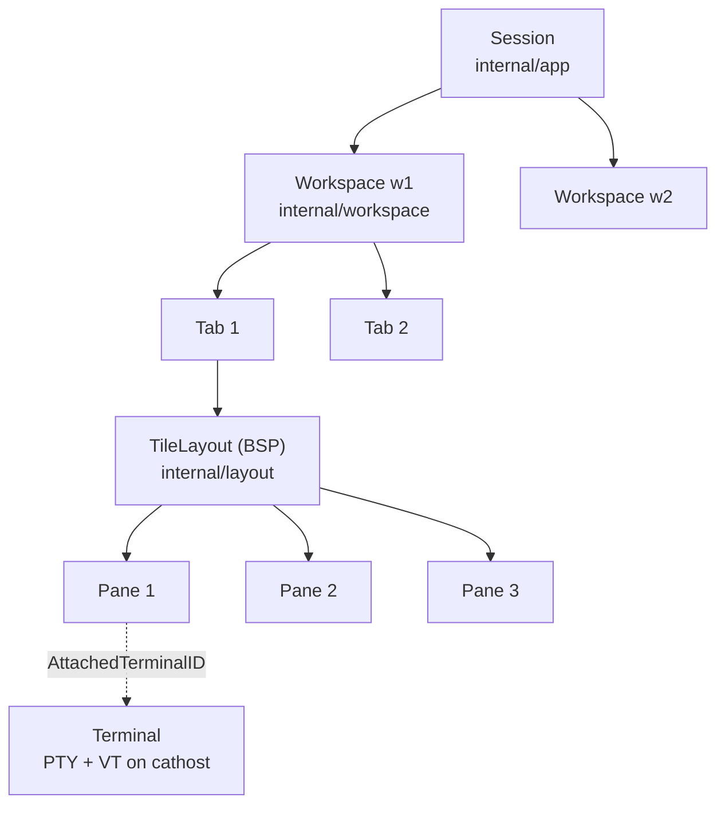
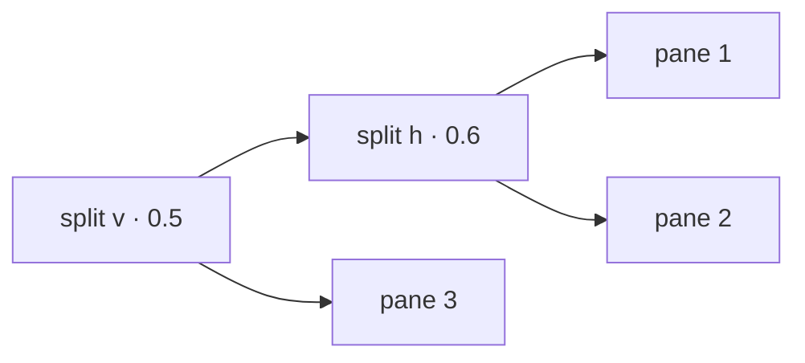
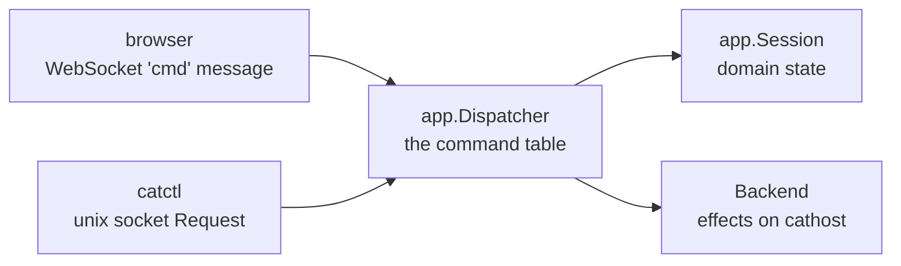

# Concepts

## The tree

cats models one session as an ordered set of **workspaces**, each holding
ordered **tabs**, each holding a BSP tree of **panes**. Exactly one pane is
focused at a time, and its tab and workspace are the *active* ones.

| Level | Owns | Identity |
|-------|------|----------|
| Session | the ordered workspaces, the active index, the default cwd for new panes | — |
| Workspace | its tabs, the active tab, stable public pane/tab numbering, cached git branch | `w1`, `w2`, … `wA` |
| Tab | one BSP pane tree, per-pane viewport state, zoom flag | a stable number, never reused |
| Pane | a layout node identity plus `PaneState` (attached terminal, seen flag, custom name) | a process-global `PaneID`, plus a per-workspace *public* number |
| Terminal | a PTY, a child process and a VT emulator — lives on `cathost` | a `TerminalID` |

### Identity and numbering

Public handles use a bijective base-32 alphabet with the ambiguous letters
`I`, `L`, `O`, `U` removed (`"123456789ABCDEFGHJKMNPQRSTVWXYZ0"`), so a
workspace reads as `w1`…`w9`, `wA`, …. Numbers are **never reused** after a
close, so a handle you saw in a log or a script never silently points at a
different pane later. Public pane numbers are per-workspace; the internal
`PaneID` is process-global.

That separation matters: the *layout* tree tracks pane **identity only, never
content**. Content lives entirely on the terminal backend, reached through the
pane's `AttachedTerminalID`.

### Naming

* A pane shows its custom name (`pane.rename`) if set, otherwise the
  terminal-reported OSC 0/2 title, otherwise its cwd/agent-derived label.
* A tab shows its custom name (`tab.rename`) if set, otherwise a label derived
  from its "most interesting" pane, otherwise its number. Ties go to the tab's
  focused pane, then to the first pane in layout order, so the label is stable
  under churn elsewhere in the tab. A multi-pane tab carries a ` +N` suffix.
* A workspace shows its custom name, otherwise an identity derived from its
  panes' cwds.

## BSP layout

Panes tile: every split turns one leaf into an internal node with a direction
(`h` = side-by-side, `v` = top/bottom) and a ratio. Resizing drags a border,
which changes one node's ratio. Rects are computed **on demand** from a
caller-supplied screen `Rect` — the tree stores no geometry.

Geometry parity with the retired Rust original is load-bearing: rect splitting
matches its float rounding and saturating subtraction, and directional focus
navigation tiebreaks by *(edge distance, negative overlap, center distance,
index)* in exactly the same order.

The top row of every pane rect is reserved for browser-side chrome — the header
strip with public number, title, cwd, agent badge and mode chips — so the
terminal grid is one row shorter than the pane.

## Zoom and visibility

A tab can be **zoomed**: one pane fills the tab while the others stay live. Only
the workspace's *active* tab streams frames to the front end; every other pane
keeps running on `cathost` but produces no traffic. That is the whole visibility
policy — see [Keystroke to pixel](architecture/request-lifecycle.md).

## Windows and views

A **window** is a connection with a view: the workspace it is showing. It is not
part of the session — nothing about a window is persisted by the server, and a
window lives exactly as long as its socket.

*A window shows a workspace; windows on different workspaces are independent;
windows on the same one mirror.* Independent means own tab, own focused pane,
own zoom, own grid — a switch or a resize in one window does not touch the
other. Mirroring means what it says: one active tab and one focused pane per
workspace is the model, so two windows on one workspace show the same thing.

Closing a window never closes anything in the session. A workspace no window is
showing keeps running exactly as a background workspace does.

Callers with no window of their own — `catctl`, a hook action, a runbook step —
and viewers such as the phone resolve through the **primary view**: the desktop
window you touched last. The session's persisted "active workspace" tracks it,
so a cold start opens where you were.

## Agents

A pane is an agent pane when detection or a hook says a coding agent (claude,
codex, kimi, gemini, cursor, droid, …) is running in it. An agent pane carries:

* an **identity** — the canonical agent label,
* a **state** — `idle`, `working`, `blocked` or `unknown`,
* a **seen** flag — cleared when the agent finishes while you are looking
  elsewhere, which is what draws the "done" marker,
* optionally a **resumable session id**, reported by the agent's hook, which
  lets a cold restore relaunch the conversation.

See [Agent detection](subsystems/agent-detection.md).

## The command table

Every mutation goes through one protocol-neutral command table in
`internal/app` — `pane.split`, `tab.create`, `workspace.focus`,
`worktree.create`, `config.set`, and so on. The browser and `catctl` are two
front ends onto the *same* `app.Dispatcher`; no command has per-transport
server code.

The full vocabulary is listed in [Control API](protocols/control-api.md).

## Single-owner event loop

There is exactly one `app.Session` per `catway` process, owned by one
goroutine — the orchestrator loop. Nothing locks it; other goroutines (the
WebSocket readers, the daemon pump, the control server, the hook server) *post
closures* onto the loop. That is why `internal/app` is pure: no I/O, no
goroutines, no daemon, so it unit-tests like the layout and workspace models it
composes.

Per-pane *runtime* state that is not domain state — the input encoder, cached
chrome for late-joining clients, the desired grid size, hook authority — lives
in `paneRuntime` maps in `cmd/catway`, also loop-goroutine only.
