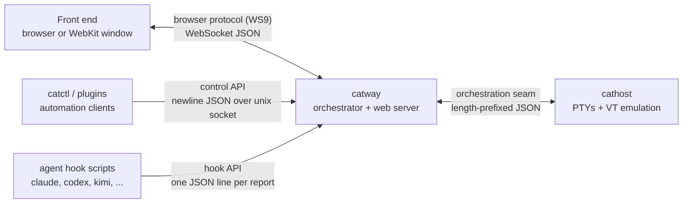

# cats

**cats** is a terminal workspace manager for herding AI coding agents. It owns a
tree of *workspaces → tabs → BSP panes*, drives a real PTY plus a full VT
emulator behind each pane, notices which coding agent is running where, and
presents the whole thing through a browser or a native macOS window.

The repo is the complete application. Three binaries plus a macOS launcher:

| Binary | Role |
|--------|------|
| [`catway`](reference/cli.md#catway) | The cats server: workspace/tab/pane orchestrator, web UI over WebSocket, control + hook APIs, session persistence, auth/TLS |
| [`cathost`](reference/cli.md#cathost) | Terminal backend daemon: owns the PTY + VT emulation for every pane. Run `-persistent` so shells survive a `catway` restart |
| [`catctl`](reference/cli.md#catctl) | CLI client for the control API — the same command table the browser drives — plus offline agent-integration and plugin installers |
| [`catapp`](reference/cli.md#catapp) | macOS launcher: a WebKit window around either supervised local daemons or a remote `catway` |

## The shape of the system

Four seams, each independently versioned, hold the app together. Everything else
is a subsystem hanging off one of them.



* **Browser protocol** — `internal/browserproto`, one versioned WebSocket
  contract. Layout, per-pane grid diffs and chrome flow down; structured
  key/mouse/paste/resize plus commands flow up.
* **Orchestration seam** — `internal/orchestration`, the `catway ↔ cathost`
  wire. The orchestrator sends commands (create/input/resize/close); the
  terminal backend streams pane frames and events back.
* **Control API** — `internal/ctlproto`, a local unix socket onto the *same*
  command table the browser uses.
* **Hook API** — a local unix socket where installed agent hooks report
  permission prompts, task completion and resumable session ids.

Read [Architecture → Overview](architecture/index.md) for the full component
map, then pick the run mode you care about.

## Three ways to run it

| Mode | Front end | `catway` + `cathost` | Read |
|------|-----------|----------------------|------|
| **Standalone Mac** | `Cats.app` WebKit window | on the same Mac, supervised by `catapp` | [Mode 1](architecture/standalone-mac.md) |
| **Mac client / Linux server** | `Cats Client.app` WebKit window | on a Linux host, run by systemd | [Mode 2](architecture/mac-client-linux-server.md) |
| **Web client / Mac server** | any browser | on a Mac, run by hand or launchd | [Mode 3](architecture/web-client-mac-server.md) |

They are all the *same* `catway` and `cathost`. What changes is who launches
them, where the WebSocket crosses a network boundary, and therefore how much
auth and TLS you need. [Choosing a topology](architecture/choosing-a-topology.md)
is the side-by-side comparison.

## Feature tour

* **Workspaces → tabs → panes** with BSP splits, drag-to-resize, zoom and
  per-pane titles. All state is a single-owner event loop over one
  `app.Session` — see [Session model](subsystems/session-model.md).
* **Agent awareness**: panes detect the coding agent running in them via
  process inspection plus a manifest catalog that updates from `herdr.dev`;
  hook reports surface as badges and toasts. See
  [Agent detection](subsystems/agent-detection.md).
* **Session persistence and restore**: the model is saved on every mutation. A
  `catway` restart re-adopts live PTYs from a persistent `cathost`; a cold start
  re-spawns panes with captured scrollback replayed and can relaunch agents into
  their native conversations. See [Persistence](subsystems/persistence.md).
* **Git worktrees** created per agent or task straight from the UI —
  [Worktrees](subsystems/worktrees.md).
* **Copy mode** with vim-style rebindable keys, OSC 52 clipboard, OSC 8
  hyperlinks, window-title and notification passthrough.
* **Remote access** with a shared password, HMAC-signed session cookies, bearer
  tokens for headless clients and optional TLS —
  [Auth and TLS](subsystems/auth-and-tls.md).
* **Plugins** installed from GitHub or linked from a local checkout, launched
  into a fresh tab — [Plugins](subsystems/plugins.md).
* **Configuration** in YAML with live-reloadable theme and keybindings —
  [Configuration](reference/configuration.md).

## Where things live

```
cmd/catway/           cats server: orchestrator event loop, web UI, WS bridge,
                       control/hook APIs, persistence + restore, auth/TLS
cmd/cathost/          terminal-backend daemon (orchestration Host over a socket)
cmd/catctl/           control-API CLI, agent-integration installers, WS probe
cmd/catapp/           macOS launcher (webview + daemon supervisor)
internal/app/         session model + the command table (the Dispatcher seam)
internal/browserproto/  browser WebSocket protocol
internal/orchestration/ catway<->cathost seam (protocol + terminal Host)
internal/terminal/    VT emulator (Emulator iface + go-libghostty)
internal/inputenc/    structured input -> VT byte encoding
internal/layout/      BSP pane layout
internal/workspace/   workspace/tab model
internal/detect/      agent detection (process inspection + manifest catalog)
internal/config/      YAML config (server / theme / keybindings)
internal/persist/     on-disk session + history state
internal/ctlproto/    control-API protocol + server
internal/integration/ agent hook installers (claude, codex, kimi, ...)
internal/plugin/      plugin host (~/.config/cats/plugins)
internal/gwauth/      login/cookie auth
internal/gwtls/       TLS certificate handling
internal/worktree/    git-worktree creation
internal/startdir/    "where does a new shell start" policy
third_party/libghostty-vt/  vendored VT engine source (Zig)
```

## History

This codebase replaced a Rust/ratatui implementation through a phased
migration: Phase A (a thin web client attached to the Rust server), Phase B
(Go-owned PTY plus VT emulation behind an orchestration seam), and Phase C (the
orchestrator, layout, detection, persistence and web chrome in Go). Design docs
and per-workstream notes live in `ai_docs/`; retired phase code is recoverable
from git history. Several package comments still name the Rust originals as
their spec — that is deliberate, they are the parity reference.
