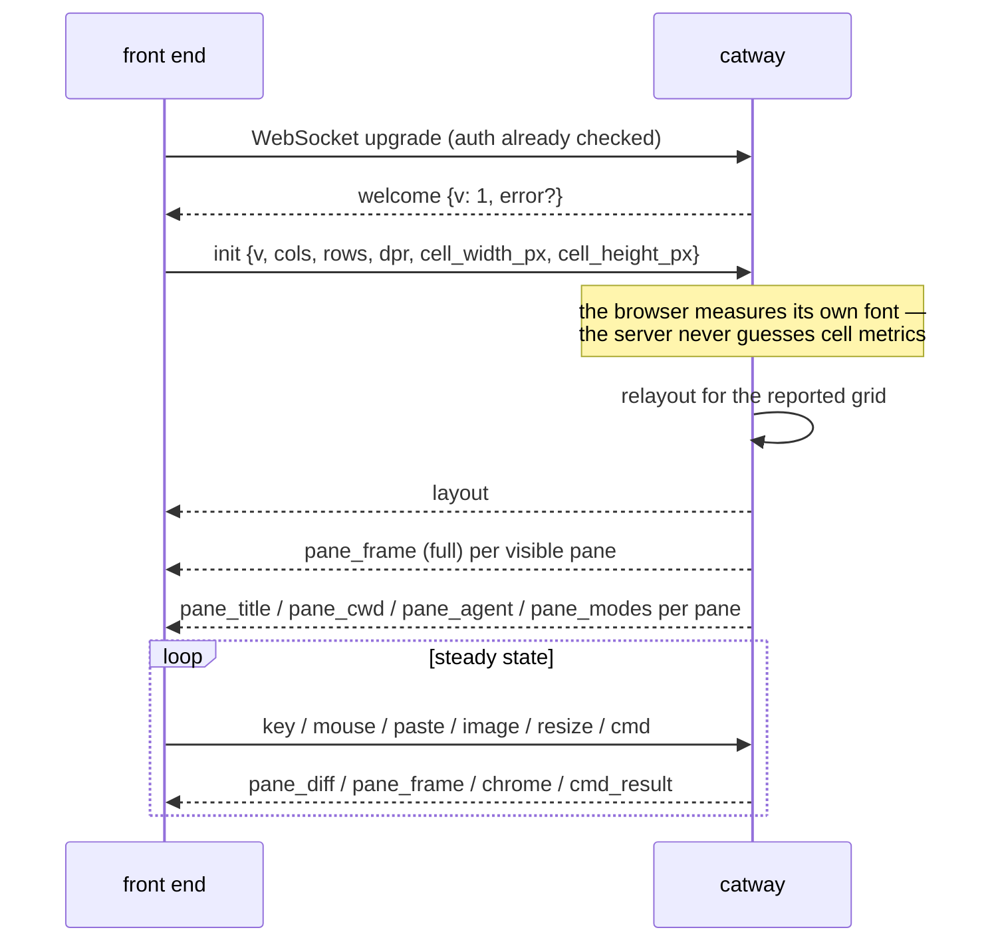
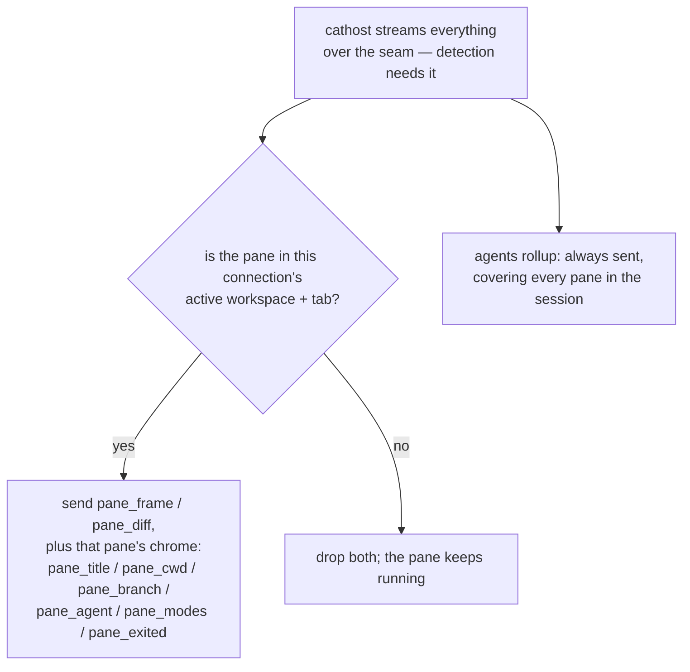

# Browser protocol

`internal/browserproto` — the one versioned contract between `catway` and a
front end. **Protocol version 1.** Full spec: `ai_docs/phase-c-ws9-protocol.md`.

## Transport and envelope

* WebSocket at `GET /ws`, authenticated **pre-upgrade** by the global HTTP
  middleware (cookie or `Authorization: Bearer`), with a same-origin check plus
  any `allowed_origins` entries.
* One JSON message per **text** frame, shaped `{"t": "<type>", …}`.
* Binary frames are reserved for a future packed cell encoding behind a version
  bump.
* Unknown `t` values **must** be ignored by both ends. `DecodeUp` / `DecodeDown`
  report them as `ErrUnknownType` so callers can drop the message instead of
  failing the session.

## Session lifecycle



`init` is required and must be first. Until the browser reports its grid, the
server assumes a default 120×32 area.

## Down — server to front end

### Layout and chrome (§3)

| `t` | Purpose |
|-----|---------|
| `welcome` | protocol version, plus an `error` string if the connection is being refused |
| `layout` | **full replacement** of the viewport structure: workspaces (sidebar), the active workspace's tabs, the active tab's pane rects, and border handles. Computed rects only — the BSP tree never crosses the wire |
| `agents` | the cross-session agent roster for the sidebar |
| `hosts` | the cathost roster: one item per configured host with `id`, `label`, `connected`, `addr_kind`, `is_default`, `panes`, an `error` explaining a host that is down, `latency_ms` (the last measured round trip, fractional, omitted when unknown), and `lists_dirs` (the start-path picker works against this host — always so for the local machine, and for a remote one whose cathost can list its own directories). Sent on connect, whenever a host connects or drops, and when a host's latency moves enough to change what is drawn — not on every sample, since every host pushes the whole roster to every client. A single-item roster is the normal single-machine session, which is how a client knows to draw no host UI at all |
| `pane_title` | OSC 0/2 title for a pane |
| `pane_cwd` | working directory for a pane |
| `pane_branch` | the git branch checked out in that working directory (`""` when the pane is not in a repository); sent separately from `pane_cwd` because a checkout moves the branch without moving the pane |
| `pane_agent` | agent identity + arbitrated state for a pane |
| `pane_modes` | the pane's DEC mode state, so the UI knows whether a drag belongs to the program or to selection |
| `pane_exited` | the pane's child exited |
| `pane_respawned` | the pane has a live child again (a cathost restart or a host move re-spawned its PTY) — the retraction of a `pane_exited`, since a client remembers the exit and the chrome sent to a late joiner simply omits `pane_exited` for a live pane |

A `Rect` on the wire is a compact `[x, y, w, h]` array of cell coordinates.

Each pane rect and each workspace in `layout` also carries `host`, the id of the
cathost it lives on (for a workspace: where its new panes will land). It is
always a resolved id naming a host in the `hosts` roster, never the empty "the
default one" form the session file stores. Clients should render it only when the
roster holds more than one host — with one, every pane's answer is the same.

### Pane content (§4)

| `t` | Purpose |
|-----|---------|
| `pane_frame` | a full grid: `w`, `h`, cursor, `def_fg`, `def_bg`, the link table, all cells, scroll metrics |
| `pane_diff` | a sparse patch: only changed cells, each addressed by row-major index `i`. Omitted colours resolve against the last full frame's `def_fg` / `def_bg` |

See [Keystroke to pixel](../architecture/request-lifecycle.md#two-layers-of-diffing)
for when the server picks which.

### App level (§5)

| `t` | Purpose |
|-----|---------|
| `clipboard` | an OSC 52 write from any pane (base64); empty data is a clear |
| `history` | the command ledger's recent entries — the sidebar's History section. Pushed on client init and again whenever a command is recorded, carrying the whole recent list rather than a delta: a command finishing is a moment only the server knows about, and the list is short enough that one message which is always the complete answer beats a delta protocol the client could fall out of step with. Absent entirely for a session with no recorded commands, which is what keeps the section from drawing empty |
| `notify` | a toast plus a permission-gated system notification. Kind is `attention` (an agent hit a blocker), `finished` (a background run completed) or `info` (anything raised through `ui.notify`). Carries the pane id and public number so a click can reveal it; the front end suppresses it entirely when that pane is already visible — **unless** it carries `actions`, since a button is not redundant with a pane you are looking at. `id` + `actions` arrive together: the toast draws a button per action and answers with a `ui.action` command, which is why it needs no server round trip to know how |
| `title` | the browser tab title |
| `error` | a server-side error to surface |
| `shutdown` | the server is going away |
| `update_ready` | a newer build is available |
| `theme` | the full resolved UI palette (+ font), pushed on any theme change so every client restyles live |
| `cmd_result` | the reply to a `cmd`, correlated by the client-chosen `id` |

## Up — front end to server

### Input (§6)

Input is **structured**; the browser never pre-encodes VT bytes.

| `t` | Payload |
|-----|---------|
| `init` | protocol version, grid size, device pixel ratio, cell pixel metrics |
| `key` | W3C `KeyboardEvent.code` plus `.key`, a modifier bitmask, and the event kind. The server runs keybinding interception, then encodes from the pane's live modes |
| `mouse` | kind, button, cell coordinates within a pane, modifier bitmask, and wheel deltas in lines. The browser converts pixels → cells with its own metrics; the server applies the pane's reported mouse encoding |
| `paste` | plain text. The server applies bracketed-paste wrapping per the focused pane's mode |
| `image` | a clipboard image paste (base64) |
| `resize` | the new grid. The server relayouts, sends a fresh `layout`, and resizes panes over the seam |
| `raw` | pre-encoded bytes. **Deprecated** — a transition escape hatch from the pre-Phase-C protocol |

Why the server encodes: it owns the pane's live mode state and it uses ghostty's
own encoders, so encoder and emulator can never drift. This retired the old
JavaScript key table and SGR mouse encoding entirely, along with their known
kitty-protocol degradations.

### Commands (§7)

```json
{ "t": "cmd", "id": "c17", "name": "pane.split", "params": { "direction": "h", "pane": 2 } }
```

`name` uses the control-API vocabulary — the same `app.Cmd*` names `catctl`
sends. `id` is client-chosen and echoed in `cmd_result`; `""` means no reply is
wanted. The full vocabulary is in [Control API](control-api.md#command-vocabulary).

## Visibility filtering



Filtering happens at the **server → front end** hop, not at the seam, and it is
**per connection**: each connection is a *view* with its own workspace, so the
question above is asked once per window. On `tab.focus` or `workspace.focus`,
the server sends *that connection* the new viewport's `layout` followed by a
**full** frame per newly-visible pane, then that pane's cached chrome — which is
why per-pane chrome can follow visibility without the front end losing anything
it is showing. A window showing another workspace hears none of it.

The `agents` rollup is the deliberate exception: it covers every pane in the
session, so the sidebar roster and the notification path have state for panes you
are not looking at. That is what makes "an agent finished in another workspace" a
thing you can be told about.

Anything else a front end wants about an off-screen pane it asks for, rather than
waiting to be told. `pane.list` reports every pane in the session with its live
title, cwd and agent merged in (`PaneMeta`), which is how catway's sidebar Panes
section spans all workspaces and tabs while the `layout` message it renders
viewport state from carries only the active tab.

## Multiple connections

Several front ends can be attached at once, all viewing one `app.Session`. A
connection is a **view**: a lens on the session that lives exactly as long as
its WebSocket. Per-connection state is small and explicit:

* one `FrameTranslator` per pane per connection (because `def_fg`/`def_bg` are
  per-connection),
* the connection's viewport — **which workspace it is showing**, and through
  that workspace its active tab, focused pane and zoom,
* its reported grid.

`Init.workspace` picks the workspace a connection opens on; omitted (or naming a
workspace that no longer exists) means "whatever the primary view is showing",
which is what a single window has always got. Server capability: `window`.

`workspace.focus` **with no id** is the inverse: it clears the connection's pin,
so it follows the primary view again. Without it the only way back to "follow
whatever the desktop is doing" would be a reconnect — which is the round trip a
viewer needs once it picks a window to watch, and what a window opened on a
bookmarked `?ws=` needs to rejoin the front window. It is not capability-gated:
a server too old to know it answers `ok: false` with `unknown workspace`, and
unlike a dropped `Init` field that is a detectable no. From a caller with no view
of its own (`catctl`, a hook, a runbook step) it does nothing — there is no pin
to clear, and clearing the primary window's would move a window on behalf of a
caller that never had one.

**Independence is per workspace.** Two connections on *different* workspaces are
fully independent — own tab, own focus, own zoom, own grid; `workspace.focus`
moves only the connection that sent it. Two connections on the *same* workspace
**mirror**: one active tab and one focused pane per workspace is the model, so
they see the same thing, and the last one to `resize` sets that workspace's pane
sizes (a resize never reaches a workspace the sender is not showing).

**The primary view** is the most recently OS-focused non-viewer connection, per
the `focus` up-message every connection already sends. It is what resolves:

* a caller with no window at all — `catctl`, a hook action, a runbook step,
  a `ui.notify` click-through: "the focused pane" is the primary view's,
* a **viewer** (`Init.viewer`, e.g. the phone), which declares no workspace and
  follows the primary — whichever desktop window the user touched last,
* the session's persisted active workspace, so a cold start opens where you
  were,
* the `focus_changed` control event: one event stream with one focus. A
  non-primary window moving its focus is a window-local fact until that window
  becomes primary.

Closing a connection **never mutates the session**. The workspace it was showing
keeps running exactly as a workspace you switched away from, and keeps its last
area so its panes hold their shape for the next window that opens on it. The
only session-level effect is that the primary view may move.

`clients` carries a `views` array — one entry per connection with its workspace,
grid, focus and primary flag — so a front end can mark a workspace another
window already has open, and a viewer can label the view it is following.

## Testing it headlessly

`catctl probe` is a stdlib-only WebSocket client that speaks this protocol
directly, authenticating with `Authorization: Bearer <secret>`. It has a small op
script language for driving a session and asserting on what comes back — the way
the browser path gets exercised in CI without a browser.

## Deferred for v1

Binary cell encoding (same semantics, WebSocket binary frames), kitty graphics,
and client-side layout computation. All three are version-bump territory, not
compatible additions.
