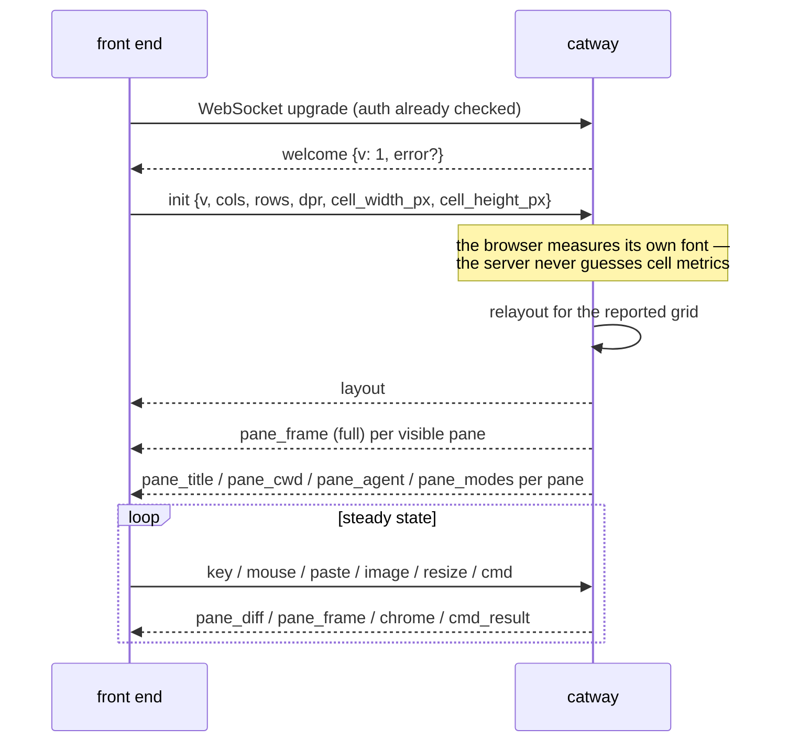
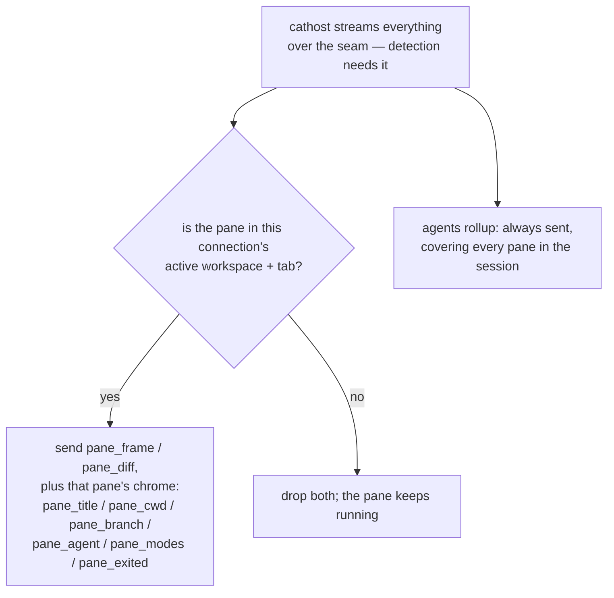

# Browser protocol

`internal/browserproto` — the one versioned contract between `catway` and a
front end. **Protocol version 1.** Full spec: `ai_docs/phase-c-ws9-protocol.md`.

## Transport and envelope

* WebSocket at `GET /ws`, authenticated **pre-upgrade** by the global HTTP
  middleware (cookie or `Authorization: Bearer`), with a same-origin check plus
  any `allowed_origins` entries.
* One JSON message per **text** frame, shaped `{"t": "<type>", …}`.
* Binary frames are reserved for a future packed cell encoding behind a version
  bump.
* Unknown `t` values **must** be ignored by both ends. `DecodeUp` / `DecodeDown`
  report them as `ErrUnknownType` so callers can drop the message instead of
  failing the session.

## Session lifecycle



`init` is required and must be first. Until the browser reports its grid, the
server assumes a default 120×32 area.

## Down — server to front end

### Layout and chrome (§3)

| `t` | Purpose |
|-----|---------|
| `welcome` | protocol version, plus an `error` string if the connection is being refused |
| `layout` | **full replacement** of the viewport structure: workspaces (sidebar), the active workspace's tabs, the active tab's pane rects, and border handles. Computed rects only — the BSP tree never crosses the wire |
| `agents` | the cross-session agent roster for the sidebar |
| `pane_title` | OSC 0/2 title for a pane |
| `pane_cwd` | working directory for a pane |
| `pane_branch` | the git branch checked out in that working directory (`""` when the pane is not in a repository); sent separately from `pane_cwd` because a checkout moves the branch without moving the pane |
| `pane_agent` | agent identity + arbitrated state for a pane |
| `pane_modes` | the pane's DEC mode state, so the UI knows whether a drag belongs to the program or to selection |
| `pane_exited` | the pane's child exited |

A `Rect` on the wire is a compact `[x, y, w, h]` array of cell coordinates.

### Pane content (§4)

| `t` | Purpose |
|-----|---------|
| `pane_frame` | a full grid: `w`, `h`, cursor, `def_fg`, `def_bg`, the link table, all cells, scroll metrics |
| `pane_diff` | a sparse patch: only changed cells, each addressed by row-major index `i`. Omitted colours resolve against the last full frame's `def_fg` / `def_bg` |

See [Keystroke to pixel](../architecture/request-lifecycle.md#two-layers-of-diffing)
for when the server picks which.

### App level (§5)

| `t` | Purpose |
|-----|---------|
| `clipboard` | an OSC 52 write from any pane (base64); empty data is a clear |
| `notify` | a toast plus a permission-gated system notification. Kind is `attention` (an agent hit a blocker) or `finished` (a background run completed). Carries the pane id and public number so a click can reveal it; the front end suppresses it entirely when that pane is already visible |
| `title` | the browser tab title |
| `error` | a server-side error to surface |
| `shutdown` | the server is going away |
| `update_ready` | a newer build is available |
| `theme` | the full resolved UI palette (+ font), pushed on any theme change so every client restyles live |
| `cmd_result` | the reply to a `cmd`, correlated by the client-chosen `id` |

## Up — front end to server

### Input (§6)

Input is **structured**; the browser never pre-encodes VT bytes.

| `t` | Payload |
|-----|---------|
| `init` | protocol version, grid size, device pixel ratio, cell pixel metrics |
| `key` | W3C `KeyboardEvent.code` plus `.key`, a modifier bitmask, and the event kind. The server runs keybinding interception, then encodes from the pane's live modes |
| `mouse` | kind, button, cell coordinates within a pane, modifier bitmask, and wheel deltas in lines. The browser converts pixels → cells with its own metrics; the server applies the pane's reported mouse encoding |
| `paste` | plain text. The server applies bracketed-paste wrapping per the focused pane's mode |
| `image` | a clipboard image paste (base64) |
| `resize` | the new grid. The server relayouts, sends a fresh `layout`, and resizes panes over the seam |
| `raw` | pre-encoded bytes. **Deprecated** — a transition escape hatch from the pre-Phase-C protocol |

Why the server encodes: it owns the pane's live mode state and it uses ghostty's
own encoders, so encoder and emulator can never drift. This retired the old
JavaScript key table and SGR mouse encoding entirely, along with their known
kitty-protocol degradations.

### Commands (§7)

```json
{ "t": "cmd", "id": "c17", "name": "pane.split", "params": { "direction": "h", "pane": 2 } }
```

`name` uses the control-API vocabulary — the same `app.Cmd*` names `catctl`
sends. `id` is client-chosen and echoed in `cmd_result`; `""` means no reply is
wanted. The full vocabulary is in [Control API](control-api.md#command-vocabulary).

## Visibility filtering



Filtering happens at the **server → front end** hop, not at the seam. On
`tab.focus` or `workspace.focus`, the server sends the new viewport's `layout`
followed by a **full** frame per newly-visible pane, then that pane's cached
chrome (`broadcastPaneChrome`) — which is why per-pane chrome can follow
visibility without the front end losing anything it is showing.

The `agents` rollup is the deliberate exception: it covers every pane in the
session, so the sidebar roster and the notification path have state for panes you
are not looking at. That is what makes "an agent finished in another workspace" a
thing you can be told about.

Anything else a front end wants about an off-screen pane it asks for, rather than
waiting to be told. `pane.list` reports every pane in the session with its live
title, cwd and agent merged in (`PaneMeta`), which is how catway's sidebar Panes
section spans all workspaces and tabs while the `layout` message it renders
viewport state from carries only the active tab.

## Multiple connections

Several front ends can be attached at once, all viewing one `app.Session`.
Per-connection state is small and explicit:

* one `FrameTranslator` per pane per connection (because `def_fg`/`def_bg` are
  per-connection),
* the connection's viewport (which workspace/tab it is showing),
* its reported grid.

Everything else is shared, so focus and layout are global, and the last client to
`resize` sets the pane sizes for everyone.

## Testing it headlessly

`catctl probe` is a stdlib-only WebSocket client that speaks this protocol
directly, authenticating with `Authorization: Bearer <secret>`. It has a small op
script language for driving a session and asserting on what comes back — the way
the browser path gets exercised in CI without a browser.

## Deferred for v1

Binary cell encoding (same semantics, WebSocket binary frames), kitty graphics,
and client-side layout computation. All three are version-bump territory, not
compatible additions.
