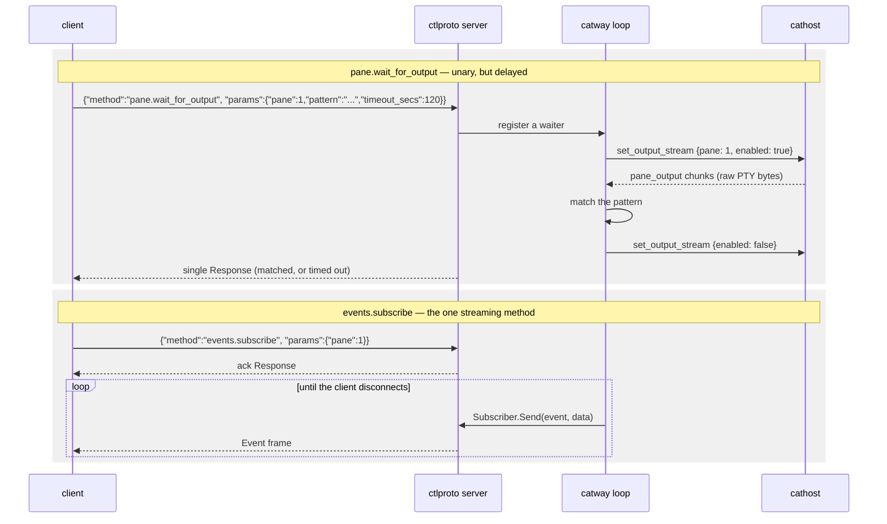

# Control API

`internal/ctlproto` — a local socket onto the **same** command table the browser
drives. **Protocol version 1.**

This is the automation surface: `catctl`, plugins, `cats-todo`, and anything you
script yourself.

## Transport

| | |
|---|---|
| Socket | `/tmp/cats-control.sock` by default; `$CATS_CONTROL_SOCKET`; `--control-socket` |
| Permissions | `0600`, owner-only — filesystem permissions **are** the auth |
| Framing | newline-delimited JSON |
| Default pattern | one `Request` in, one `Response` out, connection closes |

Path resolution is `explicit flag > CATS_CONTROL_SOCKET > /tmp/cats-control.sock`.
Server and client both call `ResolveSocket`, so they agree by default.

`catway` injects the resolved path into **every pane** as
`CATS_CONTROL_SOCKET`, alongside `CATS_PANE_ID`. That is how an in-pane script
knows which cats it lives in and which pane it is:

```bash
# inside any cats pane
catctl panes                    # finds the socket via the env var
echo "I am pane $CATS_PANE_ID"
```

If the control server fails to start, `catway` logs it and clears the path
rather than pointing panes at a socket nobody serves.

## Envelope

```json
→ {"id": "1", "method": "pane.split", "params": {"direction": "h", "pane": 2}}
← {"id": "1", "ok": true, "data": {...}}
← {"id": "1", "ok": false, "error": "pane not found"}
```

`id` is a client-chosen correlation string, echoed back; `""` is allowed.
`params` is decoded by the dispatcher via `app.JSONParamDecoder` — the same
structs the browser's params decode into, so the wire shape cannot drift between
the two front ends.

`method` is an `app.Cmd*` name, or `ping`.

### `ping`

The one method answered directly by the control server, with no session
mutation. Its `data` is the server's protocol version and service name, so a
client can confirm what it is talking to before issuing commands.

```bash
catctl ping
```

## Two methods that do not return immediately



**`pane.wait_for_output`** keeps the unchanged envelope — one request, one
response — the server just grants it a longer backstop. Matching runs against the
**raw byte stream**, not rendered frames, because frame coalescing would swallow
fast-scrolling transient output, and because the final pre-exit output must be
caught before `pane_exited`. Streaming is armed per pane only while a waiter
exists, so a pane with no waiter never pays the cost.

**`events.subscribe`** is the only streaming method, and is routed to a separate
`StreamDispatch` rather than the unary dispatcher — which is why it is *not* an
`app.Cmd*` name and is absent from `app.CommandNames()`.

The app never touches the socket. It holds a `Subscriber` and calls `Send`, which
is **non-blocking**: when a client's buffer is full — a slow or dead reader — it
returns false and the app drops the subscriber, mirroring the browser's
slow-connection drop.

### Event names

| Event | Meaning |
|-------|---------|
| `pane_exited` | the pane's child process exited |
| `pane_agent` | detected agent identity or state changed |
| `pane_title` | the program set the pane's title (OSC 0/2) |
| `pane_cwd` | the pane's working directory changed (OSC 7) |
| `pane_notify` | an agent state change warrants attention (blocked, or a background run finished) |
| `pane_added` | a pane entered the session (split / new tab / new workspace) |
| `pane_removed` | a pane left the session |
| `focus_changed` | the globally-focused pane changed |

```bash
catctl events            # everything
catctl events 1          # just pane 1
catctl events.subscribe --params '{"events":["pane_notify","pane_exited"]}'
```

## Command vocabulary

Every command below is available identically from the browser (`cmd` message) and
`catctl`. `catctl commands` prints the live list.

### Panes

| Method | Ergonomic verb |
|--------|----------------|
| `pane.split` | `split [h\|v] [pane]` |
| `pane.close` | `close [pane]` |
| `pane.focus` | `focus <pane>` |
| `pane.focus_direction` | `focus-dir <left\|right\|up\|down>` |
| `pane.cycle` | `cycle [prev]` |
| `pane.last` | `last` |
| `pane.swap` | `swap <left\|right\|up\|down>` |
| `pane.swap_with` | — (raw only) |
| `pane.zoom` | `zoom [pane]` |
| `pane.rename` | `rename-pane <pane> <name...>` |
| `pane.resize_border` | `resize <border> <ratio>` |
| `pane.send_input` | `send <pane> <text...>` / `run <pane> [text...]` |
| `pane.wait_for_output` | `wait <pane> <pattern> [timeout_secs]` |
| `scroll` | `scroll <pane> <delta>` |
| `read` | `read <pane> <r0> <c0> <r1> <c1>` |
| `capture` | `capture <pane> [lines]` |

`send` stages text without submitting; `run` types it and presses Enter. Both map
to `pane.send_input` — the difference is one flag.

### Tabs and workspaces

| Method | Ergonomic verb |
|--------|----------------|
| `tab.create` | `new-tab` |
| `tab.close` | `close-tab [num]` |
| `tab.focus` | `tab <num>` |
| `tab.rename` | `rename-tab <num> <name...>` |
| `tab.move` | — |
| `workspace.create` | `new-ws [name...]` |
| `workspace.close` | `close-ws [id]` |
| `workspace.focus` | `ws <id>` |
| `workspace.rename` | `rename-ws <id> <name...>` |
| `workspace.move` | — |

### Queries (read-only, no effects)

| Method | Ergonomic verb |
|--------|----------------|
| `session.get` | `session` |
| `workspace.list` | `workspaces` |
| `tab.list` | `tabs [workspace]` |
| `pane.list` | `panes` |
| `pane.get` | `pane [pane]` |

These are answered straight from the `Session` with no backend effects.
`pane.list` / `pane.get` add one merge on top of it: each pane's runtime metadata
(`PaneMeta` — `agent`, `agent_state`, `agent_model`, `title`, `cwd`) comes from
the backend's per-pane cache, so a client sees the same arbitrated agent identity
and live title the browser chrome shows, for every pane in the session rather
than only the ones on screen. Every field is omitted when empty.

### Worktrees, config, plugins, paths, server

| Method | Ergonomic verb |
|--------|----------------|
| `worktree.list` / `worktree.create` / `worktree.open` / `worktree.remove` | — |
| `config.get` / `config.set` | — |
| `plugin.list` / `plugin.uninstall` | — |
| `path.list` | — |
| `agent.focus` | `agent <pane>` |
| `server.reload_config` | `reload` |
| `server.stop` | `stop` |

Only the *instant* plugin verbs are commands. `install` and `update` shell out to
git and a build, whose output you want to **watch**, so the UI launches those as
`catctl plugin …` in a fresh tab rather than hiding minutes of subprocess work
behind one `cmd_result`.

Git work for worktree commands runs **off** the orchestrator loop, so a slow
`git worktree add` never stalls input.

`path.list` is what a front-end completes a directory against — the start-path
picker in the new-workspace dialog is its only caller today:

```bash
catctl path.list --params '{"dir":"~/projs/","recents":true}'
```

`dir` is a path *as typed*: `~`, `$VAR` and relative forms all resolve (a
relative one against the addressed — or focused — pane's live cwd, reported back
as `cwd`), and a path that does not resolve answers `exists:false` with an
`error` string rather than failing the command, because that is the normal state
of a path someone is half-way through typing. The answer is one directory's
whole listing (`dirs`, sorted, hidden names included, `truncated` when a very
large directory was cut off) plus, when `recents` is set, the directories the
user works in most: [cdx](https://github.com/rohanthewiz/cdx)'s frecency memory
first, then this session's own live pane cwds, so the list is useful with or
without cdx installed.

Nothing is filtered or ranked against a query server-side, on purpose. The
caller fuzzy-matches the listing locally, which keeps completion *inside* a
directory instant for a browser that may be a long way from the server and costs
one round trip per directory walked into. The directory read runs off the
orchestrator loop, like the git and plugin work above.

## Raw vs ergonomic

`catctl` has two layers. The ergonomic verbs build params from positional args and
reuse the `app.*Params` structs, so the shape can never drift from the server's:

```bash
catctl split h 2
```

The raw form reaches any method directly, including options the verbs deliberately
omit:

```bash
catctl pane.split --params '{"direction":"h","pane":2}'
catctl read    --params '{"pane":1,"anchor":[0,0],"cursor":[0,5],"rect":true}'
catctl capture --params '{"pane":1,"scope":1,"lines":100,"ansi":true}'
```

Exit status: `0` on success, `1` if the command failed, `2` on a usage or
transport error.

## Security note

The control socket is **owner-only and local**. It has no authentication of its
own and is never exposed over the network — including in
[Mode 2](../architecture/mac-client-linux-server.md), where it stays on the Linux
host. Anything that can open the socket can run any command, so treat it exactly
as you treat write access to your home directory.
