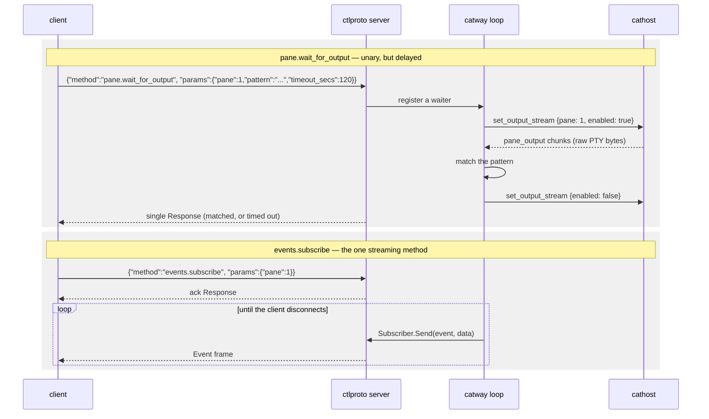

# Control API

`internal/ctlproto` — a local socket onto the **same** command table the browser
drives. **Protocol version 1.**

This is the automation surface: `catctl`, plugins, `cats-todo`, and anything you
script yourself.

## Transport

| | |
|---|---|
| Socket | `/tmp/cats-control.sock` by default; `$CATS_CONTROL_SOCKET`; `--control-socket` |
| Permissions | `0600`, owner-only — filesystem permissions **are** the auth |
| Framing | newline-delimited JSON |
| Default pattern | one `Request` in, one `Response` out, connection closes |

Path resolution is `explicit flag > CATS_CONTROL_SOCKET > /tmp/cats-control.sock`.
Server and client both call `ResolveSocket`, so they agree by default.

`catway` injects the resolved path into **every pane** as
`CATS_CONTROL_SOCKET`, alongside `CATS_PANE_ID`. That is how an in-pane script
knows which cats it lives in and which pane it is:

```bash
# inside any cats pane
catctl panes                    # finds the socket via the env var
echo "I am pane $CATS_PANE_ID"
```

If the control server fails to start, `catway` logs it and clears the path
rather than pointing panes at a socket nobody serves.

## Envelope

```json
→ {"id": "1", "method": "pane.split", "params": {"direction": "h", "pane": 2}}
← {"id": "1", "ok": true, "data": {...}}
← {"id": "1", "ok": false, "error": "pane not found"}
```

`id` is a client-chosen correlation string, echoed back; `""` is allowed.
`params` is decoded by the dispatcher via `app.JSONParamDecoder` — the same
structs the browser's params decode into, so the wire shape cannot drift between
the two front ends.

`method` is an `app.Cmd*` name, or one of the four **transport-level** methods
below — `ping`, `pair`, `clipboard.read` and `events.subscribe`
(`ctlproto.TransportMethods()`). Those four are answered before
`app.Dispatcher` ever sees the name, so they are deliberately absent from
`app.CommandNames()`; a §7 command taking one of their names would be silently
unreachable from this socket, which `TestTransportMethodsDoNotShadowCommands`
exists to prevent.

### `ping`

Answered directly by the control server, with no session mutation. Its `data` is
the server's protocol version and service name, so a client can confirm what it
is talking to before issuing commands.

```bash
catctl ping
```

### `pair`

Mints a **single-use device-pairing grant** for a phone or another client. Its
`data` is a `ctlproto.PairInfo`: the URL a device should dial, a token, its
expiry, and — when serving HTTPS — the certificate fingerprint the device pins.

```bash
catctl pair            # renders a scannable QR plus the cats:// link
catctl --json pair     # the raw PairInfo, for scripting
```

```json
{
  "url": "https://192.168.1.24:8421",
  "token": "9zs1rGrrHxpb5ADqBWBVAG-9",
  "expires_at": 1785761652,
  "fingerprint": "eb69218fd414bb5b…ca1514a8"
}
```

**Why this is not a §7 command.** The §7 table is shared with the browser front
end by construction. A browser that could mint pairing grants would turn a
stolen session cookie — which expires, and dies with the process — into a
permanent second credential. Keeping `pair` off that table is what confines
credential minting to the owner-only socket, and it is answered in
`orch.controlDispatch` before the dispatch is posted onto the loop.

**Why a grant and not the password.** A method that returned the shared secret
would be an escalation: any local process can reach this socket — a plugin, a
`curl | sh` postinstall, one of the coding agents this machine exists to run —
and the password reaches catway from anywhere on the network, forever, with no
revocation short of a restart. Worse, `catctl pair` run *inside a cats pane* has
its output swept into `~/.local/state/cats/history.json`, writing to disk the one
secret `internal/gwauth` promises never touches it.

The grant instead:

| | Grant | Shared password |
|---|---|---|
| Lifetime | `gwauth.PairTTL`, 5 minutes | forever |
| Uses | exactly one | unlimited |
| What it buys | a session credential | full access |
| Revoked by | redemption, expiry, restart | changing it and restarting |

Redemption is `POST /login` with the grant where the password would go — no new
endpoint, just one `||` in `handleLoginPost`. A native client sends
`Accept: application/json` and gets the session in the body rather than a cookie
and a 303:

```bash
curl -sk -H 'Accept: application/json' -d "password=$TOKEN" https://host:8421/login
# {"session":"1785761652.87439135…","expires_at":1785761652}
```

That session then rides `Authorization: Bearer <session>` on `/ws` — a native
client has no cookie jar, so `authed()` accepts a session value in that header as
well as in the cookie. It grants nothing new: the same value is already accepted
from the cookie, and `ValidSession` still bounds it by signature and expiry.

Sessions carry no identity (see `gwauth.IssueSession`), so paired devices are not
individually revocable — the revocation granularity is the session TTL and the
process. Set `--session-ttl` to choose how often a phone re-pairs.

Under `--auth none` there is nothing to pair with and the method fails saying so.

### `clipboard.read`

Returns the **host** system clipboard's text — the machine the server runs on,
read with `pbpaste` on macOS and `wl-paste` / `xclip` / `xsel` on Linux/BSD
(`internal/clipboard`). Its `data` is a `ctlproto.ClipboardData`.

```bash
catctl clipboard              # raw text on stdout, so it pipes
catctl --json clipboard       # {"text":"…","truncated":false}
```

```json
{ "text": "func main() {\n", "truncated": false }
```

An empty clipboard is `{"text":""}` and a **successful** answer — "nothing has
been copied yet" is a normal state, and reporting it as a failure would have a
consumer show an error for it. `truncated` marks a clipboard larger than
`clipboard.MaxBytes` (4 MiB): the text is the leading portion, cut on a whole-rune
boundary. A host with no reader on `PATH` fails with a message naming the tools
to install, which a client should read as "this host will never answer" rather
than as a transient error.

**Why this is not a §7 command.** The same reason as `pair`, applied to a
different asset. The §7 table is shared with the network-facing browser front
end; the clipboard is the *user's* rather than the session's — it holds whatever
they last copied in any application, which on a work machine is as likely to be a
password as a paragraph. A remote client holding a session cookie must not be
able to ask for it. Keeping the method off that table is what confines it to the
owner-only socket.

**Why there is no config flag on top of that.** A caller already holding this
socket can `pane.send_input` `pbpaste` into any shell pane and `capture` the
answer. A switch here would gate nothing it does not already have — it would only
make the honest path look more privileged than the dishonest one. The socket's
`0600` owner-only mode is the boundary; see the security note at the end.

**Why read-only, and only here.** OSC 52 already gives a program running inside a
pane a working clipboard *write* path, and it is write-only by design: a terminal
that answered clipboard reads would let anything that can print bytes exfiltrate
the clipboard. The read path therefore stays off the terminal stream entirely.
The browser needs none of this either — it has `navigator.clipboard`, and in the
mac app catapp's native bridge, for its own machine's clipboard.

## Two methods that do not return immediately



**`pane.wait_for_output`** keeps the unchanged envelope — one request, one
response — the server just grants it a longer backstop. Matching runs against the
**raw byte stream**, not rendered frames, because frame coalescing would swallow
fast-scrolling transient output, and because the final pre-exit output must be
caught before `pane_exited`. Streaming is armed per pane only while a waiter
exists, so a pane with no waiter never pays the cost.

**`events.subscribe`** is the only streaming method, and is routed to a separate
`StreamDispatch` rather than the unary dispatcher — which is why it is *not* an
`app.Cmd*` name and is absent from `app.CommandNames()`.

The app never touches the socket. It holds a `Subscriber` and calls `Send`, which
is **non-blocking**: when a client's buffer is full — a slow or dead reader — it
returns false and the app drops the subscriber, mirroring the browser's
slow-connection drop.

### Event names

| Event | Meaning |
|-------|---------|
| `pane_exited` | the pane's child process exited |
| `pane_agent` | detected agent identity or state changed |
| `pane_title` | the program set the pane's title (OSC 0/2) |
| `pane_cwd` | the pane's working directory changed (OSC 7) |
| `pane_notify` | an agent state change warrants attention (blocked, or a background run finished) |
| `pane_added` | a pane entered the session (split / new tab / new workspace) |
| `pane_removed` | a pane left the session |
| `focus_changed` | the globally-focused pane changed |
| `theme_changed` | the effective appearance changed (`config.set` / `theme.save` / `theme.delete`) |

Every event but the last names a pane. `theme_changed` is **session-scoped**: it
is emitted with pane 0, so a subscription that filters on a pane will not see it.
That follows from the filter's contract — a client that asked about one pane
asked about one pane — so a client wanting both takes two streams, or one
unfiltered stream and matches panes itself.

Its payload is the fully **resolved** appearance (`app.ConfigTheme`: the named
theme with the user's per-key overrides already applied, and a concrete font), so
a subscriber restyles from the event alone with no follow-up `config.get`. It is
emitted only when the effective look actually changed — a `config.set` that only
rebound a copy-mode key is silent, even though the browser still gets its
(idempotent, cheap) theme push.

```bash
catctl events            # everything
catctl events 1          # just pane 1
catctl events.subscribe --params '{"events":["pane_notify","pane_exited"]}'
```

## Command vocabulary

Every command below is available identically from the browser (`cmd` message) and
`catctl`. `catctl commands` prints the live list.

Each command's params struct, result struct, and its two dispatch properties are
also available as data — `app.CommandSpecs()`, described in
[Protocols](index.md#the-command-table-as-data) — which is what a generated
client is emitted from. The one worth knowing before writing a client: the
commands marked `ReplyRequired` there (`read`, `capture`,
`pane.wait_for_output`, `worktree.list`, `plugin.list`, `path.list`,
`config.get`, `theme.list`) are **silently dropped** when sent without a reply
channel, since a result with nowhere to go is not worth producing.

### Panes

| Method | Ergonomic verb |
|--------|----------------|
| `pane.split` | `split [h\|v] [pane]` |
| `pane.close` | `close [pane]` |
| `pane.focus` | `focus <pane>` |
| `pane.focus_direction` | `focus-dir <left\|right\|up\|down>` |
| `pane.cycle` | `cycle [prev]` |
| `pane.last` | `last` |
| `pane.swap` | `swap <left\|right\|up\|down>` |
| `pane.swap_with` | — (raw only) |
| `pane.zoom` | `zoom [pane]` |
| `pane.rename` | `rename-pane <pane> <name...>` |
| `pane.resize_border` | `resize <border> <ratio>` |
| `pane.send_input` | `send <pane> <text...>` / `run <pane> [text...]` |
| `pane.wait_for_output` | `wait <pane> <pattern> [timeout_secs]` |
| `scroll` | `scroll <pane> <delta>` |
| `read` | `read <pane> <r0> <c0> <r1> <c1>` |
| `capture` | `capture <pane> [lines]` |

`send` stages text without submitting; `run` types it and presses Enter. Both map
to `pane.send_input` — the difference is one flag.

`pane.split` returns `{"pane": N}`: the id of the pane it created, which it also
focuses. Take it rather than diffing `pane.list` around the call — that diff is
racy by construction, since another client's split can land in the same window,
and a caller that guessed wrong types into someone else's pane.

It also takes the same optional spawn params as `tab.create` — `cwd`, `command`
(an argv exec'd as the pane's process instead of a shell), and `env` — so "open a
split running X" is one round trip with no shell in the middle: no quoting, no
bracketed-paste assumption, no race against the shell's startup. Without them the
new pane inherits the split pane's live working directory. A `command` is refused
in a locked workspace, exactly as `tab.create`'s is; a bare split is the user
asking for a shell and goes through.

```bash
catctl pane.split --params '{"direction":"v","command":["ced","main.go"]}'
# {"pane": 7}
```

### Tabs and workspaces

| Method | Ergonomic verb |
|--------|----------------|
| `tab.create` | `new-tab` |
| `tab.close` | `close-tab [num]` |
| `tab.focus` | `tab <num>` |
| `tab.rename` | `rename-tab <num> <name...>` |
| `tab.move` | — |
| `workspace.create` | `new-ws [name...]` |
| `workspace.close` | `close-ws [id]` |
| `workspace.focus` | `ws <id>` |
| `workspace.rename` | `rename-ws <id> <name...>` |
| `workspace.move` | — |
| `workspace.lock` | `lock-ws [id]` / `unlock-ws [id]` |

`tab.create` opens the tab in the active workspace unless it names one:
`{"workspace":"w2"}` puts the tab there instead, without moving the viewport. It
exists for fan-out — the browser's "start in all workspaces" plugin launch sends
one `tab.create` per workspace — where focusing each workspace in turn would
scroll the user through the session as a side effect and leave them wherever the
last call landed. Everything else follows the named workspace too: `title` is
applied there (tab numbers restart per workspace), the returned `pane` is the new
tab's root pane rather than whatever the viewport has focused, an omitted `cwd` is
inherited from *that* workspace's last tab, and the lock consulted is its own.

`workspace.lock` sets a workspace aside for hand work: while it is locked, two
commands refuse it — `tab.create` **carrying a `command`** (the path a plugin
action and an agent launch both arrive on) and `pane.send_input` into any of its
panes. Everything else goes through, so a bare `tab.create`, a split, or typing
in the browser still works exactly as before; the point is to keep plugins and
agents out, not to freeze the workspace. The browser front end adds one courtesy
of its own on top of those two refusals: it dims a locked workspace's agents in
the AGENTS section, and declines the click that would land you in it — on the
workspace's own sidebar row and on any of those dimmed agent rows, whose
`agent.focus` reveals a pane by switching workspace. That is presentation only:
`workspace.focus` and `agent.focus` on a locked workspace are still ordinary
commands and still succeed, which is what the palette and the keyboard use.
`lock-ws`/`unlock-ws` are two verbs over
the one command, the same way `send`/`run` both reach `pane.send_input`; with no
id they act on the active workspace. The lock is durable (it survives a catway
restart) and reported by `workspace.list` as `locked`, but it is a guardrail
rather than a permission boundary — `workspace.lock` is itself an ordinary
command, so anything holding the control API can lift it.

### Queries (read-only, no effects)

| Method | Ergonomic verb |
|--------|----------------|
| `session.get` | `session` |
| `workspace.list` | `workspaces` |
| `tab.list` | `tabs [workspace]` |
| `pane.list` | `panes` |
| `pane.get` | `pane [pane]` |
| `host.list` | `hosts` |

These are answered straight from the `Session` with no backend effects.
`pane.list` / `pane.get` add one merge on top of it: each pane's runtime metadata
(`PaneMeta` — `agent`, `agent_state`, `agent_model`, `title`, `cwd`, `host`)
comes from the backend's per-pane cache, so a client sees the same arbitrated
agent identity and live title the browser chrome shows, for every pane in the
session rather than only the ones on screen. Every field is omitted when empty.

`host.list` is the exception that proves the rule: the cathost roster is a set of
live connections, not domain state, so it is the backend that answers. Each entry
carries `id`, `label`, `connected`, `addr_kind`, `is_default`, `panes`, and an
`error` explaining a host that is down. A session with no `hosts:` block answers
with the single synthesized `local` host — which is how a client distinguishes
"one machine here" from "the remote one is unreachable".

`host.attach` and `host.detach` are the writers, and they edit the RUNNING
session: attach builds the daemon and starts dialing, detach stops it. Both also
rewrite the config's `hosts:` block — a roster that vanished on restart would
make the pair a toy — and both answer with the new roster, so a client repaints
from the reply. `host.attach` takes a config `Host` (`id`, `addr`, and
optionally `label`, `token`/`token_file`, `fingerprint`, `is_default`); an id
already on the roster, or an address catway cannot safely dial, is refused
before anything is written.

`host.detach` takes `{id, force}`. Without `force` a host still holding panes is
refused, because detaching abandons those terminals — the command cannot move a
running process between machines. With it, the panes are re-homed onto the
default host and respawn there as new shells (layout, names and public handles
survive; what was running does not), and the departing cathost is asked to close
the PTYs it held. The synthesized `local` host cannot be detached.

`server.reload_config` applies a hand-edit of `hosts:` the same way: the file's
roster is diffed against the running one, a new entry is dialed, a removed one is
detached and its panes re-homed. A label-only change keeps the connection; a
changed address redials and keeps that host's panes.

`pane.list`'s `host` and `workspace.list`'s `host` mean different things on
purpose: a pane's is *resolved* (which machine is holding that terminal right
now, default fallbacks applied), while a workspace's is the id it *stored* —
empty meaning "whatever the default host is" — because that field is a policy for
new panes rather than a location.

### Worktrees, config, plugins, paths, server

| Method | Ergonomic verb |
|--------|----------------|
| `worktree.list` / `worktree.create` / `worktree.open` / `worktree.remove` | — |
| `config.get` / `config.set` | — |
| `host.attach` / `host.detach` | `attach-host <id> <addr> [label...]` / `detach-host <id> [force]` |
| `theme.list` / `theme.save` / `theme.delete` | — |
| `plugin.list` / `plugin.uninstall` | — |
| `path.list` | — |
| `agent.focus` | `agent <pane>` |
| `usage.refresh` | — |
| `server.reload_config` | `reload` |
| `server.stop` | `stop` |

`usage.refresh` takes a rate-limit reading now instead of at the poller's next
tick (the sidebar's refresh control). It acks the *ask*, not the answer: the
reading is one network round trip away and arrives as a `usage` broadcast, so
every client sees the fresh numbers rather than only the caller.

Only the *instant* plugin verbs are commands. `install` and `update` shell out to
git and a build, whose output you want to **watch**, so the UI launches those as
`catctl plugin …` in a fresh tab rather than hiding minutes of subprocess work
behind one `cmd_result`.

Git work for worktree commands runs **off** the orchestrator loop, so a slow
`git worktree add` never stalls input.

`path.list` is what a front-end completes a directory against — the start-path
picker in the new-workspace dialog is its only caller today:

```bash
catctl path.list --params '{"dir":"~/projs/","recents":true}'
```

`dir` is a path *as typed*: `~`, `$VAR` and relative forms all resolve (a
relative one against the addressed — or focused — pane's live cwd, reported back
as `cwd`), and a path that does not resolve answers `exists:false` with an
`error` string rather than failing the command, because that is the normal state
of a path someone is half-way through typing. The answer is one directory's
whole listing (`dirs`, sorted, hidden names included, `truncated` when a very
large directory was cut off) plus, when `recents` is set, the directories the
user works in most: [cdx](https://github.com/rohanthewiz/cdx)'s frecency memory
first, then this session's own live pane cwds, so the list is useful with or
without cdx installed.

Nothing is filtered or ranked against a query server-side, on purpose. The
caller fuzzy-matches the listing locally, which keeps completion *inside* a
directory instant for a browser that may be a long way from the server and costs
one round trip per directory walked into. The directory read runs off the
orchestrator loop, like the git and plugin work above.

## Raw vs ergonomic

`catctl` has two layers. The ergonomic verbs build params from positional args and
reuse the `app.*Params` structs, so the shape can never drift from the server's:

```bash
catctl split h 2
```

The raw form reaches any method directly, including options the verbs deliberately
omit:

```bash
catctl pane.split --params '{"direction":"h","pane":2}'
catctl read    --params '{"pane":1,"anchor":[0,0],"cursor":[0,5],"rect":true}'
catctl capture --params '{"pane":1,"scope":1,"lines":100,"ansi":true}'
```

Exit status: `0` on success, `1` if the command failed, `2` on a usage or
transport error.

## Security note

The control socket is **owner-only and local**. It has no authentication of its
own and is never exposed over the network — including in
[Mode 2](../architecture/mac-client-linux-server.md), where it stays on the Linux
host. Anything that can open the socket can run any command, so treat it exactly
as you treat write access to your home directory.

That is also the boundary `pair` is drawn against. "Anything that can open the
socket can run any command" is already true, and pairing does not widen it — but
a command that *returned the password* would, because a command's blast radius
ends when the process does, while a leaked password's does not. Hence a grant
that expires in five minutes and works once.

`clipboard.read` is drawn against the same boundary from the other side: it does
not widen it either — the socket already grants `pane.send_input` plus `capture`,
which is `pbpaste` by a longer road — so it needs no flag of its own. What it
must never become is a §7 command, because that table is reachable from the
network-facing browser front end, where none of the above is true.
