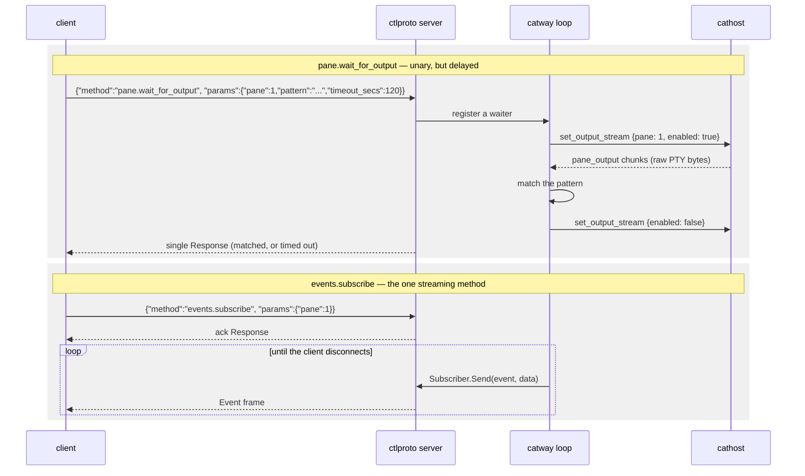

# Control API

`internal/ctlproto` — a local socket onto the **same** command table the browser
drives. **Protocol version 1.**

This is the automation surface: `catctl`, plugins, `cats-todo`, and anything you
script yourself.

## Transport

| | |
|---|---|
| Socket | `/tmp/cats-control.sock` by default; `$CATS_CONTROL_SOCKET`; `--control-socket` |
| Permissions | `0600`, owner-only — filesystem permissions **are** the auth |
| Framing | newline-delimited JSON |
| Default pattern | one `Request` in, one `Response` out, connection closes |

Path resolution is `explicit flag > CATS_CONTROL_SOCKET > /tmp/cats-control.sock`.
Server and client both call `ResolveSocket`, so they agree by default.

`catway` injects the resolved path into **every pane** as
`CATS_CONTROL_SOCKET`, alongside `CATS_PANE_ID`. That is how an in-pane script
knows which cats it lives in and which pane it is:

```bash
# inside any cats pane
catctl panes                    # finds the socket via the env var
echo "I am pane $CATS_PANE_ID"
```

If the control server fails to start, `catway` logs it and clears the path
rather than pointing panes at a socket nobody serves.

## Envelope

```json
→ {"id": "1", "method": "pane.split", "params": {"direction": "h", "pane": 2}}
← {"id": "1", "ok": true, "data": {...}}
← {"id": "1", "ok": false, "error": "pane not found"}
```

`id` is a client-chosen correlation string, echoed back; `""` is allowed.
`params` is decoded by the dispatcher via `app.JSONParamDecoder` — the same
structs the browser's params decode into, so the wire shape cannot drift between
the two front ends.

`method` is an `app.Cmd*` name, or one of the four **transport-level** methods
below — `ping`, `pair`, `clipboard.read` and `events.subscribe`
(`ctlproto.TransportMethods()`). Those four are answered before
`app.Dispatcher` ever sees the name, so they are deliberately absent from
`app.CommandNames()`; a §7 command taking one of their names would be silently
unreachable from this socket, which `TestTransportMethodsDoNotShadowCommands`
exists to prevent.

### `ping`

Answered directly by the control server, with no session mutation. Its `data` is
the server's protocol version and service name, so a client can confirm what it
is talking to before issuing commands.

```bash
catctl ping
```

### `pair`

Mints a **single-use device-pairing grant** for a phone or another client. Its
`data` is a `ctlproto.PairInfo`: the URL a device should dial, a token, its
expiry, and — when serving HTTPS — the certificate fingerprint the device pins.

```bash
catctl pair            # renders a scannable QR plus the cats:// link
catctl --json pair     # the raw PairInfo, for scripting
```

```json
{
  "url": "https://192.168.1.24:8421",
  "token": "9zs1rGrrHxpb5ADqBWBVAG-9",
  "expires_at": 1785761652,
  "fingerprint": "eb69218fd414bb5b…ca1514a8"
}
```

**Why this is not a §7 command.** The §7 table is shared with the browser front
end by construction. A browser that could mint pairing grants would turn a
stolen session cookie — which expires, and dies with the process — into a
permanent second credential. Keeping `pair` off that table is what confines
credential minting to the owner-only socket, and it is answered in
`orch.controlDispatch` before the dispatch is posted onto the loop.

**Why a grant and not the password.** A method that returned the shared secret
would be an escalation: any local process can reach this socket — a plugin, a
`curl | sh` postinstall, one of the coding agents this machine exists to run —
and the password reaches catway from anywhere on the network, forever, with no
revocation short of a restart. Worse, `catctl pair` run *inside a cats pane* has
its output swept into `~/.local/state/cats/history.json`, writing to disk the one
secret `internal/gwauth` promises never touches it.

The grant instead:

| | Grant | Shared password |
|---|---|---|
| Lifetime | `gwauth.PairTTL`, 5 minutes | forever |
| Uses | exactly one | unlimited |
| What it buys | a session credential | full access |
| Revoked by | redemption, expiry, restart | changing it and restarting |

Redemption is `POST /login` with the grant where the password would go — no new
endpoint, just one `||` in `handleLoginPost`. A native client sends
`Accept: application/json` and gets the session in the body rather than a cookie
and a 303:

```bash
curl -sk -H 'Accept: application/json' -d "password=$TOKEN" https://host:8421/login
# {"session":"1785761652.87439135…","expires_at":1785761652}
```

That session then rides `Authorization: Bearer <session>` on `/ws` — a native
client has no cookie jar, so `authed()` accepts a session value in that header as
well as in the cookie. It grants nothing new: the same value is already accepted
from the cookie, and `ValidSession` still bounds it by signature and expiry.

Sessions carry no identity (see `gwauth.IssueSession`), so paired devices are not
individually revocable — the revocation granularity is the session TTL and the
process. Set `--session-ttl` to choose how often a phone re-pairs.

Under `--auth none` there is nothing to pair with and the method fails saying so.

### `clipboard.read`

Returns the **host** system clipboard's text — the machine the server runs on,
read with `pbpaste` on macOS and `wl-paste` / `xclip` / `xsel` on Linux/BSD
(`internal/clipboard`). Its `data` is a `ctlproto.ClipboardData`.

```bash
catctl clipboard              # raw text on stdout, so it pipes
catctl --json clipboard       # {"text":"…","truncated":false}
```

```json
{ "text": "func main() {\n", "truncated": false }
```

An empty clipboard is `{"text":""}` and a **successful** answer — "nothing has
been copied yet" is a normal state, and reporting it as a failure would have a
consumer show an error for it. `truncated` marks a clipboard larger than
`clipboard.MaxBytes` (4 MiB): the text is the leading portion, cut on a whole-rune
boundary. A host with no reader on `PATH` fails with a message naming the tools
to install, which a client should read as "this host will never answer" rather
than as a transient error.

**Why this is not a §7 command.** The same reason as `pair`, applied to a
different asset. The §7 table is shared with the network-facing browser front
end; the clipboard is the *user's* rather than the session's — it holds whatever
they last copied in any application, which on a work machine is as likely to be a
password as a paragraph. A remote client holding a session cookie must not be
able to ask for it. Keeping the method off that table is what confines it to the
owner-only socket.

**Why there is no config flag on top of that.** A caller already holding this
socket can `pane.send_input` `pbpaste` into any shell pane and `capture` the
answer. A switch here would gate nothing it does not already have — it would only
make the honest path look more privileged than the dishonest one. The socket's
`0600` owner-only mode is the boundary; see the security note at the end.

**Why read-only, and only here.** OSC 52 already gives a program running inside a
pane a working clipboard *write* path, and it is write-only by design: a terminal
that answered clipboard reads would let anything that can print bytes exfiltrate
the clipboard. The read path therefore stays off the terminal stream entirely.
The browser needs none of this either — it has `navigator.clipboard`, and in the
mac app catapp's native bridge, for its own machine's clipboard.

## Two methods that do not return immediately



**`pane.wait_for_output`** keeps the unchanged envelope — one request, one
response — the server just grants it a longer backstop. Matching runs against the
**raw byte stream**, not rendered frames, because frame coalescing would swallow
fast-scrolling transient output, and because the final pre-exit output must be
caught before `pane_exited`. Streaming is armed per pane only while a waiter
exists, so a pane with no waiter never pays the cost.

**`events.subscribe`** is the only streaming method, and is routed to a separate
`StreamDispatch` rather than the unary dispatcher — which is why it is *not* an
`app.Cmd*` name and is absent from `app.CommandNames()`.

The app never touches the socket. It holds a `Subscriber` and calls `Send`, which
is **non-blocking**: when a client's buffer is full — a slow or dead reader — it
returns false and the app drops the subscriber, mirroring the browser's
slow-connection drop.

### Event names

| Event | Meaning |
|-------|---------|
| `pane_exited` | the pane's child process exited |
| `pane_agent` | detected agent identity or state changed |
| `pane_title` | the program set the pane's title (OSC 0/2) |
| `pane_cwd` | the pane's working directory changed (OSC 7) |
| `pane_notify` | a notification was raised — an agent state change (blocked, or a background run finished), or anything sent through `ui.notify` |
| `ui_action` | somebody took an action on a notification (`ui.action`, or a push action button) |
| `pane_open_file` | cats is asking the editor in this pane to open a path (`pane.open_file`) |
| `pane_added` | a pane entered the session (split / new tab / new workspace) |
| `pane_removed` | a pane left the session |
| `focus_changed` | the globally-focused pane changed |
| `theme_changed` | the effective appearance changed (`config.set` / `theme.save` / `theme.delete`) |
| `host_connected` | a cathost completed its handshake and is serving |
| `host_disconnected` | a cathost's link dropped, or it was detached |
| `runbook_finished` | one runbook run ended — see [Runbooks](#runbooks) |

The last four name no pane. They carry `pane: 0`, so a pane-scoped subscription
(`{"pane": 3}`) will not see them — a client that asked about one pane asked
about one pane. Take two streams, or one unfiltered stream, if you want both.

`host_connected` / `host_disconnected` are named for the **link**, not for
`host.attach` / `host.detach`. Those commands edit the roster and answer
immediately — `host.attach` returns before a packet has been sent, because the
dial has its own retry loop — so an event named after them would fire at a
moment that has nothing to do with them. What these report is the handshake
completing and the pump returning, which is when the machine became usable and
when it stopped being. They strictly alternate: a box that is switched off
produces one `host_disconnected`, not one per reconnection attempt, and a
`host_connected` fires again on every successful reconnect. `error` carries the
cause when the link broke by itself and is empty for a deliberate detach.

`pane_notify` carries `id` and `actions` when the notification declared buttons
(see `ui.notify` below): a subscriber that wants to answer one — a chat relay, a
status bar, a phone bridge of your own — has the id to send `ui.action` with and
the labels to draw, without a second call. `ui_action` then reports the tap,
**after** the action's own input has already been injected, along with `source`
(`control` for a `ui.action` command).

`pane_open_file` is the one event that is a **request** rather than a fact.
Everything else here reports something that happened; this one asks the editor
running in the named pane to open `path` (at `line`/`column` when given, both
1-based). An editor subscribes filtered to its own pane and needs nothing else:

```bash
catctl events.subscribe --params '{"pane":7,"events":["pane_open_file"]}'
```

Every event but `theme_changed` names a pane — `ui_action` names the
notification's pane, which is 0 for a session-level one. `theme_changed` is
**session-scoped**: it
is emitted with pane 0, so a subscription that filters on a pane will not see it.
That follows from the filter's contract — a client that asked about one pane
asked about one pane — so a client wanting both takes two streams, or one
unfiltered stream and matches panes itself.

Its payload is the fully **resolved** appearance (`app.ConfigTheme`: the named
theme with the user's per-key overrides already applied, and a concrete font), so
a subscriber restyles from the event alone with no follow-up `config.get`. It is
emitted only when the effective look actually changed — a `config.set` that only
rebound a copy-mode key is silent, even though the browser still gets its
(idempotent, cheap) theme push.

```bash
catctl events            # everything
catctl events 1          # just pane 1
catctl events.subscribe --params '{"events":["pane_notify","pane_exited"]}'
```

## Command vocabulary

Every command below is available identically from the browser (`cmd` message) and
`catctl`. `catctl commands` prints the live list.

Each command's params struct, result struct, and its two dispatch properties are
also available as data — `app.CommandSpecs()`, described in
[Protocols](index.md#the-command-table-as-data) — which is what a generated
client is emitted from. The one worth knowing before writing a client: the
commands marked `ReplyRequired` there (`read`, `capture`,
`pane.wait_for_output`, `worktree.list`, `plugin.list`, `path.list`,
`config.get`, `theme.list`) are **silently dropped** when sent without a reply
channel, since a result with nowhere to go is not worth producing.

### Panes

| Method | Ergonomic verb |
|--------|----------------|
| `pane.split` | `split [h\|v] [pane]` |
| `pane.close` | `close [pane]` |
| `pane.focus` | `focus <pane>` |
| `pane.focus_direction` | `focus-dir <left\|right\|up\|down>` |
| `pane.cycle` | `cycle [prev]` |
| `pane.last` | `last` |
| `pane.swap` | `swap <left\|right\|up\|down>` |
| `pane.swap_with` | — (raw only) |
| `pane.zoom` | `zoom [pane]` |
| `pane.rename` | `rename-pane <pane> <name...>` |
| `pane.resize_border` | `resize <border> <ratio>` |
| `pane.send_input` | `send <pane> <text...>` / `run <pane> [text...]` |
| `pane.wait_for_output` | `wait <pane> <pattern> [timeout_secs]` |
| `scroll` | `scroll <pane> <delta>` |
| `read` | `read <pane> <r0> <c0> <r1> <c1>` |
| `capture` | `capture <pane> [lines]` |

`send` stages text without submitting; `run` types it and presses Enter. Both map
to `pane.send_input` — the difference is one flag.

`pane.split` returns `{"pane": N}`: the id of the pane it created, which it also
focuses. Take it rather than diffing `pane.list` around the call — that diff is
racy by construction, since another client's split can land in the same window,
and a caller that guessed wrong types into someone else's pane.

It also takes the same optional spawn params as `tab.create` — `cwd`, `command`
(an argv exec'd as the pane's process instead of a shell), and `env` — so "open a
split running X" is one round trip with no shell in the middle: no quoting, no
bracketed-paste assumption, no race against the shell's startup. Without them the
new pane inherits the split pane's live working directory. A `command` is refused
in a locked workspace, exactly as `tab.create`'s is; a bare split is the user
asking for a shell and goes through.

`host` behaves differently here than on `tab.create`, and deliberately: a split
with no `host` lands on the machine of **the pane being split**, not on the
workspace's default host. A split means "another terminal beside this one", so a
split of a guest pane stays on the guest's machine — which is also what makes the
inherited `cwd` meaningful, since it is a path on that filesystem. `tab.create`
and `workspace.create` have no neighbouring pane to ask, so they keep taking the
workspace's host.

```bash
catctl pane.split --params '{"direction":"v","command":["ced","main.go"]}'
# {"pane": 7}
```

### Tabs and workspaces

| Method | Ergonomic verb |
|--------|----------------|
| `tab.create` | `new-tab` |
| `tab.close` | `close-tab [num]` |
| `tab.focus` | `tab <num>` |
| `tab.rename` | `rename-tab <num> <name...>` |
| `tab.move` | — |
| `workspace.create` | `new-ws [name...]` |
| `workspace.close` | `close-ws [id]` |
| `workspace.focus` | `ws <id>` |
| `workspace.rename` | `rename-ws <id> <name...>` |
| `workspace.move` | — |
| `workspace.lock` | `lock-ws [id]` / `unlock-ws [id]` |

`tab.create` opens the tab in the active workspace unless it names one:
`{"workspace":"w2"}` puts the tab there instead, without moving the viewport. It
exists for fan-out — the browser's "start in all workspaces" plugin launch sends
one `tab.create` per workspace — where focusing each workspace in turn would
scroll the user through the session as a side effect and leave them wherever the
last call landed. Everything else follows the named workspace too: `title` is
applied there (tab numbers restart per workspace), the returned `pane` is the new
tab's root pane rather than whatever the viewport has focused, an omitted `cwd` is
inherited from *that* workspace's last tab, and the lock consulted is its own.

`workspace.lock` sets a workspace aside for hand work: while it is locked, two
commands refuse it — `tab.create` **carrying a `command`** (the path a plugin
action and an agent launch both arrive on) and `pane.send_input` into any of its
panes. Everything else goes through, so a bare `tab.create`, a split, or typing
in the browser still works exactly as before; the point is to keep plugins and
agents out, not to freeze the workspace. The browser front end adds one courtesy
of its own on top of those two refusals: it dims a locked workspace's agents in
the AGENTS section, and declines the click that would land you in it — on the
workspace's own sidebar row and on any of those dimmed agent rows, whose
`agent.focus` reveals a pane by switching workspace. That is presentation only:
`workspace.focus` and `agent.focus` on a locked workspace are still ordinary
commands and still succeed, which is what the palette and the keyboard use.
`lock-ws`/`unlock-ws` are two verbs over
the one command, the same way `send`/`run` both reach `pane.send_input`; with no
id they act on the active workspace. The lock is durable (it survives a catway
restart) and reported by `workspace.list` as `locked`, but it is a guardrail
rather than a permission boundary — `workspace.lock` is itself an ordinary
command, so anything holding the control API can lift it.

### Queries (read-only, no effects)

| Method | Ergonomic verb |
|--------|----------------|
| `session.get` | `session` |
| `workspace.list` | `workspaces` |
| `tab.list` | `tabs [workspace]` |
| `pane.list` | `panes` |
| `pane.get` | `pane [pane]` |
| `host.list` | `hosts` |

These are answered straight from the `Session` with no backend effects.
`pane.list` / `pane.get` add one merge on top of it: each pane's runtime metadata
(`PaneMeta` — `agent`, `agent_state`, `agent_model`, `title`, `cwd`, `host`)
comes from the backend's per-pane cache, so a client sees the same arbitrated
agent identity and live title the browser chrome shows, for every pane in the
session rather than only the ones on screen. Every field is omitted when empty.

`host.list` is the exception that proves the rule: the cathost roster is a set of
live connections, not domain state, so it is the backend that answers. Each entry
carries `id`, `label`, `connected`, `addr_kind`, `is_default`, `panes`, an
`error` explaining a host that is down, `latency_ms`, and `lists_dirs`. A session with no
`hosts:` block answers with the single synthesized `local` host — which is how a
client distinguishes "one machine here" from "the remote one is unreachable".

`latency_ms` is the last round trip measured to that cathost (see the
[orchestration seam](orchestration-seam.md#liveness)), omitted when unknown —
never measured, not connected, or a daemon too old to answer a ping. It is
fractional because a local unix socket lands well under a millisecond, and it is
the one number that separates a slow *session* from a slow *machine*: the same
keystroke feels the same whether the box is loaded or three thousand miles away.

`lists_dirs` reports that `path.list` can complete a path on that host — always
true for the local machine, and true for a remote one whose cathost speaks
`list_dir`. It is a separate flag from `local` because the two used to be the
same answer and are not any more.

`host.attach` and `host.detach` are the writers, and they edit the RUNNING
session: attach builds the daemon and starts dialing, detach stops it. Both also
rewrite the config's `hosts:` block — a roster that vanished on restart would
make the pair a toy — and both answer with the new roster, so a client repaints
from the reply. `host.attach` takes a config `Host` (`id`, `addr`, and
optionally `label`, `token`/`token_file`, `fingerprint`, `is_default`); an id
already on the roster, or an address catway cannot safely dial, is refused
before anything is written.

`host.detach` takes `{id, force}`. Without `force` a host still holding panes is
refused, because detaching abandons those terminals — the command cannot move a
running process between machines. With it, the panes are re-homed onto the
default host and respawn there as new shells (layout, names and public handles
survive; what was running does not), and the departing cathost is asked to close
the PTYs it held. The synthesized `local` host cannot be detached.

`server.reload_config` applies a hand-edit of `hosts:` the same way: the file's
roster is diffed against the running one, a new entry is dialed, a removed one is
detached and its panes re-homed. A label-only change keeps the connection; a
changed address redials and keeps that host's panes.

`pane.list`'s `host` and `workspace.list`'s `host` mean different things on
purpose: a pane's is *resolved* (which machine is holding that terminal right
now, default fallbacks applied), while a workspace's is the id it *stored* —
empty meaning "whatever the default host is" — because that field is a policy for
new panes rather than a location.

### Worktrees, config, plugins, paths, server

| Method | Ergonomic verb |
|--------|----------------|
| `worktree.list` / `worktree.create` / `worktree.open` / `worktree.remove` | — |
| `config.get` / `config.set` | — |
| `host.attach` / `host.detach` | `attach-host <id> <addr> [label...]` / `detach-host <id> [force]` |
| `theme.list` / `theme.save` / `theme.delete` | — |
| `plugin.list` / `plugin.uninstall` | — |
| `path.list` | — |
| `ui.notify` / `ui.action` | `notify <title...>` / — |
| `ledger.list` | `history [count]` |
| `ledger.output` / `ledger.jump` | `output <pane> <block>` / `jump <pane> <block>` |
| `pane.open_file` | `open <path> [line]` |
| `file.stat` / `file.get` / `file.put` | `cp [-f] <src> <dst>` (a loop over all three) |
| `runbook.list` / `runbook.run` | `runbooks` / `runbook <name> [key=value ...]` |
| `runbook.record` | `record <start\|stop\|cancel\|status> [name] [overwrite]` |
| `agent.focus` | `agent <pane>` |
| `usage.refresh` | — |
| `server.reload_config` | `reload` |
| `server.stop` | `stop` |

`usage.refresh` takes a rate-limit reading now instead of at the poller's next
tick (the sidebar's refresh control). It acks the *ask*, not the answer: the
reading is one network round trip away and arrives as a `usage` broadcast, so
every client sees the fresh numbers rather than only the caller.

Only the *instant* plugin verbs are commands. `install` and `update` shell out to
git and a build, whose output you want to **watch**, so the UI launches those as
`catctl plugin …` in a fresh tab rather than hiding minutes of subprocess work
behind one `cmd_result`.

The worktree commands act on the machine the addressed pane is on — `worktree.remove`
on the one its workspace's checkout belongs to — because git is a subprocess
acting on a filesystem. `worktree.list` reports that machine as `host`, and every
path in its answer (`repo_root`, `worktree_root`, each checkout) is a path there.
A host whose cathost predates the `worktree` capability is refused by name rather
than answered from the wrong disk, and a workspace whose host has been detached
cannot have its checkout removed at all — the directory is on a filesystem this
catway can no longer reach.

Git work runs **off** the orchestrator loop at both ends, so a slow
`git worktree add` never stalls input on either machine.

### File transfer

`file.stat`, `file.get` and `file.put` read and write files on the machine an
addressed pane runs on. `catctl cp` is the loop over them:

```bash
catctl cp devbox:/var/log/build.log .      # from a cathost
catctl cp ./patch.diff devbox:~/work/      # to one
catctl cp devbox:notes.md laptop:notes.md  # between two
catctl cp -f ./config.yaml devbox:/etc/app/config.yaml   # -f allows a replace
```

Either operand may be `host:path`, in the scp notation. A leading `/`, `.` or
`~` makes an operand local regardless of what follows, so `./weird:name` is a
path rather than a host.

**Which machine, and what a relative path means.** Both commands take `pane`
(the anchor — it picks the machine, and a relative path resolves against that
pane's live cwd *there*) and `host` (which overrides the anchor's machine, for
naming a file on a box no pane is anchored to). Paths travel **raw**: `~` is the
answering machine's user's home, and expanding it here would name a directory in
this machine's account. When `host` names a different machine than the anchor
pane's, the anchor cwd is dropped rather than used — a cwd from another
filesystem is not an anchor, it is a plausible-looking wrong answer.

**These are ranged, not streaming.** Every hop between a caller and a remote disk
is a whole-message transport with a ceiling — the orchestration seam's 8 MiB
frame, the control relay's 4 MiB line — and JSON renders bytes as base64, which
costs 4/3 of the payload on each. So the chunking is the **caller's loop** over a
stateless positional primitive: one megabyte per request, nothing held open
between chunks, a dropped link losing a chunk rather than a transfer.

| Params | Meaning |
|--------|---------|
| `path` | the file, raw (see above). Required. |
| `pane` / `host` | which machine, as above |
| `offset` / `length` | `file.get`: the slice to read. `length` is clamped to 1 MiB. |
| `data` | `file.put`: the bytes, base64 |
| `more` | `file.put`: this is **not** the last chunk. Absent means the put is the whole file. |
| `mode` | `file.put`: permissions for a file it creates (`0644` by default) |
| `overwrite` | `file.put`: allow replacing an existing file. Absent means refuse. |

`file.get` with **neither** `offset` nor `length` means "the whole file", and is
**refused by size** when the file does not fit in one chunk rather than answered
with its first megabyte. A prefix with `eof: false` is indistinguishable from a
whole file to a caller that did not check the flag, and a caller asking for a
whole file without ranging it is exactly that caller. A `file.get` result carries
`size` (the whole file) and `eof` (this slice reached the end); a transfer loop
terminates on `eof`, not on arithmetic, so a log that grew mid-copy ends where it
ends.

`file.put` writes through a **part file** and renames on the chunk that is not
`more`. So the destination name never holds a half-written file — an interrupted
transfer leaves `.name.cats-part` beside it, under a name nothing will mistake
for the real thing. Overwrite is refused on every chunk, not only the first, and
a refusal cleans up its own fragment.

Both are refused by name on a cathost too old to advertise the `file_transfer`
capability, rather than answered from the wrong disk. A file on **this** catway's
own machine is read in-process rather than round-tripped to the local cathost,
so transfer works there even against an old local daemon.

**Dragging a file onto a pane in the browser** uploads it into that pane's
working directory, on that pane's machine, through the same `file.put`. The
browser sends a bare filename and never learns the cwd — the anchor pane resolves
it — which is also why it cannot land in the wrong directory when somebody has
just `cd`'d.

**No new privilege.** Anything holding the control socket can already
`pane.send_input` a `cat` and read the pane back, and anything holding the
orchestration seam can already spawn arbitrary processes on that machine. What
changes is that neither has to any more.

### Command history

`ledger.list` is one record per command a shell ran in any pane, on any host —
newest first:

```bash
catctl history 20
catctl ledger.list --params '{"contains":"go test","failed":true}'
catctl ledger.list --params '{"host":"devbox","cwd":"/srv/app","limit":50}'
```

| Field | Meaning |
|-------|---------|
| `at` | when it started, RFC3339 with nanoseconds |
| `host` / `pane` / `handle` | where. `handle` is the public label at the time, stored rather than resolved later so a closed pane is still nameable |
| `cmd` / `cwd` | what ran, and the directory it started in |
| `exit` | **absent** when the shell reported no status — deliberately distinct from `0` |
| `duration_ms` | measured on the machine that ran it |
| `origin` | `human`, or the label of the agent holding the pane when it started |

**This is not your shell's history file.** Those record what was *typed*, per
shell and per machine, with no cwd, no status, no duration and no pane — and an
agent's commands are absent from them entirely, because an agent drives a PTY
rather than typing into a shell that writes one. `origin` is the field that
makes an agent's work reviewable.

The filters AND together. `contains` is a plain case-insensitive substring
rather than a regexp or a fuzzy match: the caller doing the interesting matching
is a palette that wants the recent list and will rank it itself, which is the
same division `path.list` draws. `failed` means *known* to have failed — a
command whose shell reported no status is not counted, since that is exactly the
case somebody is using the filter to investigate.

#### Blocks — a command's output, after the fact

Each record carries a `block`: a handle for the extent of that command's output
in its pane's scrollback.

```bash
catctl output 3 12        # print it (raw, so it pipes)
catctl jump 3 12          # scroll that pane's viewport to it
```

**A block is live terminal state, not a stored copy.** Its cathost holds it as
two *marks* that the terminal itself moves as the scrollback shifts — which is
why both verbs are round trips rather than reads of a stored row number. The
naive design (record the screen-buffer rows) is wrong in a way that only shows
up later: those rows count from the top of the scrollback, so every line evicted
when the buffer wraps shifts them by one, and a stored row would quietly address
somebody else's output. Nothing about the result would look wrong.

So a block whose rows have finally been discarded says so. `ledger.output`
answers `found: false` — a state, not a failure, because a caller walking a
history wants to know which entries are still readable rather than have the walk
stop — while `ledger.jump` refuses by name, since it has nowhere to go.

`start_row` / `end_row` in the reply are screen-buffer rows **at the moment of
the answer**, which is the only moment they mean anything. An entry with no
`block` is one whose pane never pinned it, or one that outlived the pane it ran
in; it still lists, it just cannot be opened.

In the browser this is the sidebar's **History** section: a click jumps, and the
row's context menu copies the output.

It needs [shell integration](../reference/cli.md#verbs) installed
(`catctl integration install shell`): the records come from the OSC 133 marks a
shell prints around each command, which each cathost scans out of its own panes'
output. A shell with no integration produces no records — and one that prints
the marks but never the command line produces none either, since the field the
history exists for would be missing.

### Opening a file in the editor

`pane.open_file` is the inverse of `ced --remote`: cats asks the session's editor
to open a path.

```bash
catctl open internal/app/commands.go 412
catctl pane.open_file --params '{"path":"~/projs/go/cats/main.go","line":9,"pane":3}'
```

**cats does not run an editor.** It works out which pane should hear the request
and emits a `pane_open_file` event on the control stream that pane's editor is
already subscribed to. Three things follow, and each is a thing cats does not
have to do: it never learns an editor's CLI (`ced --remote`'s discovery — probe
every socket, pick the instance whose root contains the file, longest root wins
— is ced's, and runs on ced's machine); an editor on **another host** works by
construction, because its subscription arrives through the control relay; and
any editor works, since the whole contract is one event name plus the agent
label that pane reports.

| Param | Meaning |
|-------|---------|
| `path` | required, and passed **verbatim** — it names a file on the editor's machine, where `~` is that user's home |
| `line` / `column` | 1-based; omit for "wherever the file opens" |
| `pane` | the **anchor** — where the request came from. Decides the host, the tab and workspace searched first, and where a spawned editor is split. Defaults to the focused pane |
| `editor` | an explicit editor pane, skipping resolution |
| `host` | overrides the anchor's machine |
| `spawn` | allow starting an editor when none is running; defaults to [`editor.spawn`](../reference/configuration.md#editor) |

**Nearest wins.** The editor in the anchor's own tab, then its workspace, then
anywhere in the session — the order a person means by "the editor". Ties inside
a rung go to the lowest pane id rather than to focus recency, so clicking two
paths in a row opens both in the same editor.

**The editor must be on the file's machine.** A path is only half an identity:
the same string on two hosts is two different files, so an editor elsewhere is
not offered, and an explicit one is refused by name.

**A spawned editor gets the path in its argv**, not as an event — an editor that
has not started cannot be subscribed to one, and an event sent into that gap is
simply lost. The cost is the line number, which no editor CLI here accepts, so a
cold open lands at the top of the file. `spawned` in the result says which of the
two happened. Starting an editor is starting a process, so it answers to the
[workspace lock](../reference/cli.md#verbs) like `tab.create`.

In the browser this is what a **`file://` OSC 8 hyperlink** does when clicked: a
compiler or linter emitting one names a file on the *pane's* machine, and
rendering it as text in a browser tab is not what anybody clicking a stack trace
wanted. Every other scheme still opens in a new tab.

### Notifications

`ui.notify` raises the same notification an agent state change raises — the
browser toast, the `pane_notify` event, and the phone bridge, by one path — from
anything holding this socket. A plugin, an agent hook, a runbook, `catctl` in a
script, or an editor in a pane on another machine:

```bash
catctl notify deploy finished
catctl ui.notify --params '{
  "title": "claude needs attention",
  "kind":  "attention",
  "pane":  3,
  "actions": [
    {"id": "yes", "label": "Yes",  "send": "1", "submit": true},
    {"id": "no",  "label": "No",   "send": "2", "submit": true}
  ]
}'
```

`kind` is `attention`, `finished` or `info` (the default). `info` is deliberately
**not** in the default `push.kinds`, so a plugin narrating its own progress
cannot start vibrating a phone merely by existing; an operator who wants that
adds one word to the config.

`pane` attributes the notification: it is the deep link a tap follows, the
client-side "is it already on screen" suppression, and the default target of an
action's `send`. Omit it for a session-level notification — right for "the
nightly build finished", wrong for anything a button could answer.

**An action is a declared effect, not a callback.** `send` is injected into the
pane exactly as `pane.send_input` would inject it (`submit` appends Enter). That
is not a convenience: the caller this exists for is a hook script that reported
its agent blocked and exited milliseconds before anyone saw the notification, so
an action meaning "call me back" would be dead on arrival in the case the
feature is for. An action with no `send` is announcement-only and reaches live
subscribers as `ui_action` to act on themselves.

`ui.notify` returns the `id` its actions are answered by (empty when it declared
none). `ui.action {id, action}` takes one:

```bash
catctl ui.action --params '{"id":"K2fD…","action":"yes"}'
```

**A notification is answered once.** The registry drops it on the first action
taken, so a browser toast and a lock screen showing the same buttons cannot both
land an answer, and a second attempt is refused by name. An action whose `send`
fails — the pane exited between the notification and the tap — is still spent,
so a phone retrying over a flaky link cannot land a "yes" twice because the first
attempt reported an error. Buttons expire after 30 minutes: by then the agent has
usually timed out and the shell has scrolled, and an answer would land somewhere
it was never meant for.

When [`push.actions`](../reference/configuration.md#answering-from-the-notification)
is on, an `attention` notification that declared no actions of its own gets them
derived: catway reads the blocked pane's screen, parses the agent's menu out of
it, and the phone's buttons answer the prompt. Those derived buttons are
phone-only — a browser is one click from the pane — and a notification that
declared its own actions is never second-guessed that way.

This confers no privilege a caller does not already have: anything holding this
socket can `pane.send_input` directly, and gating the honest route would only
make it look more privileged than the dishonest one — the same argument written
down for `clipboard.read`.

`path.list` is what a front-end completes a directory against — the start-path
picker in the new-workspace dialog is its only caller today:

```bash
catctl path.list --params '{"dir":"~/projs/","recents":true}'
```

`dir` is a path *as typed*: `~`, `$VAR` and relative forms all resolve (a
relative one against the addressed — or focused — pane's live cwd, reported back
as `cwd`), and a path that does not resolve answers `exists:false` with an
`error` string rather than failing the command, because that is the normal state
of a path someone is half-way through typing. The answer is one directory's
whole listing (`dirs`, sorted, hidden names included, `truncated` when a very
large directory was cut off) plus, when `recents` is set, the directories the
user works in most: [cdx](https://github.com/rohanthewiz/cdx)'s frecency memory
first, then this session's own live pane cwds, so the list is useful with or
without cdx installed.

Nothing is filtered or ranked against a query server-side, on purpose. The
caller fuzzy-matches the listing locally, which keeps completion *inside* a
directory instant for a browser that may be a long way from the server and costs
one round trip per directory walked into. The directory read runs off the
orchestrator loop, like the git and plugin work above.

`host` names the machine to list on, overriding the anchor pane's. It exists
because the new-workspace dialog picks a host *before* anything exists there:
with only a pane to go by, a path typed for `devbox` would be completed against
the local disk and every suggestion would name a directory that does not exist
where the workspace is about to be created.

**The listing is always produced by the machine that owns the paths.** For a
remote host it is taken by that cathost, over the seam — `~` is that user's
home, `.` is a directory only that kernel can resolve, and whether something is
a directory at all is not a question this side can answer about a disk it cannot
see. `cwd` is the anchor the request was made against, and it is dropped when
the anchor pane is on a different machine from the one being listed: a relative
path resolved against a directory from another filesystem is worse than no
anchor, and with none the answering machine starts at its own home.

A host whose cathost predates the `list_dir` capability answers with an `error`
naming the host rather than with this machine's directories. `host.list`'s
`lists_dirs` is how a client knows in advance, and is what the browser gates its
picker on.

### Runbooks

A runbook is a YAML file in `~/.config/cats/runbooks` (`$XDG_CONFIG_HOME/cats/runbooks`)
whose steps are §7 commands, run in order against the live session.

```bash
catctl runbooks                                  # name, description, step count, declared vars
catctl runbook morning
catctl runbook deploy branch=main
catctl runbook.run --params '{"name":"deploy","vars":{"branch":"main"}}'
```

```yaml
description: the three panes I always start with
vars:
  repo: ~/src/api
steps:
  - run: workspace.create
    params: {name: api, path: "{{ vars.repo }}"}
    id: ws
  - run: pane.send_input
    params: {pane: "{{ ws.pane }}", text: "make dev\n"}
  - run: pane.wait_for_output
    params: {pane: "{{ ws.pane }}", pattern: "listening on", timeout_ms: 60000}
    id: up
    expect: "{{ up.matched }}"
  - run: ui.notify
    params: {title: "morning runbook done"}
```

**A step is a command, not a script line.** There is no runbook verb for
sleeping, branching or shelling out, and there is no runbook-only implementation
of anything: `runbook.run` re-enters the very same dispatcher a browser `cmd` and
a `catctl` request go through, once per step. So "what can a runbook do?" is
answerable without reading its source — exactly what its caller could already do,
in one round trip instead of five. Waiting for a shell to finish is
`pane.wait_for_output`; telling somebody it finished is `ui.notify`. Automation
that genuinely needs control flow is a program, and a program can hold this
socket itself.

The one command a step may not be is `runbook.run`. Everything else is bounded by
what the table offers; a runbook running a runbook is not bounded at all, and the
recursion would surface as a wedged loop rather than as a mistake in a file.

#### References

A step with an `id` binds its **result** under that name for later steps.
References use the wire field names — `{{ ws.pane }}` is the field `catctl commands`
documents, not the Go one, because no runbook author has a reason to know the Go
one. A path may index a list: `{{ list.panes.0.pane }}`.

Substitution has two modes, and the distinction is what makes references usable:

| Written | Sends |
|---------|-------|
| `pane: "{{ ws.pane }}"` | the **number** `3` — the value with its type intact |
| `text: "cd {{ vars.repo }} && make"` | the string, with the value interpolated |

A value that is *exactly* one reference keeps its type, because `pane` is a
`uint32` on the wire and the string `"3"` there is a decode error. A reference
embedded in longer text is stringified, because the surrounding characters prove
the author wanted text.

`vars` are declared with their defaults in the document and overridden per run.
Declaring them is what makes `{{ vars.branch }}` checkable; passing one the
runbook never declared is **refused**, not ignored, because a silently dropped
var makes the run succeed at doing the wrong thing.

#### `expect` — succeeded is not the same as happened

`pane.wait_for_output` reports a **timeout** as a successful call returning
`matched: false`. That is right for a client, which asked a question and got an
answer. It is wrong for a sequence: "wait for the build, then deploy" has to
stop when the build never finished, and without help the run would sail into the
deploy having noticed nothing.

`expect:` is a reference that must resolve to a **truthy** value after the step
has run:

```yaml
  - run: pane.wait_for_output
    params: {pane: 3, pattern: "BUILD OK", timeout_ms: 300000}
    id: build
    expect: "{{ build.matched }}"
```

It needs an `id:` on its own step, since what it asserts on is usually that
step's own result. Falsy means `false`, `0`, `""`, an empty list or object, or
`null`; a field that does not **exist** is an error rather than a falsy value,
because asserting on a field that is not there is a mistake in the runbook.

The alternative was teaching the engine about `wait_for_output`'s result shape.
That is worse: the engine would then know one command specially, and the next
result field meaning "did not happen" — `ledger.output`'s `found` — would need
the same edit. One step-level assertion covers the class.

#### Everything checkable is checked at load

A runbook is a sequence of side effects on a live desktop — panes get split,
input gets typed — and there is no undo. A mistake found at step 4 has already
let steps 1–3 change the session. So `runbook.run` validates the whole document
before dispatching anything, and refuses on:

- a `run:` that is not a command in the table
- a command whose params are required, with none given
- **a param key the command's params struct has no field for**
- an `id` on a command that returns no data, a duplicate `id`, or the reserved
  name `vars`
- a reference to a step that has not run yet, or to an undeclared var
- an unclosed `{{`

The param-key check matters more than it looks. `encoding/json` **ignores** a key
it has no field for, so `timeout_secs` where the struct says `timeout_ms` is not
an error anywhere in the system — the command runs with the field at its zero
value and reports success. In a client that is a bug you see in the output. In a
runbook it is a step that appears to work and quietly did something else, three
steps before the one that matters:

```
step 1: pane.wait_for_output has no param "timeout_secs";
        it takes lines, pane, pattern, regex, timeout_ms
```

`runbook.list` reports files that **failed** to parse alongside the ones that
loaded, each with its error. A runbook simply missing from the list looks exactly
like one that was never written, and the two need different fixes.

#### Results

```json
{"name":"morning","steps":[
  {"index":1,"id":"ws","run":"workspace.create"},
  {"index":2,"run":"pane.send_input","error":"no pane 7"},
  {"index":3,"run":"ui.notify","skipped":true}],
 "failed":true}
```

`catctl runbook` **exits 1** when `failed` is set. A runbook that ran but whose
steps failed is a successful command with an unsuccessful result, and
`catctl runbook deploy && ./ship.sh` has to stop.

A failed step stops the run, and every step after it is reported `skipped`.
"Did not run" and "ran fine" are the two things that must not look alike to
whoever is working out what state the session was left in. `continue_on_error:
true` on a step tolerates its failure — the failure is still recorded.

Step results deliberately carry **no data**. A `capture` mid-runbook would put a
screenful of text in the reply for every client that sees it, and the value is
already where it is useful: bound under the step's id for the steps that follow.
A runbook whose product is data ends by putting it somewhere.

The directory is re-scanned on **every** call, so editing a file and immediately
running it runs the new steps. Caching would make "edit, run" execute the
previous version — a staleness bug whose symptom is a correct-looking run of the
wrong thing.

`runbook.run` is the second method after `pane.wait_for_output` that is *meant*
to be slow, so the server sizes its per-request backstop off the run's own limit
(`app.MaxRunbookRuntime`, 5 minutes) rather than off one command's. A backstop
below that would answer "command timed out" while the run carried on changing the
session.

#### Triggers — `on:`

A runbook may declare the events that run it, and then nobody has to ask:

```yaml
name: tidy-up
on:
  - event: pane_exited
    where: {exit_code: 0}
  - event: pane_agent
    where: {state: blocked, agent: claude}
    min_interval: 30s
steps:
  - run: ui.notify
    params:
      title: "pane {{ event.pane }} is done"
      pane: "{{ event.pane }}"
```

`on:` accepts an event name, a clause, or a list of either — `on: pane_exited`
and the block above are the same kind of thing. A trigger is a **control-API
event and nothing else**, the same way a step is a command and nothing else: if
a runbook can react to it, a client subscribed to `events.subscribe` could
already have reacted to it. That keeps "what can start a runbook?" answerable
from the [event table](#event-names) rather than from the engine.

* **`where:`** filters on the event's payload by exact match; every entry must
  hold. A value written as a list is any-of, so `state: [blocked, idle]` is one
  clause. Keys are checked against the event's payload **at load** — `exit_cod:
  0` is a refusal, not a filter that silently never matches, which is the same
  failure a misspelled param would be one layer out. Fields dropped by
  `omitempty` are filled in with their zero values first, so `exit_code: 0` — the
  ordinary successful exit — matches rather than being the one value that never
  could.
* **`min_interval:`** is a throttle, not a safety device. `pane_cwd` fires on
  every `cd`, and a runbook reacting to "I moved to a new repo" wants the settled
  answer rather than one run per path component.
* **`{{ event.… }}`** is the firing event's payload, under the reserved root
  `event` (a step id may not be called that, exactly as with `vars`). Field names
  are checked at load against the union of the declared events' payloads. Running
  a triggered runbook by hand binds `event` to an **empty object**, so
  `{{ event.pane }}` then fails at the step that used it — true, and it stops the
  run, rather than resolving to something invented.

There is no `{{ }}` for *which* event fired. A runbook has no branching, so
"react differently depending on the event" is two runbooks, which is also how it
reads.

##### What stops a runaway

A runbook triggered by `pane_exited` can spawn panes that exit, and two runbooks
can trigger each other. Four rules, in the order they apply:

1. **One run per runbook**, whatever started it. A trigger firing while that
   runbook is running is **dropped, never queued** — a queue would be a backlog
   of stale side effects, since the event that queued a run described a session
   the run in front of it is still changing. A manual `runbook.run` is refused
   with the same rule, and says so.
2. **A global cap** of four runs in flight, counting manual ones. It bounds one
   event that matches many runbooks.
3. **A rate limit** of 10 trigger-started runs per minute per runbook. Tripping
   it **suspends** that runbook's triggers for 5 minutes. This is the rule that
   actually terminates a mutual-trigger loop: neither of the first two can,
   because A and B taking turns are never running at the same time. The
   suspension expires by itself, and never blocks a manual run — the one thing it
   must not do is stop somebody debugging the runbook that got suspended.
4. **Reserve, then start.** A run's steps never execute inside the `emitEvent`
   that started them; the orchestrator loop starts them on its next turn.

`runbook.list` reports `triggers` (the event names) and `trigger_status`, which
is why the triggers would not fire right now — suspended, a run in flight, the
feature switched off — and empty when they are armed. Every one of those causes
otherwise lives in daemon state nobody can see, and they all produce the same
symptom: nothing happens.

Set `runbooks.triggers: false` in the config to stop every `on:` clause at once.
It is file-only and deliberately not reachable from `config.set`, since a runbook
could then turn its own triggers back on.

##### Every run ends with an event

```json
{"pane":0,"name":"tidy-up","source":"trigger","trigger":"pane_exited",
 "steps":3,"failed":true,"failed_step":2,"error":"no pane 7"}
```

`runbook_finished` exists for the runs nobody is waiting on: a triggered run has
no caller to hand a result to, so without it a runbook that failed halfway would
leave no trace outside the log. Manual runs emit it too — a client watching the
stream should not have to know which runs it will be told about — with `source`
`"control"` and no `trigger`. It carries a summary rather than the per-step list,
because it answers "did the thing I set up actually work", not "what happened";
whoever asked for the run already has the second answer.

#### Recording one

`runbook.record` writes the file the other two read: do the thing once by hand,
then ask for it back as YAML.

```bash
catctl record start
# … split a pane, type the command, wait for it, notify …
catctl record status                 # what has been captured so far
catctl record stop deploy            # writes ~/.config/cats/runbooks/deploy.yaml
catctl record stop deploy overwrite  # …replacing one that is already there
catctl record cancel                 # throw it away
```

**Armed, not always on.** Nothing is captured until somebody asks, and the
recording lives in memory until it is given a name. The alternative — a durable
journal every command lands in, sliced by time afterwards — is strictly more
powerful and strictly worse to own: a permanent record of every parameter of
every command, including every chat message and every keystroke, kept by
default, on a machine somebody else may administer. `status` exists so an empty
recording is visible before it is stopped.

**What is captured** is declared per command (`CommandSpec.Recorded`), not
inferred, and the rule is "would replaying this do again what was done":

* Queries are out — a macro containing `pane.list` is noise, because the caller
  that ran it was looking at something rather than doing something.
  `pane.wait_for_output` is the exception that proves the rule: no effect at all,
  and recorded, because a replay without it races the shell it waited for.
* Answers to a live prompt are out — `ui.action`, `chat.permission`,
  `ledger.jump` each name something that existed for one moment.
* `runbook.run` is out because its **steps** are recorded as they run. Recording
  a runbook produces a runbook that does the same thing, rather than one that
  does everything twice.

The hook is in the dispatcher and nowhere else, so what is recorded is the
vocabulary rather than one client's use of it: a browser click, a `catctl` call,
a plugin, a relayed command from another host and a runbook's own step are all
the same event to it. A command that **failed** is dropped — it did not happen.

**Pane and workspace ids do not survive.** A recorded `pane.send_input
{pane: 7}` replayed tomorrow types into whatever pane 7 is then, so every handle
is rewritten:

* a pane or workspace made **inside** the recording becomes a reference to the
  step that made it (`{{ s1.pane }}`), exactly as a hand-written runbook would
  spell it;
* the pane and workspace the recording **started in** become the pane and
  workspace the runbook is *run* from, through a `pane.get` / `session.get` step
  the emitter prepends. This is what makes the common recording — do the thing in
  the pane I am already in — work at all;
* anything else is **refused**, naming the step and the fix. A runbook that loads
  and then acts on a stranger's pane is the failure mode the load checks exist to
  prevent, and no comment in a file prevents it.

Consecutive `pane.send_input` calls to one pane are merged into one step, up to
and including the keypress that submitted — a browser sends one command per key,
and a step per character is faithful and unreadable.

**Redaction is per field, not per command.** A field marked secret in the
vocabulary (today: `host.attach`'s `token`) never reaches the file; the emitted
runbook declares a var for it and asks for the value when it runs. Deliberately
narrow: `pane.send_input`'s text is the most private field in the vocabulary and
is recorded, because it is also the one a macro exists to replay — the
protection for it is that recording is armed at all.

A `stop` that is refused — a name already taken, a handle that cannot be
rewritten, nothing captured — leaves the recording **running**, so a typo does
not cost the whole session's work.

## Raw vs ergonomic

`catctl` has two layers. The ergonomic verbs build params from positional args and
reuse the `app.*Params` structs, so the shape can never drift from the server's:

```bash
catctl split h 2
```

The raw form reaches any method directly, including options the verbs deliberately
omit:

```bash
catctl pane.split --params '{"direction":"h","pane":2}'
catctl read    --params '{"pane":1,"anchor":[0,0],"cursor":[0,5],"rect":true}'
catctl capture --params '{"pane":1,"scope":1,"lines":100,"ansi":true}'
```

Exit status: `0` on success, `1` if the command failed, `2` on a usage or
transport error.

## Security note

The control socket is **owner-only and local**. It has no authentication of its
own and is never exposed over the network — including in
[Mode 2](../architecture/mac-client-linux-server.md), where it stays on the Linux
host. Anything that can open the socket can run any command, so treat it exactly
as you treat write access to your home directory.

"Local" has one deliberate exception, and it is opt-in per host. A cathost can
relay this API to panes running on **its** machine, so in-pane tooling there
works as it does here — see
[`control_relay`](../reference/configuration.md#control_relay-letting-a-host-drive-the-session).
It is off by default because it hands that machine the whole session: every
command, on every host, including the ones it cannot otherwise see. The relay is
still an owner-only unix socket, just an owner-only unix socket on somebody
else's box.

That is also the boundary `pair` is drawn against. "Anything that can open the
socket can run any command" is already true, and pairing does not widen it — but
a command that *returned the password* would, because a command's blast radius
ends when the process does, while a leaked password's does not. Hence a grant
that expires in five minutes and works once.

`clipboard.read` is drawn against the same boundary from the other side: it does
not widen it either — the socket already grants `pane.send_input` plus `capture`,
which is `pbpaste` by a longer road — so it needs no flag of its own. What it
must never become is a §7 command, because that table is reachable from the
network-facing browser front end, where none of the above is true.
