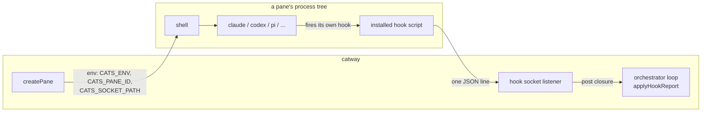
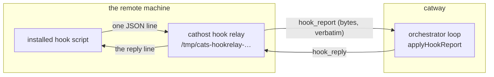
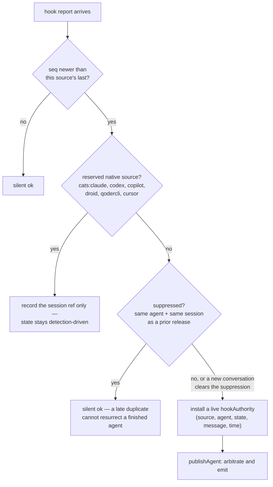
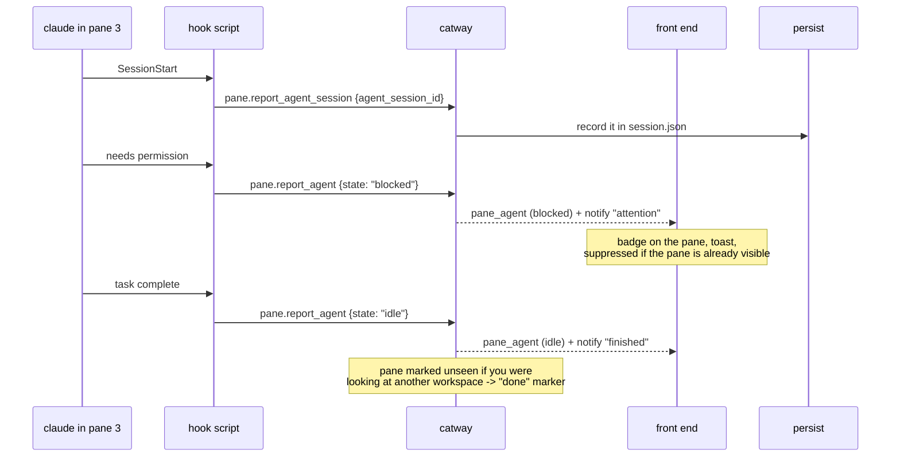

# Hook API

The ingestion seam for **agent hook reports**: the shell hooks that
`catctl integration install` plants inside coding agents dial a local unix socket
and tell cats what the agent is doing.

Implemented in `cmd/catway/hooks.go`. The wire shapes and reply format are frozen
for parity with the retired Rust server, byte for byte, so the installed assets —
shared verbatim between the two trees — work against either.

## The two halves of the seam



**Env injection is what arms the hooks.** `createPane` gives every pane
`CATS_ENV=1`, `CATS_PANE_ID=<public id>` and `CATS_SOCKET_PATH=<hook socket>`
via `integration.PaneEnv`. A hook script that finds no `CATS_SOCKET_PATH` simply
does nothing — which is why installing an integration is harmless outside cats.

If the hook server fails to start, `catway` logs it and clears the path rather
than pointing panes at a socket nobody serves.

### Panes on another machine

A pane on a remote cathost cannot dial `catway`'s socket: the path names a file
in a filesystem it cannot see. Worse, the conventional path exists on any box
that runs cats itself, so injecting it there would post a remote agent's state
onto a *different* server's panes.

So each cathost opens a **hook relay** on its own machine, advertises the path in
its `welcome`, and `catway` injects that into the panes it creates there. What
arrives is forwarded across the seam verbatim and answered by `catway`:



The cathost parses none of it. The pane the report is about belongs to
`catway`'s model and the hook API is `catway`'s to define, so relaying bytes is
both the correct division and what keeps the next field added here from needing a
cathost release. A relayed report goes through exactly the same arbitration,
idempotency and error codes as a local one — only the wire differs.

One thing it does *not* share is reach. Pane handles are session-wide, and the
reporting host is not otherwise consulted, so a relayed report is restricted to
panes on the host that relayed it: without that, one compromised box could
mislabel every agent in the session, including panes it cannot see. Nothing
legitimate is lost — these hooks run inside panes, and a pane's hooks are on the
pane's machine. A report naming a pane elsewhere is answered `pane_not_found`
rather than "not yours", since the relaying host has no business learning which
panes exist on the others.

Two consequences worth knowing:

* the relay path is stable for the **cathost's lifetime**, not the connection's.
  Panes outlive a reconnect in persistent mode and their environment cannot be
  rewritten afterwards.
* a host whose cathost predates the relay gets **no** hook environment rather
  than a fallback. Dormant hooks beat hooks dialing whatever answers on the
  other machine.

`CATS_CONTROL_SOCKET` gets the same treatment, with one difference: it is a
**trust decision**, so it is off unless the operator says otherwise. A host with
`control_relay` set in its config entry gets that cathost's control relay path
and in-pane `catctl` works there; a host without it is given
`CATS_CONTROL_SOCKET=-`, and `catctl` says why rather than quietly reaching a
different `catway` through an inherited path. See the
[control relay](orchestration-seam.md#control-relay).

## Transport

| | |
|---|---|
| Socket | `/tmp/cats-hooks.sock` by default; `server.hook_socket`; `--hook-socket`; `none` disables. On a cathost the relay picks `/tmp/cats-hookrelay-<pid>-<n>.sock`; `cathost --hook-socket` overrides it and `-` disables it |
| Scope | a report on `catway`'s own socket may name any pane; one **relayed** by a cathost may only name panes on that host |
| Permissions | `0600`, owner-only — the hooks run as the same user, so the **path is the capability** |
| Pattern | one connection, one newline-terminated JSON request, one reply, close |
| Read timeout | 5 s |
| Max request | 1 MiB |

## Request and reply

```json
→ {"id": "h1", "method": "pane.report_agent",
   "params": {"pane_id": "3", "source": "cats:pi", "agent": "pi",
              "state": "blocked", "message": "needs permission", "seq": 42}}
← {"id": "h1", "result": {"type": "ok"}}
← {"id": "h1", "error": {"code": "pane_not_found", "message": "pane 3 not found"}}
```

The hooks ignore the reply, but the CLI equivalents parse it, so the shape is part
of the asset-interop contract.

### Methods

| Method | Purpose |
|--------|---------|
| `pane.report_agent` | an agent state transition: `idle`, `working`, `blocked`, `unknown`, plus an optional message and custom status |
| `pane.report_agent_session` | a resumable session identity only — `agent_session_id`, or `agent_session_path` for `pi` |
| `pane.release_agent` | the agent is finished; drop its authority |

### Parameters

| Field | Notes |
|-------|-------|
| `pane_id` | the **public** pane id, as injected via `CATS_PANE_ID`. Required |
| `source` | the reporting source, e.g. `cats:claude`. Required |
| `agent` | the canonical agent label. Required, must be non-empty |
| `state` | required for `pane.report_agent` only |
| `message`, `custom_status` | optional display text |
| `seq` | a per-source monotonic idempotency token |
| `agent_session_id` / `agent_session_path` | the resumable conversation ref |

### Error codes

`invalid_request`, `invalid_agent`, `pane_not_found`. Snake-case, matching the
original set.

A silent drop — a stale `seq`, a suppressed report, a mismatched release — is
answered **`ok`**, deliberately: a hook never gets to distinguish "applied" from
"ignored", so it cannot build logic on the difference.

## Arbitration

This is the subtle part. A pane's agent state has two sources — the daemon's
process/screen detection, and hook reports — and they disagree.



The resolution rules, in force order:

1. **A live hook authority outranks detection** while it is present.
2. **Reserved native sources never get state authority.** `claude`, `codex`,
   `copilot`, `droid`, `qodercli` and `cursor` have real native conversation
   sessions, so their hooks are used only to anchor the resumable session id;
   detection keeps driving their state. A state or release report from them is
   downgraded or ignored.
3. **A detected visible blocker overrides a non-blocked hook state** — unless the
   source is a *full-lifecycle* one (`pi`, `omp`, `hermes`, `opencode`, `kilo`),
   whose hooks report every transition and are therefore trusted over a screen
   scan.
4. **`seq` is a per-source monotonic idempotency token.** Out-of-order or
   duplicate reports are dropped.
5. **`release` records a suppression entry** keyed by agent + session, so a late
   duplicate report cannot resurrect a finished agent. A report naming a
   *different* session — a new conversation — clears the suppression.
6. **Only official sources' session refs are recorded.** A custom source has no
   resume path, so its session ref is meaningless and discarded. The map is
   source → the agent label it must report, so `cats:claude` claiming to be
   `codex` is rejected.
7. **A release also clears the session ref** for that source — a released
   conversation must not be resumed on the next cold restore.

All of this state lives on `paneRuntime` and is touched only by the orchestrator
loop goroutine. The socket handler decodes, posts a closure, and waits for the
result with the same 5 s bound; a busy loop answers `invalid_request: server busy`
rather than hanging the hook.

## What it buys you



And on a cold restore, the recorded session ref is what lets
`resume_agents: true` relaunch the agent into its own conversation rather than a
blank prompt. See [Persistence](../subsystems/persistence.md#resuming-agents).

## Installing hooks

```bash
catctl integration install claude
catctl integration status
catctl integration uninstall claude
```

Offline — it edits the agent's own config tree and needs no running `catway`. See
[Agent detection](../subsystems/agent-detection.md#installed-hooks) for the
supported targets and how the installers avoid clobbering your config.
