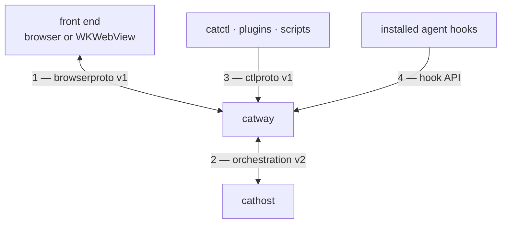
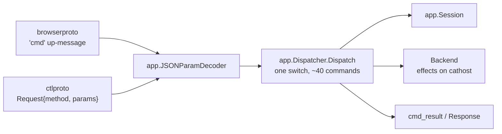

# Protocols

Four wire contracts hold cats together. Each has its **own** version constant,
bumped independently — a change to the browser protocol never forces a
`cathost` upgrade, and vice versa.

| # | Protocol | Package | Version | Transport | Framing |
|---|----------|---------|---------|-----------|---------|
| 1 | [Browser protocol](browser-protocol.md) | `internal/browserproto` | `1` | WebSocket (`/ws`) | one JSON object per text frame, `{"t": …}` |
| 2 | [Orchestration seam](orchestration-seam.md) | `internal/orchestration` | `2` | unix socket | `[u32-LE length][JSON]`, 8 MiB cap, `{"type": …}` |
| 3 | [Control API](control-api.md) | `internal/ctlproto` | `1` | unix socket, `0600` | newline-delimited JSON |
| 4 | [Hook API](hook-api.md) | `cmd/catway/hooks.go` | — (shape frozen for parity) | unix socket | one newline-terminated JSON request per connection |

## Shared conventions

**Unknown message types are ignored, not fatal.** Both the browser protocol and
the seam require it, and the decoders make it easy: `DecodeUp` / `DecodeDown`
report an unrecognised discriminator as `ErrUnknownType` so callers can
`errors.Is`-check and drop the message rather than kill the session. This is what
lets an older front end talk to a newer server within a major version.

**Version mismatch is refused, not degraded.** The seam's hello/welcome
handshake rejects a protocol mismatch outright. Silently degrading was tried and
is worse: a v1 daemon would ignore `set_output_stream` and never stream, so every
`pane.wait_for_output` would miss all post-registration output and simply time
out — a failure that looks like a bug in your build script.

**Binary payloads ride as base64.** `Input.Data`, `PaneOutput.Data` and
`PaneClipboard.Data` are Go `[]byte`, which marshals as base64 in JSON. Binary
WebSocket frames are reserved for a future packed cell encoding behind a version
bump; today everything is text.

## Where the command table sits

Protocols 1 and 3 are two front ends onto **one** command table in
`internal/app`. That is the load-bearing seam of the whole design.

Adding a command means three edits that must agree: the `app.Cmd*` constant, an
entry in `app.CommandSpecs()`, and the dispatch case. Both front ends then get it
for free — the browser via the `cmd` message, the CLI via its raw
`<method> --params '<json>'` escape hatch, plus an optional ergonomic verb.

### The command table as data

`app.CommandSpecs()` describes each command as a `CommandSpec`, so the mapping is
walkable by a program rather than only readable in the switch:

| Field | Meaning |
|-------|---------|
| `Name` | the wire method name |
| `Params` | zero value of the params struct; `nil` when parameterless |
| `Result` | zero value of the `CmdResult.Data` struct; `nil` when nothing is returned |
| `ReplyRequired` | the dispatcher **silently drops** this command when the caller cannot receive a result (a browser `cmd` with no `id`) |
| `ParamsRequired` | absent params fail with `bad params` rather than decoding to the zero value |

`ReplyRequired` is the rule most likely to bite a client author, because the
failure is silence: `capture`, `read`, `pane.wait_for_output`, `worktree.list`,
`plugin.list`, `path.list`, `config.get` and `theme.list` exist only to produce
data, so one sent with nowhere to reply does nothing at all.

The table is what the phone builds its typed calls from: cats-mobile imports
`wire` directly (its `go.mod` pins a cats commit), so a command added here is a
Go constant there, not a hand-written string.
`app.CommandNames()` is derived from it (so names and shapes cannot disagree) and
remains the enumerable vocabulary: `catctl commands` prints it, so a client can
validate a method name before sending it.

Two tests guard the drift, in opposite directions. `TestCommandNamesAllRouted`
dispatches every enumerated name and rejects the unknown-command fall-through;
`TestCommandSpecsRouted` reads the dispatch switch's own AST, which is the only
way to catch the other side — a command routed but never listed, invisible to
`catctl commands` and absent from every generated client.

## What is deliberately *not* a protocol

* **The web UI's internal structure.** The page is embedded and versioned with
  the binary, so there is no client/server skew to manage inside a build.
* **The plugin manifest.** `cats-plugin.toml` never crosses a socket. The server
  reads it host-side and answers `plugin.list` with resolved argv. See
  [Plugins](../subsystems/plugins.md).
* **The persisted state files.** `session.json` and `history.json` have their own
  schema `Version`, but only one writer and one reader, both in-process. A
  version mismatch refuses the file and starts fresh rather than guessing at a
  shape no longer written.
