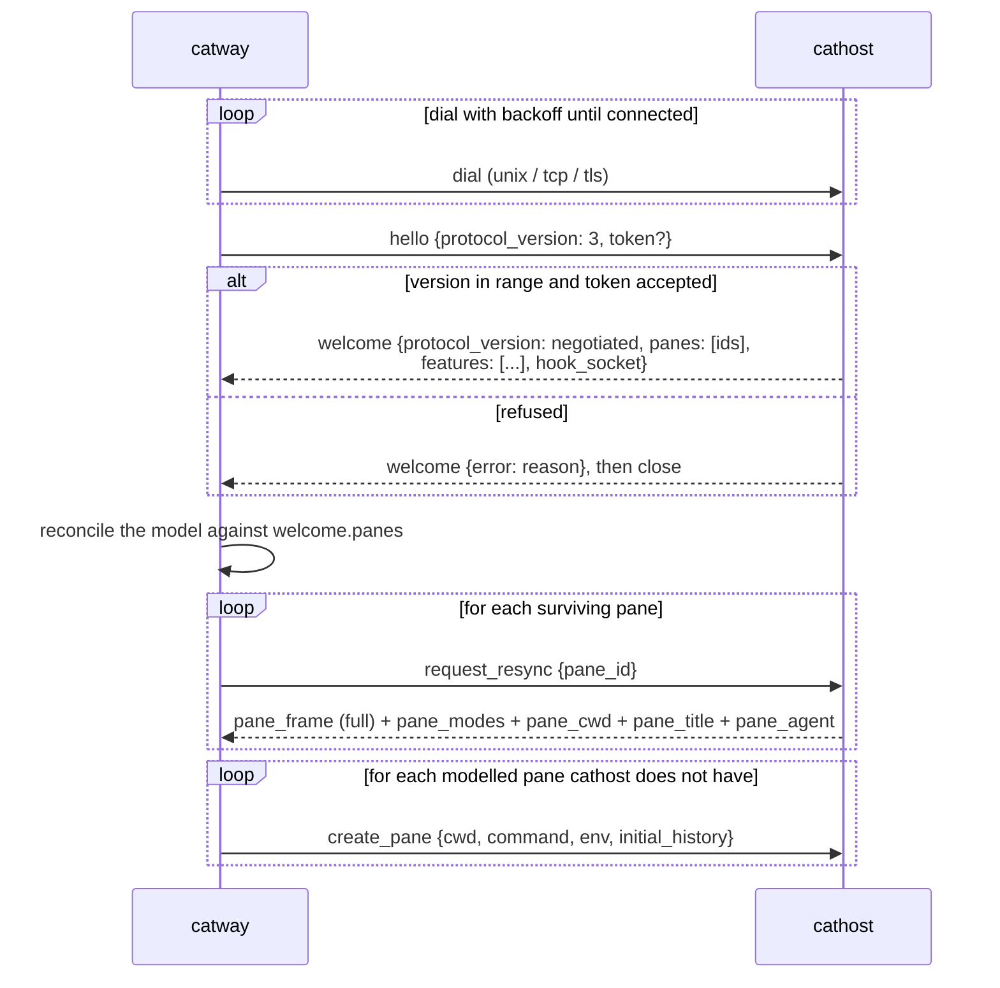
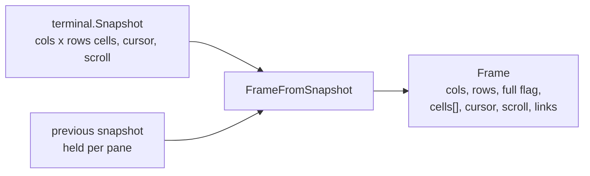
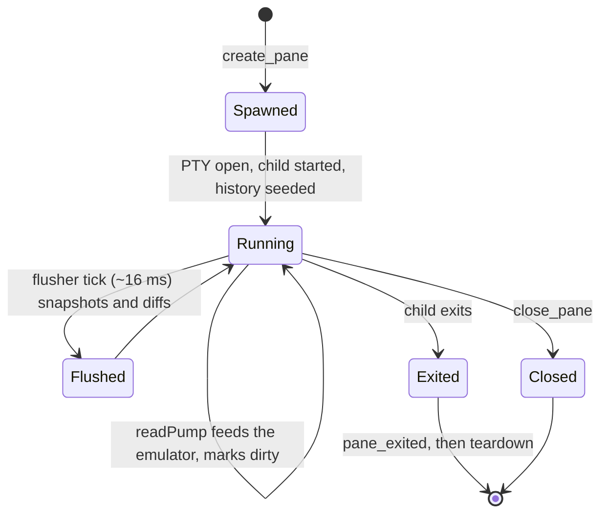
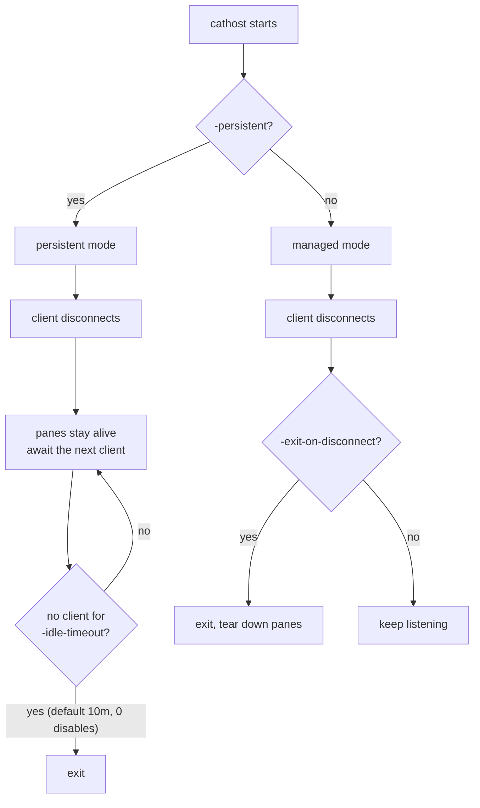

# Orchestration seam

`internal/orchestration` — the `catway ↔ cathost` wire. **Protocol version 3**
(a v3 build serves v2 peers; see [Versioning](#versioning)).

The orchestrator owns *what the session looks like*; the terminal backend owns
*PTYs and VT emulation*. The seam is the only thing between them.

## Transport and framing

```
[u32 little-endian length][JSON payload]
```

* `MaxFrameSize` = 8 MiB. A frame is **one pane**, not a composited UI, so 8 MiB
  is generous headroom for large grids.
* Every message is a JSON object with a `"type"` discriminator.
* The `Host` API is transport-agnostic — `Host.Serve(ctx, conn io.ReadWriteCloser)`
  and `Host.Attach(ctx, conn io.ReadWriteCloser)` — and the orchestrator names the
  transport at exactly **one** dial site (`dialerFor`). Three are supported:

  | `addr` | cathost | catway |
  |--------|---------|--------|
  | `unix://path` | the default; file permissions are the access control | dials it directly. An `ssh -L` forward of a remote socket is a genuine remote host with no protocol work |
  | `tcp://host:port` | refused off the loopback, and refused without `-token-file` | refused off the loopback |
  | `tls://host:port` | self-signed by default (`-tls-dir`), fingerprint printed at startup; refused without `-token-file` | pins `hosts[].fingerprint`; with no fingerprint, ordinary chain + hostname verification |
* `protocol.go` is **pure Go** — no CGO — so the wire contract compiles and is
  testable without the libghostty toolchain. Only `host.go`, which actually runs
  panes, sits behind `-tags ghostty`.

## Handshake and reconciliation



**Reconciliation is the heart of persistence.** After a `catway` restart, the
restored model is compared against the pane ids `cathost` reports in `welcome`:
ids present on both sides are *re-adopted* (their PTYs never died), ids only in
the model are *re-spawned* with their captured scrollback replayed, and ids only
on the daemon are closed.

`request_resync` exists so a reconnecting client repaints deterministically
without racing the daemon's own post-hello replay. Unknown pane ids are ignored.

## Message catalogue

### Commands — `catway` → `cathost`

| Type | Payload | Notes |
|------|---------|-------|
| `hello` | `protocol_version`, `token` | first message on every connection; `token` only when the daemon requires one (`-token-file`) |
| `create_pane` | `pane_id`, `cols`, `rows`, cell px, `cwd`, `command`, `args`, `env`, `initial_history` | empty `command` means the default shell; `initial_history` is VT-encoded scrollback seeded before the child's first output |
| `input` | `pane_id`, `data` (base64) | already-encoded VT bytes; see [inputenc](../subsystems/terminal.md) |
| `resize` | `pane_id`, `cols`, `rows`, cell px | cell pixel metrics travel too, for programs that ask |
| `close_pane` | `pane_id` | |
| `scroll_viewport` | `pane_id`, delta | |
| `request_selection` | `pane_id`, two endpoints, `rectangle` | the Host orders endpoints top-left → bottom-right; answered with `pane_selection` |
| `request_text` | `pane_id`, `scope`, `lines`, `ansi`, `unwrap` | the orchestrator holds an *unfed* local emulator, so it cannot read text itself; answered with `pane_text` |
| `request_resync` | `pane_id` | replay one pane's full state |
| `set_output_stream` | `pane_id`, `enabled` | arms the raw-byte stream for `pane.wait_for_output` |
| `ping` | `id` | round-trip probe; answered with `pong` carrying the same `id`. Sent only to a daemon advertising the `ping` capability |
| `request_host_stats` | `interval_ms` | subscribe to the daemon's readings of its own machine, one `host_stats` per interval; `0` cancels. Capability: `host_stats` |
| `request_list_dir` | `pane_id`, `dir`, `base`, `recents`, `live` | list a directory **on the daemon's filesystem**; answered with `dir_listing`. Capability: `list_dir` |
| `request_worktree` | `id`, `req` (`op`, `cwd`, `path`, `branch`, `root`, `force`) | run one git-worktree operation **on the daemon's machine**; answered with `worktree_result` carrying the same `id`. Capability: `worktree` |
| `hook_reply` | `id`, `payload` | the answer to a `hook_report`, written back to the waiting hook client verbatim |
| `control_reply` | `id`, `payload` | bytes from the orchestrator's control server, written to the relayed client verbatim |
| `shutdown` | — | ask a persistent daemon to exit and tear down all panes |

### Events — `cathost` → `catway`

| Type | Payload | Notes |
|------|---------|-------|
| `welcome` | `protocol_version`, `panes`, `features`, `hook_socket`, `control_socket` | the surviving pane ids — the input to reconciliation — the optional requests this daemon can answer, and the paths of its agent-hook and control relays |
| `pane_frame` | `Frame` (see below) | full or skip-flagged diff |
| `pane_output` | `pane_id`, `data` (base64) | raw PTY bytes, only while streaming is enabled. **Not** browser-facing |
| `pane_cwd` | `pane_id`, `cwd` | from OSC 7, or the process probe |
| `pane_branch` | `pane_id`, `branch` | v3. The git branch of the pane's cwd — `""` outside a repository, `@<sha>` while detached. Resolved **daemon-side**, because the cwd is a path on the daemon's filesystem |
| `pane_agent` | `pane_id`, agent label, state, visibility flags | `""` = plain shell; state is `idle` / `working` / `blocked` / `unknown` |
| `pane_clipboard` | `pane_id`, `data` (base64) | reconstructed OSC 52; empty data = clear |
| `pane_title` | `pane_id`, `title` | OSC 0/2; empty = clear |
| `pane_selection` | `pane_id`, `text` | reply to `request_selection`, one per request |
| `pane_text` | `pane_id`, `text` | reply to `request_text`, one per request |
| `pane_modes` | `pane_id`, DEC mode flags | mouse tracking, bracketed paste, focus reporting, application cursor, alt-scroll, sync output, kitty keyboard, `modifyOtherKeys` |
| `pane_exited` | `pane_id`, exit status | |
| `pong` | `id` | reply to `ping`, echoing its `id`. The only event with no pane |
| `host_stats` | `rows` | one reading of the daemon's machine — memory, CPU, disk — display-ready. Only while a subscription is live |
| `dir_listing` | `pane_id`, `listing` | reply to `request_list_dir`, one per request. A path that does not resolve is `exists:false` with a reason, not an error event |
| `worktree_result` | `id`, `result` | reply to `request_worktree`, matched by `id` rather than by order — git runs off the dispatch goroutine, so two operations finish in whichever order git finishes them. A git failure is `result.error` (with `result.dirty` for the escalation), not an error event |
| `hook_report` | `id`, `payload` | one agent hook request that arrived on the daemon's own hook socket, forwarded **verbatim**. Capability: `hook_relay` |
| `control_open` | `id` | a connection arrived on the daemon's control relay socket. Capability: `control_relay` |
| `control_data` | `id`, `payload` | bytes from that connection, forwarded **verbatim** |
| `control_close` | `id` | the relayed connection ended. Sent by **either** side — the daemon when its client hangs up, the orchestrator when it is done |
| `error` | code, message | |

## Versioning

`ProtocolVersion` is 3 and `MinProtocolVersion` is 2: a peer anywhere in that
range is served. The exact-equality handshake that preceded v3 was affordable
while both ends shipped in one binary drop, and stopped being affordable the
moment a cathost could live on a machine that is upgraded on its own schedule.

* The daemon answers with the **negotiated** version, not its own, so a v2
  orchestrator — which demands equality with what it sent — still accepts a v3
  daemon's welcome.
* Everything v3 adds is additive: an unknown hello field and an unknown event
  type are both ignored by a v2 peer, so the older side simply does not get the
  newer behaviour.
* A refusal is a `welcome` carrying `error` (bad token, unsupported version),
  written *before* the connection closes. A bare disconnect is indistinguishable
  from a daemon that never started, which is not a diagnosis anyone should have
  to guess at.

### Capabilities

New *requests* are advertised rather than versioned. `welcome.features` lists
what this daemon can answer beyond the negotiated version's base set, and the
client sends such a request only when it appears there.

This is not belt-and-braces on top of the version ladder — it is there because
the ladder cannot carry a new request in this direction. `NegotiateVersion`
refuses a peer *newer* than the build it runs in, so a `catway` that bumped
`ProtocolVersion` to announce a new message would be rejected outright by every
already-deployed daemon one version behind: exactly the fleet the version range
was widened for. And an unknown request is not ignored the way an unknown field
is — `dispatch` answers it with an `error` event, which surfaces as a toast in
somebody's browser.

A daemon built before capabilities existed sends no `features` at all, which
reads correctly as "the base protocol only".

| Feature | Adds | Used for |
|---------|------|----------|
| `ping` | `ping` / `pong` | the roster's per-host round-trip figure, and liveness — see below |
| `host_stats` | `request_host_stats` / `host_stats` | the sidebar's per-host meters — see below |
| `list_dir` | `request_list_dir` / `dir_listing` | the start-path picker completing a path on another machine — see below |
| `worktree` | `request_worktree` / `worktree_result` | the git-worktree dialogs acting on another machine's checkouts — see below |
| `hook_relay` | `hook_report` / `hook_reply`, plus `welcome.hook_socket` | agent hook reports from panes on this machine — see below |
| `control_relay` | `control_open` / `control_data` / `control_reply` / `control_close`, plus `welcome.control_socket` | the orchestrator's control API, for in-pane tooling on this machine — see below |

### Liveness

`catway` pings each capable cathost every 20 seconds and closes the connection
when three intervals pass with no answer. The measurement is the visible half;
the timeout is the load-bearing one.

Nothing else in the seam can notice a link that has gone quiet. A TCP connection
to a machine that slept, lost its route, or was firewalled off stays writable
indefinitely — `catway` goes on painting the host green, queues keystrokes into
it, and waits forever for reads that will never be answered. A `ping` is the only
traffic guaranteed to produce a reply, so it is the only thing that can tell.
When it times out the connection is simply **closed**, which drops it into the
ordinary disconnect path: the pending requests fail, the toast goes out, the dial
loop reconnects.

The daemon answers a `ping` on its normal event queue rather than writing
straight back. That is deliberate — a pong that overtook the pane frames ahead of
it would report a healthy link on a daemon whose output the user is watching
arrive in slow motion.

### Host meters

`host_stats` is how a pane on another machine can say anything about the machine
it is on: the daemon measures its own memory, CPU and disk and pushes the rows,
and `catway` renders them as a `host:<id>` group in the sidebar's USAGE section
beside its own.

It is a **subscription**, not a request/reply pair, and that follows from what a
CPU reading is. Utilization is a rate — it does not exist as a value to be read,
only as a difference between two readings an interval apart — so a daemon that
started measuring when asked and answered immediately would have nothing to say.
The client subscribes, the daemon starts sampling, readings arrive on the
interval the client chose.

The corollary is the rule that keeps a cathost from being a monitoring agent:

* nothing is sampled until somebody subscribes;
* the subscription dies with the connection, or when the client sends
  `interval_ms: 0`, taking the sampler — and on macOS its `iostat` — with it;
* `catway` subscribes only while a browser is connected, and cancels when the
  last one goes. A box in the roster nobody has a sidebar open on measures
  nothing at all.

`catway` never subscribes to its **local** host: it measures that machine
directly, and in managed mode the local cathost is a child of this process on
this box, so subscribing would put two CPU samplers on one machine to draw one
row.

The rows travel display-ready (name, percentage, caption, optional history)
rather than as raw byte counts. Both halves of the section are built by the same
`internal/hostmeter` code that way; sending numbers and re-deriving the captions
on the far side is how the local and remote halves of one section start
disagreeing about what "used" means.

### Directory listing

`request_list_dir` is the same principle applied to paths: the listing is
produced by the machine that owns them. `dir` travels **unexpanded** — `~` is
the daemon's user's home, `$VAR` is its environment, `.` is a directory only its
kernel can resolve — and `base` is the anchor a relative `dir` resolves against,
`""` meaning the daemon's home directory. `live` carries the client's own
interesting directories (this session's pane cwds on that host); the daemon
merges them behind cdx's frecency ranking and stats them, since only its kernel
can say whether they are still directories.

`pane_id` is a correlation handle rather than a subject. The daemon echoes it and
the client matches replies to requests per pane, in order — the same arrangement
`request_text` and `pane_text` use, and sound for the same reason: a pane's
picker asks one question at a time over one connection.

The listing runs on its own goroutine daemon-side. A cold network mount takes as
long as the mount does, and the connection's reader is what every keystroke in
every pane arrives through.

Both halves of `path.list` — local and remote — call the same
`internal/pathpick` code. The only difference is which process runs it.

### Git worktrees

`request_worktree` is the same principle again, applied to a subprocess. git
acts on a filesystem, so a checkout behind a pane on another machine can only be
listed, created or removed by that machine — which is why the worktree commands
were local-only until this capability existed, and why the fix was not "run git
harder" but "ask the right box".

The request carries a `worktree.OpRequest`: an `op` (`list`, `create`, `remove`,
`stat`), the anchor `cwd`, an explicit `path`, the `branch` to create, the
configured worktree `root`, and `force`. Both ends call the same
`worktree.Do` with it, and paths travel **unexpanded** for the reason they do in
a listing — `~/.cats/worktrees` names the home of the account the checkout will
belong to, and the expanded value comes back in the result so a dialog can
preview the real path.

Two things differ from every other round trip in the seam:

* **`id`, not order.** git runs off the dispatch goroutine — `git worktree add`
  checks out a whole tree, and blocking the reader would freeze every terminal
  on that machine for the duration — so two operations started in one order
  finish in whichever order git finishes them. The reply echoes the request's
  `id`, and the client matches on it.
* **A failure is a result, not an event.** `result.error` carries git's stderr,
  which is the text the dialog shows, and `result.dirty` marks the one refusal
  that is an escalation rather than a fault: a checkout with uncommitted work,
  which the front end re-offers as "delete anyway".

`catway` sends this to *every* host including its own local one, so a worktree
command is the same command everywhere. The only exception is a local cathost
that cannot answer — an older build — where it runs `worktree.Do` in-process;
for any other host there is nothing to fall back to, and the command is refused
by name.

### Hook relay

Every pane is spawned with `CATS_SOCKET_PATH` so the hooks
`catctl integration install` plants can report an agent's state. For a pane on
another machine that path used to be `catway`'s own — a file in a filesystem the
pane cannot see, and on a box that runs cats itself, a *different* server's
socket.

So the daemon opens a hook socket of its own, advertises it as
`welcome.hook_socket`, and `catway` injects that into the panes it creates here.
What arrives is forwarded as `hook_report` and answered with `hook_reply`.

The payload is **bytes, verbatim**. The daemon parses none of it: the pane the
report is about belongs to the orchestrator's model, the hook API is the
orchestrator's to define, and relaying bytes keeps the daemon out of the way of
the next field added to it. The read limits (5 s, 1 MiB) are still enforced
daemon-side, because this end owns the socket — a request the orchestrator would
refuse must not get as far as occupying a frame on the seam.

`welcome.hook_socket` carries the path rather than a request/reply pair because
the client needs it *before* it creates its first pane. It is stable for the
daemon's lifetime, not the connection's: panes outlive a reconnect in persistent
mode and their environment cannot be rewritten afterwards.

See [the hook API](hook-api.md#panes-on-another-machine) for the rest.

### Control relay

The same problem one level up. A pane also carries `CATS_CONTROL_SOCKET` so
in-pane tooling — `catctl`, cats-todo, a plugin binary — can drive the session it
belongs to, and for a pane on another machine that path was equally wrong. The
daemon opens a control socket of its own, advertises it as
`welcome.control_socket`, and relays what arrives.

**It relays a connection, not a message pair.** The control protocol has a
streaming half: `events.subscribe` is one request, an ack, and then events for as
long as the caller stays connected. So the relay models a connection —
`control_open`, `control_data`/`control_reply` in either direction,
`control_close` from whichever end finishes first — and a client hanging up is
carried across as a close, because that is how a subscription is cancelled and a
streaming client says nothing else.

On the orchestrator's side those frames become a synthetic `io.ReadWriteCloser`
handed to `ctlproto.Server.ServeConn` — the same entry point a real socket goes
through. Nothing about the command table, the streaming method, the per-request
backstops or the cancellation is reimplemented, which is the point: a second
implementation would agree with the first until the day it didn't, and what it
would be disagreeing about is who may run commands against every pane in the
session.

**Advertising the socket is not permission.** The orchestrator decides, per host,
with `control_relay` in that host's config entry, default off — and it checks
that flag when a connection *arrives*, not when a pane's environment is filled
in. That placement is the whole of it: the environment variable is a convenience,
turning the flag off cannot unset it in panes already running, and the socket on
the far machine goes on existing regardless. A host without the flag has its
opens refused and logged, whatever its panes were told earlier.

Granting it is a trust decision, and a total one. The control API can create
panes, run commands in them, read any pane's contents on **any** host, rewrite
the config and attach or detach cathosts. There is deliberately no partial
version: a caller holding the socket can type `pbpaste` into a local pane with
`pane.send_input` and read the answer back with `pane.capture`, so a denylist of
the "sensitive" methods would gate nothing it does not already have by a longer
route. Enable it for a machine you trust as much as the one running `catway`.

Disabling the orchestrator's own control socket disables the relay too — one
switch, not two.

## Why the daemon resolves cwd and branch

Both answers are about the daemon's own filesystem, and the orchestrator may be
on another machine:

* **`create_pane.cwd`** is a suggestion. It was chosen on the orchestrator's box
  — inherited from a neighbouring pane, restored from a session file, typed into
  a dialog — so a path that does not exist here would fail `chdir` and produce a
  pane born dead. The daemon falls back to `$HOME` and emits an `error` naming
  both directories, so the pane is usable and nobody is misled about where it is.
* **`pane_branch`** is resolved here for the same reason in reverse: reading
  `.git/HEAD` on the orchestrator's machine against a remote pane's path finds
  either nothing or — worse — a same-named checkout of its own, sitting on a
  different branch. `internal/gitbranch` is shared by both ends; catway only
  falls back to resolving locally when its peer is v2, which by construction is
  the daemon on its own machine.

## Why `pane_modes` matters

The orchestrator keeps its own emulator instance, but it is **unfed** — it never
sees PTY output. So it cannot know which DEC modes the running program has
requested. Without `pane_modes` mirrored across the seam, `inputenc` would encode
against stale modes and mis-send every key: wrong cursor-key form, wrong mouse
protocol, paste without bracketing.

The same mirror answers a UI question: *is this event for the program or for my
chrome?* Mouse tracking on means a drag belongs to the program; off means it is a
selection.

## Frame shape



* `Frame.Full` is true when `prev` is nil or the dimensions changed. Otherwise
  it is a diff: every cell is still present, but unchanged ones carry
  `skip = true`.
* Colours are packed into a `u32`. `nil` foreground/background are resolved
  against the snapshot defaults before they hit the wire, so the consumer always
  receives concrete colours.
* Sending the whole grid on every frame is what makes the seam **stateless
  enough to resync**: a reconnecting orchestrator can always be handed a
  self-contained picture.

## Pane lifecycle on the `cathost` side



Each pane owns:

* a **PTY** and a child process,
* a `terminal.Emulator` (go-libghostty), serialized by a mutex because the
  emulator is not concurrency-safe,
* a **`readPump`** goroutine that reads the PTY, feeds the emulator, runs the OSC
  scanners, and sets the dirty flag,
* a **`detectPump`** that periodically probes for the running agent — skipping the
  screen scan when the pane has produced no new output since the last probe, and
  retiring the cwd probe entirely once the shell has emitted OSC 7.

One shared flusher coalesces dirty panes into frames at ~60 Hz.

## Persistent vs managed mode



`-persistent` overrides `-exit-on-disconnect`. Run persistent for anything you
care about: it is what lets `catway` restart, or be swapped for a new build,
without losing a shell.

The distinction between a *clean* quit and a *crash* is deliberate. A clean quit
sends `shutdown` so the daemon does not linger. A crash or a binary handoff just
drops the connection — the daemon keeps its panes alive for the next `catway` to
reconnect and resync.
