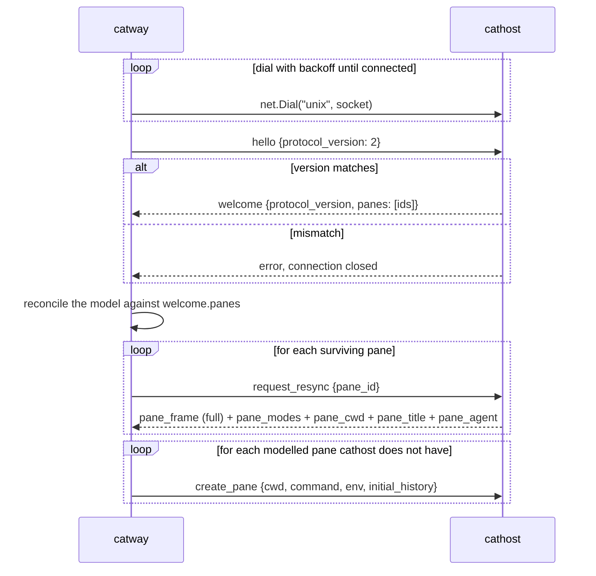
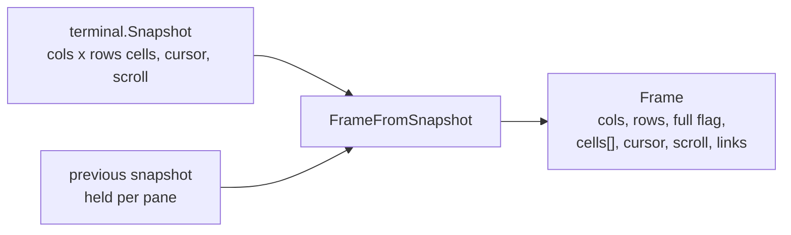
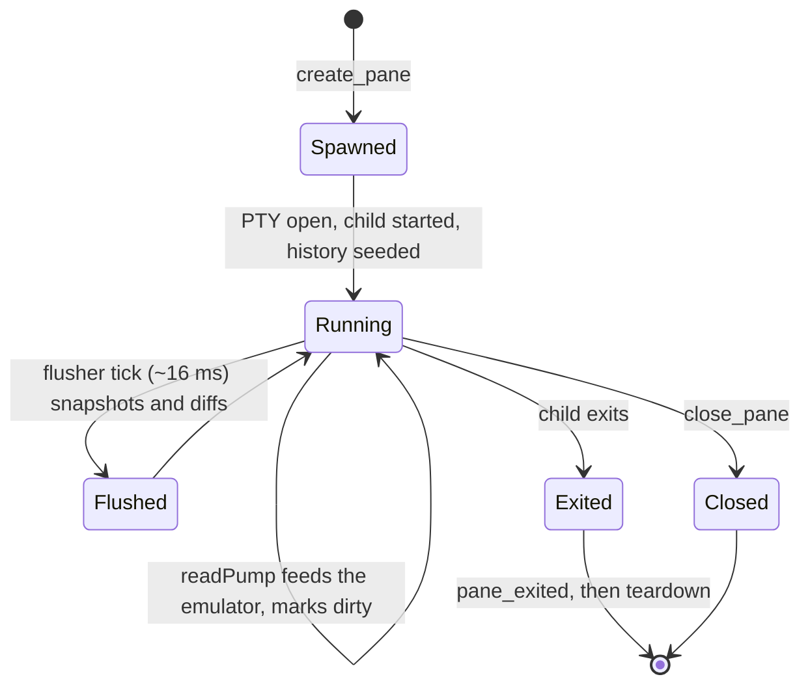
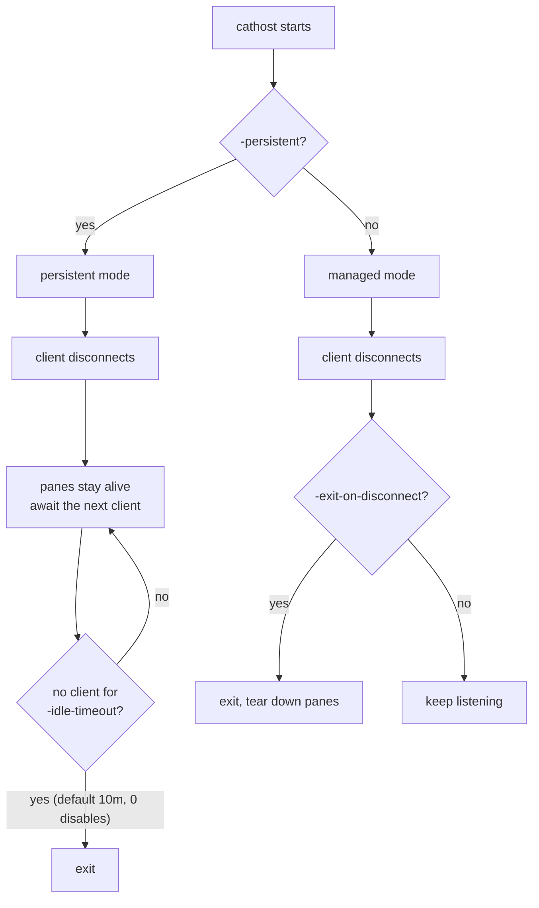

# Orchestration seam

`internal/orchestration` — the `catway ↔ cathost` wire. **Protocol version 2.**

The orchestrator owns *what the session looks like*; the terminal backend owns
*PTYs and VT emulation*. The seam is the only thing between them.

## Transport and framing

```
[u32 little-endian length][JSON payload]
```

* `MaxFrameSize` = 8 MiB. A frame is **one pane**, not a composited UI, so 8 MiB
  is generous headroom for large grids.
* Every message is a JSON object with a `"type"` discriminator.
* Transport is a unix socket today, but the `Host` API is deliberately
  transport-agnostic: `Host.Serve(ctx, conn io.ReadWriteCloser)` and
  `Host.Attach(ctx, conn io.ReadWriteCloser)`. The orchestrator names the
  transport at exactly **one** dial site.
* `protocol.go` is **pure Go** — no CGO — so the wire contract compiles and is
  testable without the libghostty toolchain. Only `host.go`, which actually runs
  panes, sits behind `-tags ghostty`.

## Handshake and reconciliation



**Reconciliation is the heart of persistence.** After a `catway` restart, the
restored model is compared against the pane ids `cathost` reports in `welcome`:
ids present on both sides are *re-adopted* (their PTYs never died), ids only in
the model are *re-spawned* with their captured scrollback replayed, and ids only
on the daemon are closed.

`request_resync` exists so a reconnecting client repaints deterministically
without racing the daemon's own post-hello replay. Unknown pane ids are ignored.

## Message catalogue

### Commands — `catway` → `cathost`

| Type | Payload | Notes |
|------|---------|-------|
| `hello` | `protocol_version` | first message on every connection |
| `create_pane` | `pane_id`, `cols`, `rows`, cell px, `cwd`, `command`, `args`, `env`, `initial_history` | empty `command` means the default shell; `initial_history` is VT-encoded scrollback seeded before the child's first output |
| `input` | `pane_id`, `data` (base64) | already-encoded VT bytes; see [inputenc](../subsystems/terminal.md) |
| `resize` | `pane_id`, `cols`, `rows`, cell px | cell pixel metrics travel too, for programs that ask |
| `close_pane` | `pane_id` | |
| `scroll_viewport` | `pane_id`, delta | |
| `request_selection` | `pane_id`, two endpoints, `rectangle` | the Host orders endpoints top-left → bottom-right; answered with `pane_selection` |
| `request_text` | `pane_id`, `scope`, `lines`, `ansi`, `unwrap` | the orchestrator holds an *unfed* local emulator, so it cannot read text itself; answered with `pane_text` |
| `request_resync` | `pane_id` | replay one pane's full state |
| `set_output_stream` | `pane_id`, `enabled` | arms the raw-byte stream for `pane.wait_for_output` |
| `shutdown` | — | ask a persistent daemon to exit and tear down all panes |

### Events — `cathost` → `catway`

| Type | Payload | Notes |
|------|---------|-------|
| `welcome` | `protocol_version`, `panes` | the surviving pane ids — the input to reconciliation |
| `pane_frame` | `Frame` (see below) | full or skip-flagged diff |
| `pane_output` | `pane_id`, `data` (base64) | raw PTY bytes, only while streaming is enabled. **Not** browser-facing |
| `pane_cwd` | `pane_id`, `cwd` | from OSC 7, or the process probe |
| `pane_agent` | `pane_id`, agent label, state, visibility flags | `""` = plain shell; state is `idle` / `working` / `blocked` / `unknown` |
| `pane_clipboard` | `pane_id`, `data` (base64) | reconstructed OSC 52; empty data = clear |
| `pane_title` | `pane_id`, `title` | OSC 0/2; empty = clear |
| `pane_selection` | `pane_id`, `text` | reply to `request_selection`, one per request |
| `pane_text` | `pane_id`, `text` | reply to `request_text`, one per request |
| `pane_modes` | `pane_id`, DEC mode flags | mouse tracking, bracketed paste, focus reporting, application cursor, alt-scroll, sync output, kitty keyboard, `modifyOtherKeys` |
| `pane_exited` | `pane_id`, exit status | |
| `error` | code, message | |

## Why `pane_modes` matters

The orchestrator keeps its own emulator instance, but it is **unfed** — it never
sees PTY output. So it cannot know which DEC modes the running program has
requested. Without `pane_modes` mirrored across the seam, `inputenc` would encode
against stale modes and mis-send every key: wrong cursor-key form, wrong mouse
protocol, paste without bracketing.

The same mirror answers a UI question: *is this event for the program or for my
chrome?* Mouse tracking on means a drag belongs to the program; off means it is a
selection.

## Frame shape



* `Frame.Full` is true when `prev` is nil or the dimensions changed. Otherwise
  it is a diff: every cell is still present, but unchanged ones carry
  `skip = true`.
* Colours are packed into a `u32`. `nil` foreground/background are resolved
  against the snapshot defaults before they hit the wire, so the consumer always
  receives concrete colours.
* Sending the whole grid on every frame is what makes the seam **stateless
  enough to resync**: a reconnecting orchestrator can always be handed a
  self-contained picture.

## Pane lifecycle on the `cathost` side



Each pane owns:

* a **PTY** and a child process,
* a `terminal.Emulator` (go-libghostty), serialized by a mutex because the
  emulator is not concurrency-safe,
* a **`readPump`** goroutine that reads the PTY, feeds the emulator, runs the OSC
  scanners, and sets the dirty flag,
* a **`detectPump`** that periodically probes for the running agent — skipping the
  screen scan when the pane has produced no new output since the last probe, and
  retiring the cwd probe entirely once the shell has emitted OSC 7.

One shared flusher coalesces dirty panes into frames at ~60 Hz.

## Persistent vs managed mode



`-persistent` overrides `-exit-on-disconnect`. Run persistent for anything you
care about: it is what lets `catway` restart, or be swapped for a new build,
without losing a shell.

The distinction between a *clean* quit and a *crash* is deliberate. A clean quit
sends `shutdown` so the daemon does not linger. A crash or a binary handoff just
drops the connection — the daemon keeps its panes alive for the next `catway` to
reconnect and resync.
