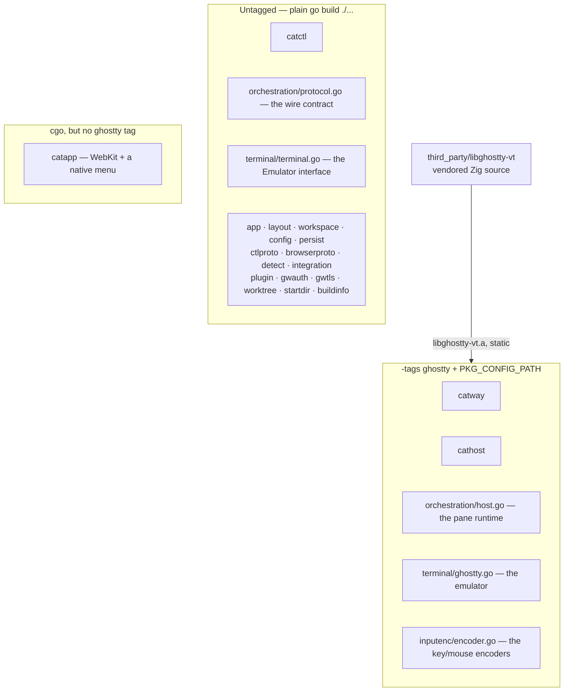
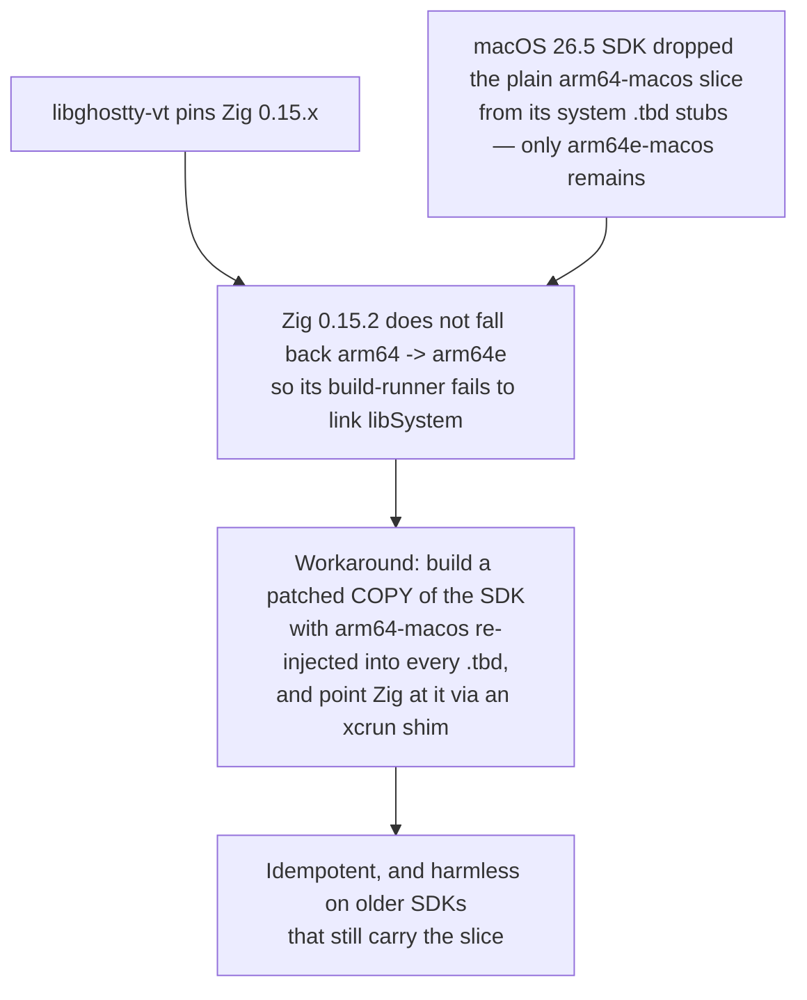
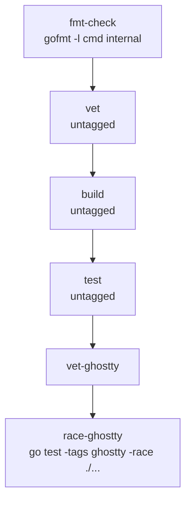
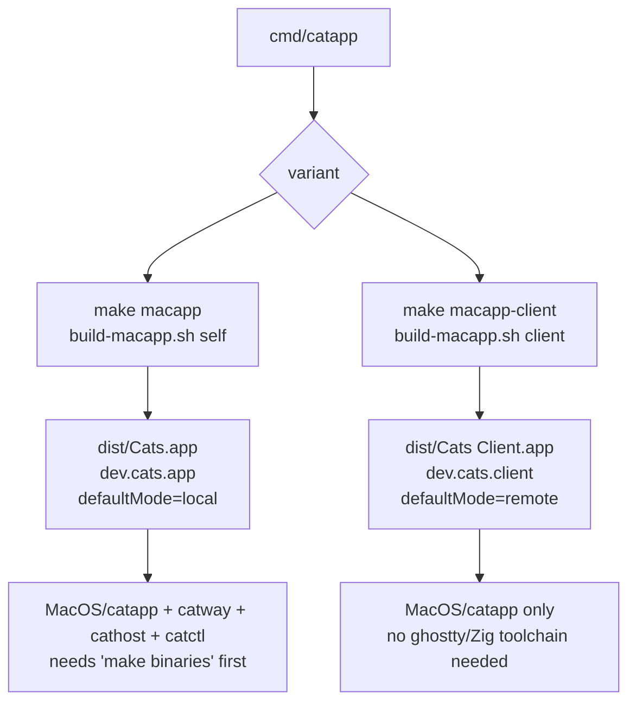
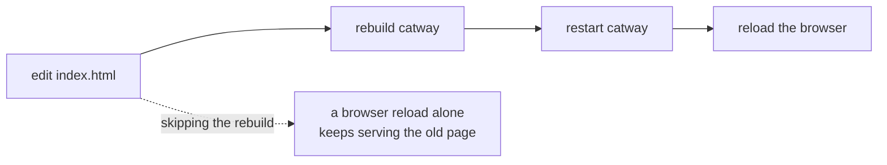

# Build and packaging

## The two build worlds



This split is the reason most of the tree is cheap to test: the domain packages,
both protocol contracts, and `catctl` all build and test with `go build ./...` and
`go test ./...` — no Zig, no CGO, no `PKG_CONFIG_PATH`.

## Building the VT engine

```bash
make vt          # or: scripts/build-libghostty-vt.sh
```

What it does:

1. Downloads **Zig 0.15.2** for this platform into `.tools/` (gitignored), verified
   against a pinned SHA-256. No system changes.
2. Builds `third_party/libghostty-vt` into a static `libghostty-vt.a` plus a
   pkg-config file at `third_party/libghostty-vt/zig-out/share/pkgconfig`.
3. Prints the `PKG_CONFIG_PATH` a tagged build needs. The Makefile wires this for
   you.

Supported platforms: `Darwin/arm64`, `Darwin/x86_64`, `Linux/x86_64`,
`Linux/aarch64`. The script is idempotent — re-running reuses an existing Zig
download and patched SDK.

Zig package dependencies land in the Zig global cache. `uucode` is pre-vendored in
`zig-pkg/`; a few others are fetched from `deps.files.ghostty.org` on a cold build,
which CI caches keyed on `build.zig.zon`.

### The macOS 26 SDK workaround

Worth understanding, because it looks alarming and is not:



Zig 0.16 handles SDK 26.5 fine, but libghostty-vt requires 0.15.x. The patch
touches a **copy** — your real SDK is not modified. On Linux the whole step is
skipped, which is why the Linux build path is simpler.

## Building the binaries

```bash
make binaries    # catway + cathost + catctl into bin/
make local       # the same three into ~/bin
```

Both pass `-tags ghostty -trimpath` plus the build stamp.

### The build stamp

`internal/buildinfo` carries the git identity that `catway` serves to the sidebar
brand, so a running instance names the commit it was built from — the quickest way
to spot a stale install.

```
-ldflags "-X ...buildinfo.hash=<short sha> -X ...buildinfo.subjectB64=<base64 subject>"
```

The commit **subject is base64-encoded** deliberately: it is free to contain
spaces, quotes and `$`, none of which survive a Make recipe's `-ldflags` string
intact, while base64's alphabet is inert throughout.

An unstamped build (plain `go build`) still shows a hash — `buildinfo` falls back
to the Go toolchain's own VCS stamping.

## Testing

```bash
make check       # exactly what CI runs, in order
```

which is:



CI (`.github/workflows/ci.yml`) runs the untagged quick checks on Linux first for a
fast signal, then the ghostty-tagged race tests on **both** Linux and macOS.

A `v*` tag triggers `release.yml`, which attaches per-platform tarballs to the
GitHub release.

## Distribution tarball

```bash
make dist
```

Produces `dist/cats_<version>_<goos>_<goarch>.tar.gz` containing `catway`,
`cathost`, `catctl`, `config.example.yaml` and `README.md`. Version comes from
`git describe --tags --always --dirty`.

## macOS app bundles

Both variants come from the **one** `cmd/catapp` codebase.
`scripts/build-macapp.sh` does the assembly; the Makefile target chooses the
variant and the baked-in default mode.



`make macapp` depends on `binaries` for the daemons; the script **copies** them
rather than building them, so `make vt` must have run first.

`catapp` itself is always built here with plain `go build` — cgo on for WebKit,
**no** `-tags ghostty`, and `-ldflags "-X main.defaultMode=…"`.

Bundle layout:

```
dist/<AppName>.app/Contents/
  Info.plist                  bundle id, name, version from git describe,
                              NSHighResolutionCapable, min-system
  MacOS/catapp                CFBundleExecutable
  MacOS/{catway,cathost,catctl}   self variant only
  Resources/AppIcon.icns
```

No dylibs to copy and no `@rpath` fixups: the daemons link libghostty-vt
statically, so `otool -L` shows only system frameworks. The launcher finds its
siblings via `os.Executable()` → same directory.

The build starts by removing any existing bundle, so a rebuild never leaves a
stale binary behind.

### Gatekeeper

The bundles are **unsigned** — this is a personal-use path, with no Apple Developer
signing or notarization. On the Mac that built it, it just opens. On another Mac it
needs a one-time **right-click → Open**.

## Cross-compilation

| Target | How |
|--------|-----|
| Same OS/arch | `make binaries` |
| macOS → Linux, tagged | **avoid**. CGO cross-compilation needs a Linux cross-toolchain *and* libghostty built for the Linux target. Build on the Linux host (`make vt && make binaries`) or pull the release tarball |
| Anything → `catctl` | trivial, it is pure Go |
| Anything → `catapp` | macOS only (WebKit + a native menu via cgo, with a `darwin` build constraint on every file in the package) |

On Linux, CGO links glibc dynamically, so build on the same distro family you run
on.

## Editing the web UI

`cmd/catway/web/index.html` is compiled into the binary with `//go:embed`.



Theme and keybinding changes are the exception — they are injected at render time,
so `catctl reload` applies them with no rebuild and no restart.

## The icon

`scripts/gen-icon.sh` produces `scripts/AppIcon.icns` from the sources in
`scripts/icon/`. Both bundles copy it into `Resources/`.
