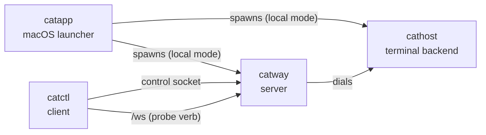

# CLI reference

Four binaries. `catway` and `cathost` are the daemons; `catctl` is the client;
`catapp` is the macOS launcher.



## `catway`

The cats server: orchestrator event loop, web UI, WebSocket bridge, control and
hook APIs, persistence, auth and TLS.

```
catway [--config PATH] [--addr :8421] [--socket /tmp/cats-cathost.sock]
       [--control-socket PATH] [--hook-socket PATH]
       [--auth password|none] [--password SECRET] [--session-ttl 24h]
       [--allowed-origins a,b] [--tls] [--tls-cert PEM] [--tls-key PEM]
       [--tls-san NAME,IP]
       [--persist=false] [--state-dir DIR] [--push-url URL]
```

| Flag | Default | Notes |
|------|---------|-------|
| `--config` | `~/.config/cats/config.yaml` | also `$CATS_CONFIG` |
| `--addr` | `:8421` | binds all interfaces |
| `--socket` | `/tmp/cats-cathost.sock` | the `cathost` seam |
| `--control-socket` | `$CATS_CONTROL_SOCKET`, else `/tmp/cats-control.sock` | |
| `--hook-socket` | `/tmp/cats-hooks.sock` | `none` disables |
| `--auth` | `password` | or `none` |
| `--password` | `$CATS_PASSWORD`, else generated and logged | |
| `--session-ttl` | `24h` | |
| `--allowed-origins` | — | comma-separated extra WebSocket origins |
| `--tls` | off | auto self-signed unless cert/key given |
| `--tls-cert` / `--tls-key` | — | both required together; either implies `--tls` |
| `--tls-san` | — | comma-separated extra names/IPs for the **auto-generated** cert; implies `--tls`. Adding one re-mints |
| `--persist` | `true` | |
| `--state-dir` | `$XDG_STATE_HOME/cats` | |
| `--push-url` | — | ntfy topic URL for [push notifications](configuration.md#push). Passing it is the opt-in; `""` forces the bridge off. Token: `$CATS_PUSH_TOKEN` |

Build requires `-tags ghostty` and `PKG_CONFIG_PATH`. Startup order relative to
`cathost` does not matter — `catway` dials lazily with retry.

A SIGINT or SIGTERM takes the same graceful path as `server.stop`: save the model,
run a bounded final scrollback capture, then exit. **Terminals survive.** A second
signal force-quits.

## `cathost`

The terminal backend daemon: PTYs plus VT emulation per pane.

```
cathost [-socket /tmp/cats-cathost.sock] [-listen unix://…|tcp://…|tls://…]
        [-token-file PATH] [-tls-dir DIR] [-tls-san a,b]
        [-persistent] [-idle-timeout 10m]
        [-hook-socket PATH] [-control-socket PATH]
        [-exit-on-disconnect] [-manifest-update=false]
```

| Flag | Default | Notes |
|------|---------|-------|
| `-socket` | `/tmp/cats-cathost.sock` | unix socket to listen on; shorthand for `-listen unix://<path>` |
| `-listen` | — | `unix://path`, `tcp://host:port` (loopback only) or `tls://host:port`. Overrides `-socket` |
| `-token-file` | — | file holding the bearer token a client's `hello` must present. **Required** for `tcp://` and `tls://` |
| `-tls-dir` | user config dir `/cats/cathost-tls` | where the self-signed `tls://` certificate is cached (minted on first use) |
| `-tls-san` | — | comma-separated extra names the generated certificate must cover |
| `-persistent` | off | keep panes alive across client disconnects. **Use this.** Overrides `-exit-on-disconnect` |
| `-idle-timeout` | `10m` | in persistent mode, exit if no client attaches for this long. `0` disables |
| `-hook-socket` | `/tmp/cats-hookrelay-<pid>-<n>.sock` | where this daemon opens the agent [hook relay](../protocols/hook-api.md#panes-on-another-machine) its panes report through. `-` disables it, so those panes report nowhere |
| `-control-socket` | `/tmp/cats-ctlrelay-<pid>-<n>.sock` | where this daemon opens the [control relay](../protocols/orchestration-seam.md#control-relay) its panes reach the session through. `-` disables it from this machine's side; the orchestrator must **also** enable it per host, and its default is off |
| `-exit-on-disconnect` | off | managed mode: exit after the first client disconnects |
| `-manifest-update` | `true` | fetch agent-detection manifest updates at startup |

Build requires `-tags ghostty` and `PKG_CONFIG_PATH`.

### Serving a remote catway

A unix socket is reachable only by someone who can already open the file; a port
is reachable by anyone who can route to it, and what it hands out is a shell.
So both network transports demand a token, and `tcp://` additionally refuses any
bind that is not loopback.

```sh
head -c 32 /dev/urandom | base64 > ~/.config/cats/cathost.token
cathost -listen tls://0.0.0.0:8422 -token-file ~/.config/cats/cathost.token \
        -tls-san devbox.lan -persistent -idle-timeout 0
```

Startup logs the certificate's SHA-256. Copy it, plus the token file, into the
catway's [`hosts`](configuration.md#hosts) entry — the fingerprint is what makes
a self-signed certificate safe, since it replaces chain verification rather than
waiving it.

For a long-running service, `-persistent -idle-timeout 0` is what you want. See
[the seam's lifecycle diagram](../protocols/orchestration-seam.md#persistent-vs-managed-mode).

## `catctl`

The control-API client. Links no libghostty — a plain `go build`.

```
catctl [flags] <verb> [args...]                 ergonomic subcommand
catctl [flags] <method> [--params '<json>']     raw command
catctl help [verb]                              the verb table, or one verb's page
catctl commands                                 list the raw method names
catctl pair                                     pair a phone with a scannable code
catctl completion <bash|zsh|fish>               shell completion script
catctl shellinit <bash|zsh|fish>                cats shell setup: PATH + plugin shell hooks
catctl integration <install|uninstall|status|help> ...
catctl plugin <install|link|uninstall|list|run|update|help> ...
catctl probe [--url ...] [--script ...]
```

`catctl help <verb>` prints one verb's page — its synopsis, the raw method it
builds, what each argument completes to, and the notes that do not fit a
one-liner (`catctl help wait`, `catctl help send`). It also takes a family name
or a raw method.

Global flags go **before** the verb:

| Flag | Default | Notes |
|------|---------|-------|
| `--socket` | `$CATS_CONTROL_SOCKET`, else `/tmp/cats-control.sock` | |
| `--params` | — | JSON params object for the raw form |
| `--timeout` | `10s` | round-trip timeout |
| `--id` | `1` | correlation id echoed in the response |
| `--json` | off | print the full JSON response instead of just the result |

Exit status: `0` success, `1` command failed, `2` usage or transport error.

### Verbs

Liveness and queries:

```bash
catctl ping                     # check the server is reachable
catctl session                  # session summary
catctl workspaces               # list workspaces
catctl tabs [workspace]         # list tabs
catctl panes                    # list all panes
catctl pane [pane]              # describe one pane
catctl hosts                    # list the cathosts panes can run on
catctl events [pane]            # stream pane events until Ctrl-C
```

Panes:

```bash
catctl split [h|v] [pane]       # split (h by default)
catctl close [pane]
catctl focus <pane>
catctl focus-dir <left|right|up|down>
catctl cycle [prev]
catctl last                     # the previously focused pane
catctl swap <left|right|up|down>
catctl zoom [pane]
catctl rename-pane <pane> <name...>
catctl flag <pane> <kind> [note...]
catctl unflag <pane>
catctl resize <border> <ratio>
catctl scroll <pane> <delta>    # negative = up
catctl capture <pane> [lines]
catctl read <pane> <r0> <c0> <r1> <c1>
catctl wait <pane> <pattern> [timeout_secs]
catctl send <pane> <text...>    # type, do not submit
catctl run <pane> [text...]     # type and press Enter
```

Tabs and workspaces:

```bash
catctl tab <num>                catctl new-tab
catctl close-tab [num]          catctl rename-tab <num> <name...>
catctl ws <id>                  catctl new-ws [name...]
catctl close-ws [id]            catctl rename-ws <id> <name...>
catctl lock-ws [id]             catctl unlock-ws [id]
catctl flag-ws <id> <kind> [note...]
catctl unflag-ws [id]
catctl clean-ws [id] [park | run <text...>]
catctl sleep-ws [id] [park | run <text...>]
catctl wake-ws <id>
```

`lock-ws` sets a workspace aside for hand work: no launching a plugin or an agent
into it (`tab.create` with a command is refused) and no typing into its panes
from the control API (`send` / `run` are refused). Splits and plain tabs are
untouched, and the lock survives a restart.

The sidebar draws a locked workspace dimmed, with a padlock beside its name, and
dims its agents in the AGENTS section too, so the set-aside work reads as one
group. Neither dimmed row takes a click: the workspace row will not switch to it,
and an agent row inside it will not reveal its pane — revealing a pane *is* a
switch, so the two refusals are the same one. Every deliberate route in still
works: the row's context menu, the command palette, and the keyboard.

`clean-ws` closes a workspace's idle panes — exited panes and shells sitting at
their prompt — and leaves anything busy: a build, an editor, a plugin, an agent
mid-turn. `sleep-ws` goes further: every pane closes and the workspace stays in
the list with no terminal running, keeping its name, flag, lock and todos; it
refuses while anything is busy, naming the panes in the way, and a `clean-ws`
that finds nothing worth keeping sleeps the workspace the same way. `wake-ws`
(or a click on the sleeping row) brings it back with a fresh shell — the layout
is not kept. An idle **agent** is left alone by default, since its context is
what you would lose; `park` closes it and keeps its session id on the workspace
so `wake-ws` resumes the conversation in a pane of its own, and `run <text>`
types the text into each idle agent instead (`run /exit`) and leaves it for a
later sleep. See the [control API](../protocols/control-api.md#clean-sleep-and-wake)
for the exact rules.

`flag` pins a persistent, annotated mark to a pane or a workspace — the thing
you set so you can find it again tomorrow:

```bash
catctl flag 7 followup "waiting on the API review"
catctl flag-ws w2 warn "flaky tests in here"
catctl flag 7 🍕 "lunch build"      # or a glyph of your own
catctl unflag 7
```

The kind is one of six names — `followup` ⚑, `question` ?, `star` ★, `warn` ⚠,
`done` ✓, `note` ✎ — or any single glyph you invent. The two shapes are kept
apart on purpose: a bare word has to be a name we know, so a mistyped `folloup`
is refused instead of quietly becoming a flag that reads "folloup". The note is
optional and gets folded to one line.

Flags are durable — they are in the session snapshot and come back after a
restart — and the sidebar draws them in the WORKSPACES, AGENTS and PANES rows
plus the pane header, whose chip shows the note inline. `catctl panes` and
`catctl workspaces` report them as `flag` / `flag_note` / `flag_at_ms`.

A pane's flag lives on the pane, not on the agent inside it, so it is still
there after the agent is restarted in place — and a plain shell can wear one too.

`flag-ws` wants its id spelled out where `unflag-ws` defaults to the active
workspace: with both optional, `flag-ws followup` and `flag-ws w2` would be the
same shape meaning different things. Clearing takes one argument and has no such
collision.

Command history — one record per command, across every pane and host:

```bash
catctl history            # the last 100
catctl history 20
catctl ledger.list --params '{"contains":"go test","failed":true}'
```

It needs the shell integration below, and answers with the cwd, exit status,
duration and whether a human or an agent ran it — see
[the control API](../protocols/control-api.md#command-history).

Each row carries a `block`, which addresses that command's output where it still
is, in its pane:

```bash
catctl output 3 12        # print it — raw, so `catctl output 3 12 | grep FAIL` works
catctl jump 3 12          # scroll that pane's viewport to it
```

A block is live terminal state: its cathost holds it as two marks that move with
the scrollback, so `output` on a command whose lines have finally been discarded
says so on stderr and exits 1 rather than printing whatever now occupies those
rows.

Editors:

```bash
catctl open internal/app/commands.go 412   # open a path in the session's editor
```

The path is passed through unexpanded — it names a file on the **editor's**
machine. cats finds the nearest editor pane on that host and asks it, starting
one if there is none; see
[the control API](../protocols/control-api.md#opening-a-file-in-the-editor).

Notifications — the same toast an agent transition raises, from a script:

```bash
catctl notify deploy finished on devbox
```

That is the one-liner form. A notification with buttons goes through the raw
form, because a caller declaring actions would rather write JSON anyway:

```bash
catctl ui.notify --params '{"title":"deploy?","pane":3,
  "actions":[{"id":"go","label":"Ship it","send":"y","submit":true}]}'
catctl ui.action --params '{"id":"<the id ui.notify returned>","action":"go"}'
```

An action's `send` is typed into the pane exactly as `catctl run` would type it,
and a notification is answerable **once** — see
[the control API](../protocols/control-api.md#notifications).

Hosts — these edit the **running** roster and the config's `hosts:` block
together, so neither needs a restart:

```bash
catctl attach-host <id> <addr> [label...]   # unix://path | tcp://host:port | tls://host:port
catctl detach-host <id>                     # refused while it still holds panes
catctl detach-host <id> force               # ...and re-home them onto the default host
```

A token, a token file or a pinned fingerprint goes through the raw form, which is
also the shape a script would rather write:

```bash
catctl host.attach --params '{"id":"box","addr":"tls://box.lan:8422","token_file":"~/.config/cats/box.token","fingerprint":"dd7d9b31..."}'
```

`force` is the word that throws work away: the panes on that host cannot follow
it, so they respawn as new shells on the default host. See
[hosts](configuration.md#editing-the-roster-without-a-restart).

Runbooks — a YAML file whose steps are §7 commands, run in order:

```bash
catctl runbooks                 # what is in ~/.config/cats/runbooks
catctl runbook morning          # run one
catctl runbook deploy branch=main env=staging   # ...with its declared vars
```

Every step **is** a command from the table above, so a runbook can do exactly
what you could do with a handful of `catctl` calls and nothing more. There is no
step for sleeping, branching or shelling out: waiting for a shell is
`pane.wait_for_output`, and automation that needs real control flow is a program,
which can hold the control socket itself.

```yaml
# ~/.config/cats/runbooks/morning.yaml
description: the three panes I always start with
vars:
  repo: ~/src/api
steps:
  - run: workspace.create
    params: {name: api, path: "{{ vars.repo }}"}
    id: ws
  - run: tab.create
    params: {name: server, command: "make dev"}
  - run: pane.wait_for_output
    params: {pane: "{{ ws.pane }}", pattern: "listening on", timeout_ms: 60000}
    id: up
    expect: "{{ up.matched }}"
  - run: ui.notify
    params: {title: "morning runbook done"}
```

A step's result binds under its `id`, and later steps read **wire** field names
out of it — `{{ ws.pane }}` is the field `catctl commands` documents, not a Go
name. A reference alone in its value keeps the value's type (`pane: "{{ ws.pane }}"`
sends the number); one embedded in longer text is interpolated.

`expect:` is there because *succeeded* and *happened* are different claims:
`pane.wait_for_output` reports a timeout as a successful call returning
`matched: false`, so without it "wait for the build, then deploy" would deploy
after a wait that never matched.

Everything checkable is checked **before the first step runs**: unknown command
names, missing required params, a param key the command does not have, a
reference to a step that has not run yet, a var that was never declared. A
runbook is a sequence of side effects on a live desktop, so a typo found at step
4 would leave the session half-changed with no undo.

`catctl runbook` exits 1 when a step failed, so `catctl runbook deploy && ./ship.sh`
stops.

A runbook can also declare what runs it, and then nobody has to type anything:

```yaml
on:
  - event: pane_agent
    where: {state: blocked, agent: claude}
    min_interval: 30s
steps:
  - run: ui.notify
    params: {title: "claude is stuck in pane {{ event.pane }}", pane: "{{ event.pane }}"}
```

A trigger is a control-API event (`catctl events` streams the same ones), filtered
by `where:` on its payload, with the payload readable as `{{ event.… }}`. `catctl
runbooks` shows each runbook's `triggers` and a `trigger_status` saying why they
would not fire right now. Cron is not one of these: point launchd or systemd at
`catctl runbook <name>`. Guardrails, the config switch, and the rest are in
[the control API](../protocols/control-api.md#runbooks).

You do not have to write one by hand. Do the thing once, and ask for it back:

```bash
catctl record start
catctl split v                       # …or do it all in the browser; same recorder
catctl run 4 make test               # type it and press Enter
catctl wait 4 PASS
catctl record status                 # what has been captured so far
catctl record stop run-tests         # writes ~/.config/cats/runbooks/run-tests.yaml
```

`record cancel` throws it away; `record stop <name> overwrite` replaces an
existing file. Only commands with effects are captured — a `pane.list` you ran to
look at something is not part of what you did — and pane ids are rewritten into
references, either to the step that created the pane or to the pane the runbook
is *run* from. A pane the recording neither created nor started in is refused by
name, because replaying a literal pane id types into whoever holds it that day.
Nothing is captured until `record start`, and nothing is written until `stop`
names a file. See
[the control API](../protocols/control-api.md#recording-one) for what is
captured, what is redacted, and why.

Files:

```bash
catctl cp devbox:/var/log/build.log .        # from a cathost
catctl cp ./patch.diff devbox:~/work/        # to one
catctl cp devbox:notes.md laptop:notes.md    # between two
catctl cp -f ./config.yaml devbox:/etc/app/config.yaml   # -f allows a replace
```

Either operand may be `host:path`, in the scp notation; a leading `/`, `.` or `~`
makes it local whatever follows, so `./weird:name` is a path. A destination that
is a directory (or ends in `/`) takes the source's basename, as `cp` does.

Nothing is overwritten without `-f`, and a transfer that fails part-way leaves a
`.name.cats-part` fragment rather than a truncated file under the destination's
own name. `cp` copies one file: no recursion, no globbing, no ownership.

`cp` is a **loop** over `file.stat`, `file.get` and `file.put` — the only verb
here that is more than one command — because every hop to a remote disk has a
message-size ceiling. See [the control API](../protocols/control-api.md#file-transfer).

Misc:

```bash
catctl agent <pane>             # reveal an agent's pane
catctl themes                   # list available UI themes
catctl theme <name>             # switch the UI theme, live (clears color overrides)
catctl reload                   # re-render the page after a config edit
catctl stop                     # stop the server (terminals survive)
```

### In-pane use

Every pane gets `CATS_CONTROL_SOCKET` and `CATS_PANE_ID`, so `catctl` inside a
pane already knows which cats it is talking to:

```bash
catctl split v                  # split the pane I am in
catctl rename-pane "$CATS_PANE_ID" build
```

### `catctl completion`

Shell completion for `catctl` **and for plugins**. Install it by evaluating the
script from your shell's rc file:

```bash
echo 'eval "$(catctl completion bash)"' >> ~/.bashrc
echo 'eval "$(catctl completion zsh)"'  >> ~/.zshrc
catctl completion fish > ~/.config/fish/completions/catctl.fish
```

What it completes:

| Where | Candidates |
|-------|------------|
| first word | the ergonomic verbs and the families; raw method names once a prefix is typed |
| `<pane>` | **live pane ids**, described by handle, agent or title |
| `<num>` | **live tab numbers**, with names |
| `<id>` / `[workspace]` | **live workspace ids**, with names |
| `theme <name>` | installed theme names, active one marked |
| `focus-dir`, `swap`, `split`, `cycle` | the direction words |
| `integration install\|uninstall` | agent targets, each showing its install state |
| `plugin run\|update\|uninstall` | installed plugin ids, then that plugin's action ids |
| `plugin link` | directories |
| flags | the global flags, plus a family's own (`--ref`, `plugin run --all`, probe's `--url`, …) |

The live rows come from a read-only query over the control socket, capped at
half a second: with no server running you simply get no candidates, never a
pause at the prompt. A `--socket` already typed on the line is honoured, so
completion queries the same server the command will reach.

Everything is served by a hidden `catctl __complete` verb, so the vocabulary
lives in Go and cannot drift from a hand-written shell script. The generated
scripts only know the wire format: `value<TAB>description` lines terminated by a
`:nofiles` / `:files` / `:dirs` directive.

### `catctl shellinit`

Cats shell setup, emitted for evaluation at shell startup (the same
generation-time pattern as `catctl completion`): a guarded prepend of the cats
bin dir (`~/.cats/bin`, where [plugin binaries](../subsystems/plugins.md#binaries-on-path)
are exposed; `$CATS_BIN_DIR` overrides), then one guarded source line per
installed plugin declaring a [`[shell]` snippet](../subsystems/plugins.md#shell-hooks)
for that shell.

The recommended install is `catctl integration install shell`, whose sourced
script evaluates this itself. To wire it by hand instead:

```bash
echo 'eval "$(catctl shellinit bash)"' >> ~/.bashrc
echo 'eval "$(catctl shellinit zsh)"'  >> ~/.zshrc
echo 'catctl shellinit fish | source'  >> ~/.config/fish/config.fish
```

Because the installed plugin set is read at every generation, installing a
plugin makes its tool and shell hooks live in the next terminal you open, and
uninstalling one needs no rc-file cleanup — its lines simply stop being
emitted.

#### Plugins complete themselves

A plugin can claim a command name in its manifest, and the generated script
registers that command alongside `catctl`:

```toml
[[completions]]
binary  = "cats-todo"
command = ["./bin/cats-todo", "__complete"]
```

The shell routes Tab on a `cats-todo` line through
`catctl __complete --for cats-todo`, which execs the plugin's completer (bounded
to two seconds and 64 KiB) and passes its reply through. A plugin with no
completion code of its own can list static candidates instead and let `catctl`
serve them:

```toml
[[completions]]
binary      = "cats-tool"
subcommands = ["add", "list"]
flags       = ["--force"]
```

Because the plugin list is read when the script is *generated*, the `eval` form
is what keeps it current: a plugin installed today is completable in the next
shell you open. See [Plugins](../subsystems/plugins.md#shell-completion).

### `catctl pair`

Mints a **single-use, five-minute** device-pairing grant and prints it as a QR
code plus a `cats://pair?…` link. Scan it to join a phone without typing the
access password into it.

```bash
catctl pair            # the scannable code
catctl --json pair     # the raw payload, for scripting
```

The code carries the server URL, the grant, and — under HTTPS — the certificate
fingerprint the device pins. The grant is **not** the password: redeeming it
buys an ordinary session, bounded by `--session-ttl` and revoked by restarting
`catway`. See [Auth and TLS](../subsystems/auth-and-tls.md#device-pairing).

The QR is rendered by `internal/qr`, an in-repo byte-mode encoder — no new
dependency. Piped output and `NO_COLOR` drop the ANSI colours; the code is only
guaranteed to have the right polarity for a scanner in the coloured form, so the
link below it is always printed too.

Requires auth to be enabled; under `--auth none` there is nothing to pair with.

### `catctl integration`

Offline — edits an agent's own config tree, no running `catway` needed.

```bash
catctl integration install <target>
catctl integration uninstall <target>
catctl integration status [--outdated-only]
catctl integration help
```

Targets: `pi`, `omp`, `claude`, `codex`, `copilot`, `droid`, `kimi`, `opencode`,
`kilo`, `hermes`, `qodercli`, `cursor`.

#### The shell target

```bash
catctl integration install shell            # the shell behind $SHELL
catctl integration install shell zsh        # ...or a named one
catctl integration uninstall shell zsh
```

`shell` is the one target that is not an agent: it installs cats's general
shell setup. The sourced script carries the OSC 133 marks a shell prints
around its prompt and each command — what the
[command history](../protocols/control-api.md#command-history) is built on —
and, since v2, the cats tool setup: `~/.cats/bin` on PATH and an eval of
[`catctl shellinit`](#catctl-shellinit) for plugin shell hooks. `bash`, `zsh`
and `fish` are supported.

It writes a script under `~/.config/cats/shell/` and **one guarded block** in
your rc file:

```sh
# >>> cats shell integration >>>
[ -f "$HOME/.config/cats/shell/cats.zsh" ] && . "$HOME/.config/cats/shell/cats.zsh"
# <<< cats shell integration <<<
```

Nothing here ever edits a line it did not write. Reinstalling replaces the block
*where it is* — if you put it before a prompt framework on purpose, it stays
there — and an uninstall with no markers to find changes nothing rather than
guessing. Updates rewrite only the script; the one line pointing at it is
already correct.

`zsh` honours `$ZDOTDIR`. `bash` writes to `~/.bashrc`, which is what a terminal
starts even on macOS, where the conventional `~/.bash_profile` sources it.

The marks are standard OSC 133, so any terminal that understands them (kitty,
WezTerm, iTerm2, VS Code) benefits too, and one that does not skips them as
unknown OSC strings. `integration status` lists the shells alongside the agents.

### `catctl plugin`

```bash
catctl plugin install rohanthewiz/cats-todo     # clone + build
catctl plugin install <git-url> --ref v0.1.0    # pin a branch or tag
catctl plugin link ./cats-todo                  # symlink a local checkout
catctl plugin update <id>                        # re-fetch + rebuild
catctl plugin list
catctl plugin run <id>                           # launch in a new tab
catctl plugin run <id> [action] --all            # ... in every workspace
catctl plugin uninstall <id>
```

Only `run` needs a running `catway`.

`--all` is the CLI twin of the plugins dialog's **run all** button: one
`tab.create` per workspace, each naming its target, so nothing is focused and
nothing is switched to. It differs from the plain launch in two ways. It sends no
cwd — the plain form sends the invoking directory because "here" is what you
meant, while a fan-out has no single "here", so each tab inherits its own
workspace's directory and a per-project plugin scopes to the project it landed
in. And locked workspaces are skipped rather than attempted, a lock meaning "no
automation lands here". The report is one line per workspace in session order:

```
$ catctl plugin run rohanthewiz.cats-todo --all
w1   tab 3 (pane 7)
w2   skipped (locked)
w3   tab 2 (pane 9)
```

Exit is 1 if any launch failed, or if nothing started at all — a command with no
effect should not read as success to a script.

### `catctl probe`

A stdlib-only WebSocket client for the browser protocol — it dials `/ws`, not the
control socket, so it exercises the full browser-facing path (upgrade, auth,
`init`, frames, commands) headlessly.

```
catctl probe [--url ws://localhost:8421/ws] [--cols 120] [--rows 32]
             [--script 'op; op; ...'] [--timeout 8s] [--life 120s] [--token SECRET]
```

Ops are semicolon-separated. A representative slice:

| Op | Effect |
|----|--------|
| `wait:MS` | sleep |
| `focus:PANE`, `focusdir:left\|right\|up\|down` | move focus |
| `type:TEXT` | structured key events per rune (`\n` = Enter) |
| `key:CODE[:MODS]` | one named key; MODS letters `c`/`s`/`a`/`m`, e.g. `key:KeyC:c` |
| `mouse:PANE:X:Y[:BTN]` | click at a cell |
| `click_text:PANE:TEXT` | poll until TEXT appears, then click its first cell |
| `wheel:PANE:X:Y:DY` | wheel event, negative DY = up |
| `read:PANE:AROW,ACOL:CROW,CCOL[:rect]` | selection extract; rows may be `@TEXT` |
| `readeq:TEXT` | assert the last read equals TEXT |
| `capture:PANE[:visible\|recent][:LINES][:ansi][:unwrap]` | buffer text |
| `captureeq:TEXT`, `capturehas:TEXT` | assert on the last capture |
| `split:PANE:h\|v`, `close:PANE`, `zoom:PANE`, `cycle`, `swap:DIR`, `last` | layout commands |
| `rect:PANE:x\|y\|w\|h:eq\|lt\|gt:N` | poll until a rect field matches (`f` = focused) |
| `title:PANE:TEXT` | poll until a title matches |

Exit status: `0` script passed, `1` an op failed, `2` bad flags.

## `catapp`

The macOS launcher. Not usually run by hand — it ships inside a `.app` bundle —
but `go run ./cmd/catapp` works for development (and stays in local mode by
default).

No flags. Behaviour comes from two places:

1. The build-time `defaultMode`, injected via
   `-ldflags "-X main.defaultMode=local|remote"`.
2. `~/Library/Application Support/cats/app.json`, which overrides it at runtime:

```json
{ "mode": "remote", "remote": { "url": "https://host:8421", "label": "home" } }
```

| Mode | Behaviour |
|------|-----------|
| `local` | hydrate PATH, pick a loopback port and `$TMPDIR` sockets, spawn `cathost -persistent` then `catway --auth none`, wait for readiness, show the window, reap on quit |
| `remote` | no daemons. Navigate to the saved URL, or show the connect form on first run |

Run from a dev terminal it keeps your shell's cwd and PATH; launched from Finder it
falls back to `$HOME` and re-derives PATH from your login shell. See
[Mode 1](../architecture/standalone-mac.md).

## Make targets

| Target | Result |
|--------|--------|
| `make vt` | build the vendored libghostty-vt (one time) |
| `make binaries` | `catway`, `cathost`, `catctl` into `bin/` |
| `make local` | the same three into `~/bin` |
| `make build` / `make test` | untagged build and test |
| `make build-ghostty` / `make test-ghostty` / `make race-ghostty` | the tagged equivalents |
| `make fmt-check` / `make vet` / `make vet-ghostty` | hygiene |
| `make check` | everything CI runs, in order |
| `make dist` | release tarball for this host into `dist/` |
| `make macapp` | `dist/Cats.app` — self-contained |
| `make macapp-client` | `dist/Cats Client.app` — thin client |
| `make clean` | remove `bin/` and `dist/` |
