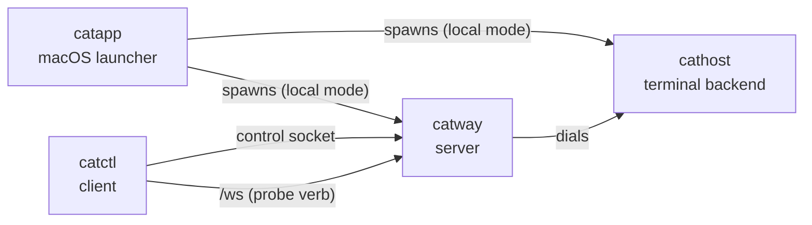

# CLI reference

Four binaries. `catway` and `cathost` are the daemons; `catctl` is the client;
`catapp` is the macOS launcher.



## `catway`

The cats server: orchestrator event loop, web UI, WebSocket bridge, control and
hook APIs, persistence, auth and TLS.

```
catway [--config PATH] [--addr :8421] [--socket /tmp/cats-cathost.sock]
       [--control-socket PATH] [--hook-socket PATH]
       [--auth password|none] [--password SECRET] [--session-ttl 24h]
       [--allowed-origins a,b] [--tls] [--tls-cert PEM] [--tls-key PEM]
       [--persist=false] [--state-dir DIR]
```

| Flag | Default | Notes |
|------|---------|-------|
| `--config` | `~/.config/cats/config.yaml` | also `$CATS_CONFIG` |
| `--addr` | `:8421` | binds all interfaces |
| `--socket` | `/tmp/cats-cathost.sock` | the `cathost` seam |
| `--control-socket` | `$CATS_CONTROL_SOCKET`, else `/tmp/cats-control.sock` | |
| `--hook-socket` | `/tmp/cats-hooks.sock` | `none` disables |
| `--auth` | `password` | or `none` |
| `--password` | `$CATS_PASSWORD`, else generated and logged | |
| `--session-ttl` | `24h` | |
| `--allowed-origins` | — | comma-separated extra WebSocket origins |
| `--tls` | off | auto self-signed unless cert/key given |
| `--tls-cert` / `--tls-key` | — | both required together; either implies `--tls` |
| `--persist` | `true` | |
| `--state-dir` | `$XDG_STATE_HOME/cats` | |

Build requires `-tags ghostty` and `PKG_CONFIG_PATH`. Startup order relative to
`cathost` does not matter — `catway` dials lazily with retry.

A SIGINT or SIGTERM takes the same graceful path as `server.stop`: save the model,
run a bounded final scrollback capture, then exit. **Terminals survive.** A second
signal force-quits.

## `cathost`

The terminal backend daemon: PTYs plus VT emulation per pane.

```
cathost [-socket /tmp/cats-cathost.sock] [-persistent] [-idle-timeout 10m]
        [-exit-on-disconnect] [-manifest-update=false]
```

| Flag | Default | Notes |
|------|---------|-------|
| `-socket` | `/tmp/cats-cathost.sock` | unix socket to listen on |
| `-persistent` | off | keep panes alive across client disconnects. **Use this.** Overrides `-exit-on-disconnect` |
| `-idle-timeout` | `10m` | in persistent mode, exit if no client attaches for this long. `0` disables |
| `-exit-on-disconnect` | off | managed mode: exit after the first client disconnects |
| `-manifest-update` | `true` | fetch agent-detection manifest updates at startup |

Build requires `-tags ghostty` and `PKG_CONFIG_PATH`.

For a long-running service, `-persistent -idle-timeout 0` is what you want. See
[the seam's lifecycle diagram](../protocols/orchestration-seam.md#persistent-vs-managed-mode).

## `catctl`

The control-API client. Links no libghostty — a plain `go build`.

```
catctl [flags] <verb> [args...]                 ergonomic subcommand
catctl [flags] <method> [--params '<json>']     raw command
catctl help                                     list the ergonomic verbs
catctl commands                                 list the raw method names
catctl integration <install|uninstall|status|help> ...
catctl plugin <install|link|uninstall|list|run|update|help> ...
catctl probe [--url ...] [--script ...]
```

Global flags go **before** the verb:

| Flag | Default | Notes |
|------|---------|-------|
| `--socket` | `$CATS_CONTROL_SOCKET`, else `/tmp/cats-control.sock` | |
| `--params` | — | JSON params object for the raw form |
| `--timeout` | `10s` | round-trip timeout |
| `--id` | `1` | correlation id echoed in the response |
| `--json` | off | print the full JSON response instead of just the result |

Exit status: `0` success, `1` command failed, `2` usage or transport error.

### Verbs

Liveness and queries:

```bash
catctl ping                     # check the server is reachable
catctl session                  # session summary
catctl workspaces               # list workspaces
catctl tabs [workspace]         # list tabs
catctl panes                    # list all panes
catctl pane [pane]              # describe one pane
catctl events [pane]            # stream pane events until Ctrl-C
```

Panes:

```bash
catctl split [h|v] [pane]       # split (h by default)
catctl close [pane]
catctl focus <pane>
catctl focus-dir <left|right|up|down>
catctl cycle [prev]
catctl last                     # the previously focused pane
catctl swap <left|right|up|down>
catctl zoom [pane]
catctl rename-pane <pane> <name...>
catctl resize <border> <ratio>
catctl scroll <pane> <delta>    # negative = up
catctl capture <pane> [lines]
catctl read <pane> <r0> <c0> <r1> <c1>
catctl wait <pane> <pattern> [timeout_secs]
catctl send <pane> <text...>    # type, do not submit
catctl run <pane> [text...]     # type and press Enter
```

Tabs and workspaces:

```bash
catctl tab <num>                catctl new-tab
catctl close-tab [num]          catctl rename-tab <num> <name...>
catctl ws <id>                  catctl new-ws [name...]
catctl close-ws [id]            catctl rename-ws <id> <name...>
```

Misc:

```bash
catctl agent <pane>             # reveal an agent's pane
catctl themes                   # list available UI themes
catctl theme <name>             # switch the UI theme, live (clears color overrides)
catctl reload                   # re-render the page after a config edit
catctl stop                     # stop the server (terminals survive)
```

### In-pane use

Every pane gets `CATS_CONTROL_SOCKET` and `CATS_PANE_ID`, so `catctl` inside a
pane already knows which cats it is talking to:

```bash
catctl split v                  # split the pane I am in
catctl rename-pane "$CATS_PANE_ID" build
```

### `catctl integration`

Offline — edits an agent's own config tree, no running `catway` needed.

```bash
catctl integration install <target>
catctl integration uninstall <target>
catctl integration status [--outdated-only]
catctl integration help
```

Targets: `pi`, `omp`, `claude`, `codex`, `copilot`, `droid`, `kimi`, `opencode`,
`kilo`, `hermes`, `qodercli`, `cursor`.

### `catctl plugin`

```bash
catctl plugin install rohanthewiz/cats-todo     # clone + build
catctl plugin install <git-url> --ref v0.1.0    # pin a branch or tag
catctl plugin link ./cats-todo                  # symlink a local checkout
catctl plugin update <id>                        # re-fetch + rebuild
catctl plugin list
catctl plugin run <id>                           # launch in a new tab
catctl plugin uninstall <id>
```

Only `run` needs a running `catway`.

### `catctl probe`

A stdlib-only WebSocket client for the browser protocol — it dials `/ws`, not the
control socket, so it exercises the full browser-facing path (upgrade, auth,
`init`, frames, commands) headlessly.

```
catctl probe [--url ws://localhost:8421/ws] [--cols 120] [--rows 32]
             [--script 'op; op; ...'] [--timeout 8s] [--life 120s] [--token SECRET]
```

Ops are semicolon-separated. A representative slice:

| Op | Effect |
|----|--------|
| `wait:MS` | sleep |
| `focus:PANE`, `focusdir:left\|right\|up\|down` | move focus |
| `type:TEXT` | structured key events per rune (`\n` = Enter) |
| `key:CODE[:MODS]` | one named key; MODS letters `c`/`s`/`a`/`m`, e.g. `key:KeyC:c` |
| `mouse:PANE:X:Y[:BTN]` | click at a cell |
| `click_text:PANE:TEXT` | poll until TEXT appears, then click its first cell |
| `wheel:PANE:X:Y:DY` | wheel event, negative DY = up |
| `read:PANE:AROW,ACOL:CROW,CCOL[:rect]` | selection extract; rows may be `@TEXT` |
| `readeq:TEXT` | assert the last read equals TEXT |
| `capture:PANE[:visible\|recent][:LINES][:ansi][:unwrap]` | buffer text |
| `captureeq:TEXT`, `capturehas:TEXT` | assert on the last capture |
| `split:PANE:h\|v`, `close:PANE`, `zoom:PANE`, `cycle`, `swap:DIR`, `last` | layout commands |
| `rect:PANE:x\|y\|w\|h:eq\|lt\|gt:N` | poll until a rect field matches (`f` = focused) |
| `title:PANE:TEXT` | poll until a title matches |

Exit status: `0` script passed, `1` an op failed, `2` bad flags.

## `catapp`

The macOS launcher. Not usually run by hand — it ships inside a `.app` bundle —
but `go run ./cmd/catapp` works for development (and stays in local mode by
default).

No flags. Behaviour comes from two places:

1. The build-time `defaultMode`, injected via
   `-ldflags "-X main.defaultMode=local|remote"`.
2. `~/Library/Application Support/cats/app.json`, which overrides it at runtime:

```json
{ "mode": "remote", "remote": { "url": "https://host:8421", "label": "home" } }
```

| Mode | Behaviour |
|------|-----------|
| `local` | hydrate PATH, pick a loopback port and `$TMPDIR` sockets, spawn `cathost -persistent` then `catway --auth none`, wait for readiness, show the window, reap on quit |
| `remote` | no daemons. Navigate to the saved URL, or show the connect form on first run |

Run from a dev terminal it keeps your shell's cwd and PATH; launched from Finder it
falls back to `$HOME` and re-derives PATH from your login shell. See
[Mode 1](../architecture/standalone-mac.md).

## Make targets

| Target | Result |
|--------|--------|
| `make vt` | build the vendored libghostty-vt (one time) |
| `make binaries` | `catway`, `cathost`, `catctl` into `bin/` |
| `make local` | the same three into `~/bin` |
| `make build` / `make test` | untagged build and test |
| `make build-ghostty` / `make test-ghostty` / `make race-ghostty` | the tagged equivalents |
| `make fmt-check` / `make vet` / `make vet-ghostty` | hygiene |
| `make check` | everything CI runs, in order |
| `make dist` | release tarball for this host into `dist/` |
| `make macapp` | `dist/Cats.app` — self-contained |
| `make macapp-client` | `dist/Cats Client.app` — thin client |
| `make clean` | remove `bin/` and `dist/` |
