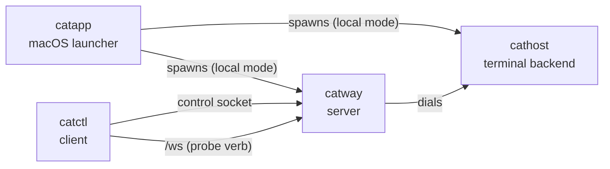

# CLI reference

Four binaries. `catway` and `cathost` are the daemons; `catctl` is the client;
`catapp` is the macOS launcher.



## `catway`

The cats server: orchestrator event loop, web UI, WebSocket bridge, control and
hook APIs, persistence, auth and TLS.

```
catway [--config PATH] [--addr :8421] [--socket /tmp/cats-cathost.sock]
       [--control-socket PATH] [--hook-socket PATH]
       [--auth password|none] [--password SECRET] [--session-ttl 24h]
       [--allowed-origins a,b] [--tls] [--tls-cert PEM] [--tls-key PEM]
       [--tls-san NAME,IP]
       [--persist=false] [--state-dir DIR] [--push-url URL]
```

| Flag | Default | Notes |
|------|---------|-------|
| `--config` | `~/.config/cats/config.yaml` | also `$CATS_CONFIG` |
| `--addr` | `:8421` | binds all interfaces |
| `--socket` | `/tmp/cats-cathost.sock` | the `cathost` seam |
| `--control-socket` | `$CATS_CONTROL_SOCKET`, else `/tmp/cats-control.sock` | |
| `--hook-socket` | `/tmp/cats-hooks.sock` | `none` disables |
| `--auth` | `password` | or `none` |
| `--password` | `$CATS_PASSWORD`, else generated and logged | |
| `--session-ttl` | `24h` | |
| `--allowed-origins` | — | comma-separated extra WebSocket origins |
| `--tls` | off | auto self-signed unless cert/key given |
| `--tls-cert` / `--tls-key` | — | both required together; either implies `--tls` |
| `--tls-san` | — | comma-separated extra names/IPs for the **auto-generated** cert; implies `--tls`. Adding one re-mints |
| `--persist` | `true` | |
| `--state-dir` | `$XDG_STATE_HOME/cats` | |
| `--push-url` | — | ntfy topic URL for [push notifications](configuration.md#push). Passing it is the opt-in; `""` forces the bridge off. Token: `$CATS_PUSH_TOKEN` |

Build requires `-tags ghostty` and `PKG_CONFIG_PATH`. Startup order relative to
`cathost` does not matter — `catway` dials lazily with retry.

A SIGINT or SIGTERM takes the same graceful path as `server.stop`: save the model,
run a bounded final scrollback capture, then exit. **Terminals survive.** A second
signal force-quits.

## `cathost`

The terminal backend daemon: PTYs plus VT emulation per pane.

```
cathost [-socket /tmp/cats-cathost.sock] [-listen unix://…|tcp://…|tls://…]
        [-token-file PATH] [-tls-dir DIR] [-tls-san a,b]
        [-persistent] [-idle-timeout 10m]
        [-exit-on-disconnect] [-manifest-update=false]
```

| Flag | Default | Notes |
|------|---------|-------|
| `-socket` | `/tmp/cats-cathost.sock` | unix socket to listen on; shorthand for `-listen unix://<path>` |
| `-listen` | — | `unix://path`, `tcp://host:port` (loopback only) or `tls://host:port`. Overrides `-socket` |
| `-token-file` | — | file holding the bearer token a client's `hello` must present. **Required** for `tcp://` and `tls://` |
| `-tls-dir` | user config dir `/cats/cathost-tls` | where the self-signed `tls://` certificate is cached (minted on first use) |
| `-tls-san` | — | comma-separated extra names the generated certificate must cover |
| `-persistent` | off | keep panes alive across client disconnects. **Use this.** Overrides `-exit-on-disconnect` |
| `-idle-timeout` | `10m` | in persistent mode, exit if no client attaches for this long. `0` disables |
| `-exit-on-disconnect` | off | managed mode: exit after the first client disconnects |
| `-manifest-update` | `true` | fetch agent-detection manifest updates at startup |

Build requires `-tags ghostty` and `PKG_CONFIG_PATH`.

### Serving a remote catway

A unix socket is reachable only by someone who can already open the file; a port
is reachable by anyone who can route to it, and what it hands out is a shell.
So both network transports demand a token, and `tcp://` additionally refuses any
bind that is not loopback.

```sh
head -c 32 /dev/urandom | base64 > ~/.config/cats/cathost.token
cathost -listen tls://0.0.0.0:8422 -token-file ~/.config/cats/cathost.token \
        -tls-san devbox.lan -persistent -idle-timeout 0
```

Startup logs the certificate's SHA-256. Copy it, plus the token file, into the
catway's [`hosts`](configuration.md#hosts) entry — the fingerprint is what makes
a self-signed certificate safe, since it replaces chain verification rather than
waiving it.

For a long-running service, `-persistent -idle-timeout 0` is what you want. See
[the seam's lifecycle diagram](../protocols/orchestration-seam.md#persistent-vs-managed-mode).

## `catctl`

The control-API client. Links no libghostty — a plain `go build`.

```
catctl [flags] <verb> [args...]                 ergonomic subcommand
catctl [flags] <method> [--params '<json>']     raw command
catctl help [verb]                              the verb table, or one verb's page
catctl commands                                 list the raw method names
catctl pair                                     pair a phone with a scannable code
catctl completion <bash|zsh|fish>               shell completion script
catctl integration <install|uninstall|status|help> ...
catctl plugin <install|link|uninstall|list|run|update|help> ...
catctl probe [--url ...] [--script ...]
```

`catctl help <verb>` prints one verb's page — its synopsis, the raw method it
builds, what each argument completes to, and the notes that do not fit a
one-liner (`catctl help wait`, `catctl help send`). It also takes a family name
or a raw method.

Global flags go **before** the verb:

| Flag | Default | Notes |
|------|---------|-------|
| `--socket` | `$CATS_CONTROL_SOCKET`, else `/tmp/cats-control.sock` | |
| `--params` | — | JSON params object for the raw form |
| `--timeout` | `10s` | round-trip timeout |
| `--id` | `1` | correlation id echoed in the response |
| `--json` | off | print the full JSON response instead of just the result |

Exit status: `0` success, `1` command failed, `2` usage or transport error.

### Verbs

Liveness and queries:

```bash
catctl ping                     # check the server is reachable
catctl session                  # session summary
catctl workspaces               # list workspaces
catctl tabs [workspace]         # list tabs
catctl panes                    # list all panes
catctl pane [pane]              # describe one pane
catctl hosts                    # list the cathosts panes can run on
catctl events [pane]            # stream pane events until Ctrl-C
```

Panes:

```bash
catctl split [h|v] [pane]       # split (h by default)
catctl close [pane]
catctl focus <pane>
catctl focus-dir <left|right|up|down>
catctl cycle [prev]
catctl last                     # the previously focused pane
catctl swap <left|right|up|down>
catctl zoom [pane]
catctl rename-pane <pane> <name...>
catctl resize <border> <ratio>
catctl scroll <pane> <delta>    # negative = up
catctl capture <pane> [lines]
catctl read <pane> <r0> <c0> <r1> <c1>
catctl wait <pane> <pattern> [timeout_secs]
catctl send <pane> <text...>    # type, do not submit
catctl run <pane> [text...]     # type and press Enter
```

Tabs and workspaces:

```bash
catctl tab <num>                catctl new-tab
catctl close-tab [num]          catctl rename-tab <num> <name...>
catctl ws <id>                  catctl new-ws [name...]
catctl close-ws [id]            catctl rename-ws <id> <name...>
catctl lock-ws [id]             catctl unlock-ws [id]
```

`lock-ws` sets a workspace aside for hand work: no launching a plugin or an agent
into it (`tab.create` with a command is refused) and no typing into its panes
from the control API (`send` / `run` are refused). Splits and plain tabs are
untouched, and the lock survives a restart.

The sidebar draws a locked workspace dimmed, with a padlock beside its name, and
dims its agents in the AGENTS section too, so the set-aside work reads as one
group. Neither dimmed row takes a click: the workspace row will not switch to it,
and an agent row inside it will not reveal its pane — revealing a pane *is* a
switch, so the two refusals are the same one. Every deliberate route in still
works: the row's context menu, the command palette, and the keyboard.

Misc:

```bash
catctl agent <pane>             # reveal an agent's pane
catctl themes                   # list available UI themes
catctl theme <name>             # switch the UI theme, live (clears color overrides)
catctl reload                   # re-render the page after a config edit
catctl stop                     # stop the server (terminals survive)
```

### In-pane use

Every pane gets `CATS_CONTROL_SOCKET` and `CATS_PANE_ID`, so `catctl` inside a
pane already knows which cats it is talking to:

```bash
catctl split v                  # split the pane I am in
catctl rename-pane "$CATS_PANE_ID" build
```

### `catctl completion`

Shell completion for `catctl` **and for plugins**. Install it by evaluating the
script from your shell's rc file:

```bash
echo 'eval "$(catctl completion bash)"' >> ~/.bashrc
echo 'eval "$(catctl completion zsh)"'  >> ~/.zshrc
catctl completion fish > ~/.config/fish/completions/catctl.fish
```

What it completes:

| Where | Candidates |
|-------|------------|
| first word | the ergonomic verbs and the families; raw method names once a prefix is typed |
| `<pane>` | **live pane ids**, described by handle, agent or title |
| `<num>` | **live tab numbers**, with names |
| `<id>` / `[workspace]` | **live workspace ids**, with names |
| `theme <name>` | installed theme names, active one marked |
| `focus-dir`, `swap`, `split`, `cycle` | the direction words |
| `integration install\|uninstall` | agent targets, each showing its install state |
| `plugin run\|update\|uninstall` | installed plugin ids, then that plugin's action ids |
| `plugin link` | directories |
| flags | the global flags, plus a family's own (`--ref`, `plugin run --all`, probe's `--url`, …) |

The live rows come from a read-only query over the control socket, capped at
half a second: with no server running you simply get no candidates, never a
pause at the prompt. A `--socket` already typed on the line is honoured, so
completion queries the same server the command will reach.

Everything is served by a hidden `catctl __complete` verb, so the vocabulary
lives in Go and cannot drift from a hand-written shell script. The generated
scripts only know the wire format: `value<TAB>description` lines terminated by a
`:nofiles` / `:files` / `:dirs` directive.

#### Plugins complete themselves

A plugin can claim a command name in its manifest, and the generated script
registers that command alongside `catctl`:

```toml
[[completions]]
binary  = "cats-todo"
command = ["./bin/cats-todo", "__complete"]
```

The shell routes Tab on a `cats-todo` line through
`catctl __complete --for cats-todo`, which execs the plugin's completer (bounded
to two seconds and 64 KiB) and passes its reply through. A plugin with no
completion code of its own can list static candidates instead and let `catctl`
serve them:

```toml
[[completions]]
binary      = "cats-tool"
subcommands = ["add", "list"]
flags       = ["--force"]
```

Because the plugin list is read when the script is *generated*, the `eval` form
is what keeps it current: a plugin installed today is completable in the next
shell you open. See [Plugins](../subsystems/plugins.md#shell-completion).

### `catctl pair`

Mints a **single-use, five-minute** device-pairing grant and prints it as a QR
code plus a `cats://pair?…` link. Scan it to join a phone without typing the
access password into it.

```bash
catctl pair            # the scannable code
catctl --json pair     # the raw payload, for scripting
```

The code carries the server URL, the grant, and — under HTTPS — the certificate
fingerprint the device pins. The grant is **not** the password: redeeming it
buys an ordinary session, bounded by `--session-ttl` and revoked by restarting
`catway`. See [Auth and TLS](../subsystems/auth-and-tls.md#device-pairing).

The QR is rendered by `internal/qr`, an in-repo byte-mode encoder — no new
dependency. Piped output and `NO_COLOR` drop the ANSI colours; the code is only
guaranteed to have the right polarity for a scanner in the coloured form, so the
link below it is always printed too.

Requires auth to be enabled; under `--auth none` there is nothing to pair with.

### `catctl integration`

Offline — edits an agent's own config tree, no running `catway` needed.

```bash
catctl integration install <target>
catctl integration uninstall <target>
catctl integration status [--outdated-only]
catctl integration help
```

Targets: `pi`, `omp`, `claude`, `codex`, `copilot`, `droid`, `kimi`, `opencode`,
`kilo`, `hermes`, `qodercli`, `cursor`.

### `catctl plugin`

```bash
catctl plugin install rohanthewiz/cats-todo     # clone + build
catctl plugin install <git-url> --ref v0.1.0    # pin a branch or tag
catctl plugin link ./cats-todo                  # symlink a local checkout
catctl plugin update <id>                        # re-fetch + rebuild
catctl plugin list
catctl plugin run <id>                           # launch in a new tab
catctl plugin run <id> [action] --all            # ... in every workspace
catctl plugin uninstall <id>
```

Only `run` needs a running `catway`.

`--all` is the CLI twin of the plugins dialog's **run all** button: one
`tab.create` per workspace, each naming its target, so nothing is focused and
nothing is switched to. It differs from the plain launch in two ways. It sends no
cwd — the plain form sends the invoking directory because "here" is what you
meant, while a fan-out has no single "here", so each tab inherits its own
workspace's directory and a per-project plugin scopes to the project it landed
in. And locked workspaces are skipped rather than attempted, a lock meaning "no
automation lands here". The report is one line per workspace in session order:

```
$ catctl plugin run rohanthewiz.cats-todo --all
w1   tab 3 (pane 7)
w2   skipped (locked)
w3   tab 2 (pane 9)
```

Exit is 1 if any launch failed, or if nothing started at all — a command with no
effect should not read as success to a script.

### `catctl probe`

A stdlib-only WebSocket client for the browser protocol — it dials `/ws`, not the
control socket, so it exercises the full browser-facing path (upgrade, auth,
`init`, frames, commands) headlessly.

```
catctl probe [--url ws://localhost:8421/ws] [--cols 120] [--rows 32]
             [--script 'op; op; ...'] [--timeout 8s] [--life 120s] [--token SECRET]
```

Ops are semicolon-separated. A representative slice:

| Op | Effect |
|----|--------|
| `wait:MS` | sleep |
| `focus:PANE`, `focusdir:left\|right\|up\|down` | move focus |
| `type:TEXT` | structured key events per rune (`\n` = Enter) |
| `key:CODE[:MODS]` | one named key; MODS letters `c`/`s`/`a`/`m`, e.g. `key:KeyC:c` |
| `mouse:PANE:X:Y[:BTN]` | click at a cell |
| `click_text:PANE:TEXT` | poll until TEXT appears, then click its first cell |
| `wheel:PANE:X:Y:DY` | wheel event, negative DY = up |
| `read:PANE:AROW,ACOL:CROW,CCOL[:rect]` | selection extract; rows may be `@TEXT` |
| `readeq:TEXT` | assert the last read equals TEXT |
| `capture:PANE[:visible\|recent][:LINES][:ansi][:unwrap]` | buffer text |
| `captureeq:TEXT`, `capturehas:TEXT` | assert on the last capture |
| `split:PANE:h\|v`, `close:PANE`, `zoom:PANE`, `cycle`, `swap:DIR`, `last` | layout commands |
| `rect:PANE:x\|y\|w\|h:eq\|lt\|gt:N` | poll until a rect field matches (`f` = focused) |
| `title:PANE:TEXT` | poll until a title matches |

Exit status: `0` script passed, `1` an op failed, `2` bad flags.

## `catapp`

The macOS launcher. Not usually run by hand — it ships inside a `.app` bundle —
but `go run ./cmd/catapp` works for development (and stays in local mode by
default).

No flags. Behaviour comes from two places:

1. The build-time `defaultMode`, injected via
   `-ldflags "-X main.defaultMode=local|remote"`.
2. `~/Library/Application Support/cats/app.json`, which overrides it at runtime:

```json
{ "mode": "remote", "remote": { "url": "https://host:8421", "label": "home" } }
```

| Mode | Behaviour |
|------|-----------|
| `local` | hydrate PATH, pick a loopback port and `$TMPDIR` sockets, spawn `cathost -persistent` then `catway --auth none`, wait for readiness, show the window, reap on quit |
| `remote` | no daemons. Navigate to the saved URL, or show the connect form on first run |

Run from a dev terminal it keeps your shell's cwd and PATH; launched from Finder it
falls back to `$HOME` and re-derives PATH from your login shell. See
[Mode 1](../architecture/standalone-mac.md).

## Make targets

| Target | Result |
|--------|--------|
| `make vt` | build the vendored libghostty-vt (one time) |
| `make binaries` | `catway`, `cathost`, `catctl` into `bin/` |
| `make local` | the same three into `~/bin` |
| `make build` / `make test` | untagged build and test |
| `make build-ghostty` / `make test-ghostty` / `make race-ghostty` | the tagged equivalents |
| `make fmt-check` / `make vet` / `make vet-ghostty` | hygiene |
| `make check` | everything CI runs, in order |
| `make dist` | release tarball for this host into `dist/` |
| `make macapp` | `dist/Cats.app` — self-contained |
| `make macapp-client` | `dist/Cats Client.app` — thin client |
| `make clean` | remove `bin/` and `dist/` |
