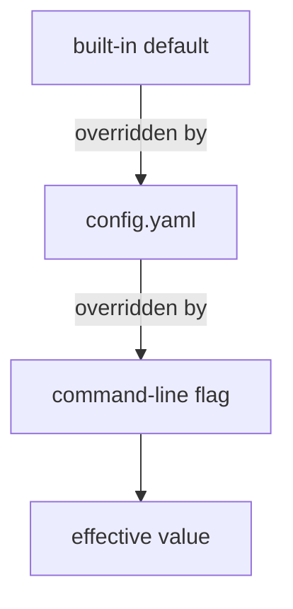
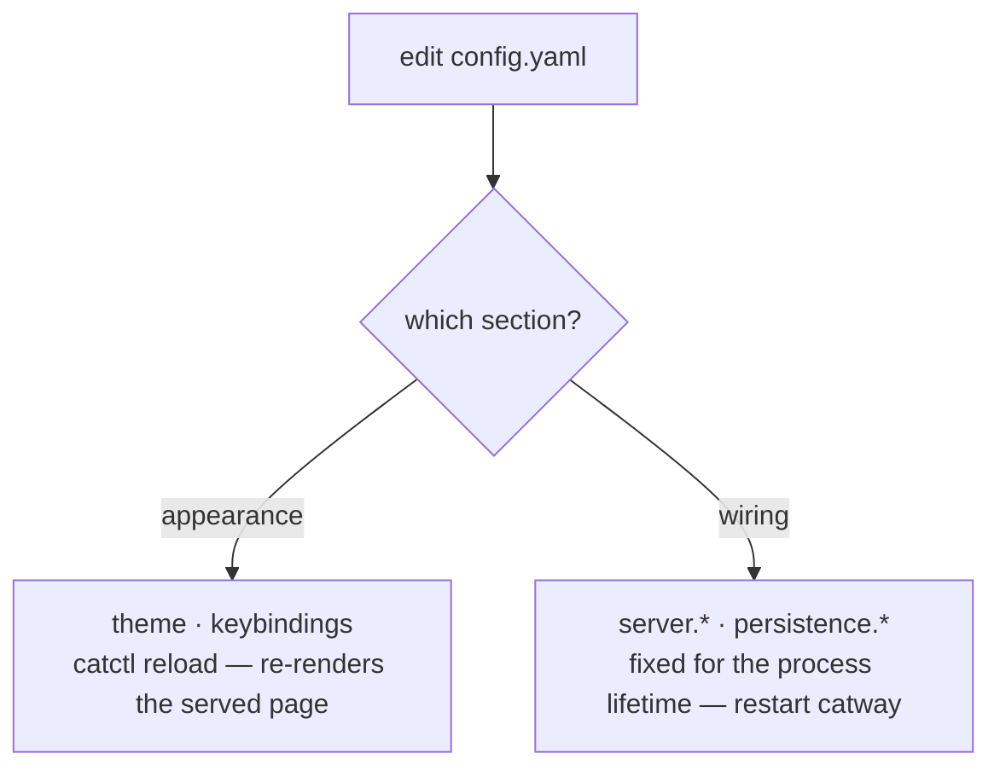

# Configuration

One YAML file: `~/.config/cats/config.yaml`. Every field is optional — omit
anything you do not want to change and the built-in default applies.

Location resolution: `catway --config <path>` > `$CATS_CONFIG` >
`$XDG_CONFIG_HOME/cats/config.yaml` > `~/.config/cats/config.yaml`.

## Precedence



**`flag > config > default`**, and only for `server.*` — those are the only
settings with flags. Theme and keybindings come from the file alone.

The implementation matters here: `catway` starts from the config (which starts
from the defaults), then applies only the flags you **explicitly passed**.
`flag.Visit` reports just those, so an unset flag never masks a config value with
its own default.

## Live reload



`catctl reload` maps to `server.reload_config`. Because the page is rendered
server-side with the theme and keybindings injected, re-rendering it is all a
theme change needs — no restart, no rebuild.

The settings modal in the UI does the same thing through `config.get` /
`config.set`, which persist the live-appliable sections.

## `server`

```yaml
server:
  addr: ":8421"
  cathost_socket: "/tmp/cats-cathost.sock"
  control_socket: ""                    # "" => CATS_CONTROL_SOCKET or /tmp/cats-control.sock
  hook_socket: "/tmp/cats-hooks.sock"   # "none" disables
  auth: "password"                      # "password" | "none"
  session_ttl: "24h"                    # a Go duration string
  # allowed_origins: ["https://home.relay.example"]
  tls:
    enabled: false
    cert: ""
    key: ""
```

| Key | Flag | Notes |
|-----|------|-------|
| `addr` | `--addr` | `host:port` or `:port`. Binds all interfaces by default |
| `cathost_socket` | `--socket` | the orchestration seam |
| `control_socket` | `--control-socket` | empty defers to `$CATS_CONTROL_SOCKET`, then the default |
| `hook_socket` | `--hook-socket` | `none` disables the hook API entirely |
| `auth` | `--auth` | `none` skips login. Safe on loopback **only** |
| `session_ttl` | `--session-ttl` | cookie lifetime |
| `allowed_origins` | `--allowed-origins` | extra WebSocket origins beyond same-origin. Full origins or bare `host[:port]`. Empty means strict same-origin |
| `tls.enabled` | `--tls` | HTTPS. Auto self-signed unless cert/key are given |
| `tls.cert` / `tls.key` | `--tls-cert` / `--tls-key` | operator PEMs. Both must be set together; either implies `--tls` |

!!! warning "The password is not in this file"
    There is no `server.password`. Set `CATS_PASSWORD` or pass `--password`, so
    the secret never lands in a committed config. If neither is given, `catway`
    generates one and logs it.

`server.*` settings are fixed for the process's lifetime. Changing them needs a
restart.

## `persistence`

```yaml
persistence:
  enabled: true
  state_dir: ""            # "" => $XDG_STATE_HOME/cats  (~/.local/state/cats)
  history_lines: 2000      # scrollback lines captured per pane (0 = whole buffer)
  resume_agents: true
```

| Key | Flag | Notes |
|-----|------|-------|
| `enabled` | `--persist` | `--persist=false` disables save and restore |
| `state_dir` | `--state-dir` | |
| `history_lines` | — | per-pane scrollback captured for cold-restore seeds |
| `resume_agents` | — | relaunch supported agent panes into their native conversations on a cold restore |

See [Persistence](../subsystems/persistence.md).

## `worktrees`

```yaml
worktrees:
  directory: "~/.cats/worktrees"
```

Where new checkouts are created. A leading `~` is expanded. Checkouts land at
`<directory>/<repoName>/<branch-slug>`.

## `theme`

Colours are the served page's `:root` CSS custom properties, **without** the
leading `--`. Only the ones you list are overridden.

```yaml
theme:
  colors:
    bg: "#1f2420"
    fg: "#d6ddd6"
    accent: "#4db380"
    accent-dim: "#3d4a43"   # focused pane outline
    panel: "#242a25"
    panel2: "#2b322c"
    line: "#38403a"
    muted: "#9db0a2"
    chrome: "#2b322c"
    chrome-focus: "#3a4a3f"
    ok: "#6ac47a"
    warn: "#e0b64e"
    err: "#e57373"
    done: "#4fd1c5"         # unseen agent-completion markers
  font: 'ui-monospace, "SF Mono", Menlo, Consolas, monospace'
```

| Colour | Where it shows |
|--------|----------------|
| `bg` / `fg` | page background and default text |
| `accent` / `accent-dim` | active highlights; `accent-dim` is the focused pane's hairline outline |
| `panel` / `panel2` | sidebar and dialog surfaces |
| `line` | dividers and borders |
| `muted` | secondary text (cwd, hints) |
| `chrome` / `chrome-focus` | the per-pane header strip, unfocused and focused |
| `ok` / `warn` / `err` | agent state badges and toasts |
| `done` | the unseen-completion marker on a pane whose agent finished while you were elsewhere |

`font` is a CSS font stack for the terminal grid. The browser measures it and
reports the resulting cell metrics in `init`, so changing the font relayouts
everything.

Apply with `catctl reload`.

## `keybindings`

Keys are DOM `KeyboardEvent.key` values — `"ArrowLeft"`, `"h"`, `"Escape"`,
`"0"`, `"$"`, `"Enter"`. Only the actions you list are rebound; the rest keep
their defaults.

```yaml
keybindings:
  copy_mode:
    move-left:  ["ArrowLeft", "h"]
    move-right: ["ArrowRight", "l"]
    move-up:    ["ArrowUp", "k"]
    move-down:  ["ArrowDown", "j"]
    line-start: ["0", "Home"]
    line-end:   ["$", "End"]
    top:        ["g"]
    bottom:     ["G"]
    select:     ["v"]
    rect:       ["r"]
    yank:       ["y", "Enter"]
    exit:       ["Escape", "q"]
```

Multiple keys per action are allowed — the defaults themselves pair a vim key with
an arrow key. Apply with `catctl reload`.

## Environment variables

| Variable | Read by | Purpose |
|----------|---------|---------|
| `CATS_CONFIG` | `catway` | config file path |
| `CATS_PASSWORD` | `catway` | the shared secret |
| `CATS_CONTROL_SOCKET` | `catway`, `catctl` | control socket path. Injected into every pane |
| `CATS_CATCTL` | `catway` | where to find `catctl` when spawning plugin operations |
| `CATS_PLUGINS_DIR` | plugin host | override the plugins root |
| `CATS_AGENT_DETECTION_MANIFEST_CATALOG_URL` | `cathost` | override the manifest catalog URL |
| `XDG_CONFIG_HOME` | config, plugins | config home |
| `XDG_STATE_HOME` | persistence, manifests | state home |

Injected **into** every pane by `catway`:

| Variable | Meaning |
|----------|---------|
| `CATS_ENV=1` | you are in a cats pane |
| `CATS_PANE_ID` | this pane's public id |
| `CATS_SOCKET_PATH` | the hook socket — this is what arms agent hooks |
| `CATS_CONTROL_SOCKET` | the control socket |
| `CATS_PLUGIN_ID` / `CATS_PLUGIN_DIR` | set additionally for a plugin's pane |

## Paths at a glance

| What | Path |
|------|------|
| config | `~/.config/cats/config.yaml` |
| plugins | `~/.config/cats/plugins/` |
| TLS cert cache | `~/.config/cats/catway-{cert,key}.pem` |
| session + history state | `~/.local/state/cats/` |
| manifest overlay | `~/.local/state/cats/agent-detection/` |
| worktrees | `~/.cats/worktrees/` |
| `catapp` settings | `~/Library/Application Support/cats/app.json` |

The full annotated example lives at
[`config.example.yaml`](https://github.com/rohanthewiz/cats/blob/main/config.example.yaml)
in the repo root.
