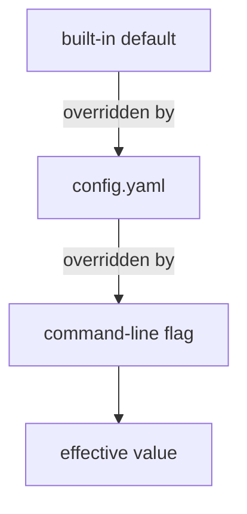
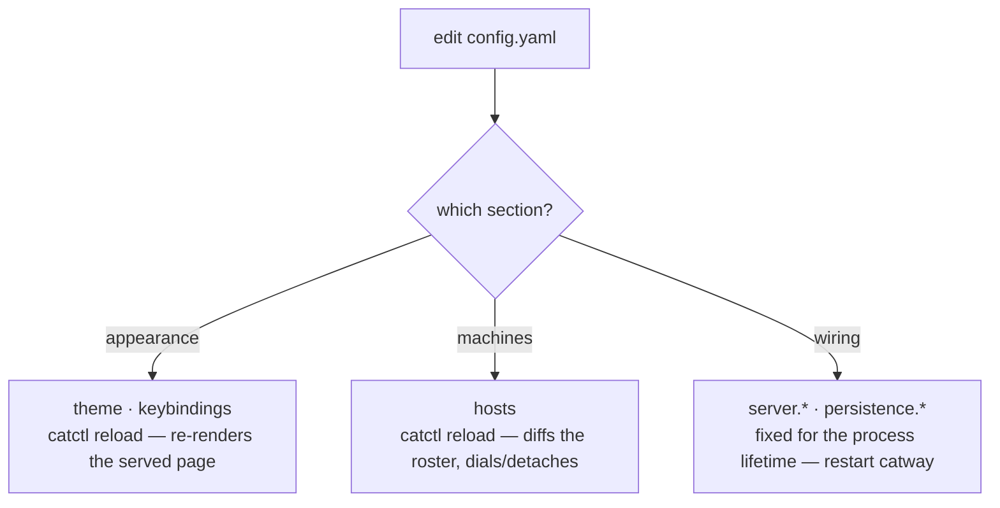

# Configuration

One YAML file: `~/.config/cats/config.yaml`. Every field is optional — omit
anything you do not want to change and the built-in default applies.

Location resolution: `catway --config <path>` > `$CATS_CONFIG` >
`$XDG_CONFIG_HOME/cats/config.yaml` > `~/.config/cats/config.yaml`.

## Precedence



**`flag > config > default`**, and only for the sections that have flags:
`server.*`, `persistence.*` (`--persist`, `--state-dir`) and `push.url`
(`--push-url`). Theme and keybindings come from the file alone.

The implementation matters here: `catway` starts from the config (which starts
from the defaults), then applies only the flags you **explicitly passed**.
`flag.Visit` reports just those, so an unset flag never masks a config value with
its own default.

## Live reload



`catctl reload` maps to `server.reload_config`. Because the page is rendered
server-side with the theme and keybindings injected, re-rendering it is all a
theme change needs — no restart, no rebuild.

The settings modal in the UI does the same thing through `config.get` /
`config.set`, which persist the live-appliable sections. `hosts:` has its own
pair — `host.attach` / `host.detach` — for the same reason: see
[editing the roster](#editing-the-roster-without-a-restart).

## `server`

```yaml
server:
  addr: ":8421"
  cathost_socket: "/tmp/cats-cathost.sock"
  control_socket: ""                    # "" => CATS_CONTROL_SOCKET or /tmp/cats-control.sock
  hook_socket: "/tmp/cats-hooks.sock"   # "none" disables
  auth: "password"                      # "password" | "none"
  session_ttl: "24h"                    # a Go duration string
  # allowed_origins: ["https://home.relay.example"]
  tls:
    enabled: false
    cert: ""
    key: ""
    sans: []
```

| Key | Flag | Notes |
|-----|------|-------|
| `addr` | `--addr` | `host:port` or `:port`. Binds all interfaces by default |
| `cathost_socket` | `--socket` | the orchestration seam |
| `control_socket` | `--control-socket` | empty defers to `$CATS_CONTROL_SOCKET`, then the default |
| `hook_socket` | `--hook-socket` | `none` disables the hook API entirely |
| `auth` | `--auth` | `none` skips login. Safe on loopback **only** |
| `session_ttl` | `--session-ttl` | cookie lifetime |
| `allowed_origins` | `--allowed-origins` | extra WebSocket origins beyond same-origin. Full origins or bare `host[:port]`. Empty means strict same-origin |
| `tls.enabled` | `--tls` | HTTPS. Auto self-signed unless cert/key are given |
| `tls.cert` / `tls.key` | `--tls-cert` / `--tls-key` | operator PEMs. Both must be set together; either implies `--tls` |
| `tls.sans` | `--tls-san` | extra names/IPs for the auto-generated cert (a LAN DNS name, a relay hostname). Implies `--tls`; ignored when operator PEMs are given. Adding one re-mints the certificate |

> **Warning — the password is not in this file**
>
> There is no `server.password`. Set `CATS_PASSWORD` or pass `--password`, so
> the secret never lands in a committed config. If neither is given, `catway`
> generates one and logs it.

`server.*` settings are fixed for the process's lifetime. Changing them needs a
restart.

## `hosts`

The cathosts panes can run on. Omit the section — the default — and there is
exactly one host, `local`, on `server.cathost_socket`: the UI grows no roster and
no badges, and nothing about a single-machine session changes.

```yaml
hosts:
  - id: devbox                                   # letters, digits, . _ -
    label: "devbox (ssh)"                        # display name; defaults to the id
    addr: "unix:///tmp/devbox-cathost.sock"
    # default: true                              # new panes land here instead of local

  - id: box                                      # the native transport: no ssh
    addr: "tls://box.lan:8422"
    token_file: "~/.config/cats/box.token"       # must match the daemon's -token-file
    fingerprint: "dd7d9b31…"                     # printed by cathost at startup
    # control_relay: true                        # let panes there drive the session
```

| Key | Notes |
|-----|-------|
| `id` | how panes name the host; recorded per pane in `session.json` |
| `label` | display name in the sidebar and in error toasts |
| `addr` | `unix://path`, `tcp://host:port`, or `tls://host:port` |
| `default` | where a pane that names no host lands. At most one entry; with none, `local` is the default |
| `control_relay` | let panes on this host reach the control API. **Off by default, and a trust decision** — see below |
| `token` / `token_file` | credential for a cathost that requires one (set one, not both) |
| `fingerprint` | pinned TLS certificate for a `tls://` host |

The `local` entry is **always synthesized** from `server.cathost_socket`, so this
list only ever names the extra machines. Listing an entry with `id: local`
overrides the synthesized one (its address must stay `unix://`).

### Reaching another machine

Two ways, and the ssh one needs nothing from the daemon at all:

```sh
ssh -N -L /tmp/devbox-cathost.sock:/tmp/cats-cathost.sock devbox
```

makes a remote machine's cathost a local socket, and a `unix://` host pointed at
it is a genuine remote host — panes on it appear beside local ones in the same
workspace.

`tls://` is the native alternative, for a host nobody wants to keep an ssh
session open for. The daemon runs with `-listen tls://… -token-file …` (see
[cathost](cli.md#cathost)) and prints its certificate fingerprint; the catway
presents the token in its handshake and pins that fingerprint. **Pinning
replaces chain verification, it does not waive it** — a `tls://` host with no
`fingerprint` falls back to ordinary CA + hostname validation, which is right
only if you actually issued a real certificate for that name.

`tcp://` is cleartext and is refused at both ends unless the target is a
loopback address — it exists for a sandbox or a container sharing this machine's
network namespace, not for a network.

An address catway cannot safely dial (cleartext off the loopback, a fingerprint
that is not a SHA-256) fails at **startup**, with the reason, rather than
becoming a roster row that retries forever.

Every pane records the host it ran on, so a restart re-adopts each pane on its
own machine; a pane whose host has left the config falls back to the default
host rather than staying dark.

`catctl hosts` prints the live roster (which hosts, connected or not, and how
many panes each holds).

### Editing the roster without a restart

Unlike the rest of the server-side settings, `hosts:` is **live**. Three ways in,
all of which change the running session *and* rewrite this section of the file,
so the roster and the config can never disagree:

```sh
catctl attach-host devbox unix:///tmp/devbox-cathost.sock "devbox (ssh)"
catctl detach-host devbox            # refused while it still holds panes
catctl detach-host devbox force      # …unless you say so; see below
catctl reload                        # apply a hand-edit of hosts: to the running catway
```

In the browser it is the `＋` on the HOSTS section heading (and **attach host…**
in the gear menu, since that section is hidden while there is only one host);
detach is a right-click on the host's row.

A newly attached host starts dialing immediately — the reply means the roster
took it, not that it answered, so the row's dot is the thing to watch. An
address catway cannot safely dial is refused before anything is written.

Detaching is the destructive half, because a terminal cannot move between
machines: the panes on that host are abandoned. So a host that still holds panes
is refused unless you force it, and forcing it re-homes those panes onto the
default host, where they **respawn as new shells** — the layout, names and public
handles survive, whatever was running does not. The departing cathost is asked to
close the PTYs it was holding (best effort — it is often unreachable, which is
usually why it is being detached).

The `local` host is not detachable: it is synthesized rather than configured, and
it is where everything else falls back to.

A live edit that only changes a host's `label` (or moves `default`) keeps the
connection — a rename must not interrupt the streams a machine is carrying. A
changed `addr` redials, keeping that host's panes: same host, new route.
`control_relay` is applied live too, and takes effect on the next connection from
that host rather than needing one.

### `control_relay`: letting a host drive the session

Off by default, and the one host setting that is a trust decision rather than a
connection detail.

Panes carry `CATS_CONTROL_SOCKET` so in-pane tooling — `catctl`, cats-todo, a
plugin binary — can drive the session they belong to. On a remote host there is
nothing to point it at unless that host's cathost relays the control API back
(see the [control relay](../protocols/orchestration-seam.md#control-relay)), so a
pane there is told `CATS_CONTROL_SOCKET=-` and `catctl` explains why.

```yaml
hosts:
  - id: devbox
    addr: "tls://devbox.lan:8422"
    control_relay: true      # in-pane catctl on devbox drives this session
```

**What you are granting.** The control API can create panes, run commands in
them, read any pane's contents on *any* host, rewrite this config, and attach or
detach cathosts. Turning this on for a host says: anything that can open a unix
socket on that machine may do all of that.

There is deliberately no partial version — no denylist of the "sensitive"
methods. A caller holding the socket can type `pbpaste` into a local pane with
`pane.send_input` and read the answer back with `pane.capture`, so a switch on
the direct route would gate nothing it does not already have by a longer one. It
would only make the honest path look more privileged than the dishonest one.
Enable it for a machine you trust as much as the one running `catway`, and leave
it off otherwise.

Two smaller points worth knowing:

* the flag is checked when a connection **arrives**, not when a pane's
  environment is written. Turning it off cannot unset the variable in panes
  already running, and the socket on the far machine goes on existing either
  way — so the arriving-connection check is the boundary, and turning the flag
  off is effective immediately regardless of what those panes were told.
* disabling `server.control_socket` disables the relay too. One switch, not two.

A cathost can also refuse from its own side with `cathost -control-socket -`,
which is how a machine says it must never be able to drive a session whatever an
orchestrator's config claims.

## `persistence`

```yaml
persistence:
  enabled: true
  state_dir: ""            # "" => $XDG_STATE_HOME/cats  (~/.local/state/cats)
  history_lines: 2000      # scrollback lines captured per pane (0 = whole buffer)
  resume_agents: true
```

| Key | Flag | Notes |
|-----|------|-------|
| `enabled` | `--persist` | `--persist=false` disables save and restore |
| `state_dir` | `--state-dir` | |
| `history_lines` | — | per-pane scrollback captured for cold-restore seeds |
| `resume_agents` | — | relaunch supported agent panes into their native conversations on a cold restore |

See [Persistence](../subsystems/persistence.md).

## `push`

The outbound notification bridge. When an agent needs attention, `catway` POSTs
to an [ntfy](https://ntfy.sh)-shaped webhook so a phone with its screen off gets
a real system push — not a toast on a screen nobody is looking at.

```yaml
push:
  enabled: false
  url: "https://ntfy.sh/cats-CHANGE-ME-TO-SOMETHING-UNGUESSABLE"
  kinds: ["attention"]      # any of "attention", "finished", "info"
  priority:                 # ntfy priority per kind
    attention: "high"
    finished: "low"
  min_interval: "60s"       # debounce per (pane, kind)
  click_url: "cats://pane/" # deep-link base; the pane handle is appended
  actions: false            # tappable buttons that answer the agent's prompt
  action_url: ""            # where a phone reaches this catway; required with actions
```

| Key | Flag | Default | Notes |
|-----|------|---------|-------|
| `enabled` | — | `false` | passing `--push-url` turns it on by itself; `--push-url ""` forces it off |
| `url` | `--push-url` | — | required when enabled. Must be `http`/`https` |
| `kinds` | — | `["attention"]` | which [notify kinds](../protocols/browser-protocol.md) to forward |
| `priority` | — | `attention: high`, `finished: low` | per kind. Accepts ntfy's `min`/`low`/`default`/`high`/`urgent` or `1`–`5` |
| `min_interval` | — | `60s` | Go duration. `0` disables the debounce |
| `click_url` | — | — | tap target; the pane's public handle (`w1:p3`) is appended. Empty means no click action |
| `actions` | — | `false` | render buttons that answer the agent's prompt from the notification |
| `action_url` | — | — | the base URL a **phone** reaches this catway at (scheme + host, no path). Required when `actions` is set |

Because the POST is an ordinary outbound request from the machine `catway` runs
on, it needs no inbound reachability and keeps working when no client is
connected at all. Unknown kinds and non-ntfy priorities are rejected at startup
rather than silently downgrading every notification. The bridge is built once at
startup, so like `server.*` it needs a restart, not `catctl reload`.

Two defaults are deliberate. `kinds` is attention-only, and it excludes two
things for two reasons: `finished` fires on every completion of every agent, and
a bridge that pushes those is how its owner learns to ignore it; `info` is
whatever a plugin, a hook or a script raised through
[`ui.notify`](../protocols/control-api.md#notifications), and something that can
be raised by anything holding the control socket must not be able to reach a
phone until you say so. `priority` tops out at `high`, never `urgent`: ntfy's
urgent bypasses Do Not Disturb on Android, and a blocked agent is not a 3am
emergency.

### Answering from the notification

With `actions: true`, an `attention` push carries the blocked agent's own
choices as buttons:

```yaml
push:
  enabled: true
  url: "https://ntfy.sh/cats-7f3a91"
  actions: true
  action_url: "https://cats.tail1234.ts.net"   # what the PHONE dials
```

When an agent blocks, catway reads that pane's screen, parses the menu out of
the bottom of it (`internal/promptopts`), and renders up to three buttons —
"Yes", "Yes, and don't ask again", "No". Tapping one POSTs to
`<action_url>/api/notify-action/<token>` and the choice is typed into the pane.

Four properties are worth understanding before you turn it on.

**The token is not your password.** Your notification server relays the request
and therefore sees whatever credential rides it, so the button carries a token
that answers exactly one choice on one notification, once, and expires with it
(30 minutes). It authorizes nothing else — no command, no pane, no read.

**A notification is answerable once**, whichever route gets there first. A
browser toast and a lock screen can show the same buttons; the first tap wins
and the second is refused. An action whose pane exited in the meantime is still
spent, so a retry over a flaky mobile link cannot land an answer twice.

**Nothing is guessed.** If the screen does not hold a menu the parser is sure of
— numbered from 1, ascending, at the very bottom, at least two entries — the
notification arrives with no buttons at all. A wrong button types a real
keystroke into a real terminal, so the failure mode is "go and look".

**`action_url` cannot be derived.** catway knows the address it bound (often
`127.0.0.1`, or a Tailscale name, or nothing routable at all), not the one a
phone on another network would use to come back. Use the address you would type
into that phone's browser — a Tailscale/WireGuard name, or a reverse proxy in
front of catway. The endpoint is public in the auth middleware, because a phone
holds no session cookie; it is authenticated by the token instead, and with
`actions` off no token exists, so every request to it is refused.

Buttons derived from a screen are **phone-only**. The browser has already had
its toast, and a browser is one click away from the pane itself; a second
delayed toast carrying the same choices would be noise in the one place the
prompt is already reachable. A caller that wants buttons in the browser declares
them on [`ui.notify`](../protocols/control-api.md#notifications).

## Ledger

The [command history](../protocols/control-api.md#command-history):

```yaml
ledger:
  enabled: true
  retention: 20000   # records; the oldest go first
```

| Key | Default | Notes |
|-----|---------|-------|
| `enabled` | `true` | whether cats asks its cathosts to report shell-integration marks |
| `retention` | `20000` | records kept. A count, not an age |

It costs nothing until a shell reports: scanning is a subscription each cathost
only honours while asked, and a shell with no
[integration installed](cli.md#the-shell-target) produces no marks at all. What
the switch really controls is whether cats asks, and therefore whether any pane
pays for the scan.

Retention is a count rather than an age because it is the bound that keeps a
query's backward scan honest — an age bound would let a quiet month and a
frantic week differ by three orders of magnitude in how much a listing walks.

The store lives beside the session state, in
[`persistence.state_dir`](#persistence). A store that will not open is a logged
line and a disabled feature, never a failure to start.

## Editor

What cats knows about editors, which is deliberately almost nothing:

```yaml
editor:
  agents: ["ced"]     # a pane running one of these agents IS an editor
  command: ["ced"]    # how to start one when none is running
  spawn: true         # may pane.open_file start one?
```

| Key | Default | Notes |
|-----|---------|-------|
| `agents` | `["ced"]` | matched case-insensitively against the pane's reported agent label |
| `command` | `["ced"]` | argv; the path is appended when an editor is spawned |
| `spawn` | `true` | `false` makes [`pane.open_file`](../protocols/control-api.md#opening-a-file-in-the-editor) a "reveal it if the editor is open" command |

An agent label is the editor's own name for itself — what it reports over the
[hook API](../protocols/hook-api.md) — not a cats-side registry, which is why
adding another editor is one word here and no code anywhere.

> **Warning — the topic URL is a capability**
>
> Anyone who learns your ntfy topic path can read your notifications, so treat
> the URL like a secret and pick something unguessable. If your endpoint also
> wants a bearer credential, set `CATS_PUSH_TOKEN` in the environment. Like
> `CATS_PASSWORD` it is deliberately **not** read from this file: the settings
> modal rewrites `config.yaml`, and a token field would mean it silently copied
> your secret into a file you may well commit.

## `worktrees`

```yaml
worktrees:
  directory: "~/.cats/worktrees"
```

Where new checkouts are created. Checkouts land at
`<directory>/<repoName>/<branch-slug>`.

A leading `~` is expanded **on the machine that will hold the checkout**, not
here. A worktree command runs on the host the pane is on, so with the default
value a checkout made from a pane on `devbox` lands in devbox's
`~/.cats/worktrees` — which is almost always what you meant. An absolute path,
by contrast, is one path applied to every host, and has to exist (or be
creatable) on each of them.

## `theme`

The UI is themed by **named themes** plus optional per-colour overrides. `name`
picks a theme; `colors` (CSS custom-property names **without** the leading
`--`) override individual keys of that theme; `font` overrides its font stack.
Everything you don't name comes from the theme.

```yaml
theme:
  name: tokyo-night
  colors:
    accent: "#ff9e64"   # just this one key differs from the theme
  # font: 'JetBrains Mono, monospace'
```

Built-in themes: `cats-green` (the default), `darcula`, `tokyo-night`,
`solarized-dark`, `solarized-light`, `super-warm`, `cool-blue`, `dark-game`,
`dark-city`, `corporate`. `solarized-light` and `corporate` are light themes.
`catctl themes` lists everything available (including custom and
plugin-shipped themes); `catctl theme <name>` switches live.

### Colour keys

A theme (or an override map) can set any of these. Only the first eight are
required in a custom theme — every other key is derived from them when absent
(e.g. `panel` defaults to `bg`, `sel-fill` to a translucent `accent`):

| Colour | Where it shows |
|--------|----------------|
| `bg` / `fg` | page background and default text *(required)* |
| `muted` | secondary text: cwd, hints, section metadata *(required)* |
| `line` | dividers and borders *(required)* |
| `accent` | active highlights, links, the primary button *(required)* |
| `ok` / `warn` / `err` | agent state badges and toasts *(required)* |
| `accent-dim` | the focused pane's hairline outline |
| `accent-fg` | text on accent-coloured surfaces (primary buttons) |
| `panel` / `panel2` | sidebar and dialog surfaces |
| `chrome` / `chrome-focus` | the per-pane header strip, unfocused and focused |
| `chrome-fg` / `chrome-fg-dim` | the focused header's text and buttons |
| `heading` | sidebar section titles |
| `ws-heading` | the per-workspace group headers inside the sidebar's Panes list (defaults to `muted`) |
| `branch` | the git branch in a pane's header strip (defaults to `ws-heading`) |
| `fg-strong` / `fg-soft` / `fg-bright` | the text-emphasis ladder (active labels / hover lift / loudest hover) |
| `agent-1` … `agent-6` | the identity hues the sidebar's Agents list gives tool names, so two agents on screen are told apart by colour (default to `accent`, `done`, `branch`, `heading`, `ok`, `todo`) |
| `todo` | the workspace to-do reminder mark |
| `done` | the unseen-completion marker on a pane whose agent finished while you were elsewhere |
| `err-bg` / `err-fg` | the link-error banner's surface and text |
| `hover` | the translucent wash on hovered icon buttons |
| `sel-fill` / `cm-cursor` | drag-selection wash and copy-mode cursor outline (canvas) |
| `scroll-thumb` / `scroll-thumb-idle` | the scrollback scrollbar's thumb, scrolled and at rest |
| `term-fg` / `term-bg` | terminal canvas defaults when a program doesn't set its own colours |

`font` is a CSS font stack for the terminal grid. The browser measures it and
reports the resulting cell metrics in `init`, so changing the font relayouts
everything.

### Custom themes

The settings modal (⚙ → settings) has a theme picker with live preview; edit
any colours and **save as** a named theme to write
`~/.config/cats/themes/<name>.yaml`. Theme files can also be authored by hand:

```yaml
# ~/.config/cats/themes/my-night.yaml
label: My Night
dark: true          # optional — auto-detected from bg
colors:
  bg: "#101418"
  fg: "#d4dae2"
  muted: "#7f8a99"
  line: "#2a3240"
  accent: "#5fa8f5"
  ok: "#57c98a"
  warn: "#d9a94a"
  err: "#e06767"
font: 'JetBrains Mono, monospace'   # optional
```

A user theme that reuses a built-in's name shadows it. Plugins can ship themes
too — see [plugins](../subsystems/plugins.md). Over the control API the same
library is scriptable via `theme.list` / `theme.save` / `theme.delete`.

### Applying

Theme changes apply **live to every connected client**: saving the settings
modal, `catctl theme <name>`, and `catctl reload` (after a hand edit of the
config or a theme file) all push the resolved palette over the WebSocket.

## `keybindings`

Keys are DOM `KeyboardEvent.key` values — `"ArrowLeft"`, `"h"`, `"Escape"`,
`"0"`, `"$"`, `"Enter"`. Only the actions you list are rebound; the rest keep
their defaults.

```yaml
keybindings:
  copy_mode:
    move-left:  ["ArrowLeft", "h"]
    move-right: ["ArrowRight", "l"]
    move-up:    ["ArrowUp", "k"]
    move-down:  ["ArrowDown", "j"]
    line-start: ["0", "Home"]
    line-end:   ["$", "End"]
    top:        ["g"]
    bottom:     ["G"]
    select:     ["v"]
    rect:       ["r"]
    yank:       ["y", "Enter"]
    exit:       ["Escape", "q"]
```

Multiple keys per action are allowed — the defaults themselves pair a vim key with
an arrow key. Apply with `catctl reload`.

## Environment variables

| Variable | Read by | Purpose |
|----------|---------|---------|
| `CATS_CONFIG` | `catway` | config file path |
| `CATS_PASSWORD` | `catway` | the shared secret |
| `CATS_PUSH_TOKEN` | `catway` | bearer credential for the [push](#push) webhook. Never read from the config file |
| `CATS_CONTROL_SOCKET` | `catway`, `catctl` | control socket path. Injected into every pane |
| `CATS_CATCTL` | `catway` | where to find `catctl` when spawning plugin operations |
| `CATS_PLUGINS_DIR` | plugin host | override the plugins root |
| `CATS_AGENT_DETECTION_MANIFEST_CATALOG_URL` | `cathost` | override the manifest catalog URL |
| `XDG_CONFIG_HOME` | config, plugins | config home |
| `XDG_STATE_HOME` | persistence, manifests | state home |

Injected **into** every pane by `catway`:

| Variable | Meaning |
|----------|---------|
| `CATS_ENV=1` | you are in a cats pane |
| `CATS_PANE_ID` | this pane's public id |
| `CATS_SOCKET_PATH` | the hook socket — this is what arms agent hooks |
| `CATS_CONTROL_SOCKET` | the control socket |
| `CATS_PLUGIN_ID` / `CATS_PLUGIN_DIR` | set additionally for a plugin's pane |

## Paths at a glance

| What | Path |
|------|------|
| config | `~/.config/cats/config.yaml` |
| plugins | `~/.config/cats/plugins/` |
| TLS cert cache | `~/.config/cats/catway-{cert,key}.pem` |
| session + history state | `~/.local/state/cats/` |
| manifest overlay | `~/.local/state/cats/agent-detection/` |
| worktrees | `~/.cats/worktrees/` |
| `catapp` settings | `~/Library/Application Support/cats/app.json` |

The full annotated example lives at
[`config.example.yaml`](https://github.com/rohanthewiz/cats/blob/main/config.example.yaml)
in the repo root.
