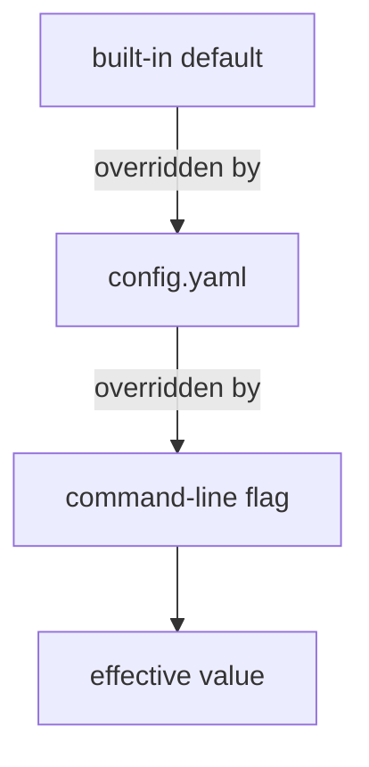
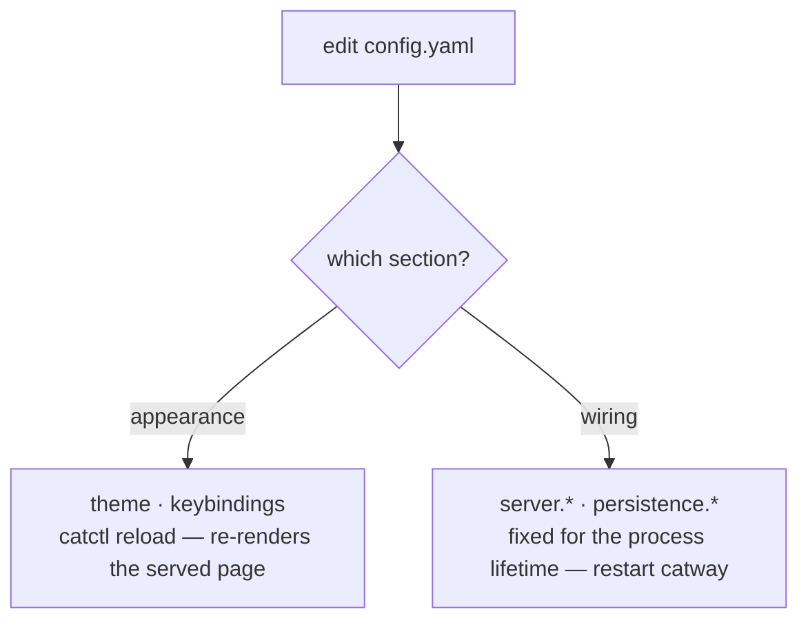

# Configuration

One YAML file: `~/.config/cats/config.yaml`. Every field is optional — omit
anything you do not want to change and the built-in default applies.

Location resolution: `catway --config <path>` > `$CATS_CONFIG` >
`$XDG_CONFIG_HOME/cats/config.yaml` > `~/.config/cats/config.yaml`.

## Precedence



**`flag > config > default`**, and only for the sections that have flags:
`server.*`, `persistence.*` (`--persist`, `--state-dir`) and `push.url`
(`--push-url`). Theme and keybindings come from the file alone.

The implementation matters here: `catway` starts from the config (which starts
from the defaults), then applies only the flags you **explicitly passed**.
`flag.Visit` reports just those, so an unset flag never masks a config value with
its own default.

## Live reload



`catctl reload` maps to `server.reload_config`. Because the page is rendered
server-side with the theme and keybindings injected, re-rendering it is all a
theme change needs — no restart, no rebuild.

The settings modal in the UI does the same thing through `config.get` /
`config.set`, which persist the live-appliable sections.

## `server`

```yaml
server:
  addr: ":8421"
  cathost_socket: "/tmp/cats-cathost.sock"
  control_socket: ""                    # "" => CATS_CONTROL_SOCKET or /tmp/cats-control.sock
  hook_socket: "/tmp/cats-hooks.sock"   # "none" disables
  auth: "password"                      # "password" | "none"
  session_ttl: "24h"                    # a Go duration string
  # allowed_origins: ["https://home.relay.example"]
  tls:
    enabled: false
    cert: ""
    key: ""
    sans: []
```

| Key | Flag | Notes |
|-----|------|-------|
| `addr` | `--addr` | `host:port` or `:port`. Binds all interfaces by default |
| `cathost_socket` | `--socket` | the orchestration seam |
| `control_socket` | `--control-socket` | empty defers to `$CATS_CONTROL_SOCKET`, then the default |
| `hook_socket` | `--hook-socket` | `none` disables the hook API entirely |
| `auth` | `--auth` | `none` skips login. Safe on loopback **only** |
| `session_ttl` | `--session-ttl` | cookie lifetime |
| `allowed_origins` | `--allowed-origins` | extra WebSocket origins beyond same-origin. Full origins or bare `host[:port]`. Empty means strict same-origin |
| `tls.enabled` | `--tls` | HTTPS. Auto self-signed unless cert/key are given |
| `tls.cert` / `tls.key` | `--tls-cert` / `--tls-key` | operator PEMs. Both must be set together; either implies `--tls` |
| `tls.sans` | `--tls-san` | extra names/IPs for the auto-generated cert (a LAN DNS name, a relay hostname). Implies `--tls`; ignored when operator PEMs are given. Adding one re-mints the certificate |

> **Warning — the password is not in this file**
>
> There is no `server.password`. Set `CATS_PASSWORD` or pass `--password`, so
> the secret never lands in a committed config. If neither is given, `catway`
> generates one and logs it.

`server.*` settings are fixed for the process's lifetime. Changing them needs a
restart.

## `persistence`

```yaml
persistence:
  enabled: true
  state_dir: ""            # "" => $XDG_STATE_HOME/cats  (~/.local/state/cats)
  history_lines: 2000      # scrollback lines captured per pane (0 = whole buffer)
  resume_agents: true
```

| Key | Flag | Notes |
|-----|------|-------|
| `enabled` | `--persist` | `--persist=false` disables save and restore |
| `state_dir` | `--state-dir` | |
| `history_lines` | — | per-pane scrollback captured for cold-restore seeds |
| `resume_agents` | — | relaunch supported agent panes into their native conversations on a cold restore |

See [Persistence](../subsystems/persistence.md).

## `push`

The outbound notification bridge. When an agent needs attention, `catway` POSTs
to an [ntfy](https://ntfy.sh)-shaped webhook so a phone with its screen off gets
a real system push — not a toast on a screen nobody is looking at.

```yaml
push:
  enabled: false
  url: "https://ntfy.sh/cats-CHANGE-ME-TO-SOMETHING-UNGUESSABLE"
  kinds: ["attention"]      # "attention" and/or "finished"
  priority:                 # ntfy priority per kind
    attention: "high"
    finished: "low"
  min_interval: "60s"       # debounce per (pane, kind)
  click_url: "cats://pane/" # deep-link base; the pane handle is appended
```

| Key | Flag | Default | Notes |
|-----|------|---------|-------|
| `enabled` | — | `false` | passing `--push-url` turns it on by itself; `--push-url ""` forces it off |
| `url` | `--push-url` | — | required when enabled. Must be `http`/`https` |
| `kinds` | — | `["attention"]` | which [notify kinds](../protocols/browser-protocol.md) to forward |
| `priority` | — | `attention: high`, `finished: low` | per kind. Accepts ntfy's `min`/`low`/`default`/`high`/`urgent` or `1`–`5` |
| `min_interval` | — | `60s` | Go duration. `0` disables the debounce |
| `click_url` | — | — | tap target; the pane's public handle (`w1:p3`) is appended. Empty means no click action |

Because the POST is an ordinary outbound request from the machine `catway` runs
on, it needs no inbound reachability and keeps working when no client is
connected at all. Unknown kinds and non-ntfy priorities are rejected at startup
rather than silently downgrading every notification. The bridge is built once at
startup, so like `server.*` it needs a restart, not `catctl reload`.

Two defaults are deliberate. `kinds` is attention-only — `finished` fires on
every completion of every agent, and a bridge that pushes those is how its owner
learns to ignore it. `priority` tops out at `high`, never `urgent`: ntfy's
urgent bypasses Do Not Disturb on Android, and a blocked agent is not a 3am
emergency.

> **Warning — the topic URL is a capability**
>
> Anyone who learns your ntfy topic path can read your notifications, so treat
> the URL like a secret and pick something unguessable. If your endpoint also
> wants a bearer credential, set `CATS_PUSH_TOKEN` in the environment. Like
> `CATS_PASSWORD` it is deliberately **not** read from this file: the settings
> modal rewrites `config.yaml`, and a token field would mean it silently copied
> your secret into a file you may well commit.

## `worktrees`

```yaml
worktrees:
  directory: "~/.cats/worktrees"
```

Where new checkouts are created. A leading `~` is expanded. Checkouts land at
`<directory>/<repoName>/<branch-slug>`.

## `theme`

The UI is themed by **named themes** plus optional per-colour overrides. `name`
picks a theme; `colors` (CSS custom-property names **without** the leading
`--`) override individual keys of that theme; `font` overrides its font stack.
Everything you don't name comes from the theme.

```yaml
theme:
  name: tokyo-night
  colors:
    accent: "#ff9e64"   # just this one key differs from the theme
  # font: 'JetBrains Mono, monospace'
```

Built-in themes: `cats-green` (the default), `darcula`, `tokyo-night`,
`solarized-dark`, `solarized-light`, `super-warm`, `cool-blue`, `dark-game`,
`dark-city`, `corporate`. `solarized-light` and `corporate` are light themes.
`catctl themes` lists everything available (including custom and
plugin-shipped themes); `catctl theme <name>` switches live.

### Colour keys

A theme (or an override map) can set any of these. Only the first eight are
required in a custom theme — every other key is derived from them when absent
(e.g. `panel` defaults to `bg`, `sel-fill` to a translucent `accent`):

| Colour | Where it shows |
|--------|----------------|
| `bg` / `fg` | page background and default text *(required)* |
| `muted` | secondary text: cwd, hints, section metadata *(required)* |
| `line` | dividers and borders *(required)* |
| `accent` | active highlights, links, the primary button *(required)* |
| `ok` / `warn` / `err` | agent state badges and toasts *(required)* |
| `accent-dim` | the focused pane's hairline outline |
| `accent-fg` | text on accent-coloured surfaces (primary buttons) |
| `panel` / `panel2` | sidebar and dialog surfaces |
| `chrome` / `chrome-focus` | the per-pane header strip, unfocused and focused |
| `chrome-fg` / `chrome-fg-dim` | the focused header's text and buttons |
| `heading` | sidebar section titles |
| `ws-heading` | the per-workspace group headers inside the sidebar's Panes list (defaults to `muted`) |
| `branch` | the git branch in a pane's header strip (defaults to `ws-heading`) |
| `fg-strong` / `fg-soft` / `fg-bright` | the text-emphasis ladder (active labels / hover lift / loudest hover) |
| `agent-1` … `agent-6` | the identity hues the sidebar's Agents list gives tool names, so two agents on screen are told apart by colour (default to `accent`, `done`, `branch`, `heading`, `ok`, `todo`) |
| `todo` | the workspace to-do reminder mark |
| `done` | the unseen-completion marker on a pane whose agent finished while you were elsewhere |
| `err-bg` / `err-fg` | the link-error banner's surface and text |
| `hover` | the translucent wash on hovered icon buttons |
| `sel-fill` / `cm-cursor` | drag-selection wash and copy-mode cursor outline (canvas) |
| `scroll-thumb` / `scroll-thumb-idle` | the scrollback scrollbar's thumb, scrolled and at rest |
| `term-fg` / `term-bg` | terminal canvas defaults when a program doesn't set its own colours |

`font` is a CSS font stack for the terminal grid. The browser measures it and
reports the resulting cell metrics in `init`, so changing the font relayouts
everything.

### Custom themes

The settings modal (⚙ → settings) has a theme picker with live preview; edit
any colours and **save as** a named theme to write
`~/.config/cats/themes/<name>.yaml`. Theme files can also be authored by hand:

```yaml
# ~/.config/cats/themes/my-night.yaml
label: My Night
dark: true          # optional — auto-detected from bg
colors:
  bg: "#101418"
  fg: "#d4dae2"
  muted: "#7f8a99"
  line: "#2a3240"
  accent: "#5fa8f5"
  ok: "#57c98a"
  warn: "#d9a94a"
  err: "#e06767"
font: 'JetBrains Mono, monospace'   # optional
```

A user theme that reuses a built-in's name shadows it. Plugins can ship themes
too — see [plugins](../subsystems/plugins.md). Over the control API the same
library is scriptable via `theme.list` / `theme.save` / `theme.delete`.

### Applying

Theme changes apply **live to every connected client**: saving the settings
modal, `catctl theme <name>`, and `catctl reload` (after a hand edit of the
config or a theme file) all push the resolved palette over the WebSocket.

## `keybindings`

Keys are DOM `KeyboardEvent.key` values — `"ArrowLeft"`, `"h"`, `"Escape"`,
`"0"`, `"$"`, `"Enter"`. Only the actions you list are rebound; the rest keep
their defaults.

```yaml
keybindings:
  copy_mode:
    move-left:  ["ArrowLeft", "h"]
    move-right: ["ArrowRight", "l"]
    move-up:    ["ArrowUp", "k"]
    move-down:  ["ArrowDown", "j"]
    line-start: ["0", "Home"]
    line-end:   ["$", "End"]
    top:        ["g"]
    bottom:     ["G"]
    select:     ["v"]
    rect:       ["r"]
    yank:       ["y", "Enter"]
    exit:       ["Escape", "q"]
```

Multiple keys per action are allowed — the defaults themselves pair a vim key with
an arrow key. Apply with `catctl reload`.

## Environment variables

| Variable | Read by | Purpose |
|----------|---------|---------|
| `CATS_CONFIG` | `catway` | config file path |
| `CATS_PASSWORD` | `catway` | the shared secret |
| `CATS_PUSH_TOKEN` | `catway` | bearer credential for the [push](#push) webhook. Never read from the config file |
| `CATS_CONTROL_SOCKET` | `catway`, `catctl` | control socket path. Injected into every pane |
| `CATS_CATCTL` | `catway` | where to find `catctl` when spawning plugin operations |
| `CATS_PLUGINS_DIR` | plugin host | override the plugins root |
| `CATS_AGENT_DETECTION_MANIFEST_CATALOG_URL` | `cathost` | override the manifest catalog URL |
| `XDG_CONFIG_HOME` | config, plugins | config home |
| `XDG_STATE_HOME` | persistence, manifests | state home |

Injected **into** every pane by `catway`:

| Variable | Meaning |
|----------|---------|
| `CATS_ENV=1` | you are in a cats pane |
| `CATS_PANE_ID` | this pane's public id |
| `CATS_SOCKET_PATH` | the hook socket — this is what arms agent hooks |
| `CATS_CONTROL_SOCKET` | the control socket |
| `CATS_PLUGIN_ID` / `CATS_PLUGIN_DIR` | set additionally for a plugin's pane |

## Paths at a glance

| What | Path |
|------|------|
| config | `~/.config/cats/config.yaml` |
| plugins | `~/.config/cats/plugins/` |
| TLS cert cache | `~/.config/cats/catway-{cert,key}.pem` |
| session + history state | `~/.local/state/cats/` |
| manifest overlay | `~/.local/state/cats/agent-detection/` |
| worktrees | `~/.cats/worktrees/` |
| `catapp` settings | `~/Library/Application Support/cats/app.json` |

The full annotated example lives at
[`config.example.yaml`](https://github.com/rohanthewiz/cats/blob/main/config.example.yaml)
in the repo root.
