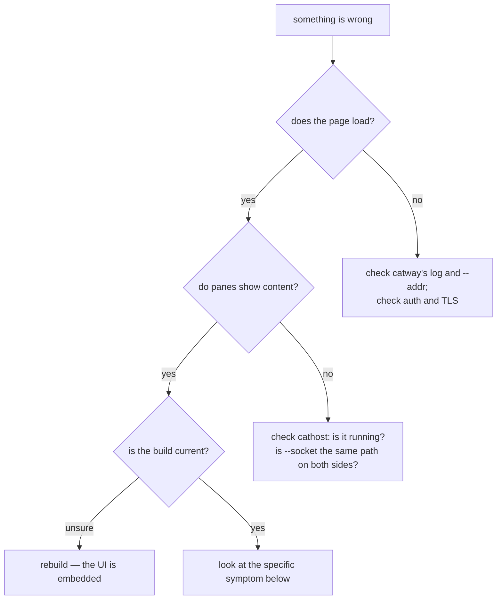
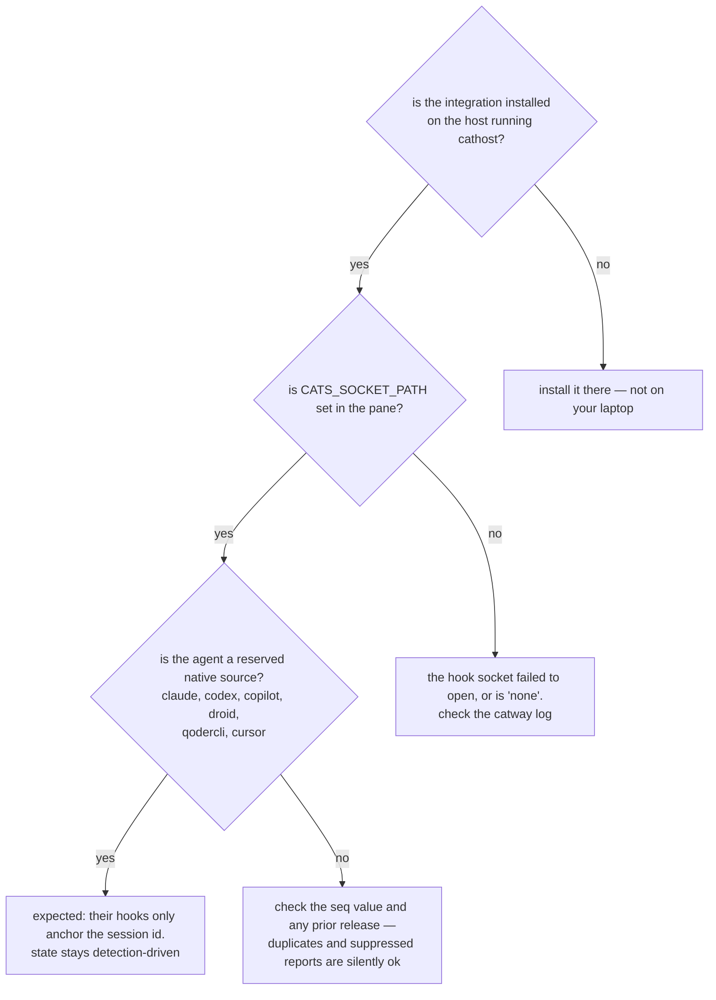

# Troubleshooting

## Where to look first



The sidebar brand shows the commit `catway` was built from — the quickest way to
spot a stale install.

## UI changes do not appear

The page (`cmd/catway/web`: element components, `css/`, `js/`) is compiled into
the binary with `//go:embed`. A browser reload keeps serving the old page.
Rebuild and restart `catway`.

Theme and keybinding edits are the exception: `catctl reload`.

## Panes are empty, or nothing spawns

`catway` serves HTTP as soon as it binds and dials `cathost` **lazily**, so the
page loads fine with no terminal backend at all.

```bash
ls -l /tmp/cats-cathost.sock       # or wherever --socket points
pgrep -l cathost
catctl ping
```

Both sides must name the **same socket path**. In
[Mode 1](../architecture/standalone-mac.md) the launcher moves it under `$TMPDIR`
keyed by its pid, so a hand-launched `catctl` on the `/tmp` default will not find
it — check the `catway` log line, which prints the path it used.

A protocol version mismatch is refused outright rather than degraded. If you
upgraded one binary and not the other, rebuild both.

## `sh: go: command not found` inside the Mac app

A GUI launch hands the process launchd's bare PATH — none of your
`.zprofile`/`.zshrc` additions — and everything downstream inherits it: the
daemons, every pane, every plugin build step.

`catapp` fixes this by re-deriving PATH from your login shell on a GUI launch. If
you see it anyway:

* Confirm the PATH addition is in a file a **login** shell reads
  (`~/.zprofile`, `~/.zshenv`), not only an interactive-only rc path.
* Check the `catapp` log for `could not adopt login shell PATH`.
* If you are running `catway` under **launchd** by hand rather than through the
  app, set `EnvironmentVariables.PATH` in the plist yourself — see
  [Mode 3](../architecture/web-client-mac-server.md#running-it-as-a-background-service-on-macos).

## New panes open at `/`

A GUI or launchd launch has cwd `/`. `internal/startdir` falls back to `$HOME`, so
this should not happen — but a **restored snapshot** taken from an old GUI launch
can carry `/` as the session cwd. The restore path re-validates it, and the fix if
it persists is to set the session cwd from a pane (`cd`, which OSC 7 reports) or
delete `session.json`.

For a launchd job, set `WorkingDirectory` explicitly.

## The Mac app will not open on another Mac

The bundles are unsigned. One-time **right-click → Open** to clear Gatekeeper.

## The app window shows an error page

That is `showError` — a double-clicked `.app` has no console, so a startup failure
is surfaced in a small window. Common causes: the bundled `catway` or `cathost` is
missing (an incomplete `make macapp`), or the catway did not become ready within
10 s. The same text is logged, so `go run ./cmd/catapp` from a terminal shows more.

## Clipboard does not work

| Context | Behaviour |
|---------|-----------|
| `Cats.app` / `Cats Client.app` | native bridge via `pbcopy`/`pbpaste`. If it fails, check the log for `clipboard write bridge unavailable` |
| Browser | `navigator.clipboard` rules apply. Reads need permission; writes need a user activation, which a WebSocket-driven OSC 52 copy does not have |

This asymmetry is why the native bridge exists — WKWebView is *stricter* than a
normal browser here (reads resolve empty), so the app cannot rely on the web API at
all.

## ⌘+ / ⌘- do not change the font in the app

They do — through the native View menu, not the page. Cocoa resolves those as key
equivalents before the WKWebView sees a keydown, so the page's own handler can
never fire in a bundled app. If the menu items do nothing, the loaded page has no
`window.catsAdjustFont` hook — you are on the connect form or a login page.

## WebSocket connects then immediately fails

Three candidates, in order of likelihood:

1. **403 `forbidden: cross-origin websocket`** — the `Origin` header does not match
   the `Host`. Behind a reverse proxy, add the public host to
   `server.allowed_origins`. Note `catway` does not read `X-Forwarded-*`.
2. **401 `unauthorized`** — no valid cookie or bearer token. A browser gets
   redirected to `/login` for normal pages but a **401** on `/ws`, so it fails
   fast.
3. **Cookie invalidated by a restart** — the cookie signing key is per-process, so
   restarting `catway` requires a re-login.

## I have to log in again after every restart

Expected. The signing key is generated per process precisely so no secret is
written to disk. If the restarts are the problem, keep `catway` up — restarting it
does not cost you any panes.

## `catctl` says the socket is missing

```bash
echo "$CATS_CONTROL_SOCKET"
catctl --socket /path/to/cats-control.sock ping
```

Resolution is `--socket > $CATS_CONTROL_SOCKET > /tmp/cats-control.sock`. Inside a
pane the env var is already set. If `catway` logged `control API disabled`, it
could not open the socket at all and cleared the path rather than pointing panes at
a socket nobody serves.

## Hook reports are not arriving



`catctl integration status` reports *not installed* / *current* / *outdated* per
target. Note that a silently-dropped report is answered **`ok`** by design, so a
hook never reveals the difference — read the arbitration rules in
[Hook API](../protocols/hook-api.md#arbitration).

Remember: in [Mode 2](../architecture/mac-client-linux-server.md) integrations
belong on the **Linux** host.

## Agent state is wrong or flickers

* The badge is debounced on purpose — a Working → Idle drop must survive several
  confirmations (capped at 700 ms) before it publishes.
* A stale detection manifest is the usual cause of a *persistently* wrong state.
  Check `~/.local/state/cats/agent-detection/status.json` for per-agent
  `updated` / `current` / `failed` plus the last error.
* Manifest updates are refused for good reasons: a downgrade, a same-version
  content change, a `min_engine_version` above 2, or exceeding the complexity
  limits. All of those land in `status.json`.
* `cathost -manifest-update=false` disables fetching entirely if you want to pin
  the embedded set.

## Agents did not resume after a restart

Resume only happens on a **cold** restore — if `cathost` survived, the PTYs were
adopted and the agents never stopped. Beyond that:

* `persistence.resume_agents` must be `true`.
* A session ref is only recorded for an **official source** whose agent label
  matches, so a custom hook source has no resume path.
* Refs are validated: id ≤ 512 chars, no control characters; a `path` form is
  `pi`-only, absolute, ≤ 4096 chars. A corrupted state file yields no resume rather
  than a malformed exec.
* Duplicates of an already-planned conversation get no plan — first pane by
  ascending id wins.
* A `pane.release_agent` clears the ref deliberately: a released conversation must
  not resume.

## Scrollback is missing after a cold restore

The capture sweep runs every 60 s, so an unclean `cathost` death loses at most a
minute. A clean shutdown runs a final sweep with a 1 s budget and writes what it
has. `persistence.history_lines` (default 2000) caps how much is kept per pane;
`0` means the whole buffer.

Scrollback is also **deliberately suppressed** for panes that resumed an agent —
the resumed agent owns its transcript, and a replayed stale one would look live.

## Panes vanished after `cathost` restarted

They were re-spawned, not adopted, which is correct — the PTYs died with the
daemon. Run `cathost -persistent` (and `-idle-timeout 0` for a service) so this
only happens on a real crash or reboot.

Note the reverse case is fine: restarting **`catway`** against a live persistent
`cathost` keeps every shell.

## `cathost` exits on its own

In persistent mode it exits when no client has been attached for
`-idle-timeout` (default 10 minutes). Pass `-idle-timeout 0` to disable. In
managed mode with `-exit-on-disconnect`, it exits when the first client leaves —
`-persistent` overrides that flag.

## Two cats instances interfere

The default sockets (`/tmp/cats-*.sock`) are shared and world-visible.
[Mode 1](../architecture/standalone-mac.md) solves it by moving all three under
`$TMPDIR` keyed by pid. Doing it by hand:

```bash
cathost -socket "$TMPDIR/cats-th-a.sock" -persistent &
catway --socket "$TMPDIR/cats-th-a.sock" \
       --control-socket "$TMPDIR/cats-ctl-a.sock" \
       --hook-socket "$TMPDIR/cats-hooks-a.sock" --addr :8422
```

Isolate all three, not just the seam — otherwise hook reporting from one instance
lands in the other.

## A build fails to link on macOS

If you see libSystem link errors from Zig, that is the macOS 26 SDK `.tbd` slice
problem. `scripts/build-libghostty-vt.sh` patches a copy of the SDK to work around
it — make sure you are going through `make vt` rather than invoking Zig yourself.
See [Build and packaging](build-and-packaging.md#the-macos-26-sdk-workaround).

## A tagged build fails with "package libghostty-vt not found"

`PKG_CONFIG_PATH` is not set. Use the Makefile targets, which wire it:

```bash
PKG_CONFIG_PATH=$PWD/third_party/libghostty-vt/zig-out/share/pkgconfig \
  go build -tags ghostty ./cmd/catway
```

Run `make vt` first if `zig-out` does not exist.

## Verifying the browser path without a browser

```bash
catctl probe --url ws://localhost:8421/ws --token "$CATS_PASSWORD" \
  --script 'wait:500; split:1:h; rect:2:w:gt:10; type:echo hi\n; capturehas:hi'
```

Exit `0` means the script passed, `1` an op failed, `2` bad flags. This exercises
the real upgrade, auth, `init`, frame and command path.
