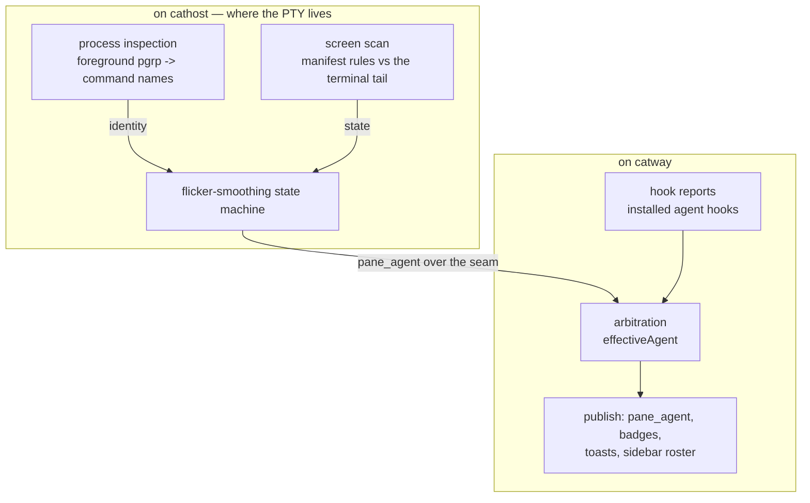
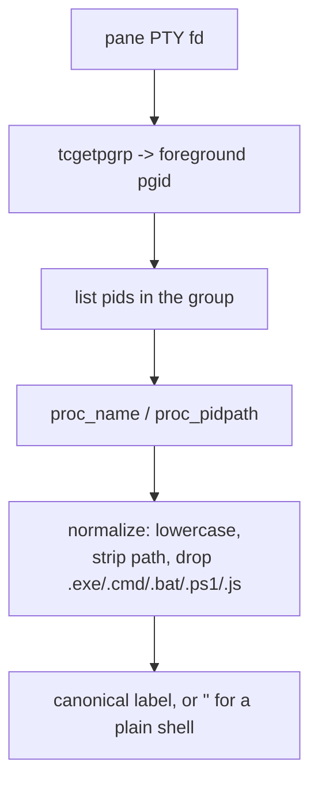
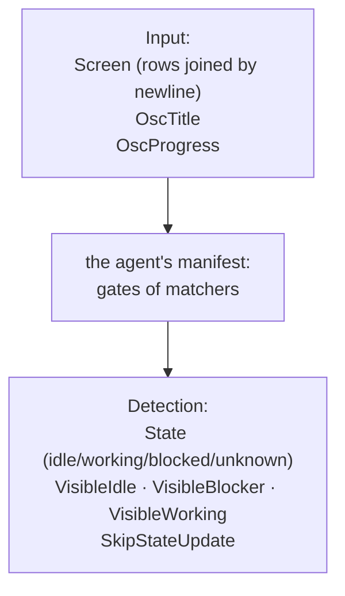
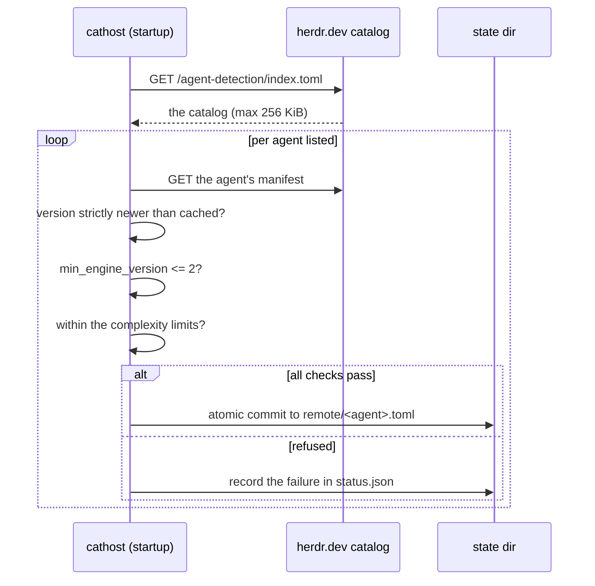
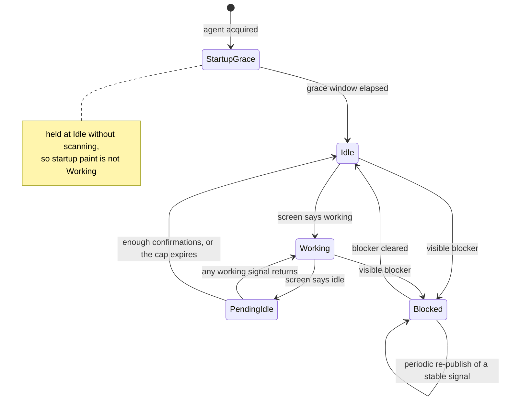

# Agent detection

cats answers two questions about every pane, continuously: **which coding agent
is running here**, and **what is it doing right now**. Three independent sources
feed the answer, and they are arbitrated.



Detection runs on `cathost` because that is where the PTY and the child process
are. `catway` arbitrates because that is where hook reports arrive and where the
UI lives.

## Stage A — identity from the process

`internal/detect` finds the pane's **foreground process group** via
`tcgetpgrp(pty_fd)`, lists that group's pids, reads each one's command name and
executable path, and maps them onto a canonical label.



The label vocabulary — `claude`, `codex`, `gemini`, `cursor`, `agy`, `cline`,
`opencode`, `copilot`, `kimi`, `kiro`, `droid`, `amp`, `pi`, and more — with its
aliases (`claude-code` → `claude`, `cursor-agent` → `cursor`, `antigravity` →
`agy`) mirrors the retired Rust table exactly, so labels round-trip between the
two implementations.

Per-platform implementations:

| File | Platform | Mechanism |
|------|----------|-----------|
| `procscan_darwin.go` | macOS | cgo: `libproc` — `proc_listpids`, `proc_name`, `proc_pidpath`, `PROC_PIDVNODEPATHINFO` |
| `procscan_linux.go` | Linux | `/proc/<pid>/` |
| `procscan_stub.go` | anything else | reports nothing |

The same inspection answers **where a pane's shell currently is**
(`ProcessCwd`) — the question OSC 7 would answer if every shell emitted it. Once a
pane's shell *has* emitted OSC 7, the cwd probe for that pane is retired.

## Stage B — state from the screen

Knowing that `claude` is running does not tell you whether it is thinking, idle,
or waiting for you to approve a file write. That comes from matching **manifest
rules** against the terminal's visible tail.

A manifest is a per-agent rule set:



The embedded set covers 17 agents (`internal/detect/manifests/*.json`):
`amp`, `antigravity`, `claude`, `cline`, `codex`, `cursor`, `droid`, `gemini`,
`github-copilot`, `grok`, `hermes`, `kilo`, `kimi`, `kiro`, `opencode`, `pi`,
`qodercli`.

The `VisibleBlocker` flag is separate from `State` on purpose — it is what lets a
*detected* permission prompt override a hook that claims the agent is merrily
working. See [arbitration](../protocols/hook-api.md#arbitration).

### The remote catalog

Agents change their UI, so rules go stale. `internal/detect/update.go` fetches a
TOML catalog listing per-agent manifest files, and layers accepted manifests over
the embedded set.



The safety rules matter, because a fetched manifest is **untrusted input**:

* **Downgrades are rejected**, and so is a same-version manifest whose content
  changed — both read as tampering.
* **`min_engine_version` must not exceed `EngineVersion` (2)** — a manifest may
  otherwise use constructs this engine cannot evaluate.
* **Bounded complexity**: at most 128 rules per manifest, gate depth 8, 512 total
  gates, 32 matchers per gate, 1024 total matchers, 512 characters per matcher.
* **Bounded fetch**: 256 KiB.
* Commits are **atomic** (temp file + rename), and the outcome per agent lands in
  `status.json` with `updated` / `current` / `failed` plus the last error.

The overlay lives at `<state-dir>/agent-detection/remote/<agent>.toml`, in the
same layout and format the Rust implementation used, so a machine running both
shares one cache.

| Knob | Value |
|------|-------|
| Catalog URL | `https://herdr.dev/agent-detection/index.toml` |
| Override | `CATS_AGENT_DETECTION_MANIFEST_CATALOG_URL` |
| Disable | `cathost -manifest-update=false` |

!!! note "Why `herdr.dev`"
    The project was renamed from herdr to cats, but the manifest host was
    deliberately left in place — it still serves the live catalog. A `cats.dev`
    equivalent is a known to-do; until it exists, pointing at `herdr.dev` is what
    keeps manifest fetches working.

## Stage C — flicker smoothing

A naive "emit on every change" loop is unusable: agents repaint spinners,
transient blank frames read as idle, and startup splash screens look like work.
`internal/orchestration/detectstate.go` ports the debouncing state machine.



| Behaviour | Tuning |
|-----------|--------|
| base probe cadence | 300 ms |
| recheck cadence while confirming Working → Idle | 100 ms |
| cap on holding a pending Working → Idle | 700 ms |
| content-change skip | while Idle with no new PTY bytes, the screen scan is skipped entirely |
| stable-signal refresh | a persistent visible blocker is periodically re-published, so a consumer that missed the edge still learns of it |

These helpers are **pure** — no `ghostty` build tag — so they unit-test without
the emulator toolchain.

## Installed hooks

Detection works with zero setup. Hooks make it better: they report transitions the
screen cannot show unambiguously, and they carry the **resumable session id** that
makes agent resume possible.

```bash
catctl integration install claude
catctl integration status
catctl integration uninstall claude
```

Supported targets, in canonical order: `pi`, `omp`, `claude`, `codex`, `copilot`,
`droid`, `kimi`, `opencode`, `kilo`, `hermes`, `qodercli`, `cursor`.

### How the installers avoid breaking your config

Each install drops an embedded asset into the agent's own config tree and
registers it in that agent's **native settings format**:

| Format | Editing strategy |
|--------|------------------|
| JSON | rewritten order-preservingly |
| TOML | edited line-wise |
| YAML | edited line-wise |

The point of all three being surgical is that unrelated user configuration
survives **byte for byte**. Status detection reads the
`CATS_INTEGRATION_VERSION` marker stamped into every asset, so
`catctl integration status` can report *not installed* / *current* / *outdated*,
and an install without a readable marker is recognised as a legacy install rather
than corrupt.

The port is unix-only — on Windows every target reports not-supported.

!!! warning "Install on the host that runs cathost"
    A hook reaches cats via `CATS_SOCKET_PATH`, which is injected into the pane's
    environment by the `catway` that owns it. In
    [Mode 2](../architecture/mac-client-linux-server.md) that means installing
    integrations on the **Linux** host. Installing them on your Mac does nothing
    for a Linux-hosted session.

## What surfaces in the UI

| Signal | Where it shows |
|--------|----------------|
| agent label | the pane header badge |
| state | badge colour, plus the sidebar workspace summary |
| `blocked` transition | a toast, and a permission-gated system notification (`notify` kind `attention`) |
| background `idle` after `working` | `notify` kind `finished`, and the pane is marked **unseen** — the "done" marker |
| current model | re-read periodically per agent pane, shown in the pane hover card |

A notification is suppressed entirely when the pane it concerns is already
visible — the front end makes that call, since only it knows what is on screen.
