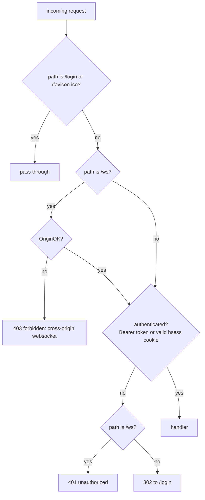
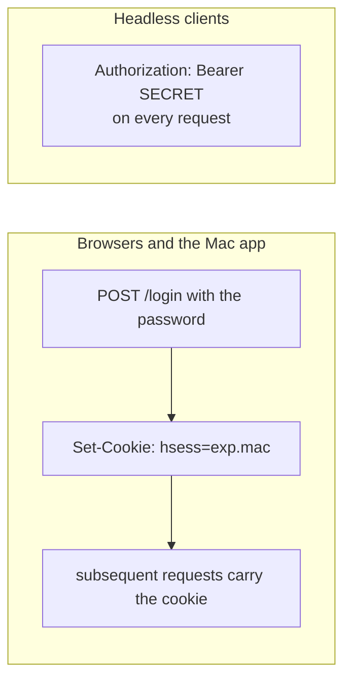
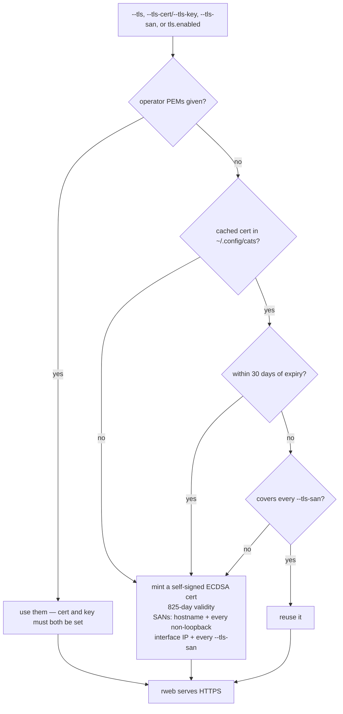

# Auth and TLS

`internal/gwauth` and `internal/gwtls`. The model is deliberately minimal because
cats is **single-user**: one secret, no user table, no accounts.

## The request path



A browser navigation without credentials is **redirected**; an API or WebSocket
call gets a **401** so it fails fast instead of receiving an HTML login page it
cannot use.

With `--auth none` the guard is `nil` and **no middleware is installed at all**.

## The shared secret

Resolution order:

1. `--password <secret>`
2. `CATS_PASSWORD` environment variable
3. a freshly **generated** secret, logged for you to read

The secret is deliberately **not** readable from `config.yaml`, so it can never
land in a committed file. Comparison is constant-time (`subtle.ConstantTimeCompare`).

The generated fallback is fine for a quick local run and useless for a service —
if you are running `catway` under systemd or launchd, set the secret explicitly.

## Two credential forms



### The `hsess` cookie

```
hsess = <expiryUnix> "." <hex(HMAC-SHA256(signKey, expiryUnix))>
```

* It carries **no identity** — only proof the server minted it and when it lapses.
  That is all a single-user system needs.
* The signing key is 32 random bytes generated **per process**. So restarting
  `catway` invalidates every outstanding session, and **no secret is ever written
  to disk**.
* Validation checks well-formedness, then the MAC in constant time, then the
  expiry. A bad signature and a correctly-signed-but-expired cookie are both
  rejected.

Cookie attributes: `Path=/`, `MaxAge` from `session_ttl` (default 24 h),
`HttpOnly`, `SameSite=Strict`, and `Secure` **when the server is serving TLS**.

### Bearer tokens

`Authorization: Bearer <secret>` — the secret directly, no cookie exchange. This
is how `catctl probe` and any script drive `/ws` headlessly.

## WebSocket origin checking

`OriginOK(origin, host, allowed)`:

| Case | Result |
|------|--------|
| `Origin` header absent | **allowed** — a non-browser client. Auth is still enforced separately |
| `Origin` unparseable, or has no host | denied |
| `Origin.Host == Host` | allowed — the same-origin case |
| `Origin.Host` matches an `allowed_origins` entry | allowed |
| otherwise | denied |

Allowlist entries may be full origins (`https://relay.example`) or bare
authorities (`relay.example:8443`). A malformed entry yields an empty authority so
it can never accidentally match.

```yaml
server:
  allowed_origins: ["https://home.relay.example"]
```

Flag: `--allowed-origins a,b,c`.

!!! warning "No `X-Forwarded-*` trust"
    `catway` does not interpret forwarded headers. Behind a reverse proxy it
    compares the `Origin` header against the `Host` header it actually received.
    Subdomain-style routing keeps those equal; path-prefix routing does not, which
    is why the allowlist exists.

## Auth is checked once

The guard runs **pre-upgrade**, as HTTP middleware. Once a WebSocket is
established there is no mid-session re-check, so a long-lived connection outlives
its cookie's TTL. Closing the tab and reconnecting is what forces a re-auth.

This is a deliberate simplification, and the honest limitation of the model: TTL
bounds how long a *stolen cookie* is useful for starting new sessions, not how
long an *already-open* session lasts.

## TLS



Files: `catway-cert.pem` and `catway-key.pem` in `~/.config/cats`, the key written
`0600` in a `0700` directory.

The certificate must be written to disk because rweb loads certificates from
files (`tls.LoadX509KeyPair`) — that is the entire reason `internal/gwtls`
exists rather than generating an in-memory `tls.Certificate`.

The SANs deliberately include **every non-loopback interface IP**, so a LAN or VPN
address validates against the auto-generated cert. Browsers still warn on first
connect: there is no CA for a self-hosted tool. Supply your own PEMs to avoid the
warning entirely.

`--tls-san` adds names the host cannot work out for itself — a LAN DNS name, or
the hostname a relay will front:

```
catway --tls-san cats.lan,10.0.0.7        # or server.tls.sans in the config
```

Each entry is an IP literal or a bare DNS name, validated at startup so a typo
fails loudly instead of surfacing months later as an unexplained trust warning.
They are ignored (with a log line) when operator PEMs are supplied — those are
whatever they are.

**Adding a SAN re-mints the certificate.** It has to: a cached cert is good for
825 days, so a name that did not invalidate the cache would do nothing until the
next expiry. The check runs only against the *requested* names, never the
auto-discovered ones — those follow the machine, and re-minting whenever a laptop
changed Wi-Fi networks would churn the fingerprint a client pinned. Removing a
SAN or reordering the list changes nothing, and neither does case or a trailing
dot.

`--tls-cert`, `--tls-key`, or `--tls-san` alone implies `--tls`; cert and key must
be set together.

## The local sockets

Neither local socket has authentication of its own, by design.

| Socket | Protection |
|--------|-----------|
| control socket | unix, `0600` — filesystem permissions **are** the auth |
| hook socket | unix, `0600` — the hooks run as the same user, so the **path is the capability** |

Neither is ever exposed over the network. Anything that can open the control
socket can run any command, so treat it exactly as you treat write access to your
home directory.

In [Mode 1](../architecture/standalone-mac.md) both move under `$TMPDIR` — a
per-user `0700` directory on macOS — keyed by the launcher's pid, which is
strictly better than the world-visible `/tmp` defaults.

## Posture by run mode

| | Mode 1 Standalone Mac | Mode 2 Mac client / Linux server | Mode 3 Web client / Mac server |
|---|---|---|---|
| Auth | `none` | `password`, mandatory | `password`, default |
| Bind | `127.0.0.1:<ephemeral>` | `:8421` | `:8421`, or narrow it |
| TLS | none | required | recommended on a LAN |
| Cookie `Secure` | n/a | yes | yes under TLS |
| Sockets | `$TMPDIR`, pid-keyed | `/tmp` or `/run/user/$UID` | `/tmp` defaults |
| Exposure | none | the network | the LAN |

`--auth none` is safe on `127.0.0.1` and **only** there. Never combine it with a
routable bind address.

## What is not in the model

Named to be explicit about the boundaries: no multi-user accounts, no per-user
permissions, no OAuth or SSO, no rate limiting on `/login`, no audit log, no
mid-session revocation. If you need any of those, put cats behind something that
provides them and use `allowed_origins` to let the WebSocket through.
