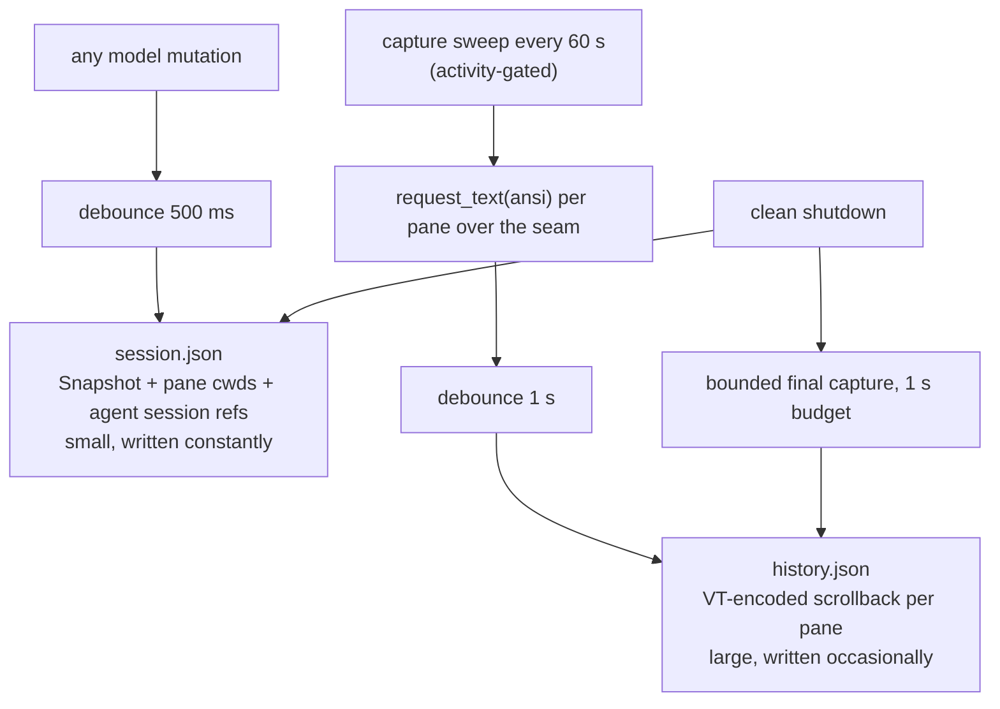
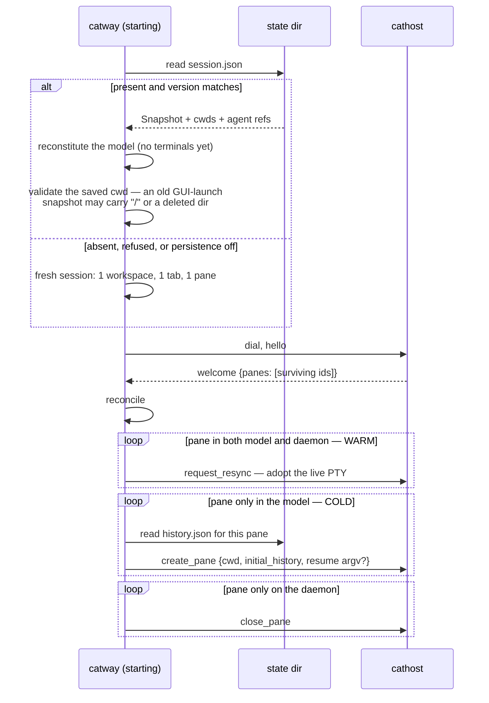
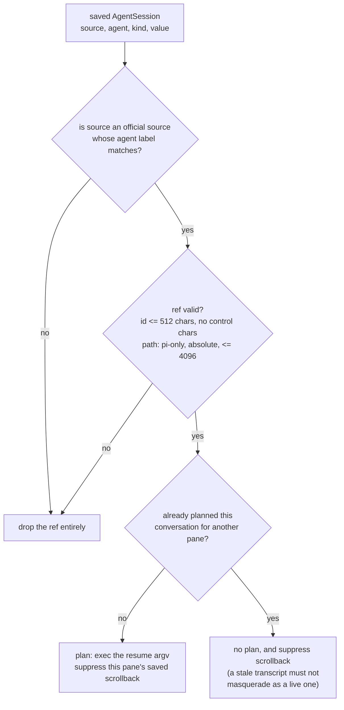

# Persistence and restore

cats survives three different kinds of loss, and the design falls out of which
one you are recovering from.

| What died | What is lost | What restores it |
|-----------|--------------|------------------|
| the front end | nothing | a fresh WebSocket gets a full resync from cached runtime state |
| `catway` | nothing, if `cathost` is persistent | `session.json` restores the tree; reconciliation re-adopts live PTYs |
| `cathost` too (crash, reboot, first run) | the live shells | `session.json` restores the tree; `history.json` seeds each fresh pane with its scrollback |

## Two files, two rhythms

`internal/persist` writes both under `$XDG_STATE_HOME/cats` (default
`~/.local/state/cats`).



Both are versioned JSON, written **atomically** (temp file + rename) with
owner-only permissions — `history.json` contains raw terminal scrollback, which
is as sensitive as anything you have typed.

A schema `Version` mismatch **refuses** the file and starts fresh rather than
guessing at a shape no longer written.

### Why the debounces exist

A mouse-drag resize emits one model mutation *per movement*. Without the 500 ms
debounce that is hundreds of `session.json` writes for one gesture. Likewise a
capture sweep gets one reply per pane, asynchronously, so `histDebounce` coalesces
a whole sweep into a single write.

`histCaptureInterval` (60 s) bounds how stale the cold-restore seeds can be when
nothing shuts down cleanly: a `cathost` crash loses at most a minute of history.
The clean-shutdown path runs a final sweep with a hard 1 s budget, then writes
what it has and exits regardless — a hung pane must not block the quit.

### What rides alongside the snapshot

`session.json` is not only the model. Two maps travel with it because they are
*runtime chrome the domain model deliberately does not own*:

* **`pane_cwds`** — each pane's last daemon-reported working directory, so a cold
  restore re-spawns shells where they were.
* **`pane_agent_sessions`** — the hook-reported resumable session identity per
  pane: source, agent label, kind (`id`, or `path` for `pi`), and value. No
  timestamps and no TTL: staleness is the agent's own problem at resume time.

Both are additive fields — an older file simply has neither map, which is why
adding them needed no version bump.

## Restore



The **warm** path needs no history at all: the PTYs survived, so the model
snapshot alone restores the tree around them. History exists purely for the cold
case.

The saved cwd is re-validated through `internal/startdir` because it may no longer
be usable — an old snapshot taken from a GUI launch carries `/`, and directories
get deleted.

## Resuming agents

With `persistence.resume_agents: true` (the default), a cold-restored pane whose
hook-reported session ref survived is spawned with the agent's **native resume
command** instead of a shell.



The resume table:

| Agent | Command |
|-------|---------|
| `claude` | `claude --resume <id>` |
| `codex` | `codex resume <id>` |
| `copilot` | `copilot --resume=<id>` |
| `droid` | `droid --resume <id>` |
| `kimi` | `kimi --session <id>` |
| `pi` | `pi --session <id or path>` |
| `hermes` | `hermes --resume <id>` |
| `opencode` | `opencode --session <id>` |
| `qodercli` | `qodercli --resume <id>` |
| `kilo` | `kilo --session <id>` |
| `cursor` | `cursor-agent --resume <id>` — note the binary name differs from the label |

Three details worth knowing:

* **The argv is exec'd directly** via `create_pane.command`/`args`, not typed into
  a shell. The session id therefore stays *argv data* and never becomes shell
  text — no quoting to get wrong. The visible consequence: when the resumed agent
  exits, the pane exits with it rather than dropping to a shell.
* **Dedupe is per conversation**, keyed on NUL-joined
  `source + agent + kind + value` so no field's content can collide. The first
  pane (by ascending pane id — deterministic) wins a shared conversation.
* **Scrollback is suppressed for both** the resuming pane and its
  duplicate-suppressed siblings: the resumed agent owns its transcript, and
  replaying a stale one would look like live output.

A corrupted state file yields **no resume**, never a malformed exec. Validation on
restore is the same as on ingest.

With `resume_agents: false`, valid refs are still kept (the metadata is preserved)
but no resume plans are built — panes come back as plain shells with their
scrollback replayed.

## Configuration

```yaml
persistence:
  enabled: true
  state_dir: ""            # "" => $XDG_STATE_HOME/cats
  history_lines: 2000      # scrollback lines captured per pane (0 = whole buffer)
  resume_agents: true
```

Flags: `--persist=false`, `--state-dir DIR`.

## The state directory

```
~/.local/state/cats/
  session.json                       the model snapshot, cwds, agent refs
  history.json                       VT-encoded scrollback per pane
  agent-detection/
    remote/<agent>.toml              the fetched manifest overlay
    status.json                      per-agent update outcomes
```

`~/.config/cats/` holds the other half — `config.yaml`, `plugins/`, and the
auto-generated TLS cert. The split is intentional: *state* is machine-local
runtime data cats remembers; *config* is what you chose.
