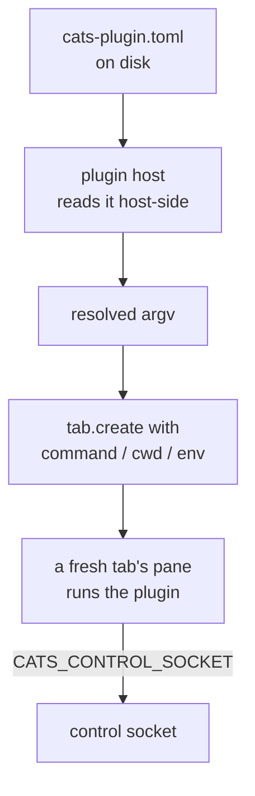
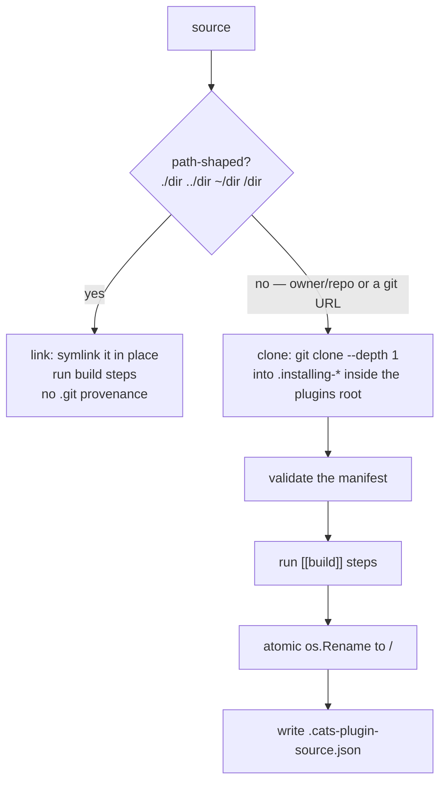
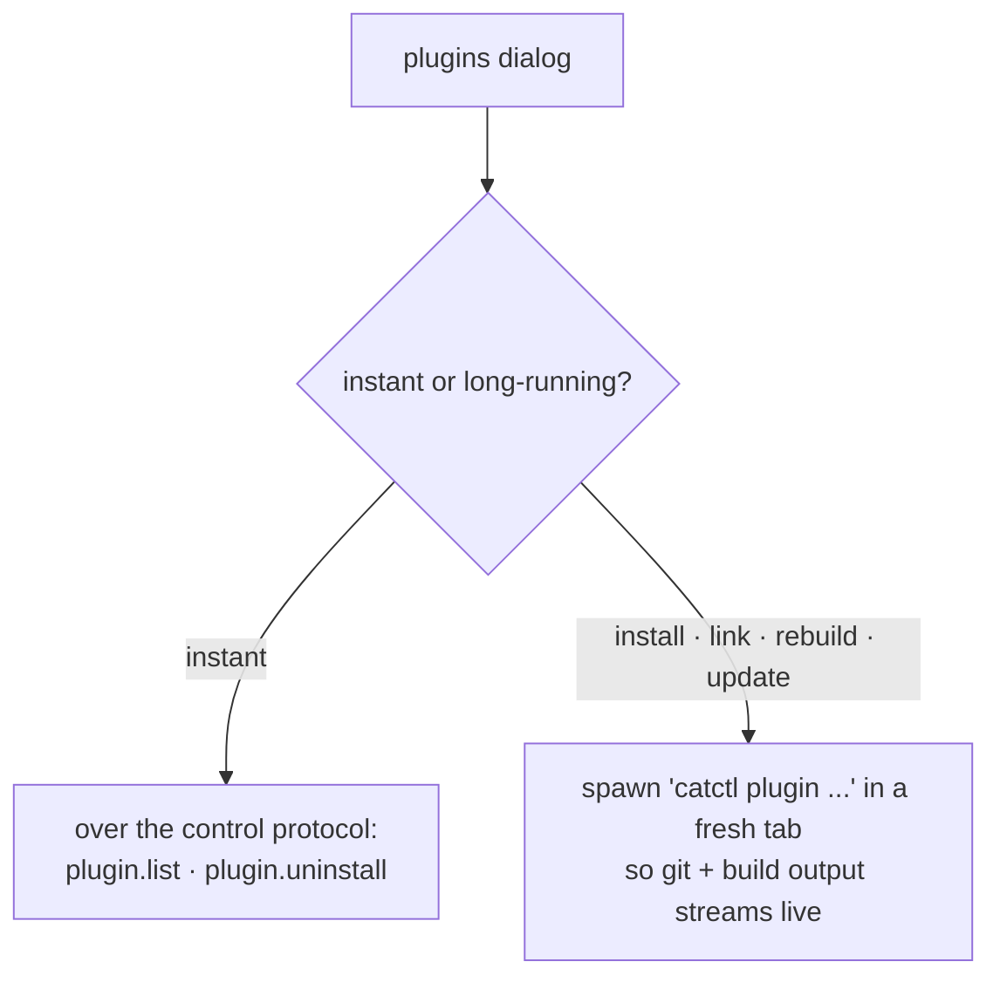

# Plugins

`internal/plugin` manages `~/.config/cats/plugins/`. The model is deliberately
thin: a plugin is a **directory** with a `cats-plugin.toml` manifest plus
whatever its build produces. The host's whole job is directory management.

## The key design decision

The **server never parses a manifest**.



An action is just an argv. `catctl plugin run` resolves it locally and launches it
in a fresh tab via `tab.create`'s spawn params. The plugin process then talks back
over the control socket like any other automation client. Three things fall out:

* The server stays **plugin-agnostic** — no manifest schema on the wire, no
  server-side action runner, no plugin-pane lifecycle.
* A plugin binary is **equally runnable by hand**, which is how
  [`cats-todo`](https://github.com/rohanthewiz/cats-todo) already works.
* The blast radius of a bad manifest is one tab, not the server.

## Layout

```
~/.config/cats/plugins/
  <id>/                            a real directory (install) or a symlink (link)
    cats-plugin.toml
    bin/<tool>                     whatever the build produced
    .cats-plugin-source.json       install provenance (absent for links)
```

Root resolution: `$CATS_PLUGINS_DIR` > `$XDG_CONFIG_HOME/cats/plugins` >
`~/.config/cats/plugins`. That is the same config-home chain as the config file,
because a plugin set is **configuration** (what you chose to have), not state
(what the server remembers).

`$CATS_PLUGINS_DIR` exists primarily so tests and scratch setups never touch the
real `~/.config` tree.

## The manifest

```toml
id = "rohanthewiz.cats-todo"
name = "cats-todo"
version = "0.1.0"
description = "Prompt backlog manager"
platforms = ["macos", "linux"]      # empty = everywhere; GOOS values also accepted

[[build]]
command = ["go", "build", "-o", "./bin/cats-todo", "."]

[[actions]]
id = "open"
title = "Open backlog"
command = ["./bin/cats-todo"]
```

| Field | Notes |
|-------|-------|
| `id` | the directory name under the plugins root |
| `platforms` | limits where the plugin installs |
| `min_cats_version` | carried for forward compatibility but **not enforced** — cats has no single server version constant yet, and enforcing against the wrong number would be worse than not enforcing |
| `[[build]]` | commands run in the plugin root at install/link time |
| `[[actions]]` | launchable entrypoints; command paths are relative to the plugin root and resolved at launch |

The shape matches herdr's `herdr-plugin.toml`, so a herdr plugin ports by renaming
the file and swapping the id and command names. Herdr's `[[panes]]` table is
deliberately absent: cats actions run their TUI directly in the tab that launches
them, so a separate server-run pane entrypoint has no meaning.

## Install, link, update



Two details in the clone path are load-bearing:

* The temp dir is **dot-prefixed and inside the plugins root** — same filesystem,
  so the final `os.Rename` is atomic, and a crash mid-install leaves an invisible
  directory rather than a half-usable plugin.
* `--depth 1` keeps installs fast, and `--branch` covers both branches and tags,
  which is what a plugin release ref is. A bare commit SHA would need a full clone
  plus checkout and is not supported until someone needs it.
* The `.git` directory is **kept** — it is the provenance `plugin update` pulls on.

The leading `./` genuinely matters: a **path-shaped** source links in place, while
a bare two-segment `rohanthewiz/cats-todo` is the GitHub `owner/repo` shorthand
and **clones**.

A relative path resolves against the **focused pane's cwd**. So with a pane
sitting next to a `cats-todo` checkout, `./cats-todo` links it in place, and
`../cats-todo` works from inside a sibling project.

## CLI

```bash
catctl plugin install rohanthewiz/cats-todo     # clone from GitHub + build
catctl plugin install <git-url> --ref v0.1.0    # pin a branch or tag
catctl plugin link ./cats-todo                  # dev mode: symlink a checkout
catctl plugin update rohanthewiz.some-plugin    # fetch recorded source + rebuild
catctl plugin list                              # ids, versions, actions
catctl plugin run rohanthewiz.cats-todo         # launch in a new tab
catctl plugin uninstall rohanthewiz.cats-todo
```

Install, link, list, update and uninstall are **offline** — they need no running
`catway`. Only `run` dials the control socket, and only to issue `tab.create`.

## The UI surface

Gear menu → **plugins**, also reachable from the ⌘K palette. Each row offers run /
update / uninstall, plus an **add…** prompt.



Only the *instant* verbs are commands. Install and update shell out to git and a
build, whose output you want to **watch** — hiding minutes of subprocess work
behind a single `cmd_result` would be worse than a pane you can read. The server
resolves the `catctl` path itself; override it with `CATS_CATCTL` if it lives
somewhere unusual.

Linked rows show their checkout path and swap **update** (there is no remote to
pull from) for **rebuild** — a re-link that re-runs the build steps to pick up
local edits. **unlink** removes only the link, never the checkout.

## Environment a plugin gets

| Variable | Meaning |
|----------|---------|
| `CATS_PLUGIN_ID` | which plugin is running |
| `CATS_PLUGIN_DIR` | where its files live, so a binary finds its own assets without argv[0] games |
| `CATS_PANE_ID` | the pane it is running in (every pane gets this) |
| `CATS_CONTROL_SOCKET` | how to drive cats (every pane gets this) |
| `CATS_ENV` | set to `1` in any cats pane |
| `CATS_SOCKET_PATH` | the hook socket (every pane gets this) |

The invoking directory becomes the pane's cwd.

## cats-todo — the reference plugin

[`cats-todo`](https://github.com/rohanthewiz/cats-todo) is a TUI prompt-backlog
manager built on the control socket: save prompts of future work per-project or
globally, then *drop* one into a Claude Code session — either an existing agent
pane or a fresh tab that launches the agent first.

```bash
catctl plugin install rohanthewiz/cats-todo
catctl plugin run rohanthewiz.cats-todo
```

Its [`cats-plugin.toml`](https://github.com/rohanthewiz/cats-todo/blob/main/cats-plugin.toml)
is the reference manifest. It lives in its own repo precisely to prove the plugin
path works from outside the tree — it is deliberately **not** built by this repo's
Makefile.

## Security posture

A plugin is code you chose to run, installed from a git remote you named, built by
commands its own manifest specifies, executed as you in a pane on your machine.
There is no sandbox and no permission model. Install plugins the way you install
anything else you build from source.

Note the interaction with [Mode 2](../architecture/mac-client-linux-server.md):
plugins install on the **server's** filesystem, and a relative `./dir` source
resolves against a pane's cwd on that host — not your Mac.
