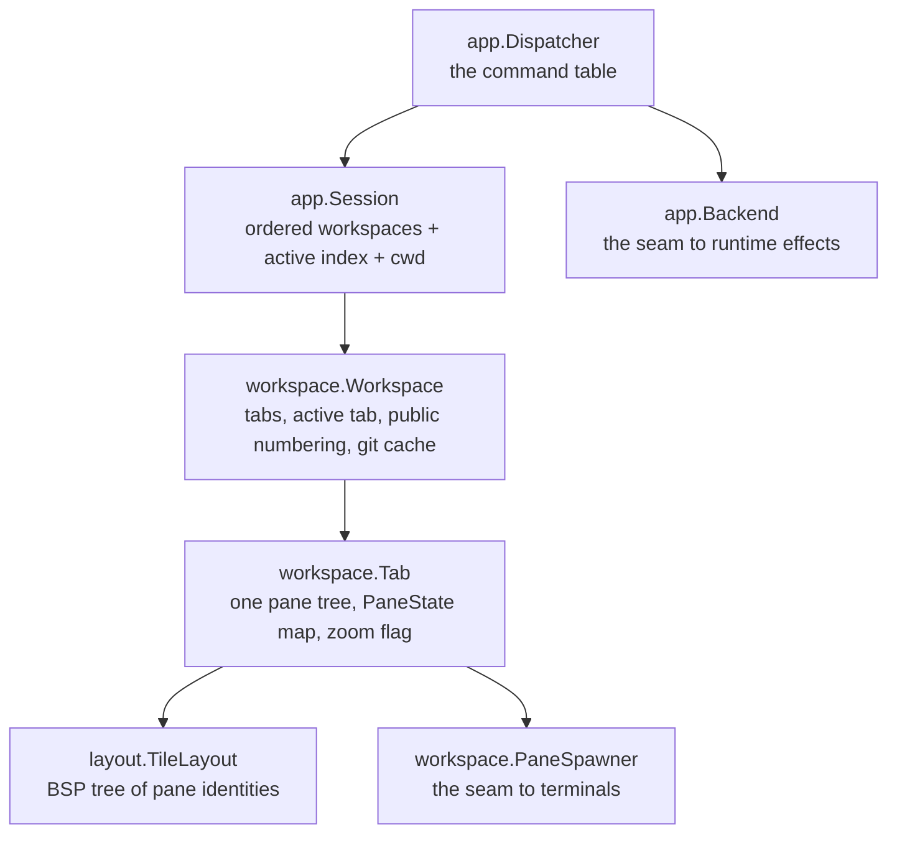
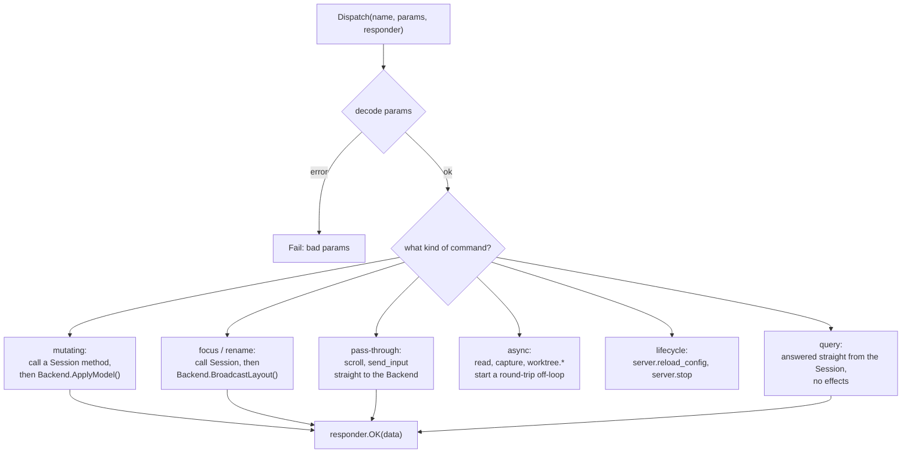
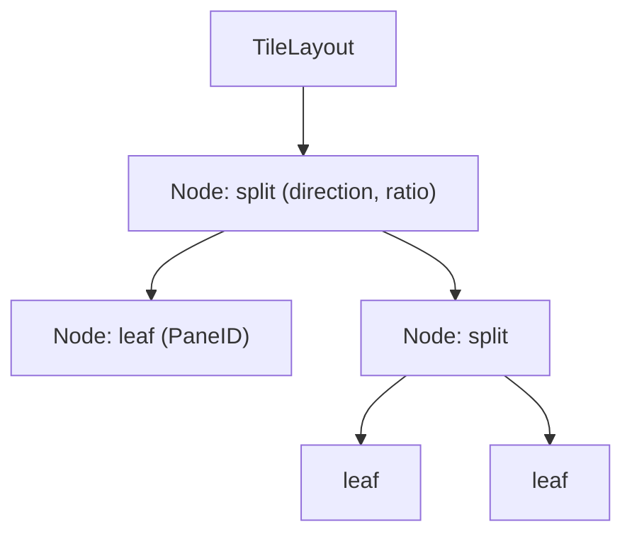
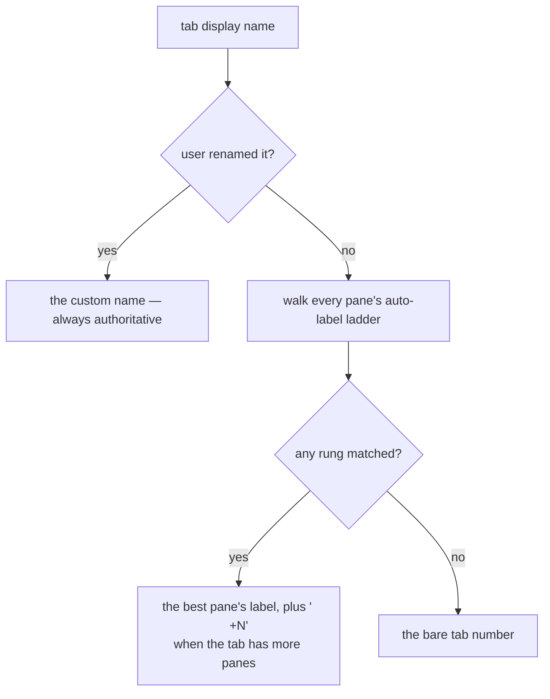
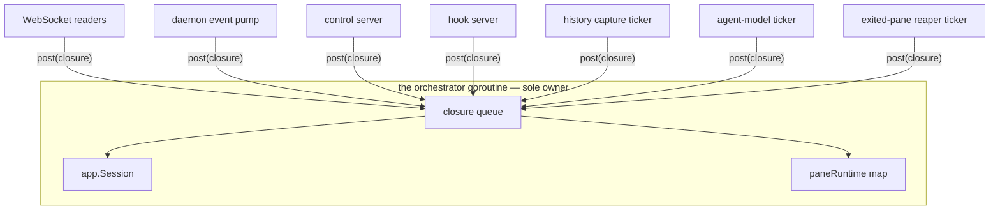

# Session model

`internal/app`, `internal/workspace`, `internal/layout` — the domain layer. It
sits **above** the daemon seam: it owns *what the session looks like* and *how
commands change it*, never *how PTYs are driven*.

That discipline is what makes it testable. No daemon, no I/O, no goroutines — it
unit-tests like the pure data structures it composes.

## Layering

Two interfaces keep the domain pure:

* **`workspace.PaneSpawner`** — "give me a terminal id for a new pane". The model
  never imports a backend.
* **`app.Backend`** — the effects a command needs from the runtime:
  `ApplyModel()`, `BroadcastLayout()`, `ScrollPane()`, `SendInput()`,
  `StageSpawn()`, `PaneMeta()`, and the async worktree/text round-trips.

## The dispatcher

`Dispatcher.Dispatch(name, decoder, responder)` is one switch over ~40 commands.
Its shape is uniform enough to describe once:

`ApplyModel()` is the reconciler: it makes pane PTYs match the session and
rebroadcasts the viewport — layout, agent roster, and chrome plus full frames for
newly-visible panes. `BroadcastLayout()` is the cheaper path for commands that
moved focus or renamed something without changing the pane set.

`Dispatch` is **loop-goroutine only**, because it shares the session with the
backend.

### Spawn staging

`tab.create` can take an argv, a cwd and extra environment. But the dispatcher
knows the new pane's id from the session *before* the backend creates its PTY —
that is the only window in which an override can influence the spawn. So
`StageSpawn()` registers a one-shot override which the next `ApplyModel()`
consumes. This is the mechanism behind `catctl plugin run` launching a plugin into
a fresh tab.

## BSP layout

`internal/layout` tracks pane **identity only, never content**, and computes rects
on demand from a caller-supplied screen `Rect`.

Operations: split a leaf, close a leaf (collapsing its parent), swap two leaves,
set a border's ratio, and navigate focus directionally.

Geometry parity with the retired Rust original is load-bearing and tested:

* rect splitting matches its float round-half-away-from-zero plus `u16`
  saturating subtraction,
* directional focus navigation tiebreaks by **(edge distance, negative overlap,
  center distance, index)** in that exact order.

`PaneID`s come from a process-global atomic counter starting at 1, so ids are
unique across *all* workspaces — a pane id never means two things in one process.

## Public numbering

Two numbering schemes coexist on purpose:

| | Internal | Public |
|---|---|---|
| Type | `layout.PaneID` (`uint32`) | a base-32 handle string |
| Scope | process-global | per workspace (panes), per workspace (tabs) |
| Used by | the seam, internal maps | the UI, `catctl`, hook reports, `CATS_PANE_ID` |
| Reuse after close | never | never |

The alphabet is `"123456789ABCDEFGHJKMNPQRSTVWXYZ0"` — bijective base-32 with
`I`, `L`, `O` and `U` removed so a handle read off a screen is unambiguous.
Workspace ids come out as `w1`…`w9`, `wA`, ….

Non-reuse matters for automation: a `catctl wait 7 …` in a script can never
silently attach to a different pane because pane 7 was closed and recreated.

## Naming derivation

The ladder walks each pane's available signals (agent identity, cwd basename,
reported title…) and the **highest rung wins**. Ties go to the tab's focused
pane — the one the user considers "the" pane — and then to the first pane in
layout order, so the label stays stable as metadata churns elsewhere in the tab.

One `Session.TabDisplayName` serves every surface that shows a tab name: the
browser `layout` message, `tab.list`, and the notification context line. Only the
per-pane metadata lookup differs per caller, and that arrives as a function —
runtime state the session cannot know, the same seam shape as `Backend.PaneMeta`.

## The single-owner event loop

There is exactly **one** `app.Session` per `catway` process and **no lock on
it**. Every other goroutine posts a closure onto the loop. A caller that needs a
result — a hook report, a control command — sends a channel along and waits with a
timeout, so a busy loop degrades into an error rather than a hang.

`paneRuntime` holds the per-pane state that is *not* domain state: the input
encoder, mode mirror, cached chrome for late joiners, desired grid size, exit
status, and all the hook-arbitration bookkeeping. Also loop-only.

## Reaping exited panes

A pane whose child exits is kept, not closed: the chrome turns red, the last
screen stays put, and the exit code lands on the header — the build output or
stack trace that preceded the exit is usually why anyone is looking. Nothing
used to take it away again except a hand-issued `pane.close`, so a long-lived
session silted up with dead panes, each holding a slot in its tab's BSP tree, a
`paneRuntime`, and a scrollback seed in `history.json`.

A five-minute sweep (`cmd/catway/reap.go`) now closes any pane whose child
exited more than `panes.reap_exited` ago — four hours by default, long enough
that the pane is scenery rather than something still being read, and settable to
`"off"` to keep the old keep-forever behaviour. The value is live-reloadable:
the next sweep reads whatever `catctl reload` left on the orch.

The clock starts on the `pane_exited` event (first one wins; a replayed
duplicate does not reset it) and is cleared by `createPane` along with the rest
of the pane's exit state, so a pane whose PTY was respawned under it — a cold
restore, a host reconnect, or a move to another host — is never closed out from
under its new shell. That clearing is also what stops a respawned pane from
refusing input to the shell that just started, and it emits `pane_respawned` so
a window that already drew the red header takes it back off.

The sweep closes through `Session.ClosePaneIn`, which refuses the session's last
pane, and it simply skips what it is refused: an idle session cannot reap itself
down to nothing, and the corpse still goes on the next sweep once a second pane
exists. A reap is an ordinary model mutation from there on — one `applyModel`
for the whole sweep, so the layout broadcast, the `pane_removed` events, and the
debounced save all happen exactly as they would for a hand-issued close.

## Snapshots

`app.Snapshot` is the serializable form of the whole session — workspaces, tabs,
layout trees, pane states, names, numbering counters. It is what
[persistence](persistence.md) writes, and restoring it reconstitutes the model
before any terminal exists, which is exactly why reconciliation can then decide
per pane whether to adopt or respawn.
