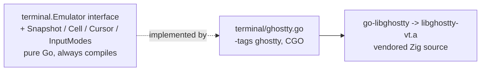
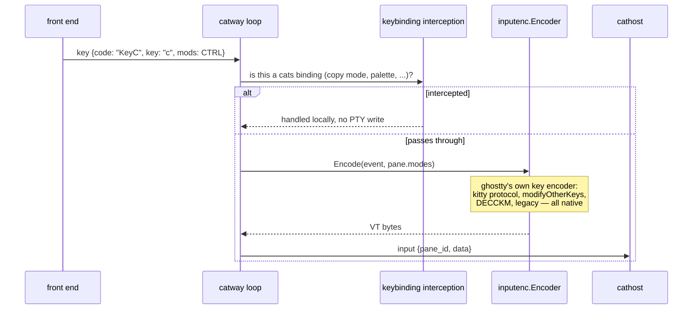
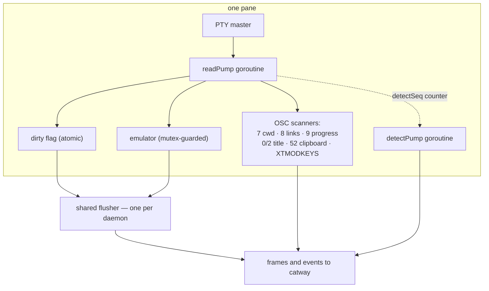

# Terminal and input

Two packages, two directions of the same pipe.

* **`internal/terminal`** — the VT emulator: PTY bytes in, a cell-grid
  `Snapshot` out.
* **`internal/inputenc`** — the reverse: structured input events in, VT byte
  sequences out.

Both wrap **libghostty-vt**, which is why they cannot drift apart.

## The `Emulator` seam

The interface and value types are pure Go and **always** compile. That is what
lets `internal/app`, `internal/layout`, `internal/browserproto` and the rest be
tested with a plain `go test ./...` — no Zig, no CGO, no `PKG_CONFIG_PATH`. The
concrete implementation lives behind `-tags ghostty`.

### `Snapshot`

| Field | Notes |
|-------|-------|
| `Cols`, `Rows` | grid dimensions |
| `Cells [][]Cell` | `[row][col]`, each row exactly `Cols` long |
| `Cursor` | viewport position, visibility, DECSCUSR style |
| `DefaultFg`, `DefaultBg` | what a `nil` cell colour resolves to |
| `HasHyperlinks` | lets the frame builder skip the per-cell OSC 8 scan when there are none |
| `Scroll` | `ScrollMetrics`: offset from bottom, available history lines, viewport rows |

A `Cell` is one grapheme cluster plus resolved styling; `nil` fg/bg mean "use the
terminal default", and they are resolved to concrete colours before crossing the
seam.

### Text extraction

`TextScope` picks what `ExtractText` reads: `TextVisible` (the current viewport)
or `TextRecent` (the last N lines of scrollback plus active area, `0` = the whole
buffer). Options select VT-encoded vs plain, and whether soft-wrapped lines are
rejoined.

This is the machinery behind `capture`, and behind the scrollback seeds that
[persistence](persistence.md) writes.

## Input modes

`InputModes` is the state that decides how a keystroke is encoded:

| Mode | Effect on encoding |
|------|--------------------|
| `AlternateScreen` | affects UI decisions more than encoding |
| `ApplicationCursor` (DECCKM) | arrow keys as `SS3` vs `CSI` |
| `BracketedPaste` | wrap pastes in `CSI 200~` / `CSI 201~` |
| `FocusReporting` | send focus in/out reports |
| `MouseMode` | off / X10 / press+release / button-motion / any-motion (modes 9, 1000, 1002, 1003) |
| `MouseEncoding` | default / UTF-8 (1005) / SGR (1006) |
| `MouseAlternateScroll` | wheel becomes arrow keys (mode 1007) |
| `SynchronizedOutput` | frame tearing avoidance |
| `KittyKeyboardFlags` | `0` = legacy; otherwise the kitty keyboard protocol's active flag set |
| `ModifyOtherKeys` | xterm XTMODKEYS (`CSI >4;Nm`) |

Two of these need care. `ModifyOtherKeys` is **not** surfaced by libghostty-vt, so
the emulator leaves it false and the orchestration host injects the value from its
own raw-stream scanner before reporting `pane_modes`. And `MouseAlternateScroll` is
a *policy* layered above the encoders — ghostty implements it in its Surface, not
its encoder — so `inputenc` implements it in pure Go.

## Encoding input

The pure-Go half of `inputenc` is the W3C `KeyboardEvent.code` → ghostty key-name
mapping (`"KeyA"` → `a`, `"Digit0"` → `0`, `"ArrowLeft"` → left, …) and the
alternate-scroll fallback. Everything else delegates.

Wrapping ghostty's encoders rather than reimplementing them retired the previous
pure-Go encoders **and** their known kitty bits-2/8 degradation. The full protocol
is now encoded natively: disambiguate, report-event-types, report-alternates,
report-all-keys, report-associated-text.

## Per-pane goroutines on `cathost`

* The emulator is **not** concurrency-safe, so every access goes through the
  pane's `emuMu`. That mutex also guards the previous snapshot used for diffing
  and the closed flag.
* The OSC scanners are owned **exclusively** by `readPump`. They exist because
  libghostty-vt does not surface those sequences to the embedder, so cats scans
  the raw byte stream in parallel with feeding it to the emulator.
* `detectSeq` counts non-empty PTY reads. `detectPump` uses it to skip a
  redundant screen scan when an idle agent has produced no new output.
* `streamOutput`, off by default, makes `readPump` also emit each raw chunk as a
  `pane_output` event — armed only while a `pane.wait_for_output` waiter exists.

## Scrollback

Scrollback lives in the emulator, on `cathost`. Three things read it:

1. **`scroll_viewport`** moves the pane's viewport, which changes what the next
   snapshot contains — so scrolling is just another frame.
2. **`request_text`** extracts text for `capture` and `read`.
3. **The history capture sweep** periodically extracts VT-encoded scrollback per
   pane into `history.json`, so a *cold* restore can replay it into a freshly
   spawned shell via `create_pane.initial_history`. Default 2000 lines per pane,
   configurable, `0` = the whole buffer.

That third one is why a pane's history survives even `cathost` dying — see
[Persistence](persistence.md).

## Building the VT engine

`third_party/libghostty-vt` is vendored Zig source. `make vt` (or
`scripts/build-libghostty-vt.sh`) downloads a pinned Zig 0.15.2 into `.tools/`
and builds a **static** `libghostty-vt.a`. Static linking is why the macOS bundle
has no dylibs to copy and no `@rpath` fixups.

See [Build and packaging](../reference/build-and-packaging.md) for the macOS 26
SDK workaround the script performs.
