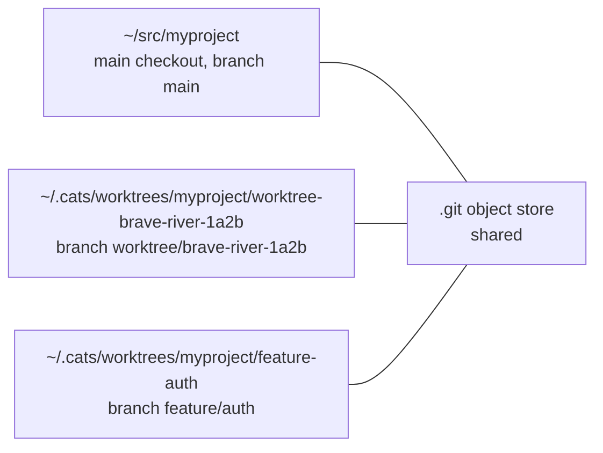
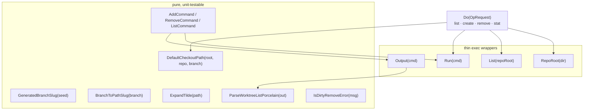
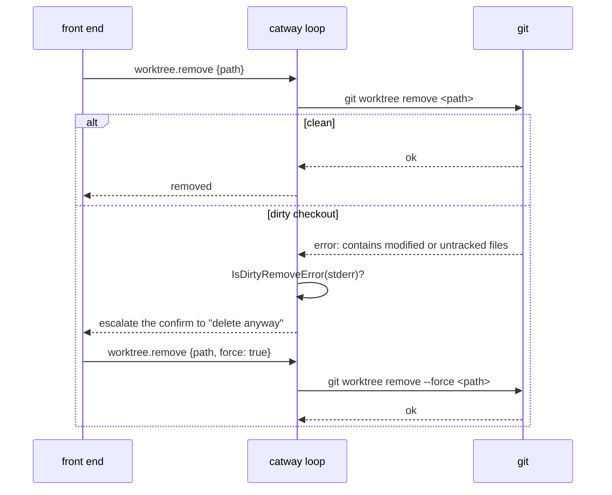
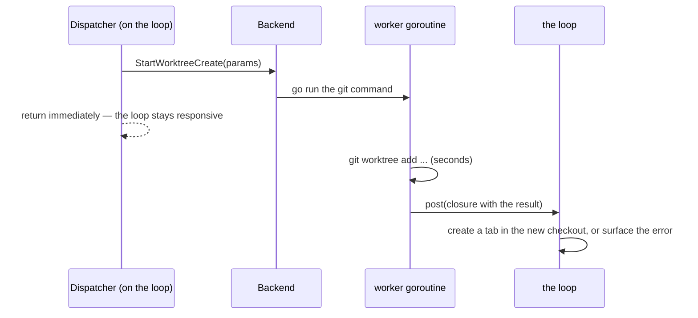

# Git worktrees

`internal/worktree` — create a separate checkout per agent or task, straight from
the UI, so two agents can work on the same repo without fighting over the working
tree.

## Why it exists

A coding agent editing files is a working-tree mutation. Two agents in one
checkout stomp on each other, and `git stash` gymnastics are not a workflow. A
git **worktree** gives each one its own directory and branch backed by the same
object store.



## Package shape

Everything except the runners is **deterministic and I/O-free**: slug derivation,
command builders, the porcelain parser, and the dirty-remove detector. The runners
are thin `exec` wrappers whose errors carry git's trimmed stderr — the exact text
the dialogs show you. On top of both sits `Do(OpRequest) OpResult`, which
composes them into the whole operations — and which two different processes run,
for the reason in [Which machine runs git](#which-machine-runs-git).



## Naming

An unnamed worktree gets a generated branch:

```
worktree/{adjective}-{noun}-{4 hex digits}
```

Adjectives: `brave`, `calm`, `clear`, `green`, `lucky`, `quiet`, `rapid`,
`silver`. Nouns: `river`, `cloud`, `field`, `forest`, `harbor`, `meadow`, `stone`,
`valley`. The word lists are kept identical to the retired Rust implementation so
generated names look the same across both.

Derivation is deterministic per seed (callers pass something like
`time.Now().UnixMicro()`), which is what makes it testable.

The filesystem folder name comes from `BranchToPathSlug`: lowercased,
non-alphanumeric runs collapsed to a single `-`, edges trimmed, falling back to
`worktree` when nothing survives. So `feature/Auth Flow!` becomes `feature-auth-flow`.

The checkout lands at `<root>/<repoName>/<branch-slug>`, with the root from config:

```yaml
worktrees:
  directory: "~/.cats/worktrees"
```

A leading `~` is expanded against the user's home directory **on the machine
that will hold the checkout** — see below.

## The commands

| Operation | git invocation |
|-----------|----------------|
| create | `git -C <sourceCheckout> worktree add -b <branch> <path> <base>` |
| remove | `git -C <repoRoot> worktree remove [--force] <path>` |
| list | `git -C <repoRoot> worktree list --porcelain` |

`RepoRoot(dir)` resolves via `git -C <dir> rev-parse --show-toplevel`. For a
*linked* worktree this returns the worktree's own root, not the main repo's — which
is correct, and worth knowing when reasoning about nested operations.

**Remove never deletes the branch**, only the checkout folder. That is deliberate:
losing a checkout is recoverable, losing a branch with unmerged commits may not be.

## Which machine runs git

A worktree command runs on the machine whose disk holds the checkout: the host
the addressed pane is on, or — for `worktree.remove` — the host the workspace's
checkout belongs to.

This is not a feature bolted onto the feature; it is the only thing git can
mean. `git` is a subprocess acting on a filesystem, so while `catway` was the
only process that could run it, every worktree verb acted on `catway`'s own
disk. Anchored on a pane running on another machine that would at best fail with
a confusing "not a git worktree" and at worst find a same-named checkout here and
act on **it** — which is why the commands were refused outright for a remote pane
until cathost could answer them.

So the operations travel: `catway` sends `request_worktree` and the daemon
replies with `worktree_result` (the `worktree` capability — see
[the orchestration seam](../protocols/orchestration-seam.md)). Both ends call the
same `worktree.Do`, so a remote worktree cannot slowly diverge from a local one,
and paths — including `worktrees.directory` — are expanded by the machine that
will hold the checkout rather than by the one asking.

`catway` asks the daemon for **every** host, including its own local one, so
there is one path through the code rather than a local one and a remote one. The
single exception is a local cathost that cannot answer — an older build, or no
connection at all — where it runs `worktree.Do` in-process. For any other host
there is nothing here that could stand in, and the command is refused by name.

Two consequences worth knowing:

* `worktree.list` reports the machine as `host`, and every path in its answer is
  a path there. The dialogs name it in their title once a session has more than
  one host, because a remote checkout path under a title that reads as local is
  the mistake this would otherwise invite.
* A workspace pinned to a host that has been **detached** cannot have its
  checkout removed. Its directory is on a filesystem this `catway` can no longer
  reach, and resolving its host to the default one would run
  `git worktree remove` on the wrong machine — which, on a coincidental path
  match, deletes the wrong checkout.

The one thing that stays here: the branch name. It is generated by `catway`,
because it is the name the new workspace takes and the value the command reports
back — an answer that depended on which machine ran the operation would be a
different answer to the same request.

## The remove-safety escalation



`IsDirtyRemoveError` requires **both** characteristic substrings, so a
locked-worktree refusal does not accidentally match and offer you a force that
would not help.

## Off-loop execution

`git worktree add` clones a working tree — it can take seconds on a large repo.
Both ends **must** keep it off the goroutine that carries terminal traffic, and
do: `catway`'s worktree commands go through the `Backend`'s async
start-and-callback pattern, and a cathost answers `request_worktree` from its own
goroutine rather than from the connection reader every keystroke arrives through.
A slow git never stalls a pane on either machine.

The round trip to another host is bounded at five minutes rather than the usual
five seconds, for the same reason: the wait is git's, and failing a checkout at
five seconds would report a failure for work that then quietly succeeds.



## Commands

| Method | Purpose |
|--------|---------|
| `worktree.list` | enumerate checkouts anchored on a pane's repo |
| `worktree.create` | new branch plus checkout, then open it |
| `worktree.open` | open an existing checkout in a new tab |
| `worktree.remove` | remove a checkout, with the force escalation above |

All four are anchored on **a pane's repo** — the pane's cwd determines which
repository you are operating on, *and* which machine it is on, which is why the
feature composes naturally with "the agent pane I am looking at" wherever that
pane happens to be running.

In the UI: workspace menu → **new worktree**.

## Requirements

`git` on `PATH` — on **each host you use worktrees from**, since that is where
the subprocess runs, not on the machine running `catway`. This is the only
runtime dependency cats has beyond a login shell, and it is only needed if you
use worktrees or plugins.
